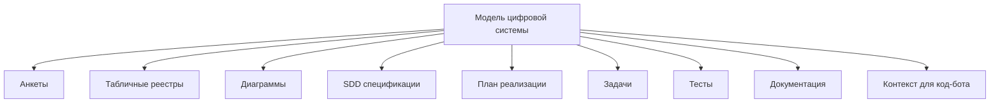
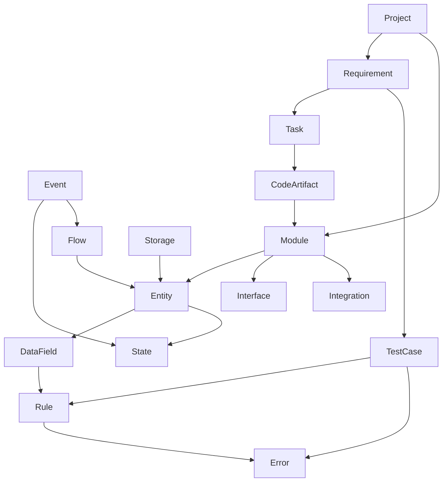
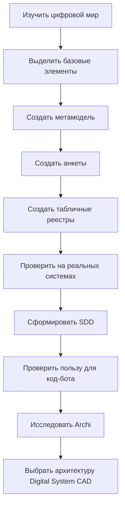

# Digital System CAD — концепция инженерной среды проектирования цифровых систем

**Статус документа:** концепция / рабочая гипотеза проекта  
**Назначение документа:** дать Codex и другим код-ботам единое понимание идеи, целей, границ и правил работы над будущей системой.  
**Рекомендуемое расположение в репозитории:** `docs/concepts/digital_system_cad_concept.md`  
**Связанные документы:** `AGENTS.md`, `docs/roadmap.md`, `docs/architecture.md`, `docs/requirements.md`, `docs/metamodel.md`

---

## 1. Краткое описание идеи

**Digital System CAD** — это будущая инженерная среда для проектирования цифровых систем по аналогии с CAD/CAM/PLM-системами в машиностроении.

Главная идея: цифровая система должна проектироваться не как набор разрозненных файлов, диаграмм, заметок и задач, а как **единая модель системы**, из которой можно получать разные представления:

- анкеты;
- табличные реестры;
- архитектурные диаграммы;
- SDD-спецификации;
- планы реализации;
- задачи для разработчика или код-бота;
- тестовые сценарии;
- техническую документацию.

Цель проекта — исследовать, можно ли описать большинство цифровых систем через ограниченный набор базовых элементов, а затем использовать эти элементы как основу для SDD и будущего инструмента проектирования.

---

## 2. Главная гипотеза проекта

Если цифровой мир состоит из повторяющихся базовых элементов, таких как требования, сущности, данные, правила, состояния, события, потоки, хранилища, интерфейсы, ошибки, тесты и кодовые артефакты, то можно построить систему, которая:

1. собирает информацию о проекте через анкеты;
2. хранит её в связанных таблицах;
3. строит диаграммы на основе модели;
4. формирует SDD-документы;
5. генерирует задачи для реализации;
6. подготавливает контекст для код-бота;
7. связывает результат реализации с исходной спецификацией.

Иначе говоря:

```text
Анкеты + Таблицы + Связи + Диаграммы = Модель цифровой системы
Модель цифровой системы = Источник SDD, задач, тестов и документации
```

---

## 3. Аналогия с CAD/CAM/PLM

В CAD/CAM центральным объектом является не чертёж и не NC-код, а **модель изделия**.

Вокруг модели изделия строятся:

- сборки;
- чертежи;
- спецификации;
- материалы;
- технологические операции;
- CAM-операции;
- постпроцессор;
- управляющая программа;
- контроль качества;
- производственная документация.

Для цифровых систем должен использоваться аналогичный принцип.

Центральным объектом должен быть не код, не диаграмма и не задача в трекере, а **модель цифровой системы**.



---

## 4. Основной принцип проекта

Главный принцип:

> Диаграмма, таблица, анкета и документ не должны быть разными источниками правды. Они должны быть разными представлениями одной модели.

Это означает:

- если объект создан в анкете, он должен появиться в реестре;
- если объект используется на диаграмме, он должен ссылаться на элемент модели;
- если объект описан в таблице, он должен иметь связи с другими объектами;
- если формируется SDD, он должен собираться из модели, а не писаться вручную отдельно;
- если код-бот получает задачу, она должна ссылаться на требования, правила, сущности и тесты из модели.

---

## 5. Что такое “цифровой мир” в рамках проекта

В рамках этого проекта цифровой мир рассматривается как совокупность цифровых систем, программ, утилит, сервисов, интерфейсов, данных, правил и процессов, которые можно описывать инженерным способом.

Важно: мы не пытаемся описать абсолютно всё. Мы ищем **общие строительные блоки**, которых достаточно для описания большинства практических цифровых систем.

---

## 6. Базовые элементы цифровой системы

Ниже приведена начальная версия базовых элементов. Этот список является рабочей гипотезой и должен уточняться в ходе исследования.

### 6.1. Project

Проект как верхний контейнер системы.

Содержит:

- цель проекта;
- границы проекта;
- контекст;
- ограничения;
- заинтересованные стороны;
- связанные системы;
- набор требований;
- набор моделей и документов.

### 6.2. Requirement

Требование к системе.

Содержит:

- что должно быть реализовано;
- зачем это нужно;
- для кого это нужно;
- критерии приёмки;
- связи с модулями, тестами и задачами.

### 6.3. User / Actor

Пользователь, роль или внешняя система, взаимодействующая с проектируемой системой.

Содержит:

- роль;
- права;
- сценарии использования;
- ограничения;
- ожидаемый результат взаимодействия.

### 6.4. Use Case / Scenario

Сценарий использования системы.

Содержит:

- начальное условие;
- действия пользователя или системы;
- результат;
- альтернативные ветки;
- ошибки;
- связанные требования.

### 6.5. System / Subsystem / Module

Структурная часть системы.

Содержит:

- назначение;
- ответственность;
- входные данные;
- выходные данные;
- зависимости;
- интерфейсы;
- внутренние правила;
- связанные кодовые артефакты.

### 6.6. Entity

Сущность предметной области или внутренней модели данных.

Содержит:

- название;
- тип сущности;
- назначение;
- поля данных;
- связи с другими сущностями;
- правила;
- состояния;
- события;
- ошибки;
- место хранения.

### 6.7. DataField

Поле данных сущности, формы, таблицы, файла или API.

Содержит:

- имя поля;
- тип данных;
- обязательность;
- допустимые значения;
- значение по умолчанию;
- правила проверки;
- источник данных;
- место использования.

### 6.8. Rule

Правило, ограничение или условие работы системы.

Содержит:

- формулировку правила;
- область действия;
- связанные сущности и поля;
- условие срабатывания;
- ожидаемое действие системы;
- ошибку при нарушении;
- тесты для проверки.

### 6.9. State

Состояние объекта или процесса.

Содержит:

- название состояния;
- что оно означает;
- какие переходы разрешены;
- какие переходы запрещены;
- какие события переводят объект в это состояние.

### 6.10. Event

Событие, запускающее изменение состояния, обработку данных или системное действие.

Содержит:

- источник события;
- условие возникновения;
- связанные данные;
- обработчик;
- результат;
- возможные ошибки.

### 6.11. Flow

Поток данных, управления или действий между элементами системы.

Содержит:

- источник;
- получатель;
- передаваемые данные;
- направление;
- условия передачи;
- ограничения;
- ошибки передачи.

### 6.12. Storage

Место хранения данных.

Содержит:

- тип хранения;
- структуру данных;
- связанные сущности;
- правила чтения;
- правила записи;
- правила обновления;
- правила удаления;
- требования к резервированию и целостности.

### 6.13. Interface

Точка взаимодействия пользователя, системы или внешнего сервиса с проектируемой системой.

Содержит:

- тип интерфейса;
- входные данные;
- выходные данные;
- элементы управления;
- сценарии использования;
- ошибки;
- ограничения.

### 6.14. Integration

Связь с внешней системой, сервисом, файлом, API или устройством.

Содержит:

- внешнюю систему;
- протокол;
- формат данных;
- правила обмена;
- ограничения;
- ошибки интеграции;
- тесты совместимости.

### 6.15. Error

Ошибка, исключение или некорректная ситуация.

Содержит:

- код ошибки;
- причину;
- место возникновения;
- реакцию системы;
- сообщение пользователю;
- способ восстановления;
- связанные правила и тесты.

### 6.16. TestCase

Проверка требования, правила, сценария или ошибки.

Содержит:

- что проверяется;
- входные данные;
- ожидаемый результат;
- шаги проверки;
- связанное требование;
- связанный модуль;
- статус прохождения.

### 6.17. Task

Задача реализации.

Содержит:

- что нужно сделать;
- почему это нужно;
- какие требования реализует;
- какие файлы могут быть затронуты;
- какие тесты должны быть добавлены или обновлены;
- критерии готовности.

### 6.18. CodeArtifact

Файл, модуль, класс, функция, скрипт или другой артефакт реализации.

Содержит:

- путь к файлу;
- назначение;
- связанные требования;
- связанные модули;
- связанные тесты;
- ограничения изменения.

---

## 7. Метамодель связей

Метамодель должна описывать не только типы объектов, но и допустимые связи между ними.

Начальная версия связей:

```text
Project содержит Requirement
Project содержит Module
Requirement реализуется Module
Requirement проверяется TestCase
Requirement разбивается на Task
Module использует Entity
Module имеет Interface
Module интегрируется с Integration
Entity содержит DataField
Entity имеет State
Entity участвует в Flow
DataField проверяется Rule
Rule при нарушении вызывает Error
Event меняет State
Event запускает Flow
Flow передаёт DataField или Entity
Storage хранит Entity
Interface использует DataField
Integration передаёт DataField или Entity
Task реализует Requirement
Task изменяет CodeArtifact
CodeArtifact реализует Module
TestCase проверяет Rule
TestCase проверяет Error
```

Упрощённая схема:



---

## 8. Роль SDD

SDD в этом проекте рассматривается не как отдельный документ, а как результат структурированного проектирования.

Правильная цепочка:

```text
Анкетирование → Связанные таблицы → Модель системы → SDD → План → Задачи → Реализация → Тесты
```

SDD-документы должны генерироваться из модели, а не существовать отдельно от неё.

Минимальный набор SDD-документов:

- `spec.md` — общая спецификация системы или функции;
- `requirements.md` — требования;
- `entities.md` — сущности;
- `data-model.md` — модель данных;
- `rules.md` — правила;
- `states.md` — состояния;
- `events.md` — события;
- `flows.md` — потоки;
- `storage.md` — хранение;
- `interfaces.md` — интерфейсы;
- `integrations.md` — интеграции;
- `errors.md` — ошибки;
- `tests.md` — проверки;
- `plan.md` — план реализации;
- `tasks.md` — задачи реализации.

---

## 9. Роль анкет

Анкеты являются способом заполнения модели.

Анкета не должна быть свободным текстовым документом. Она должна собирать структурированные данные, которые можно сохранить в таблицах и связать с другими объектами.

Пример: анкета сущности должна создавать или обновлять объект `Entity`, а не просто добавлять текст в документ.

Минимальные анкеты:

- анкета проекта;
- анкета требования;
- анкета пользователя/роли;
- анкета сценария;
- анкета модуля;
- анкета сущности;
- анкета поля данных;
- анкета правила;
- анкета состояния;
- анкета события;
- анкета потока;
- анкета хранения;
- анкета интерфейса;
- анкета интеграции;
- анкета ошибки;
- анкета теста;
- анкета задачи реализации.

---

## 10. Роль таблиц

Таблицы являются инженерными реестрами проекта.

Они аналогичны ведомостям в CAD/PLM-системах.

Минимальные реестры:

- реестр проектов;
- реестр требований;
- реестр пользователей и ролей;
- реестр сценариев;
- реестр модулей;
- реестр сущностей;
- реестр полей данных;
- реестр правил;
- реестр состояний;
- реестр событий;
- реестр потоков;
- реестр хранилищ;
- реестр интерфейсов;
- реестр интеграций;
- реестр ошибок;
- реестр тестов;
- реестр задач;
- реестр кодовых артефактов.

Каждая запись должна иметь стабильный ID.

Пример ID:

```text
REQ-001
MOD-001
ENT-001
FIELD-001
RULE-001
ERR-001
TEST-001
TASK-001
CODE-001
```

---

## 11. Роль диаграмм

Диаграммы должны быть не самостоятельными картинками, а визуальными представлениями модели.

Каждый блок на диаграмме должен соответствовать объекту модели.

Пример:

```text
Блок на диаграмме: MaterialService
Объект модели: MOD-004 MaterialService
```

Если объект модели изменяется, диаграмма должна оставаться связанной с ним.

Если объект удаляется, система должна обнаруживать нарушенную связь.

---

## 12. Роль Archi и ArchiMate

Archi рассматривается как возможная open-source база или визуальный слой для будущего Digital System CAD.

Роль Archi:

- создавать архитектурные диаграммы;
- использовать ArchiMate-нотацию;
- визуализировать связи между элементами цифровой системы;
- хранить пользовательские свойства элементов;
- служить кандидатом для расширения через плагины или интеграцию.

Важно: Archi не должен рассматриваться как полное ядро системы до проверки его возможностей.

Сначала нужно исследовать:

- какие данные Archi уже умеет хранить;
- как работают user-defined properties;
- можно ли связать элементы Archi с внешней моделью;
- можно ли экспортировать и импортировать модель;
- можно ли создать плагин для анкет и таблиц;
- не будет ли проще создать отдельное ядро и использовать Archi только как визуальный слой.

---

## 13. Возможные архитектурные варианты реализации

### Вариант A. Archi как основа

Archi используется как базовая программа. Digital System CAD реализуется как набор плагинов.

Плюсы:

- уже есть диаграммы;
- уже есть ArchiMate;
- open-source база;
- не нужно писать визуальный редактор с нуля.

Минусы:

- ограничения существующей архитектуры Archi;
- возможная сложность расширения;
- риск подстроиться под чужую модель данных.

### Вариант B. Отдельное ядро + интеграция с Archi

Digital System CAD имеет собственную базу модели, а Archi используется только для диаграмм.

Плюсы:

- собственная метамодель;
- больше контроля;
- проще делать анкеты, таблицы, SDD и экспорт для код-бота.

Минусы:

- сложнее интеграция;
- нужно синхронизировать модель и диаграммы;
- больше работы на старте.

### Вариант C. Полностью отдельное приложение

Создаётся самостоятельная система с собственными диаграммами, анкетами, таблицами и SDD-экспортом.

Плюсы:

- полный контроль;
- можно проектировать UX под задачу;
- можно строить систему без ограничений Archi.

Минусы:

- самый большой объём разработки;
- нужно писать диаграммный слой;
- высокий риск слишком рано усложнить проект.

Предварительный вывод: сначала исследовать Archi, но не связывать всю концепцию только с ним.

---

## 14. Предлагаемый путь исследования



---

## 15. Проверочные проекты

Чтобы доказать пригодность метамодели, нужно проверить её на разных типах цифровых систем.

### 15.1. Простая Python-утилита

Пример:

- анализ файлов;
- обработка таблиц;
- генерация отчёта.

Что проверяем:

- требования;
- входные данные;
- обработку;
- выходные данные;
- ошибки;
- тесты;
- задачи реализации.

### 15.2. GUI-приложение

Пример:

- учёт инструмента;
- ручной ввод измерений;
- хранение в базе;
- предупреждения по допускам.

Что проверяем:

- роли пользователей;
- интерфейсы;
- состояния;
- события;
- сущности;
- правила;
- хранение.

### 15.3. Excel / SVG / template-система

Пример:

- шаблоны этикеток;
- привязка Excel-данных;
- генерация SVG;
- QR/DataMatrix.

Что проверяем:

- шаблоны;
- данные;
- связи;
- правила рендера;
- экспорт;
- ошибки.

### 15.4. CNC / промышленная автоматизация

Пример:

- автоматическое измерение инструмента;
- чтение параметров;
- логирование;
- предупреждения.

Что проверяем:

- внешние системы;
- события;
- состояния;
- ошибки;
- ограничения безопасности;
- технические правила.

---

## 16. Правила для Codex

Codex должен учитывать, что этот проект находится на этапе исследования и формирования инженерной модели.

### 16.1. Не начинать с кода без модели

Перед реализацией функций Codex должен проверять:

- есть ли описание требования;
- есть ли связанная сущность;
- есть ли правила;
- есть ли ожидаемые ошибки;
- есть ли критерии проверки;
- есть ли место в архитектуре.

Если этих данных нет, Codex должен сначала предложить дополнить спецификацию, а не сразу писать код.

### 16.2. Не смешивать уровни описания

Codex должен различать:

- концепцию;
- требования;
- архитектуру;
- метамодель;
- данные;
- интерфейс;
- реализацию;
- тесты;
- документацию.

Нельзя описывать всё одним плоским текстом.

### 16.3. Не смешивать категории и примеры

Если перечисляются виды объектов, примеры должны быть вложены внутрь соответствующего вида.

Правильно:

```text
Entity
  Пример: Tool
  Пример: Material

Rule
  Пример: DiameterMustBePositive
  Пример: RequiredFieldValidation
```

Неправильно:

```text
Entity, Tool, Material, Rule, DiameterMustBePositive
```

### 16.4. Сохранять трассировку

Любая задача реализации должна иметь связь с исходными элементами модели.

Минимальная трассировка:

```text
Requirement → Task → CodeArtifact → TestCase
```

Желательная трассировка:

```text
Requirement → Module → Entity → DataField → Rule → Error → TestCase → Task → CodeArtifact
```

### 16.5. Писать документацию как инженерные спецификации

Документы должны быть:

- структурированными;
- проверяемыми;
- пригодными для чтения человеком;
- пригодными для чтения код-ботом;
- связанными с моделью;
- без лишнего художественного текста.

### 16.6. Использовать Mermaid только в совместимом стиле

Для диаграмм использовать простой `flowchart TD`.

Не использовать сложный синтаксис, если он может плохо работать в Obsidian или других markdown-средах.

### 16.7. Не превращать проект в бюрократию

Документация должна помогать разработке, а не существовать ради документации.

Если элемент не влияет на понимание, реализацию, проверку или сопровождение системы, его не нужно добавлять на раннем этапе.

---

## 17. Минимальная версия будущей системы

Минимальный прототип Digital System CAD должен уметь:

1. создавать проект;
2. создавать требования;
3. создавать сущности;
4. создавать поля данных;
5. создавать правила;
6. создавать ошибки;
7. связывать объекты между собой;
8. показывать табличные реестры;
9. генерировать SDD markdown-документы;
10. генерировать список задач для реализации;
11. экспортировать контекст для код-бота;
12. строить простую диаграмму связей.

---

## 18. Не входит в первую версию

На первом этапе не нужно реализовывать:

- полноценный визуальный редактор диаграмм с нуля;
- сложную совместную работу;
- управление пользователями;
- серверную платформу;
- marketplace плагинов;
- полную замену Archi;
- полную замену IDE;
- автоматическую генерацию всего кода;
- поддержку всех возможных нотаций моделирования.

---

## 19. Главный результат текущего этапа

Текущий этап должен дать не готовую программу, а доказанную основу:

- список базовых элементов цифровой системы;
- описание каждого элемента;
- схему связей между элементами;
- набор анкет;
- набор табличных реестров;
- пример SDD-документа, собранного из модели;
- проверку на нескольких разных проектах;
- решение, как использовать Archi.

---

## 20. Краткая формула проекта

```text
Digital System CAD =
  инженерная модель цифровой системы
  + анкеты для сбора информации
  + связанные таблицы
  + диаграммы как виды модели
  + SDD-документы
  + задачи реализации
  + тесты
  + контекст для код-бота
```

Главная цель:

> Научиться проектировать цифровые системы так же дисциплинированно, как инженер проектирует изделие в CAD/CAM/PLM-среде.

---

## 21. Рабочий вывод

Проект нужно развивать не как очередную программу для заметок и не как очередной редактор диаграмм.

Правильная цель — создать инженерную среду, где центральным объектом является **модель цифровой системы**, а все остальные артефакты являются её представлениями или результатами обработки.

До начала активного кодирования необходимо завершить исследование метамодели и проверить, что она действительно позволяет описывать разные типы цифровых систем.
