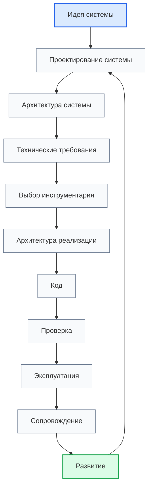

# PROJECT SCOPE: Programming Digital Systems

## 1. Назначение проекта

Programming Digital Systems — универсальная система знаний по проектированию, разработке, документированию, проверке, сопровождению и развитию цифровых систем.

Проект не является набором отдельных заметок. Проект должен развиваться как связанная база знаний и как исследовательская основа будущей инженерной среды [[Digital_System_CAD_Concept_for_Codex|Digital System CAD]].

Конечная цель проекта — проверить, можно ли описывать большинство практических цифровых систем через ограниченный набор повторяющихся элементов и связей, а затем использовать эту модель как источник SDD, диаграмм, анкет, таблиц, задач, тестов и контекста для код-бота.

Проект должен быть пригоден для учебного курса, инженерного справочника, системы roadmap-документов, системы анкет, энциклопедии понятий и будущей метамодели цифровой системы.

> [!info] Главное
> PROJECT_SCOPE задаёт масштаб всей базы знаний и не должен подменяться отдельными roadmap, анкетами или примерами. Главный ориентир масштаба — не документация ради документации, а доказательство или опровержение гипотезы Digital System CAD.

## 2. Главная цель

Главная цель проекта — дать пользователю маршрут движения от идеи цифровой системы до реализации, проверки, эксплуатации и развития, сохраняя все проектные решения как элементы единой инженерной модели.

Эта модель должна позволить ответить на главный исследовательский вопрос:

> Можно ли построить универсальное ядро описания цифровых систем, достаточное для SDD и будущего Digital System CAD, или цифровой мир требует только набора частных методик без общего ядра?

Маршрут разработки:

1. Идея системы.
2. Предметная область.
3. Сущности.
4. Данные.
5. Правила.
6. Состояния.
7. События.
8. Потоки.
9. Хранение.
10. Ошибки.
11. Проектирование архитектуры системы.
12. Технические требования.
13. Выбор инструментария.
14. Архитектура реализации.
15. Код.
16. Проверка.
17. Эксплуатация.
18. Сопровождение.
19. Развитие.

## 3. Разделение уровней проектирования

В проекте должны быть разделены три уровня:

1. Проектирование системы.
   - Определяет, что существует в системе: сущности, данные, правила, состояния, события, потоки, хранение и ошибки.

2. Проектирование архитектуры системы.
   - Определяет, как система должна быть организована на архитектурном уровне: слои, модули, модели, интерфейсы, зависимости, конфигурации и точки расширения.

3. Архитектура реализации.
   - Определяет, как выбранная архитектура будет реализована в конкретном коде, структуре проекта, библиотеках, фреймворках и технических компонентах.

> [!warning] Не путать
> Проектирование архитектуры системы не должно быть скрыто внутри проектирования системы и не должно подменяться архитектурой реализации.

## 4. Центральная формула цифровой системы

Цифровая система рассматривается как система, которая:

1. получает входные данные;
2. проверяет данные;
3. хранит данные или состояние;
4. выполняет правила обработки;
5. реагирует на события;
6. переходит между состояниями;
7. формирует выходные данные;
8. сообщает об ошибках;
9. сохраняет след выполнения;
10. допускает проверку результата.

> [!tip] Простая формула
> Если система получает данные, применяет правила, меняет состояние, реагирует на события и выдаёт результат, её можно описывать через маршрут Programming Digital Systems.

## 5. Связь с Digital System CAD

Programming Digital Systems является содержательной и методологической базой для будущего Digital System CAD.

В рамках этой связи каждый важный элемент документации должен рассматриваться как кандидат на элемент будущей модели:

- roadmap-документы описывают порядок получения элементов модели;
- анкеты собирают структурированные ответы для заполнения модели;
- энциклопедия уточняет типы элементов и критерии их выделения;
- диаграммы показывают представления модели;
- примеры проверяют применимость модели на разных типах цифровых систем;
- чек-листы проверяют полноту модели перед переходом к следующему этапу.

Цель проверки — определить, какие элементы являются универсальным ядром, какие требуют доменных расширений, а какие не должны входить в базовую метамодель.

После добавления [[Digital_System_CAD_Philosophical_Essay_for_Codex|Digital System CAD Philosophical Essay]] проект должен учитывать более жёсткое правило:

> Цифровая система должна описываться не списком объектов, а сетью структурированных фактов: typed elements, typed relations, definitions, constraints, views и traceability.

Это означает:

- важный элемент должен иметь не только имя, но и Definition, Purpose, Context и Source;
- связь между элементами должна быть явной модельной сущностью;
- диаграмма, таблица, анкета, SDD и Codex context являются views или outputs модели;
- текущая метамодель считается рабочей формой, а не окончательной онтологией цифрового мира.

## 6. Области применения

Проект должен использовать примеры из разных областей цифровых систем:

- скрипты автоматизации;
- GUI-приложения;
- web-системы;
- embedded-системы;
- PLC-системы;
- CNC/CAM-системы;
- системы хранения данных;
- интеграционные системы.

## 7. Принцип связности

> [!important] Правило
> Каждый документ проекта должен быть частью общей системы знаний.

Документ считается корректным, если он показывает:

- своё место в структуре проекта;
- входные документы;
- выходные документы;
- связанные понятия;
- связанные диаграммы;
- связанные анкеты;
- область применения;
- ограничения применения.

Изолированные документы без связей допускаются только как временные черновики.

## 8. Принцип анкетного движения

Для каждого важного проектного этапа должна существовать связанная анкета.

Анкета должна превращать правила документа в последовательность вопросов и помогать пользователю двигаться от точки А к точке Б.

В контексте Digital System CAD анкета должна не просто собирать свободный текст, а помогать получить структурированные ответы, которые можно связать с требованиями, сущностями, правилами, состояниями, событиями, потоками, хранилищами, интерфейсами, ошибками, тестами и задачами.

## 9. Базовые документы

Базовый слой документации:

- [[Digital_System_CAD_Concept_for_Codex|Digital System CAD Concept]]
- [[Digital_System_CAD_Philosophical_Essay_for_Codex|Digital System CAD Philosophical Essay]]
- [[PROJECT_SCOPE|PROJECT_SCOPE]]
- [[docs/01_regulations/Documentation_System_Regulation|Documentation System Regulation]]
- [[docs/01_regulations/Document_Writing_Rules|Document Writing Rules]]
- [[docs/01_regulations/Link_Rules|Link Rules]]
- [[docs/01_regulations/Diagram_Rules|Diagram Rules]]
- [[docs/02_templates/Roadmap_Document_Template|Roadmap Document Template]]
- [[docs/02_templates/Questionnaire_Document_Template|Questionnaire Document Template]]

## 10. Следующий шаг

После работы с масштабом проекта необходимо перейти к [[Digital_System_CAD_Concept_for_Codex|Digital System CAD Concept]], [[docs/00_maps/00_Documentation_Map|Documentation Map]] и [[docs/00_maps/00_Development_Route_Map|Development Route Map]].

## 11. История изменений

- Updated: документ восстановлен и приведён к единому визуальному формату проекта.
- Updated: масштаб проекта связан с конечной целью исследования Digital System CAD и проверкой универсальной метамодели цифровой системы.
- Updated: добавлено правило structured facts из философского эссе Digital System CAD.
