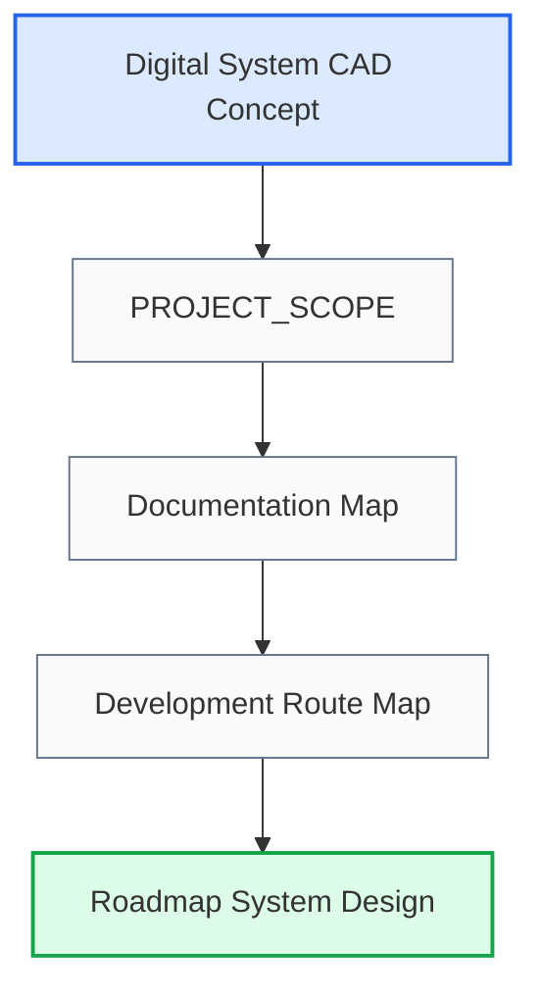

# Programming Digital Systems

## 1. Назначение документа

`README.md` является краткой входной точкой в базу знаний Programming Digital Systems и в исследование будущей инженерной среды [[Digital_System_CAD_Concept_for_Codex|Digital System CAD]].

Документ помогает перейти к конечной цели проекта, масштабу работ, карте документации и маршруту разработки.

> [!info] Главное
> README не заменяет базовые документы проекта, а только направляет к ним. Конечная цель базы знаний — проверить, можно ли описывать цифровые системы через связанную инженерную модель, пригодную для SDD, задач, диаграмм, анкет и будущего Digital System CAD.

## 2. Основные входные документы

- [[Digital_System_CAD_Concept_for_Codex|Digital System CAD Concept]]
  - Передаёт: конечную цель исследования, гипотезу метамодели цифровой системы и роль SDD как результата модели.
  - Используется для: понимания, зачем развиваются roadmap, анкеты, таблицы, диаграммы и энциклопедия.
  - Ограничение: не заменяет детальные roadmap-документы и проверочные примеры.

- [[Digital_System_CAD_Philosophical_Essay_for_Codex|Digital System CAD Philosophical Essay]]
  - Передаёт: основания для работы с typed elements, typed relations, structured facts, definitions, views и traceability.
  - Используется для: понимания, почему модель должна быть сетью проверяемых фактов, а не списком объектов.
  - Ограничение: не является технической спецификацией.

- [[PROJECT_SCOPE|PROJECT_SCOPE]]
  - Передаёт: масштаб проекта, центральную формулу цифровой системы и место проекта в исследовании Digital System CAD.
  - Используется для: понимания общей цели базы знаний и границ метамодели.
  - Ограничение: не является картой документации.

- [[docs/00_maps/00_Documentation_Map|Documentation Map]]
  - Передаёт: структуру базы знаний.
  - Используется для: навигации по слоям документации.
  - Ограничение: не раскрывает каждый этап подробно.

- [[docs/00_maps/00_Development_Route_Map|Development Route Map]]
  - Передаёт: маршрут от идеи до развития системы.
  - Используется для: движения по проектным этапам.
  - Ограничение: не заменяет roadmap-документы.

## 3. Быстрый маршрут

## 4. Следующий шаг

Начать работу нужно с [[Digital_System_CAD_Concept_for_Codex|Digital System CAD Concept]] и [[Digital_System_CAD_Philosophical_Essay_for_Codex|Digital System CAD Philosophical Essay]], затем перейти к [[PROJECT_SCOPE|PROJECT_SCOPE]] и [[docs/00_maps/00_Documentation_Map|Documentation Map]].

## 5. История изменений

- Updated: документ создан как краткая входная точка проекта.
