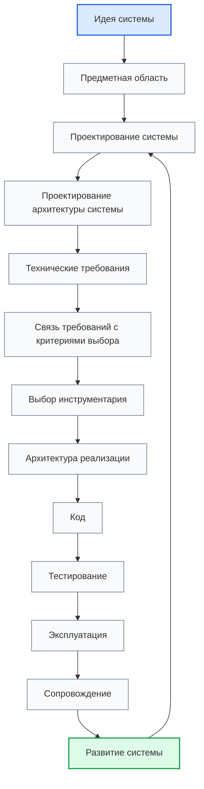
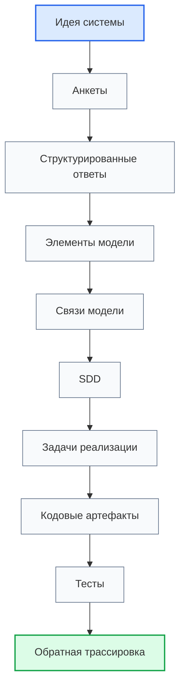

# Development Route Map / Карта маршрута разработки

## 1. Назначение документа

`00_Development_Route_Map.md` определяет маршрут движения пользователя от идеи цифровой системы к реализации, проверке, эксплуатации, сопровождению и развитию.

Документ используется как навигационная карта проектного процесса. Он показывает порядок этапов, входы и выходы между этапами, допустимые возвраты и документы, которые поддерживают каждый этап. В контексте [[Digital_System_CAD_Concept_for_Codex|Digital System CAD]] маршрут также показывает, как из проектных ответов постепенно собирается модель цифровой системы.

> [!info] Главное
> Документ помогает ориентироваться в базе знаний и показывает место связанных документов в маршруте.

## 2. Место документа в системе знаний

Документ относится к навигационному слою проекта Programming Digital Systems.

Документ используется после [[PROJECT_SCOPE|PROJECT_SCOPE]] и [[Digital_System_CAD_Concept_for_Codex|Digital System CAD Concept]], вместе с [[docs/00_maps/00_Documentation_Map|Documentation Map]] и [[docs/00_maps/00_Knowledge_Layer_Map|Knowledge Layer Map]].

Документ не заменяет roadmap-документы. Roadmap-документы раскрывают каждый этап подробно.

## 3. Главный маршрут разработки

Маршрут разработки:

1. Идея системы.
2. Предметная область.
3. Проектирование системы.
4. Проектирование архитектуры системы.
5. Технические требования.
6. Связь требований с критериями выбора инструментария.
7. Выбор инструментария.
8. Архитектура реализации.
9. Код.
10. Тестирование.
11. Эксплуатация.
12. Сопровождение.
13. Развитие системы.



## 4. Правило движения по маршруту

> [!important] Правило
> Переход к следующему этапу допускается только после фиксации выходных данных текущего этапа.

В целевой логике Digital System CAD выходные данные этапа должны быть пригодны для связи с элементами модели. Если результат невозможно связать с требованием, сущностью, правилом, состоянием, событием, потоком, интерфейсом, ошибкой, тестом, задачей или кодовым артефактом, результат нужно уточнить до перехода дальше.

Запрещено:

- выбирать инструменты до технических требований;
- проектировать архитектуру реализации до выбора инструментария;
- писать код до архитектуры реализации;
- переходить к эксплуатации без проверки;
- смешивать сопровождение и развитие системы.

Если на этапе есть открытые вопросы, они должны быть зафиксированы в соответствующей анкете, roadmap-документе или чек-листе.

## 5. Маршрут как сборка модели

В рамках исследования Digital System CAD маршрут разработки рассматривается не только как порядок чтения документов, но и как способ собрать связанную модель цифровой системы.



Минимальная трассировка результата:

```text
Requirement -> Task -> CodeArtifact -> TestCase
```

Желательная трассировка:

```text
Requirement -> Module -> Entity -> DataField -> Rule -> Error -> TestCase -> Task -> CodeArtifact
```

## 6. Этапы маршрута и основные документы

### 6.1. Проектирование системы

- [[docs/03_roadmaps/01_Roadmap_System_Design|Roadmap: System Design]]
  - Передаёт: сущности, данные, правила, состояния, события, потоки, хранение и ошибки.
  - Используется для: построения логической модели системы.
  - Ограничение: не выбирает инструментарий и не пишет код.

- [[docs/04_questionnaires/01_Questionnaire_System_Design|Questionnaire: System Design]]
  - Передаёт: ответы по проектированию системы.
  - Используется для: фиксации проектных решений.
  - Ограничение: не заменяет roadmap.

### 6.2. Проектирование архитектуры системы

- [[docs/03_roadmaps/02_Roadmap_System_Architecture_Design|Roadmap: System Architecture Design]]
  - Получает: логическую модель системы.
  - Используется для: проектирования слоёв, модулей, моделей, интерфейсов и зависимостей.
  - Ограничение: не подменяет архитектуру реализации.

- [[docs/04_questionnaires/02_Questionnaire_System_Architecture_Design|Questionnaire: System Architecture Design]]
  - Передаёт: архитектурные ответы.
  - Используется для: подготовки технических требований.
  - Ограничение: не выбирает инструменты.

### 6.3. Технические требования

- [[docs/03_roadmaps/03_Roadmap_Technical_Requirements|Roadmap: Technical Requirements]]
  - Получает: проектную модель и архитектуру системы.
  - Используется для: формулирования проверяемых требований.
  - Ограничение: не выбирает конкретные библиотеки, базы данных или фреймворки.

- [[docs/04_questionnaires/03_Questionnaire_Technical_Requirements|Questionnaire: Technical Requirements]]
  - Передаёт: ответы по требованиям.
  - Используется для: подготовки критериев выбора инструментария.
  - Ограничение: не заменяет требования свободными пожеланиями.

### 6.4. Связь требований и инструментария

- [[docs/00_maps/04_Requirements_To_Toolchain_Map|Requirements To Toolchain Map]]
  - Получает: технические требования.
  - Используется для: трассировки требований к критериям выбора инструментария.
  - Ограничение: не выбирает инструменты.

### 6.5. Выбор инструментария

- [[docs/03_roadmaps/05_Roadmap_Toolchain_Selection|Roadmap: Toolchain Selection]]
  - Получает: требования и критерии выбора.
  - Используется для: выбора базового, прикладного и специализированного инструментария.
  - Ограничение: не меняет требования.

- [[docs/04_questionnaires/05_Questionnaire_Toolchain_Selection|Questionnaire: Toolchain Selection]]
  - Передаёт: ответы по выбору инструментария.
  - Используется для: подготовки архитектуры реализации.
  - Ограничение: не должен быть списком популярных технологий.

### 6.6. Архитектура реализации

- [[docs/03_roadmaps/06_Roadmap_Implementation_Architecture|Roadmap: Implementation Architecture]]
  - Получает: архитектуру системы и выбранный инструментарий.
  - Используется для: проектирования структуры проекта, модулей, адаптеров, конфигурации и тестовой структуры.
  - Ограничение: не пишет код.

- [[docs/04_questionnaires/06_Questionnaire_Implementation_Architecture|Questionnaire: Implementation Architecture]]
  - Передаёт: ответы по архитектуре реализации.
  - Используется для: подготовки к коду.
  - Ограничение: не заменяет проектирование структуры реализации.

### 6.7. Тестирование

- [[docs/03_roadmaps/07_Roadmap_Testing|Roadmap: Testing]]
  - Получает: требования, архитектуру реализации и код.
  - Используется для: проверки требований, модулей, интерфейсов, ошибок и сценариев.
  - Ограничение: не подменяет эксплуатацию.

- [[docs/04_questionnaires/07_Questionnaire_Testing|Questionnaire: Testing]]
  - Передаёт: ответы по тестированию.
  - Используется для: подготовки тестового плана.
  - Ограничение: не является отчётом о тестировании.

### 6.8. Эксплуатация

- [[docs/03_roadmaps/08_Roadmap_Operation|Roadmap: Operation]]
  - Получает: результат тестирования.
  - Используется для: подготовки запуска, рабочих сценариев, логов и ограничений эксплуатации.
  - Ограничение: не подменяет сопровождение.

- [[docs/04_questionnaires/08_Questionnaire_Operation|Questionnaire: Operation]]
  - Передаёт: ответы по эксплуатации.
  - Используется для: фиксации рабочих условий использования.
  - Ограничение: не исправляет дефекты.

### 6.9. Сопровождение

- [[docs/03_roadmaps/09_Roadmap_Maintenance|Roadmap: Maintenance]]
  - Получает: эксплуатационные дефекты, ошибки и изменения.
  - Используется для: сопровождения, исправлений, регрессии и журнала изменений.
  - Ограничение: не подменяет развитие системы.

- [[docs/04_questionnaires/09_Questionnaire_Maintenance|Questionnaire: Maintenance]]
  - Передаёт: ответы по сопровождению.
  - Используется для: фиксации дефектов и решений по исправлениям.
  - Ограничение: не должен маскировать новые функции как дефекты.

### 6.10. Развитие системы

- [[docs/03_roadmaps/10_Roadmap_System_Evolution|Roadmap: System Evolution]]
  - Получает: запросы развития, новые ограничения и новые сценарии.
  - Используется для: контролируемого изменения системы.
  - Ограничение: не должно начинаться с правки кода без анализа влияния.

- [[docs/04_questionnaires/10_Questionnaire_System_Evolution|Questionnaire: System Evolution]]
  - Передаёт: ответы по развитию системы.
  - Используется для: возврата к проектированию системы или архитектуры.
  - Ограничение: не заменяет анализ влияния изменений.

## 7. Роль энциклопедического слоя

> [!note] Практический приём
> Если на roadmap-этапе непонятен термин, нужно перейти в энциклопедический слой, уточнить понятие и вернуться к маршруту.

Основные понятия проектирования системы являются кандидатами на базовые элементы или свойства будущей метамодели:

- [[docs/05_encyclopedia/Entities|Entities]]
- [[docs/05_encyclopedia/Data|Data]]
- [[docs/05_encyclopedia/Rules|Rules]]
- [[docs/05_encyclopedia/States|States]]
- [[docs/05_encyclopedia/Events|Events]]
- [[docs/05_encyclopedia/Flows|Flows]]
- [[docs/05_encyclopedia/Storage|Storage]]
- [[docs/05_encyclopedia/Errors|Errors]]
- [[docs/05_encyclopedia/Interfaces|Interfaces]]
- [[docs/05_encyclopedia/Architecture|Architecture]]

## 8. Роль чек-листов

Чек-листы используются после roadmap-документов и анкет.

Они проверяют, можно ли переходить дальше без пропуска обязательных решений.

- [[docs/09_checklists/00_Checklists_Index|Checklists Index]]
  - Передаёт: перечень чек-листов готовности.
  - Используется для: финальной проверки этапов маршрута.
  - Ограничение: не собирает проектные решения вместо анкет.

## 9. Контрольные вопросы

Перед переходом к следующему этапу необходимо ответить:

1. Зафиксирован ли результат текущего этапа?
2. Есть ли связанная анкета с проектными ответами?
3. Проверены ли критерии готовности?
4. Есть ли открытые вопросы?
5. Понятно ли, какой документ используется следующим?
6. Не выбран ли инструмент раньше требований?
7. Не начат ли код раньше архитектуры реализации?
8. Не смешаны ли сопровождение и развитие системы?
9. Сохраняется ли трассировка от требований к задачам, коду и тестам?
10. Понятно ли, какие результаты этапа попадают в будущую модель Digital System CAD?

## 10. Критерии актуальности маршрута

Маршрут считается актуальным, если:

- перечислены основные этапы движения от идеи до развития;
- каждый этап связан с roadmap-документом;
- основные этапы связаны с анкетами;
- связь требований и инструментария вынесена отдельно;
- эксплуатация, сопровождение и развитие разделены;
- маршрут содержит допустимый возврат от развития к проектированию системы;
- маршрут показывает связь этапов с постепенной сборкой модели Digital System CAD;
- ссылки ведут на существующие документы.

## 11. Следующий шаг

После работы с документом необходимо перейти к первому актуальному этапу маршрута:

- если система ещё не описана, перейти к [[docs/03_roadmaps/01_Roadmap_System_Design|Roadmap: System Design]];
- если уже есть проектные ответы, проверить следующий незавершённый roadmap-этап;
- если этап завершён, использовать связанный чек-лист готовности.

## 12. Связанные документы

### Входные документы

- [[PROJECT_SCOPE|PROJECT_SCOPE]]
  - Передаёт: общий маршрут, центральную формулу цифровой системы и связь с целью Digital System CAD.
  - Используется для: определения порядка этапов.
  - Ограничение: не раскрывает каждый этап подробно.

- [[Digital_System_CAD_Concept_for_Codex|Digital System CAD Concept]]
  - Передаёт: гипотезу модели, роль SDD и правило трассировки.
  - Используется для: понимания, зачем маршрут должен собирать связанные элементы модели.
  - Ограничение: не заменяет карту маршрута.

- [[docs/00_maps/00_Documentation_Map|Documentation Map]]
  - Передаёт: структуру базы знаний.
  - Используется для: связи маршрута со слоями документации.
  - Ограничение: не заменяет этот маршрут.

### Выходные документы

- [[docs/03_roadmaps/01_Roadmap_System_Design|Roadmap: System Design]]
  - Получает: место первого проектного этапа.
  - Используется для: начала проектирования системы.
  - Ограничение: не заменяет карту маршрута.

- [[docs/07_diagrams/00_Development_Route_Diagrams|Development Route Diagrams]]
  - Получает: маршрут разработки.
  - Используется для: визуального представления переходов и возвратов.
  - Ограничение: не заменяет текстовую карту маршрута.

## 13. История изменений

- Updated: документ восстановлен и приведён к единому визуальному формату проекта.
- Updated: маршрут связан с постепенной сборкой модели для [[Digital_System_CAD_Concept_for_Codex|Digital System CAD]].
