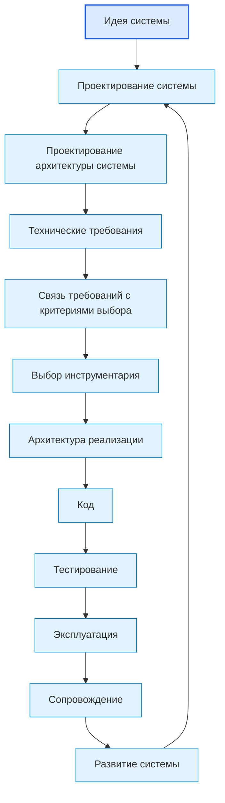

# Documentation Map

## 1. Назначение документа

`00_Documentation_Map.md` определяет карту документации проекта Programming Digital Systems и показывает, как слои документации работают на конечную цель [[Digital_System_CAD_Concept_for_Codex|Digital System CAD]].

Документ показывает структуру базы знаний, связи между слоями документации и маршрут движения пользователя от идеи цифровой системы к реализации, проверке, эксплуатации, сопровождению и развитию. В контексте Digital System CAD этот маршрут рассматривается как способ последовательно собрать и проверить модель цифровой системы.

> [!info] Главное
> Документ помогает ориентироваться в базе знаний и показывает место связанных документов в маршруте.

## 2. Главные входные точки

- [[PROJECT_SCOPE|PROJECT_SCOPE]]
  - Передаёт: масштаб проекта, центральную формулу цифровой системы, области применения, разделение уровней проектирования и связь с Digital System CAD.
  - Используется для: понимания общего масштаба работы.
  - Ограничение: не заменяет карту документации.

- [[Digital_System_CAD_Concept_for_Codex|Digital System CAD Concept]]
  - Передаёт: конечную цель исследования, гипотезу метамодели, базовые элементы модели, роль SDD и проверочные проекты.
  - Используется для: проверки, что roadmap, анкеты, энциклопедия, примеры и диаграммы развиваются в сторону единой модели цифровой системы.
  - Ограничение: не заменяет карту документации и детальные документы слоёв.

- [[AGENTS|AGENTS]]
  - Передаёт: правила, которые AI-агент должен учитывать перед созданием и изменением документов.
  - Используется для: соблюдения структуры, маршрута и регламентов.
  - Ограничение: не заменяет регламенты и roadmap-документы.

- [[TODO|TODO]]
  - Передаёт: текущий рабочий план развития базы знаний.
  - Используется для: выбора следующего блока работ после обновления документов.
  - Ограничение: не заменяет roadmap-документы и регламенты.

- [[docs/00_maps/00_Development_Route_Map|Development Route Map]]
  - Передаёт: полный маршрут разработки от идеи до развития системы.
  - Используется для: понимания порядка движения по проекту.
  - Ограничение: не раскрывает подробно каждый этап.

- [[docs/00_maps/00_Knowledge_Layer_Map|Knowledge Layer Map]]
  - Передаёт: карту слоёв базы знаний.
  - Используется для: понимания назначения roadmap, анкет, энциклопедии, примеров и диаграмм.
  - Ограничение: не заменяет маршрут разработки.

## 3. Общая структура базы знаний

```text
Programming-Digital-Systems
|
|-- PROJECT_SCOPE.md
|-- AGENTS.md
|-- TODO.md
|-- Digital_System_CAD_Concept_for_Codex.md
|-- Digital_System_CAD_Philosophical_Essay_for_Codex.md
|-- docs/
|   |-- 00_maps/
|   |-- 01_regulations/
|   |-- 02_templates/
|   |-- 03_roadmaps/
|   |-- 04_questionnaires/
|   |-- 05_encyclopedia/
|   |-- 06_examples/
|   |-- 07_diagrams/
|   |-- 08_digital_system_cad/
|   |-- 09_checklists/
```

## 4. Слои документации

### 4.1. Концептуальный и масштабный слой

Назначение слоя: определить конечную цель, масштаб, границы проекта и исследовательскую гипотезу Digital System CAD.

Документы:

- [[Digital_System_CAD_Concept_for_Codex|Digital System CAD Concept]]
  - Передаёт: рабочую гипотезу инженерной среды проектирования цифровых систем.
  - Используется для: ориентации всех последующих документов на метамодель, SDD и проверку применимости.
  - Ограничение: не заменяет подробные правила разработки содержания.

- [[Digital_System_CAD_Philosophical_Essay_for_Codex|Digital System CAD Philosophical Essay]]
  - Передаёт: философские основания модели как сети structured facts, typed elements, typed relations, definitions, views, constraints и traceability.
  - Используется для: ужесточения критериев качества метамодели, roadmap-документов, анкет и SDD.
  - Ограничение: не является технической спецификацией и не заменяет рабочую форму метамодели.

- [[PROJECT_SCOPE|PROJECT_SCOPE]]
  - Передаёт: масштаб базы знаний и место проекта в исследовании Digital System CAD.
  - Используется для: определения границ документации и областей применения.
  - Ограничение: не заменяет концепцию Digital System CAD.

### 4.2. Агентный слой

Назначение слоя: определить, какие документы и правила должен учитывать AI-агент при создании и изменении документации.

Документы:

- [[AGENTS|AGENTS]]

### 4.3. Навигационный слой

Назначение слоя: показывать карту базы знаний и маршруты движения пользователя.

Документы:

- [[docs/00_maps/00_Documentation_Map|Documentation Map]]
  - Передаёт: общую структуру базы знаний.
  - Используется для: ориентации в документации.
  - Ограничение: не заменяет подробные roadmap-документы.

- [[docs/00_maps/00_Development_Route_Map|Development Route Map]]
  - Передаёт: полный маршрут разработки.
  - Используется для: движения от идеи до развития системы.
  - Ограничение: не заменяет анкеты.

- [[docs/00_maps/00_Knowledge_Layer_Map|Knowledge Layer Map]]
  - Передаёт: карту слоёв знаний.
  - Используется для: понимания назначения каждого слоя документации.
  - Ограничение: не заменяет карту маршрута.

- [[docs/00_maps/04_Requirements_To_Toolchain_Map|Requirements To Toolchain Map]]
  - Передаёт: переход от технических требований к критериям выбора инструментария.
  - Используется для: предотвращения прямого выбора инструмента без критериев.
  - Ограничение: не заменяет документы требований и инструментария.

### 4.4. Регламентный слой

Назначение слоя: определить правила создания, оформления, связывания и визуализации документов.

Документы:

- [[docs/01_regulations/Documentation_System_Regulation|Documentation System Regulation]]
  - Передаёт: правила построения системы документации.
  - Используется для: согласования структуры документов.
  - Ограничение: не заменяет карту документации.

- [[docs/01_regulations/Document_Writing_Rules|Document Writing Rules]]
  - Передаёт: правила изложения и оформления.
  - Используется для: исключения личного шума и мусора.
  - Ограничение: не определяет маршрут разработки.

- [[docs/01_regulations/Link_Rules|Link Rules]]
  - Передаёт: правила Obsidian-ссылок.
  - Используется для: связывания документов между собой и отображения связей в Graph view.
  - Ограничение: не определяет содержание документов.

- [[docs/01_regulations/Diagram_Rules|Diagram Rules]]
  - Передаёт: правила использования диаграмм.
  - Используется для: визуального объяснения структуры и связей.
  - Ограничение: не заменяет текстовое содержание.

### 4.5. Шаблонный слой

Назначение слоя: задать единую структуру будущих документов.

Документы:

- [[docs/02_templates/Roadmap_Document_Template|Roadmap Document Template]]
  - Передаёт: структуру roadmap-документов.
  - Используется для: создания новых roadmap.
  - Ограничение: не содержит содержание конкретного этапа.

- [[docs/02_templates/Questionnaire_Document_Template|Questionnaire Document Template]]
  - Передаёт: структуру анкет.
  - Используется для: создания новых анкет.
  - Ограничение: не содержит конкретные вопросы этапа.

### 4.6. Roadmap-слой

Назначение слоя: вести пользователя по этапам проектирования и разработки так, чтобы результаты этапов могли стать элементами модели цифровой системы.

Документы:

- [[docs/03_roadmaps/01_Roadmap_System_Design|Roadmap: System Design]]
  - Передаёт: проектирование сущностей, данных, правил, состояний, событий, потоков, хранения и ошибок.
  - Используется для: первого проектного этапа после идеи и предметной области.
  - Ограничение: не выбирает инструментарий.

- [[docs/03_roadmaps/02_Roadmap_System_Architecture_Design|Roadmap: System Architecture Design]]
  - Передаёт: проектирование слоёв, модулей, моделей, интерфейсов, зависимостей и точек расширения.
  - Используется для: архитектурной организации системы.
  - Ограничение: не подменяет архитектуру реализации.

- [[docs/03_roadmaps/03_Roadmap_Technical_Requirements|Roadmap: Technical Requirements]]
  - Передаёт: проверяемые технические условия.
  - Используется для: подготовки критериев проверки и выбора инструментария.
  - Ограничение: не выбирает инструменты.

- [[docs/03_roadmaps/05_Roadmap_Toolchain_Selection|Roadmap: Toolchain Selection]]
  - Передаёт: правила выбора базового, прикладного и специализированного инструментария.
  - Используется для: выбора инструментов по требованиям и ограничениям.
  - Ограничение: не меняет требования.

- [[docs/03_roadmaps/05_Toolchain_Selection_Category_Rules|Toolchain Selection Category Rules]]
  - Передаёт: условия применения категорий инструментария.
  - Используется для: предотвращения ощущения, что PLC, embedded или CNC/CAM нужны каждому проекту.
  - Ограничение: не выбирает конкретный инструмент.

- [[docs/03_roadmaps/06_Roadmap_Implementation_Architecture|Roadmap: Implementation Architecture]]
  - Передаёт: проектирование структуры проекта, модулей, адаптеров, конфигурации, логирования, тестов и зависимостей.
  - Используется для: подготовки к коду.
  - Ограничение: не пишет код.

- [[docs/03_roadmaps/07_Roadmap_Testing|Roadmap: Testing]]
  - Передаёт: правила проверки требований, модулей, интерфейсов, ошибок и сценариев.
  - Используется для: подтверждения качества системы.
  - Ограничение: не подменяет эксплуатацию.

- [[docs/03_roadmaps/08_Roadmap_Operation|Roadmap: Operation]]
  - Передаёт: правила запуска, рабочих сценариев, ошибок пользователя, логов и ограничений эксплуатации.
  - Используется для: подготовки реального использования системы.
  - Ограничение: не подменяет сопровождение.

- [[docs/03_roadmaps/09_Roadmap_Maintenance|Roadmap: Maintenance]]
  - Передаёт: правила регистрации дефектов, исправлений, регрессии, обновлений и журнала изменений.
  - Используется для: сопровождения системы после эксплуатации.
  - Ограничение: не подменяет развитие системы.

- [[docs/03_roadmaps/10_Roadmap_System_Evolution|Roadmap: System Evolution]]
  - Передаёт: правила анализа новых функций, новых сценариев, изменения требований, архитектуры и тестов.
  - Используется для: развития системы без разрушения архитектуры.
  - Ограничение: не маскирует дефекты как новые функции.

### 4.7. Анкетный слой

Назначение слоя: превращать правила roadmap-документов в последовательность вопросов и собирать структурированные ответы для будущей модели Digital System CAD.

Документы:

- [[docs/04_questionnaires/01_Questionnaire_System_Design|Questionnaire: System Design]]
- [[docs/04_questionnaires/02_Questionnaire_System_Architecture_Design|Questionnaire: System Architecture Design]]
- [[docs/04_questionnaires/03_Questionnaire_Technical_Requirements|Questionnaire: Technical Requirements]]
- [[docs/04_questionnaires/05_Questionnaire_Toolchain_Selection|Questionnaire: Toolchain Selection]]
- [[docs/04_questionnaires/06_Questionnaire_Implementation_Architecture|Questionnaire: Implementation Architecture]]
- [[docs/04_questionnaires/07_Questionnaire_Testing|Questionnaire: Testing]]
- [[docs/04_questionnaires/08_Questionnaire_Operation|Questionnaire: Operation]]
- [[docs/04_questionnaires/09_Questionnaire_Maintenance|Questionnaire: Maintenance]]
- [[docs/04_questionnaires/10_Questionnaire_System_Evolution|Questionnaire: System Evolution]]
- [[docs/04_questionnaires/01_Questionnaire_System_Design_Filled_Python_File_Processing_Utility|Filled Questionnaire: Python File Processing Utility]]

Эти документы используются для практического заполнения проектных решений по этапам маршрута. В целевой логике Digital System CAD ответы анкеты должны создавать или уточнять элементы модели, а не оставаться только свободным текстом.

Заполненные анкеты используются как тестовые `.md` файлы для проверки совместной работы пользователя и чат-бота. Они не заменяют универсальные анкеты.

### 4.8. Энциклопедический слой

Назначение слоя: раскрывать универсальные понятия цифрового мира и проверять, какие из них могут стать базовыми элементами метамодели Digital System CAD.

Документы:

- [[docs/05_encyclopedia/Entities|Entities]]
- [[docs/05_encyclopedia/Data|Data]]
- [[docs/05_encyclopedia/Rules|Rules]]
- [[docs/05_encyclopedia/States|States]]
- [[docs/05_encyclopedia/Events|Events]]
- [[docs/05_encyclopedia/Flows|Flows]]
- [[docs/05_encyclopedia/Storage|Storage]]
- [[docs/05_encyclopedia/Errors|Errors]]
- [[docs/05_encyclopedia/Interfaces|Interfaces]]
- [[docs/05_encyclopedia/Architecture|Architecture]]
- [[docs/05_encyclopedia/Layers|Layers]]
- [[docs/05_encyclopedia/Modules|Modules]]
- [[docs/05_encyclopedia/Models|Models]]
- [[docs/05_encyclopedia/Dependencies|Dependencies]]
- [[docs/05_encyclopedia/Configurations|Configurations]]
- [[docs/05_encyclopedia/Extension_Points|Extension Points]]

Энциклопедия объясняет понятия, а roadmap ведёт пользователя по процессу.

### 4.9. Слой примеров

Назначение слоя: показывать применение универсальных правил в разных областях цифровых систем и проверять, где универсальная метамодель достаточна, а где нужны доменные расширения.

Документы:

- [[docs/06_examples/Examples_Index|Examples Index]]
  - Передаёт: структуру категорий примеров.
  - Используется для: выбора учебного примера.
  - Ограничение: не заменяет сами примеры.

- [[docs/06_examples/Scripts/Python_File_Processing_Utility|Python File Processing Utility]]
  - Передаёт: первый полный учебный пример Python-утилиты обработки файлов.
  - Используется для: демонстрации полного маршрута от идеи до развития.
  - Ограничение: не является production-реализацией.

Категории будущих примеров:

- Scripts / Скрипты автоматизации.
- GUI / Графические приложения.
- Web / Web-системы.
- Embedded / Встроенные системы.
- PLC / Промышленная автоматизация.
- CNC_CAM / CNC и CAM-системы.
- Databases / Базы данных.
- Integrations / Интеграционные системы.

### 4.10. Слой диаграмм

Назначение слоя: хранить крупные диаграммы и визуальные карты, которые используются несколькими документами. В целевой логике Digital System CAD диаграммы должны рассматриваться как представления модели, а не как отдельный источник правды.

#### 4.10.1. Базовые диаграммы системы знаний

- [[docs/07_diagrams/00_System_Map|System Map]]
  - Передаёт: универсальную карту цифровой системы.
  - Используется для: понимания связей между сущностями, данными, правилами, архитектурой, требованиями, инструментарием и жизненным циклом.
  - Ограничение: не заменяет энциклопедию и roadmap-документы.

- [[docs/07_diagrams/00_Documentation_Map_Diagrams|Documentation Map Diagrams]]
  - Передаёт: визуальную структуру базы знаний и слоёв документации.
  - Используется для: навигации по документации.
  - Ограничение: не заменяет [[docs/00_maps/00_Documentation_Map|Documentation Map]].

- [[docs/07_diagrams/00_Development_Route_Diagrams|Development Route Diagrams]]
  - Передаёт: визуальный маршрут разработки от идеи до развития системы.
  - Используется для: понимания переходов, возвратов и запрещённых переходов.
  - Ограничение: не заменяет [[docs/00_maps/00_Development_Route_Map|Development Route Map]].

#### 4.10.2. Диаграммы roadmap-этапов

- [[docs/07_diagrams/01_Roadmap_System_Design_Diagrams|Roadmap System Design Diagrams]]
  - Передаёт: диаграммы проектирования системы.
  - Используется для: визуального понимания границы системы, сущностей, данных, правил, состояний, событий, потоков, хранения и ошибок.
  - Ограничение: не заменяет [[docs/03_roadmaps/01_Roadmap_System_Design|Roadmap: System Design]].

- [[docs/07_diagrams/02_Roadmap_System_Architecture_Diagrams|Roadmap System Architecture Diagrams]]
  - Передаёт: диаграммы архитектуры системы.
  - Используется для: визуального понимания слоёв, модулей, моделей, интерфейсов, зависимостей, конфигураций и точек расширения.
  - Ограничение: не заменяет [[docs/03_roadmaps/02_Roadmap_System_Architecture_Design|Roadmap: System Architecture Design]].

- [[docs/07_diagrams/03_Roadmap_Technical_Requirements_Diagrams|Roadmap Technical Requirements Diagrams]]
  - Передаёт: диаграммы технических требований.
  - Используется для: визуального понимания источников требований, классификации, жизненного цикла требования и связи с выбором инструментария.
  - Ограничение: не заменяет [[docs/03_roadmaps/03_Roadmap_Technical_Requirements|Roadmap: Technical Requirements]].

- [[docs/07_diagrams/05_Roadmap_Toolchain_Selection_Diagrams|Roadmap Toolchain Selection Diagrams]]
  - Передаёт: диаграммы выбора инструментария.
  - Используется для: визуального понимания базового, прикладного и специализированного инструментария, условий применения и процесса выбора.
  - Ограничение: не заменяет [[docs/03_roadmaps/05_Roadmap_Toolchain_Selection|Roadmap: Toolchain Selection]].

- [[docs/07_diagrams/06_Roadmap_Implementation_Architecture_Diagrams|Roadmap Implementation Architecture Diagrams]]
  - Передаёт: диаграммы архитектуры реализации.
  - Используется для: визуального понимания структуры проекта, модулей реализации, точек входа, адаптеров, конфигурации, ошибок, логирования, тестов и зависимостей.
  - Ограничение: не заменяет [[docs/03_roadmaps/06_Roadmap_Implementation_Architecture|Roadmap: Implementation Architecture]].

- [[docs/07_diagrams/07_Roadmap_Testing_Operation_Maintenance_Evolution_Diagrams|Roadmap Testing Operation Maintenance Evolution Diagrams]]
  - Передаёт: диаграммы тестирования, эксплуатации, сопровождения и развития системы.
  - Используется для: визуального понимания жизненного цикла после реализации, возвратов и разделения сопровождения и развития.
  - Ограничение: не заменяет roadmap-документы тестирования, эксплуатации, сопровождения и развития.

### 4.11. Слой Digital System CAD

Назначение слоя: хранить исследовательские документы по методам метамоделирования, рабочей форме метамодели, будущим кандидатам элементов, реестрам, SDD как view/transformation и проверкам на примерах.

Документы:

- [[docs/08_digital_system_cad/00_Digital_System_CAD_Index|Digital System CAD Index]]
  - Передаёт: входную карту слоя Digital System CAD, текущие документы, будущие документы метамодели и порядок работы.
  - Используется для: навигации по исследовательскому слою и проверки, что новые документы появляются в правильном месте.
  - Ограничение: не заменяет концепт, рабочую форму метамодели и TODO.

- [[docs/08_digital_system_cad/research/01_Metamodeling_Methods_And_Standards|Metamodeling Methods and Standards]]
  - Передаёт: методы, стандарты и reference technologies метамоделирования.
  - Используется для: понимания правил сбора и формирования информации.
  - Ограничение: не является техническим заданием на metamodeling workbench.

- [[docs/08_digital_system_cad/metamodel/01_Metamodel_Form|Metamodel Form]]
  - Передаёт: рабочую форму element type, element card, relation type, structured fact, register, view, viewpoint, transformation, validation rule, controlled vocabulary, questionnaire mapping и traceability rule.
  - Используется для: структурированного сбора информации по цифровым системам.
  - Ограничение: не является окончательной метамоделью.

- [[docs/08_digital_system_cad/metamodel/01_Model_Elements|Model Elements]]
  - Передаёт: первый рабочий список кандидатов типов элементов модели.
  - Используется для: формирования реестров, structured facts, SDD и проверочных примеров.
  - Ограничение: не является доказанным универсальным ядром.

- [[docs/08_digital_system_cad/metamodel/02_Model_Relations|Model Relations]]
  - Передаёт: первый рабочий список relation types как first-class objects.
  - Используется для: построения structured facts, трассировки, views и validation rules.
  - Ограничение: не является окончательным словарём всех допустимых связей.

- [[docs/08_digital_system_cad/metamodel/03_Structured_Facts|Structured Facts]]
  - Передаёт: форму проверяемого утверждения модели.
  - Используется для: превращения элементов и relation types в сеть фактов, пригодную для views, SDD и Codex context.
  - Ограничение: не заменяет реестры и validation-документы.

- [[docs/08_digital_system_cad/metamodel/04_Model_Registers|Model Registers]]
  - Передаёт: правила табличных реестров как views над моделью.
  - Используется для: отображения элементов, facts, gaps и трассировки.
  - Ограничение: registers не являются source of truth.

- [[docs/08_digital_system_cad/metamodel/05_Controlled_Vocabulary|Controlled Vocabulary]]
  - Передаёт: правила терминов, definitions, allowed synonyms, forbidden synonyms и контекстов применения.
  - Используется для: стабилизации языка модели, SDD и Codex context.
  - Ограничение: не заменяет спецификации elements, relations и facts.

- [[docs/08_digital_system_cad/metamodel/06_Traceability|Traceability]]
  - Передаёт: правила обязательной трассировки между требованиями, моделью, задачами, кодом, тестами и SDD.
  - Используется для: поиска gaps и подготовки Codex context.
  - Ограничение: не заменяет facts register и validation example.

- [[docs/08_digital_system_cad/metamodel/07_SDD_From_Model|SDD From Model]]
  - Передаёт: правила сборки SDD как views и transformations из модели.
  - Используется для: проверки цепочки model -> SDD -> tasks -> tests.
  - Ограничение: не является готовым SDD конкретного проекта.

- [[docs/08_digital_system_cad/validation/01_Python_File_Processing_Utility_Metamodel_Check|Python File Processing Utility Metamodel Check]]
  - Передаёт: первый результат проверки metamodel form на простой Python-утилите.
  - Используется для: уточнения elements, relations, facts, registers, traceability and SDD feasibility.
  - Ограничение: не доказывает универсальность метамодели.

## 5. Главный маршрут разработки



В контексте Digital System CAD этот маршрут имеет дополнительный смысл:

```text
Анкеты -> Структурированные ответы -> Модель цифровой системы -> SDD -> Задачи -> Код -> Тесты -> Обратная трассировка
```

## 6. Связь roadmap-документов и анкет

```mermaid
flowchart TD
    R1[Roadmap System Design] --> Q1[Questionnaire System Design]
    R2[Roadmap System Architecture Design] --> Q2[Questionnaire System Architecture Design]
    R3[Roadmap Technical Requirements] --> Q3[Questionnaire Technical Requirements]
    R4[Roadmap Toolchain Selection] --> Q4[Questionnaire Toolchain Selection]
    R5[Roadmap Implementation Architecture] --> Q5[Questionnaire Implementation Architecture]
    R6[Roadmap Testing] --> Q6[Questionnaire Testing]
    R7[Roadmap Operation] --> Q7[Questionnaire Operation]
    R8[Roadmap Maintenance] --> Q8[Questionnaire Maintenance]
    R9[Roadmap System Evolution] --> Q9[Questionnaire System Evolution]

    classDef root fill:#dbeafe,stroke:#2563eb,stroke-width:2px
    classDef type fill:#e0f2fe,stroke:#0284c7,stroke-width:1px
    classDef step fill:#f8fafc,stroke:#64748b,stroke-width:1px
    classDef success fill:#dcfce7,stroke:#16a34a,stroke-width:2px
    classDef warning fill:#fee2e2,stroke:#dc2626,stroke-width:1px

    class R1 root
    class Q1,R2,Q2,R3,Q3,R4,Q4,R5,Q5,R6,Q6,R7,Q7,R8,Q8,R9,Q9 type
```



## 7. Критерии актуальности карты

Карта считается актуальной, если:

- перечислены все основные слои документации;
- указаны главные документы каждого слоя;
- документы оформлены рабочими Obsidian wikilinks;
- показан маршрут от идеи к реализации;
- технические требования отделены от выбора инструментария;
- связь требований и инструментария вынесена в отдельный документ;
- эксплуатация, сопровождение и развитие системы выделены отдельно;
- слой диаграмм содержит базовые диаграммы и диаграммы roadmap-этапов;
- слой Digital System CAD содержит исследовательские документы и рабочую форму метамодели;
- концепция Digital System CAD указана как конечная цель и проверочная рамка проекта;
- постоянные папки и подпапки Obsidian имеют понятное назначение и отражены в карте, если они важны для навигации;
- новые документы не появляются вне карты.

## 8. Связанные документы

### Входные документы

- [[PROJECT_SCOPE|PROJECT_SCOPE]]
  - Передаёт: масштаб проекта, центральную формулу цифровой системы, области применения, разделение уровней проектирования и связь с Digital System CAD.
  - Используется для: построения общей карты базы знаний.
  - Ограничение: не описывает подробную структуру каждого слоя.

- [[Digital_System_CAD_Concept_for_Codex|Digital System CAD Concept]]
  - Передаёт: конечную цель и рабочую гипотезу метамодели цифровой системы.
  - Используется для: проверки назначения слоёв документации.
  - Ограничение: не заменяет карту документации.

- [[Digital_System_CAD_Philosophical_Essay_for_Codex|Digital System CAD Philosophical Essay]]
  - Передаёт: принципы structured facts, model/view separation и provisional metamodel.
  - Используется для: уточнения качества документов слоя Digital System CAD.
  - Ограничение: не заменяет концепт и карты.

- [[AGENTS|AGENTS]]
  - Передаёт: правила, которые AI-агент должен учитывать перед созданием и изменением документов.
  - Используется для: соблюдения структуры, маршрута и регламентов.
  - Ограничение: не заменяет карту документации.

- [[docs/01_regulations/Documentation_System_Regulation|Documentation System Regulation]]
  - Передаёт: правила построения системы документации.
  - Используется для: определения слоёв и связей документации.
  - Ограничение: не является навигационной картой.

### Выходные документы

- [[docs/00_maps/00_Development_Route_Map|Development Route Map]]
  - Получает: общий маршрут разработки.
  - Используется для: детального описания движения от идеи до сопровождения.
  - Ограничение: не должен дублировать всю карту документации.

- [[docs/00_maps/00_Knowledge_Layer_Map|Knowledge Layer Map]]
  - Получает: структуру слоёв базы знаний.
  - Используется для: детального описания энциклопедического, учебного, roadmap- и анкетного слоёв.
  - Ограничение: не должен заменять roadmap-документы.

- [[docs/00_maps/04_Requirements_To_Toolchain_Map|Requirements To Toolchain Map]]
  - Получает: место связующего документа между требованиями и инструментарием.
  - Используется для: трассировки требований к критериям выбора инструментов.
  - Ограничение: не должен заменять документы требований и выбора инструментария.

## 9. Следующий шаг

После работы с документом необходимо перейти к связанным roadmap, анкетам, диаграммам или регламентам, указанным в разделе `Связанные документы`.

## 10. История изменений

- Updated: документ приведён к рабочим Obsidian wikilinks вместо текстовых путей и Markdown-only ссылок.
- Updated: слой диаграмм дополнен базовыми диаграммами системы знаний и диаграммами roadmap-этапов.
- Updated: энциклопедический слой начал наполняться с документа [[docs/05_encyclopedia/Entities|Entities]].
- Updated: документ приведён к единому визуальному формату проекта.
- Updated: энциклопедический слой дополнен архитектурными понятиями: слои, модули, модели, зависимости, конфигурации и точки расширения.
- Updated: добавлен рабочий документ [[TODO|TODO]] как оперативная точка планирования дальнейших действий.
- Updated: добавлен тестовый заполненный файл анкеты проектирования системы для проверки совместной работы пользователя и чат-бота.
- Updated: карта документации связана с конечной целью [[Digital_System_CAD_Concept_for_Codex|Digital System CAD]].
- Updated: добавлен слой `docs/08_digital_system_cad` для исследования методов метамоделирования и рабочей формы метамодели.
- Updated: добавлено философское эссе Digital System CAD как концептуальный входной документ.
- Updated: добавлен [[docs/08_digital_system_cad/00_Digital_System_CAD_Index|Digital System CAD Index]] как входная карта слоя Digital System CAD.
- Updated: добавлены документы [[docs/08_digital_system_cad/metamodel/01_Model_Elements|Model Elements]] и [[docs/08_digital_system_cad/metamodel/02_Model_Relations|Model Relations]].
- Updated: добавлен документ [[docs/08_digital_system_cad/metamodel/03_Structured_Facts|Structured Facts]].
- Updated: добавлен документ [[docs/08_digital_system_cad/metamodel/04_Model_Registers|Model Registers]].
- Updated: добавлен документ [[docs/08_digital_system_cad/metamodel/05_Controlled_Vocabulary|Controlled Vocabulary]].
- Updated: добавлен документ [[docs/08_digital_system_cad/metamodel/06_Traceability|Traceability]].
- Updated: добавлен документ [[docs/08_digital_system_cad/metamodel/07_SDD_From_Model|SDD From Model]].
- Updated: добавлен первый validation-документ [[docs/08_digital_system_cad/validation/01_Python_File_Processing_Utility_Metamodel_Check|Python File Processing Utility Metamodel Check]].
