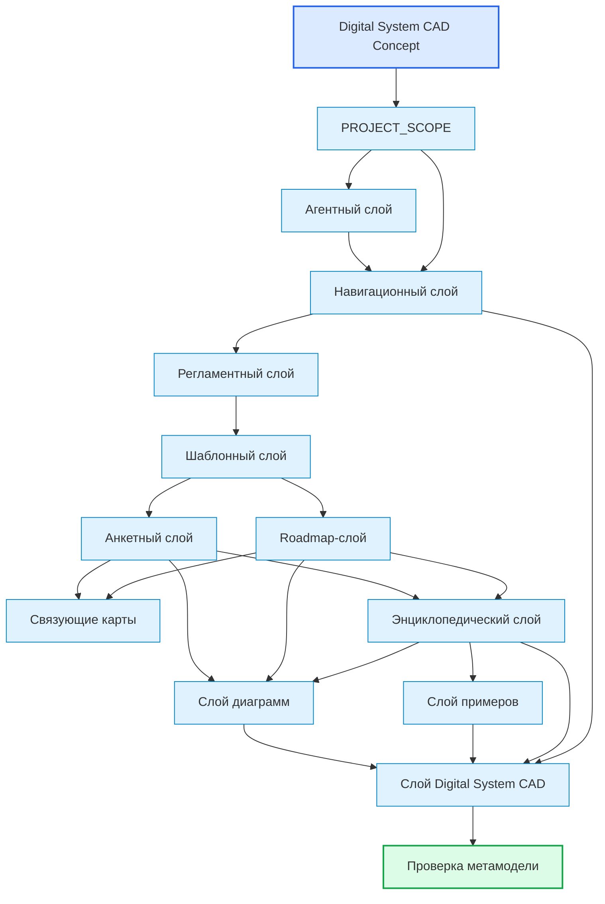
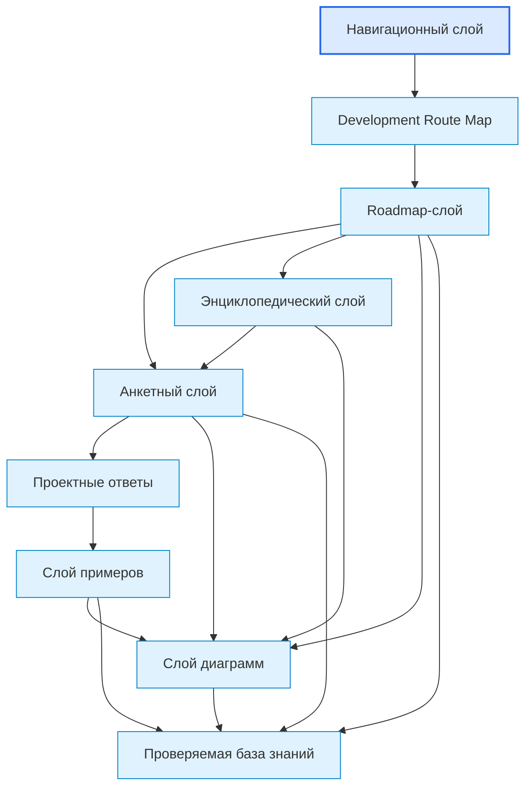

# Knowledge Layer Map

## 1. Назначение документа

`00_Knowledge_Layer_Map.md` определяет слои базы знаний проекта Programming Digital Systems.

Документ объясняет, какие виды документов существуют в проекте, за что отвечает каждый слой и как слои связаны между собой. В контексте [[Digital_System_CAD_Concept_for_Codex|Digital System CAD]] карта слоёв также показывает, какие слои помогают формировать, проверять и представлять модель цифровой системы.

Документ не описывает подробный маршрут разработки. Маршрут разработки описан в [[docs/00_maps/00_Development_Route_Map|Development Route Map]].

> [!info] Главное
> Документ помогает ориентироваться в базе знаний и показывает место связанных документов в маршруте.

## 2. Место документа в системе знаний

Документ относится к навигационному слою.

Документ используется после [[PROJECT_SCOPE|PROJECT_SCOPE]], [[Digital_System_CAD_Concept_for_Codex|Digital System CAD Concept]] и [[docs/00_maps/00_Documentation_Map|Documentation Map]].

Документ применяется перед созданием новых слоёв, крупных разделов и серий документов.

## 3. Общая схема слоёв знаний

## 4. Концептуальный слой

Назначение: определить конечную цель исследования и рабочую гипотезу будущей инженерной среды.

Основной документ:

- [[Digital_System_CAD_Concept_for_Codex|Digital System CAD Concept]]
  - Передаёт: идею Digital System CAD, гипотезу универсальных элементов, роль SDD, варианты реализации и проверочные проекты.
  - Используется для: ориентации всех слоёв на модель цифровой системы.
  - Ограничение: не заменяет roadmap, анкеты и проверочные примеры.

- [[Digital_System_CAD_Philosophical_Essay_for_Codex|Digital System CAD Philosophical Essay]]
  - Передаёт: философские основания typed elements, typed relations, structured facts, definitions, views, constraints и traceability.
  - Используется для: ужесточения рабочей формы метамодели и правил для Codex.
  - Ограничение: не является технической спецификацией.

## 5. Слой масштаба проекта

Назначение: определить цель, масштаб и стратегическую границу проекта.

Основной документ:

- [[PROJECT_SCOPE|PROJECT_SCOPE]]
  - Передаёт: масштаб базы знаний, центральную формулу цифровой системы и связь с Digital System CAD.
  - Используется для: понимания общей цели проекта.
  - Ограничение: не раскрывает подробно каждый слой.

## 6. Агентный слой

Назначение: определить правила работы AI-агента с документацией проекта.

Документы:

- [[AGENTS|AGENTS]]
  - Передаёт: правила, которые агент должен учитывать перед созданием и изменением документов.
  - Используется для: соблюдения структуры, маршрута и регламентов.
  - Ограничение: не заменяет сами регламенты.

## 7. Навигационный слой

Назначение: помогать пользователю ориентироваться в базе знаний.

Документы:

- [[docs/00_maps/00_Documentation_Map|Documentation Map]]
  - Передаёт: общую структуру документации.
  - Используется для: поиска слоёв и главных документов.
  - Ограничение: не раскрывает подробно каждый этап.

- [[docs/00_maps/00_Development_Route_Map|Development Route Map]]
  - Передаёт: полный маршрут разработки.
  - Используется для: движения от идеи до развития системы.
  - Ограничение: не объясняет структуру каждого слоя.

- [[docs/00_maps/00_Knowledge_Layer_Map|Knowledge Layer Map]]
  - Передаёт: карту слоёв знаний.
  - Используется для: понимания назначения roadmap, анкет, энциклопедии, примеров и диаграмм.
  - Ограничение: не заменяет roadmap-документы.

- [[docs/00_maps/04_Requirements_To_Toolchain_Map|Requirements To Toolchain Map]]
  - Передаёт: связь требований с критериями выбора инструментария.
  - Используется для: предотвращения прямого выбора инструмента без критериев.
  - Ограничение: не выбирает инструменты.

## 8. Регламентный слой

Назначение: определить правила создания, оформления, связывания и визуализации документов.

Документы:

- [[docs/01_regulations/Documentation_System_Regulation|Documentation System Regulation]]
  - Передаёт: общие правила системы документации.
  - Используется для: согласования структуры базы знаний.
  - Ограничение: не заменяет карту документации.

- [[docs/01_regulations/Document_Writing_Rules|Document Writing Rules]]
  - Передаёт: правила изложения.
  - Используется для: исключения личного шума и мусора.
  - Ограничение: не определяет маршрут разработки.

- [[docs/01_regulations/Link_Rules|Link Rules]]
  - Передаёт: правила Obsidian wikilinks.
  - Используется для: рабочих внутренних ссылок и Graph view.
  - Ограничение: не задаёт содержание документов.

- [[docs/01_regulations/Diagram_Rules|Diagram Rules]]
  - Передаёт: правила диаграмм.
  - Используется для: визуального объяснения структуры и связей.
  - Ограничение: не заменяет текстовое содержание.

## 9. Шаблонный слой

Назначение: задать стандартную форму будущих документов.

Документы:

- [[docs/02_templates/Roadmap_Document_Template|Roadmap Document Template]]
  - Передаёт: обязательную структуру roadmap-документа.
  - Используется для: создания новых roadmap.
  - Ограничение: не содержит содержание конкретного этапа.

- [[docs/02_templates/Questionnaire_Document_Template|Questionnaire Document Template]]
  - Передаёт: обязательную структуру анкеты.
  - Используется для: создания новых анкет.
  - Ограничение: не содержит конкретные вопросы этапа.

## 10. Roadmap-слой

Назначение: вести пользователя по этапам проектирования и разработки. Для Digital System CAD roadmap-слой определяет порядок получения элементов модели и критерии перехода между уровнями описания.

Документы:

- [[docs/03_roadmaps/01_Roadmap_System_Design|Roadmap: System Design]]
- [[docs/03_roadmaps/02_Roadmap_System_Architecture_Design|Roadmap: System Architecture Design]]
- [[docs/03_roadmaps/03_Roadmap_Technical_Requirements|Roadmap: Technical Requirements]]
- [[docs/03_roadmaps/05_Roadmap_Toolchain_Selection|Roadmap: Toolchain Selection]]
- [[docs/03_roadmaps/05_Toolchain_Selection_Category_Rules|Toolchain Selection Category Rules]]
- [[docs/03_roadmaps/06_Roadmap_Implementation_Architecture|Roadmap: Implementation Architecture]]
- [[docs/03_roadmaps/07_Roadmap_Testing|Roadmap: Testing]]
- [[docs/03_roadmaps/08_Roadmap_Operation|Roadmap: Operation]]
- [[docs/03_roadmaps/09_Roadmap_Maintenance|Roadmap: Maintenance]]
- [[docs/03_roadmaps/10_Roadmap_System_Evolution|Roadmap: System Evolution]]

Слой отвечает за:

- порядок проектирования;
- входные условия этапа;
- правила этапа;
- контрольные вопросы;
- критерии завершения;
- выходные данные для следующего этапа.

Слой не должен быть свободной теорией. Каждый roadmap-документ должен вести пользователя к результату.

## 11. Анкетный слой

Назначение: превращать правила roadmap-документов в последовательность вопросов. Для Digital System CAD анкетный слой должен стремиться к структурированным ответам, которые можно превратить в записи модели и связать с другими объектами.

Документы:

- [[docs/04_questionnaires/01_Questionnaire_System_Design|Questionnaire: System Design]]
- [[docs/04_questionnaires/02_Questionnaire_System_Architecture_Design|Questionnaire: System Architecture Design]]
- [[docs/04_questionnaires/03_Questionnaire_Technical_Requirements|Questionnaire: Technical Requirements]]
- [[docs/04_questionnaires/05_Questionnaire_Toolchain_Selection|Questionnaire: Toolchain Selection]]
- [[docs/04_questionnaires/06_Questionnaire_Implementation_Architecture|Questionnaire: Implementation Architecture]]
- [[docs/04_questionnaires/07_Questionnaire_Testing|Questionnaire: Testing]]
- [[docs/04_questionnaires/08_Questionnaire_Operation|Questionnaire: Operation]]
- [[docs/04_questionnaires/09_Questionnaire_Maintenance|Questionnaire: Maintenance]]
- [[docs/04_questionnaires/10_Questionnaire_System_Evolution|Questionnaire: System Evolution]]

Слой отвечает за:

- вопросы пользователю;
- поля для ответов;
- критерии заполнения;
- связь вопросов с roadmap-документами;
- движение от неопределённой идеи к проектному решению;
- отделение неизвестных ответов в открытые вопросы.

## 12. Связующие карты

Назначение: связывать самостоятельные темы, которые нельзя смешивать в одном документе.

Документы:

- [[docs/00_maps/04_Requirements_To_Toolchain_Map|Requirements To Toolchain Map]]
  - Передаёт: переход от технического требования к критерию выбора инструмента.
  - Используется для: трассировки требования к инструменту.
  - Ограничение: не заменяет документы требований и инструментария.

## 13. Энциклопедический слой

Назначение: раскрывать универсальные понятия цифрового мира. Для Digital System CAD энциклопедический слой проверяет, какие понятия являются универсальными элементами модели, какие являются свойствами элементов, а какие относятся только к доменным расширениям.

Документы:

- [[docs/05_encyclopedia/Entities|Entities]]
- [[docs/05_encyclopedia/Data|Data]]
- [[docs/05_encyclopedia/Rules|Rules]]
- [[docs/05_encyclopedia/States|States]]
- [[docs/05_encyclopedia/Events|Events]]
- [[docs/05_encyclopedia/Flows|Flows]]
- [[docs/05_encyclopedia/Storage|Storage]]
- [[docs/05_encyclopedia/Errors|Errors]]
- [[docs/05_encyclopedia/Interfaces|Interfaces]]
- [[docs/05_encyclopedia/Architecture|Architecture]]
- [[docs/05_encyclopedia/Layers|Layers]]
- [[docs/05_encyclopedia/Modules|Modules]]
- [[docs/05_encyclopedia/Models|Models]]
- [[docs/05_encyclopedia/Dependencies|Dependencies]]
- [[docs/05_encyclopedia/Configurations|Configurations]]
- [[docs/05_encyclopedia/Extension_Points|Extension Points]]

Слой отвечает за:

- определения;
- классификации;
- универсальные свойства цифровых систем;
- примеры применения понятий;
- связи между понятиями.

Энциклопедия объясняет понятия, а roadmap ведёт пользователя по процессу.

## 14. Слой примеров

Назначение: показывать применение универсальных правил в разных областях цифровых систем. Для Digital System CAD слой примеров является проверкой того, выдерживает ли метамодель разные классы систем.

Документы:

- [[docs/06_examples/Examples_Index|Examples Index]]
  - Передаёт: индекс категорий примеров.
  - Используется для: выбора учебного примера.
  - Ограничение: не заменяет сами примеры.

- [[docs/06_examples/Scripts/Python_File_Processing_Utility|Python File Processing Utility]]
  - Передаёт: первый полный пример Python-утилиты.
  - Используется для: демонстрации полного маршрута.
  - Ограничение: не является production-реализацией.

Категории:

- Скрипты автоматизации
  - Примеры: обработка файлов, генерация отчётов, парсинг данных.
- GUI-приложения
  - Примеры: настольная утилита, интерфейс оператора, редактор шаблонов.
- Web-системы
  - Примеры: API-сервис, личный кабинет, панель мониторинга.
- Embedded-системы
  - Примеры: контроллер датчиков, устройство сбора данных, управление клапанами.
- PLC-системы
  - Примеры: автоматический режим, аварийные межблокировки, управление технологическим процессом.
- CNC/CAM-системы
  - Примеры: постпроцессор, анализ NC-программ, контроль инструмента.
- Базы данных
  - Примеры: складской учёт, журнал измерений, история изменений.
- Интеграционные системы
  - Примеры: обмен между Excel и БД, обмен между PLC и GUI, REST API.

## 15. Слой диаграмм

Назначение: хранить крупные диаграммы и визуальные карты, которые используются несколькими документами. Для Digital System CAD диаграммы должны быть представлениями модели, а не самостоятельными источниками правды.

### 15.1. Базовые диаграммы системы знаний

- [[docs/07_diagrams/00_System_Map|System Map]]
  - Передаёт: универсальную карту цифровой системы.
  - Используется для: связки энциклопедического, roadmap-, анкетного и примерного слоёв.
  - Ограничение: не заменяет энциклопедию.

- [[docs/07_diagrams/00_Documentation_Map_Diagrams|Documentation Map Diagrams]]
  - Передаёт: визуальную структуру документации.
  - Используется для: навигации по слоям базы знаний.
  - Ограничение: не заменяет [[docs/00_maps/00_Documentation_Map|Documentation Map]].

- [[docs/07_diagrams/00_Development_Route_Diagrams|Development Route Diagrams]]
  - Передаёт: визуальный маршрут разработки.
  - Используется для: понимания этапов, возвратов и запрещённых переходов.
  - Ограничение: не заменяет [[docs/00_maps/00_Development_Route_Map|Development Route Map]].

### 15.2. Диаграммы roadmap-этапов

- [[docs/07_diagrams/01_Roadmap_System_Design_Diagrams|Roadmap System Design Diagrams]]
  - Передаёт: визуальную структуру проектирования системы.
  - Используется для: обучения выделению сущностей, данных, правил, состояний, событий, потоков, хранения и ошибок.
  - Ограничение: не заменяет [[docs/03_roadmaps/01_Roadmap_System_Design|Roadmap: System Design]].

- [[docs/07_diagrams/02_Roadmap_System_Architecture_Diagrams|Roadmap System Architecture Diagrams]]
  - Передаёт: визуальную структуру архитектуры системы.
  - Используется для: обучения слоям, модулям, моделям, интерфейсам, зависимостям, конфигурациям и точкам расширения.
  - Ограничение: не заменяет [[docs/03_roadmaps/02_Roadmap_System_Architecture_Design|Roadmap: System Architecture Design]].

- [[docs/07_diagrams/03_Roadmap_Technical_Requirements_Diagrams|Roadmap Technical Requirements Diagrams]]
  - Передаёт: визуальную структуру технических требований.
  - Используется для: обучения источникам, классификации, жизненному циклу и проверяемости требований.
  - Ограничение: не заменяет [[docs/03_roadmaps/03_Roadmap_Technical_Requirements|Roadmap: Technical Requirements]].

- [[docs/07_diagrams/05_Roadmap_Toolchain_Selection_Diagrams|Roadmap Toolchain Selection Diagrams]]
  - Передаёт: визуальную структуру выбора инструментария.
  - Используется для: обучения выбору инструментов по требованиям и условиям применения категорий.
  - Ограничение: не заменяет [[docs/03_roadmaps/05_Roadmap_Toolchain_Selection|Roadmap: Toolchain Selection]].

- [[docs/07_diagrams/06_Roadmap_Implementation_Architecture_Diagrams|Roadmap Implementation Architecture Diagrams]]
  - Передаёт: визуальную структуру архитектуры реализации.
  - Используется для: обучения переходу от архитектуры системы к структуре проекта, модулям, адаптерам, конфигурации, логам и тестам.
  - Ограничение: не заменяет [[docs/03_roadmaps/06_Roadmap_Implementation_Architecture|Roadmap: Implementation Architecture]].

- [[docs/07_diagrams/07_Roadmap_Testing_Operation_Maintenance_Evolution_Diagrams|Roadmap Testing Operation Maintenance Evolution Diagrams]]
  - Передаёт: визуальную структуру тестирования, эксплуатации, сопровождения и развития.
  - Используется для: понимания жизненного цикла системы после реализации.
  - Ограничение: не заменяет roadmap-документы и анкеты этих этапов.

## 16. Слой Digital System CAD

Назначение: собирать и формировать информацию для рабочей метамодели цифровой системы.

Слой не является реализацией metamodeling workbench. Он хранит исследовательские документы, рабочие формы, будущие кандидаты элементов модели и результаты проверки на примерах.

Документы:

- [[docs/08_digital_system_cad/00_Digital_System_CAD_Index|Digital System CAD Index]]
  - Передаёт: назначение слоя, текущую структуру, входные документы, будущие metamodel-документы и порядок работы.
  - Используется для: входа в слой Digital System CAD.
  - Ограничение: не заменяет рабочую форму метамодели.

- [[docs/08_digital_system_cad/research/01_Metamodeling_Methods_And_Standards|Metamodeling Methods and Standards]]
  - Передаёт: методы, стандарты и reference technologies метамоделирования.
  - Используется для: понимания model, metamodel, views, transformations, validation rules и traceability.
  - Ограничение: не является ТЗ на приложение.

- [[docs/08_digital_system_cad/metamodel/01_Metamodel_Form|Metamodel Form]]
  - Передаёт: рабочую форму сбора и структурирования информации.
  - Используется для: выделения Element Type, Element Card, Relation Type, Structured Fact, Register, View, Viewpoint, Transformation, Validation Rule, Controlled Vocabulary, Questionnaire Mapping и Traceability Rule.
  - Ограничение: не является доказанной метамоделью.

- [[docs/08_digital_system_cad/metamodel/01_Model_Elements|Model Elements]]
  - Передаёт: кандидаты element types для рабочей метамодели.
  - Используется для: перехода от энциклопедии к реестрам, structured facts и SDD.
  - Ограничение: требует проверки на примерах.

- [[docs/08_digital_system_cad/metamodel/02_Model_Relations|Model Relations]]
  - Передаёт: кандидаты relation types для рабочей метамодели.
  - Используется для: построения сети structured facts.
  - Ограничение: требует разделения на универсальные, частые, доменные и подозрительные связи.

- [[docs/08_digital_system_cad/metamodel/03_Structured_Facts|Structured Facts]]
  - Передаёт: форму проверяемых утверждений модели.
  - Используется для: построения реестров, views, SDD, трассировки и Codex context.
  - Ограничение: требует проверки на первом примере.

- [[docs/08_digital_system_cad/metamodel/04_Model_Registers|Model Registers]]
  - Передаёт: форму registers как табличных views.
  - Используется для: проверки полноты элементов, facts, gaps и подготовки SDD.
  - Ограничение: не заменяет model repository и structured facts.

- [[docs/08_digital_system_cad/metamodel/05_Controlled_Vocabulary|Controlled Vocabulary]]
  - Передаёт: правила терминологии и границы понятий.
  - Используется для: уменьшения неоднозначности в модели, SDD, registers и Codex context.
  - Ограничение: требует расширения на проверочных примерах.

- [[docs/08_digital_system_cad/metamodel/06_Traceability|Traceability]]
  - Передаёт: правила цепочек трассировки и gap detection.
  - Используется для: связи требований, model elements, tasks, code artifacts, tests и SDD.
  - Ограничение: требует проверки на первом validation example.

- [[docs/08_digital_system_cad/metamodel/07_SDD_From_Model|SDD From Model]]
  - Передаёт: правила SDD как view/transformation модели.
  - Используется для: проверки, можно ли собирать SDD из elements, facts, registers, vocabulary and traceability.
  - Ограничение: требует проверки на первом validation example.

- [[docs/08_digital_system_cad/validation/01_Python_File_Processing_Utility_Metamodel_Check|Python File Processing Utility Metamodel Check]]
  - Передаёт: первый validation result по простой Python-утилите.
  - Используется для: проверки применимости рабочей формы и выявления metamodel refinements.
  - Ограничение: не является доказательством универсальности.

Будущие подпапки слоя:

- `metamodel/`
  - Для кандидатов элементов, связей, реестров, SDD и трассировки.
- `research/`
  - Для методов, стандартов, reference technologies и анализа подходов.
- `validation/`
  - Для проверки рабочей формы на разных типах цифровых систем.

## 17. Связь слоёв с маршрутом разработки

## 18. Правило добавления нового слоя

Новый слой допускается только если существующие слои не покрывают его назначение.

AI-агент может создавать новые папки и подпапки для Obsidian, если они помогают отделить слой, тип документов, серию примеров, профиль метамодели или группу связанных материалов. Папка считается частью структуры знаний, поэтому она должна иметь понятное назначение и быть отражена в картах, если становится постоянной частью проекта.

Перед добавлением нового слоя необходимо определить:

- назначение слоя;
- какие документы он содержит;
- какие документы являются входными;
- какие документы являются выходными;
- чем слой отличается от существующих;
- нужно ли обновить [[docs/00_maps/00_Documentation_Map|Documentation Map]];
- нужно ли обновить [[docs/00_maps/00_Knowledge_Layer_Map|Knowledge Layer Map]].

Перед добавлением новой папки необходимо определить:

- назначение папки;
- к какому слою она относится;
- какие документы будут в ней храниться;
- не дублирует ли она существующую папку;
- нужно ли добавить её в карту документации или карту слоёв.

## 19. Критерии актуальности карты слоёв

Документ считается актуальным, если:

- перечислены все основные слои базы знаний;
- каждый слой имеет назначение;
- каждый слой имеет границы ответственности;
- каждый слой связан с документами через Obsidian wikilinks;
- постоянные папки и подпапки имеют понятное назначение и отражены в картах, если они важны для навигации;
- roadmap-слой и анкетный слой соответствуют текущему маршруту разработки;
- концептуальный слой Digital System CAD указан как источник конечной цели;
- слой Digital System CAD указан как место сбора и формирования информации для рабочей метамодели;
- связующие карты вынесены отдельно от самостоятельных тем;
- слой диаграмм содержит базовые диаграммы системы знаний и диаграммы roadmap-этапов;
- категории и примеры не смешаны;
- карта не противоречит [[docs/00_maps/00_Documentation_Map|Documentation Map]].

## 20. Связанные документы

### Входные документы

- [[PROJECT_SCOPE|PROJECT_SCOPE]]
  - Передаёт: масштаб проекта, принцип связанной базы знаний и связь с Digital System CAD.
  - Используется для: определения необходимости слоёв знаний.
  - Ограничение: не раскрывает структуру каждого слоя.

- [[Digital_System_CAD_Concept_for_Codex|Digital System CAD Concept]]
  - Передаёт: конечную цель исследования, гипотезу метамодели и роль SDD.
  - Используется для: определения, зачем нужны слои знаний и как они проверяют модель.
  - Ограничение: не заменяет карту слоёв.

- [[Digital_System_CAD_Philosophical_Essay_for_Codex|Digital System CAD Philosophical Essay]]
  - Передаёт: принципы model/view separation, first-class relations, controlled vocabulary и provisional metamodel.
  - Используется для: определения качества слоя Digital System CAD.
  - Ограничение: не заменяет карту слоёв.

- [[docs/00_maps/00_Documentation_Map|Documentation Map]]
  - Передаёт: общую структуру базы знаний.
  - Используется для: детализации слоёв документации.
  - Ограничение: не объясняет границы ответственности каждого слоя подробно.

- [[docs/00_maps/00_Development_Route_Map|Development Route Map]]
  - Передаёт: полный маршрут разработки.
  - Используется для: связи roadmap- и анкетного слоёв с этапами разработки.
  - Ограничение: не описывает назначение каждого слоя базы знаний.

### Выходные документы

- [[docs/03_roadmaps/01_Roadmap_System_Design|Roadmap: System Design]]
  - Получает: место roadmap-слоя в базе знаний.
  - Используется для: построения первого проектного roadmap-документа.
  - Ограничение: не должен подменять энциклопедию понятий.

- [[docs/05_encyclopedia/Entities|Entities]]
  - Получает: место энциклопедического слоя в базе знаний.
  - Используется для: раскрытия понятия сущностей.
  - Ограничение: не должен превращаться в roadmap-документ.

- [[docs/06_examples/Examples_Index|Examples Index]]
  - Получает: место слоя примеров в базе знаний.
  - Используется для: демонстрации применения маршрута в разных областях цифровых систем.
  - Ограничение: не должен заменять roadmap и анкеты.

- [[docs/07_diagrams/00_System_Map|System Map]]
  - Получает: место слоя диаграмм в базе знаний.
  - Используется для: визуального связывания понятий, roadmap, анкет и примеров.
  - Ограничение: не должен заменять карту слоёв.

## 21. Следующий шаг

После работы с документом необходимо перейти к связанным roadmap, анкетам, диаграммам или регламентам, указанным в разделе `Связанные документы`.

## 22. История изменений

- Updated: карта слоёв синхронизирована с текущей структурой документации, добавлены агентный слой, связующие карты, полный roadmap-слой, полный анкетный слой, эксплуатация, сопровождение и развитие системы.
- Updated: документ приведён к Obsidian wikilinks.
- Updated: слой диаграмм дополнен базовыми диаграммами системы знаний и диаграммами roadmap-этапов.
- Updated: документ приведён к единому визуальному формату проекта.
- Updated: энциклопедический слой дополнен архитектурными понятиями для проектирования архитектуры системы.
- Updated: добавлен концептуальный слой [[Digital_System_CAD_Concept_for_Codex|Digital System CAD]] и связь слоёв с проверкой метамодели.
- Updated: добавлен слой Digital System CAD для исследования методов метамоделирования и рабочей формы метамодели.
- Updated: философское эссе Digital System CAD добавлено как концептуальный ориентир для качества метамодели.
- Updated: добавлен [[docs/08_digital_system_cad/00_Digital_System_CAD_Index|Digital System CAD Index]] как входная карта слоя Digital System CAD.
- Updated: добавлены документы [[docs/08_digital_system_cad/metamodel/01_Model_Elements|Model Elements]] и [[docs/08_digital_system_cad/metamodel/02_Model_Relations|Model Relations]].
- Updated: добавлен документ [[docs/08_digital_system_cad/metamodel/03_Structured_Facts|Structured Facts]].
- Updated: добавлен документ [[docs/08_digital_system_cad/metamodel/04_Model_Registers|Model Registers]].
- Updated: добавлен документ [[docs/08_digital_system_cad/metamodel/05_Controlled_Vocabulary|Controlled Vocabulary]].
- Updated: добавлен документ [[docs/08_digital_system_cad/metamodel/06_Traceability|Traceability]].
- Updated: добавлен документ [[docs/08_digital_system_cad/metamodel/07_SDD_From_Model|SDD From Model]].
- Updated: добавлен первый validation-документ [[docs/08_digital_system_cad/validation/01_Python_File_Processing_Utility_Metamodel_Check|Python File Processing Utility Metamodel Check]].
