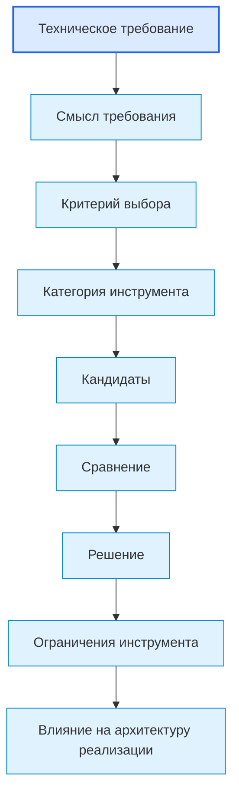

# Requirements To Toolchain Map / Карта перехода от требований к инструментарию

## 1. Назначение документа

`04_Requirements_To_Toolchain_Map.md` определяет связь между техническими требованиями и выбором инструментария.

Документ используется после формирования технических требований и перед практическим выбором инструментов.

Документ не раскрывает заново тему технических требований и не раскрывает заново тему выбора инструментария.

Назначение документа — показать, как техническое требование превращается в критерий выбора инструмента.

> [!info] Главное
> Документ помогает ориентироваться в базе знаний и показывает место связанных документов в маршруте.

## 2. Место документа в системе знаний

Документ относится к навигационно-связующему слою проекта Programming Digital Systems.

Документ находится между:

- [[docs/03_roadmaps/03_Roadmap_Technical_Requirements|Roadmap: Technical Requirements]];
- [[docs/03_roadmaps/05_Roadmap_Toolchain_Selection|Roadmap: Toolchain Selection]].

Документ обеспечивает переход:

```text
Техническое требование
↓
Критерий выбора инструмента
↓
Кандидаты инструментов
↓
Сравнение
↓
Решение
↓
Ограничения выбранного инструмента
↓
Вход в архитектуру реализации
```

## 3. Главный принцип

Техническое требование не должно сразу превращаться в название инструмента.

Правильный переход должен проходить через критерий выбора.

Неправильно:

```text
Система должна хранить данные между запусками
↓
Использовать SQLite
```

Правильно:

```text
Система должна хранить данные между запусками
↓
Нужен инструмент хранения с поддержкой постоянного хранения, структурированных данных и чтения после перезапуска
↓
Кандидаты: JSON, CSV, SQLite, PostgreSQL
↓
Сравнение по критериям
↓
Выбор инструмента
```

## 4. Граница ответственности документа

### 4.1. Что делает документ

Документ:

- показывает связь требований и инструментария;
- определяет правила преобразования требований в критерии выбора;
- определяет шаблон трассировки требования к инструменту;
- помогает проверить, что инструмент выбран не случайно;
- передаёт результат в архитектуру реализации.

### 4.2. Что документ не делает

Документ не должен:

- формировать технические требования заново;
- выбирать инструменты без критериев;
- заменять `03_Roadmap_Technical_Requirements.md`;
- заменять `05_Roadmap_Toolchain_Selection.md`;
- проектировать структуру кода;
- подменять архитектуру реализации.

## 5. Связанные документы

### 5.1. Входные документы

- [[docs/03_roadmaps/03_Roadmap_Technical_Requirements|Roadmap: Technical Requirements]]
  - Передаёт: виды технических требований, правила формулировки требований и критерии проверки.
  - Используется для: определения требований-источников.
  - Ограничение: не выбирает инструменты.

- [[docs/04_questionnaires/03_Questionnaire_Technical_Requirements|Questionnaire: Technical Requirements]]
  - Передаёт: заполненные требования конкретной системы.
  - Используется для: получения списка требований, влияющих на выбор инструментария.
  - Ограничение: не должен содержать решение по инструментарию.

- [[docs/03_roadmaps/02_Roadmap_System_Architecture_Design|Roadmap: System Architecture Design]]
  - Передаёт: архитектурные ограничения, слои, модули, интерфейсы, зависимости и точки расширения.
  - Используется для: проверки совместимости инструмента с архитектурой системы.
  - Ограничение: не выбирает инструменты.

### 5.2. Выходные документы

- [[docs/03_roadmaps/05_Roadmap_Toolchain_Selection|Roadmap: Toolchain Selection]]
  - Получает: критерии выбора, сформированные из требований.
  - Используется для: выбора конкретных инструментов.
  - Ограничение: не должен менять требования без возврата к требованиям.

- [[docs/04_questionnaires/05_Questionnaire_Toolchain_Selection|Questionnaire: Toolchain Selection]]
  - Получает: структуру трассировки требования к инструменту.
  - Используется для: практического заполнения решений по инструментарию.
  - Ограничение: не должен формировать требования заново.

- [[docs/03_roadmaps/06_Roadmap_Implementation_Architecture|Roadmap: Implementation Architecture]]
  - Получает: выбранные инструменты и их ограничения.
  - Используется для: проектирования конкретной структуры реализации.
  - Ограничение: не должен выбирать инструменты заново без причины.

## 6. Основная схема перехода



## 7. Правила преобразования требований в критерии

### RULE-RTT-001. Требование должно быть источником критерия

Критерий выбора должен ссылаться на конкретное требование или архитектурное ограничение.

### RULE-RTT-002. Критерий должен быть проверяемым

Критерий должен позволять определить, подходит инструмент или не подходит.

Неправильно:

> Инструмент должен быть хороший.

Правильно:

> Инструмент должен поддерживать чтение и запись структурированных данных без потери данных после перезапуска системы.

### RULE-RTT-003. Один инструмент может закрывать несколько требований

Если инструмент закрывает несколько требований, каждое требование должно быть указано явно.

### RULE-RTT-004. Одно требование может влиять на несколько категорий инструментов

Например, требование к offline-работе может влиять на:

- хранение;
- GUI;
- обновления;
- логирование;
- развёртывание.

### RULE-RTT-005. Инструмент не должен быть выбран до сравнения

Если решение важное, должны быть зафиксированы кандидаты и причина выбора.

### RULE-RTT-006. Ограничение выбранного инструмента должно возвращаться в архитектуру реализации

Ограничения инструмента должны быть переданы в `06_Roadmap_Implementation_Architecture.md`.

## 8. Категории требований и возможное влияние на инструменты

### 8.1. Требования к данным

Могут влиять на:

- формат файлов;
- библиотеку парсинга;
- модель данных;
- инструмент валидации;
- способ хранения.

### 8.2. Требования к обработке

Могут влиять на:

- язык программирования;
- библиотеки обработки;
- архитектуру выполнения задач;
- инструменты параллельной или последовательной обработки.

### 8.3. Требования к хранению

Могут влиять на:

- базу данных;
- формат файла;
- механизм сериализации;
- стратегию резервного копирования;
- инструмент миграции.

### 8.4. Требования к интерфейсам

Могут влиять на:

- GUI-фреймворк;
- API-фреймворк;
- HMI-инструмент;
- CLI-инструмент;
- протокол обмена.

### 8.5. Требования к производительности

Могут влиять на:

- язык программирования;
- алгоритмы;
- формат хранения;
- runtime;
- аппаратную платформу;
- способ обработки событий.

### 8.6. Требования к надёжности

Могут влиять на:

- инструменты логирования;
- механизмы восстановления;
- средства мониторинга;
- платформу выполнения;
- способ хранения состояния.

### 8.7. Требования к ошибкам и диагностике

Могут влиять на:

- библиотеку логирования;
- формат диагностических данных;
- HMI/GUI-сообщения;
- инструменты мониторинга;
- тестовые инструменты.

### 8.8. Требования к конфигурации

Могут влиять на:

- формат конфигурации;
- механизм загрузки конфигурации;
- инструмент проверки конфигурации;
- интерфейс изменения настроек.

### 8.9. Требования к расширяемости

Могут влиять на:

- архитектурный стиль;
- plugin-механизм;
- формат интерфейсов;
- выбор фреймворка;
- структуру модулей.

### 8.10. Требования к тестируемости

Могут влиять на:

- тестовый фреймворк;
- mock-инструменты;
- симуляторы;
- CI-инструменты;
- структуру проекта.

### 8.11. Требования к безопасности

Могут влиять на:

- механизм авторизации;
- инструмент хранения секретов;
- протокол обмена;
- платформу выполнения;
- аудит действий.

### 8.12. Требования к окружению

Могут влиять на:

- язык программирования;
- runtime;
- платформу;
- способ поставки;
- допустимые библиотеки;
- ограничения оборудования.

## 9. Шаблон трассировки требования к инструменту

```md
## RTT-000. Название связи

### Требование-источник

- `REQ-TR-000` — формулировка требования.

### Смысл требования

- 

### Категория инструмента

- 

### Критерии выбора

- 

### Кандидаты

- Кандидат 1:
- Кандидат 2:
- Кандидат 3:

### Сравнение

| Критерий | Кандидат 1 | Кандидат 2 | Кандидат 3 |
|---|---|---|---|
|  |  |  |  |

### Выбранный инструмент

- 

### Причина выбора

- 

### Ограничения выбранного инструмента

- 

### Влияние на архитектуру реализации

- 

### Статус

- Draft / Approved / Changed / Deprecated.
```

## 10. Примеры перехода от требования к инструменту

### 10.1. Скрипт автоматизации

Требование:

```text
Система должна читать входные таблицы и проверять обязательные колонки перед обработкой.
```

Критерии выбора:

- инструмент должен читать табличные файлы;
- инструмент должен позволять получать список колонок;
- инструмент должен позволять обрабатывать строки;
- инструмент должен быть пригоден для автоматического тестирования.

Категории инструментов:

- язык программирования;
- библиотека чтения таблиц;
- инструмент тестирования.

### 10.2. GUI-приложение

Требование:

```text
Система должна отображать предпросмотр результата перед экспортом.
```

Критерии выбора:

- GUI-инструмент должен поддерживать область предпросмотра;
- инструмент должен поддерживать обновление предпросмотра после изменения данных;
- инструмент должен работать в целевой операционной среде.

Категории инструментов:

- GUI-фреймворк;
- библиотека рендера;
- формат внутреннего представления документа.

### 10.3. Embedded-система

Требование:

```text
Система должна выполнить управляющее действие не позднее заданного времени реакции после изменения сигнала датчика.
```

Критерии выбора:

- платформа должна поддерживать требуемое время реакции;
- среда выполнения должна быть пригодна для работы с периферией;
- инструменты отладки должны позволять проверять задержку реакции.

Категории инструментов:

- микроконтроллер;
- SDK;
- таймеры;
- инструмент отладки.

### 10.4. PLC-система

Требование:

```text
Система должна блокировать запуск оборудования при активной аварии.
```

Критерии выбора:

- PLC-платформа должна поддерживать надёжную обработку аварий;
- среда разработки должна поддерживать диагностику;
- HMI-инструмент должен отображать причину блокировки;
- выбранная платформа должна соответствовать промышленной среде.

Категории инструментов:

- PLC-платформа;
- HMI-инструмент;
- инструмент диагностики;
- протокол обмена.

### 10.5. CNC/CAM-система

Требование:

```text
Система должна определять вызовы инструмента в NC-программе и формировать отчёт по использованию инструмента.
```

Критерии выбора:

- инструмент должен позволять читать текстовые NC-файлы;
- язык должен поддерживать надёжный парсинг строк;
- формат отчёта должен быть пригоден для последующего анализа;
- инструмент тестирования должен позволять проверять разные варианты NC-программ.

Категории инструментов:

- язык программирования;
- библиотека парсинга;
- формат отчёта;
- инструмент тестирования.

## 11. Таблица трассировки требований к инструментам

| ID требования | Смысл требования | Категория инструмента | Критерий выбора | Выбранный инструмент | Ограничения | Влияние на архитектуру реализации |
|---|---|---|---|---|---|---|
| REQ-TR-000 |  |  |  |  |  |  |
| REQ-TR-001 |  |  |  |  |  |  |
| REQ-TR-002 |  |  |  |  |  |  |

## 12. Контрольные вопросы

Перед переходом к `05_Roadmap_Toolchain_Selection.md` необходимо ответить:

1. Все ли важные требования имеют критерии выбора инструмента?
2. Не выбран ли инструмент напрямую без критерия?
3. Есть ли требования, которые влияют сразу на несколько категорий инструментов?
4. Есть ли внешние обязательные ограничения?
5. Есть ли требования, которым ни один кандидат не соответствует?
6. Нужно ли вернуться к техническим требованиям из-за невозможности выбора?
7. Зафиксированы ли ограничения выбранных инструментов?
8. Переданы ли ограничения в архитектуру реализации?

## 13. Критерии завершения документа

Документ считается применённым корректно, если:

- требования не смешаны с инструментами;
- инструменты не выбраны без критериев;
- для важных требований указано влияние на категории инструментов;
- для важных решений указаны кандидаты;
- выбранные инструменты имеют причины выбора;
- ограничения выбранных инструментов зафиксированы;
- результат может быть использован в `05_Roadmap_Toolchain_Selection.md` и `06_Roadmap_Implementation_Architecture.md`.

## 14. Следующий шаг

После работы с документом необходимо перейти к связанным roadmap, анкетам, диаграммам или регламентам, указанным в разделе `Связанные документы`.

## 15. История изменений

- Initial version: создана карта перехода от технических требований к выбору инструментария.
- Updated: документ приведён к единому визуальному формату проекта.
