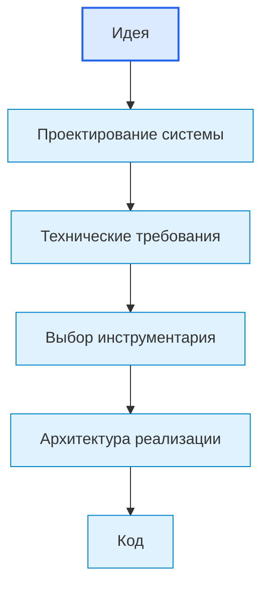
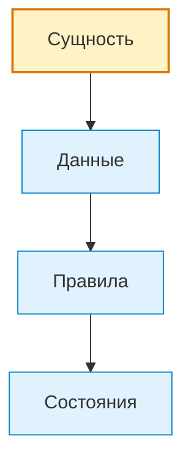

# Правила диаграмм и визуального представления

## 1. Назначение документа

Документ определяет правила использования диаграмм в проекте Programming Digital Systems.

Диаграммы нужны для визуального объяснения структуры, связей, потоков, состояний, последовательностей и архитектурных уровней.

> [!info] Главное
> Документ задаёт правило, которое должно применяться при создании и изменении материалов проекта.

## 2. Главный принцип

Диаграмма должна использоваться только тогда, когда она уточняет структуру, связь, поток, состояние, последовательность или поведение системы.

Диаграмма не должна быть декоративной.

## 3. Выбор типа диаграммы

Тип диаграммы должен соответствовать типу информации.

| Что нужно показать | Рекомендуемый тип |
|---|---|
| Общий маршрут разработки | `flowchart` |
| Иерархия понятий | `mindmap` или `flowchart` |
| Сущности, атрибуты и связи | `classDiagram` |
| Состояния системы | `stateDiagram` |
| Последовательность действий | `sequenceDiagram` |
| Поток данных или решений | `flowchart` |
| Границы системы и внешние участники | C4 или flowchart-адаптация |
| Структура файлов проекта | дерево каталогов или `flowchart` |

## 4. Правило Mermaid

Если документ предназначен для Obsidian, Mermaid-синтаксис должен быть максимально совместимым.

Для сложных диаграмм допускается использовать упрощённую flowchart-адаптацию вместо продвинутого синтаксиса, если это повышает стабильность отображения.

## 5. Правило обязательного пояснения

Каждая диаграмма должна иметь:

- идентификатор;
- название;
- назначение;
- Mermaid-код или другой формат представления;
- пояснение, что именно показывает диаграмма;
- связанные документы или разделы.

Пример структуры:

````md
## DG-SYS-001. Общий маршрут разработки

Назначение: показывает путь от идеи до сопровождения.


````

## 6. Правило цветового оформления Mermaid

Mermaid-диаграммы в учебных, энциклопедических и roadmap-документах должны использовать цветовые классы, если это помогает отличить главный объект, типы элементов, шаги процесса, результат или ошибку.

Рекомендуемые классы:

```md
classDef root fill:#fef3c7,stroke:#d97706,stroke-width:2px
classDef type fill:#e0f2fe,stroke:#0284c7,stroke-width:1px
classDef step fill:#f8fafc,stroke:#64748b,stroke-width:1px
classDef success fill:#dcfce7,stroke:#16a34a,stroke-width:2px
classDef warning fill:#fee2e2,stroke:#dc2626,stroke-width:1px
```

Пример:

````md

````

Цвета должны помогать читать смысл диаграммы.

Запрещено использовать цвет только ради оформления, если он не различает смысловые группы.

## 7. Правило визуальной достаточности

Диаграмма должна быть достаточно подробной, чтобы объяснять смысл, но не должна превращаться в нечитаемую схему.

Если диаграмма становится слишком большой, её необходимо разделить на несколько диаграмм:

- обзорная диаграмма;
- диаграмма отдельного раздела;
- диаграмма отдельного процесса;
- диаграмма отдельной сущности.

## 8. Запрещено

Запрещено использовать диаграммы:

- без текстового пояснения;
- только ради красоты;
- с типом, который не соответствует смыслу информации;
- с нестабильным синтаксисом, если документ предназначен для Obsidian;
- настолько большими, что пользователь не может прочитать связи.

## 9. Связанные документы

- [[PROJECT_SCOPE|PROJECT_SCOPE]]
  - Передаёт: масштаб проекта.
  - Используется для: определения необходимости диаграмм в базе знаний.
  - Ограничение: не задаёт синтаксис Mermaid.

- [[docs/01_regulations/Documentation_System_Regulation|Documentation System Regulation]]
  - Передаёт: требование визуальной информативности.
  - Используется для: согласования диаграмм со структурой документа.
  - Ограничение: не задаёт цветовое оформление.

- [[docs/01_regulations/Link_Rules|Link Rules]]
  - Передаёт: правила ссылок на документы и смысловые блоки.
  - Используется для: связывания диаграмм с документами.
  - Ограничение: не определяет тип диаграммы.

## 10. Следующий шаг

После работы с регламентом необходимо применять его при создании, проверке и обновлении связанных документов.

## 11. История изменений

- Updated: добавлены правила цветового оформления Mermaid-диаграмм и связанные документы приведены к Obsidian wikilinks.
- Updated: документ приведён к единому визуальному формату проекта.
