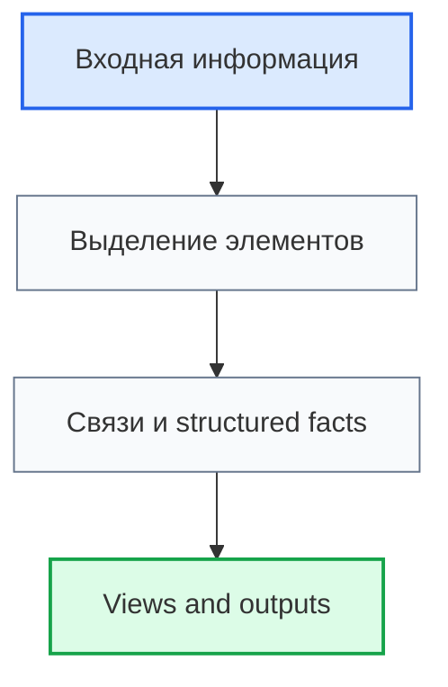

# Шаблон Roadmap-документа

## 1. Назначение шаблона

`Roadmap_Document_Template.md` определяет обязательную структуру roadmap-документа проекта Programming Digital Systems.

Roadmap-документ должен вести пользователя по этапу работы и фиксировать не только текстовые выводы, но и модельные результаты для будущей [[Digital_System_CAD_Concept_for_Codex|Digital System CAD]].

> [!info] Главное
> Roadmap-документ должен показывать, как этап превращает входную информацию в структурированные элементы, связи, факты, views, проверки, открытые вопросы и выходы для следующего этапа.

## 2. Новый смысл roadmap-документа

Roadmap больше не является только планом движения от входа к выходу.

В контексте Digital System CAD roadmap должен выполнять четыре функции:

1. Объяснять порядок работы этапа.
2. Отделять уровень модели от уровня метамодели, view, transformation и implementation.
3. Показывать, какие элементы, связи и structured facts появляются после этапа.
4. Фиксировать, какие outputs могут стать частью SDD, анкет, реестров, диаграмм, задач, тестов или Codex context.

> [!warning] Не путать
> Roadmap-документ не должен быть философским эссе, свободным планом или списком задач. Он должен быть проверяемым маршрутом получения структурированной информации.

## 3. Обязательная структура

```md
# Roadmap: Название этапа

## 1. Назначение документа

> [!info] Главное
> Кратко указать, какой этап ведёт документ и какой проверяемый результат должен получить пользователь.

## 2. Место документа в маршруте и Digital System CAD

## 3. Уровень описания

## 4. Входные условия

## 5. Связанные документы

## 6. Основные понятия этапа

## 7. Модельные результаты этапа

## 8. Structured facts этапа

## 9. Правила этапа

> [!important] Правило
> Зафиксировать главное ограничение этапа.

## 10. Порядок работы

## 11. Views этапа

## 12. Validation rules этапа

## 13. Transformations этапа

## 14. Диаграммы этапа

## 15. Примеры из разных областей цифровых систем

> [!note] Практический приём
> Показать, как применять правила этапа в реальной задаче.

## 16. Контрольные вопросы

## 17. Критерии завершения

## 18. Выходные данные для следующего этапа

## 19. Открытые вопросы

## 20. Следующий шаг

## 21. История изменений
```

## 4. Место документа в маршруте и Digital System CAD

Каждый roadmap-документ должен указывать:

- какой этап идёт до него;
- какой этап идёт после него;
- какие данные он получает;
- какие данные он передаёт дальше;
- какие решения нельзя принимать на этом этапе;
- какие элементы будущей модели Digital System CAD он создаёт или уточняет;
- какие views или transformations могут использовать результат этапа.

## 5. Уровень описания

Roadmap-документ должен явно указать, к какому уровню относится этап.

Допустимые уровни:

| Уровень | Значение |
|---|---|
| Concept | Идея, гипотеза, философское или методологическое основание |
| Metamodel | Правила построения моделей, типы элементов, связи, constraints |
| Model | Описание конкретной цифровой системы |
| View | Представление модели: анкета, таблица, диаграмма, SDD, task list |
| Transformation | Преобразование модели в SDD, задачи, тесты, Codex context |
| Validation | Проверка целостности модели |
| Implementation | Код, структура проекта, конкретные артефакты реализации |

> [!important] Правило
> Roadmap не должен смешивать эти уровни. Если этап касается нескольких уровней, каждый уровень должен быть указан отдельно.

## 6. Входные условия

Раздел должен отвечать на вопрос:

> Что должно быть уже определено до начала работы с этим документом?

Входные условия должны быть проверяемыми.

Пример:

```md
- [ ] Определены входные требования или открытые вопросы.
- [ ] Есть ссылка на источник информации.
- [ ] Понятно, какие элементы модели могут быть затронуты.
```

## 7. Связанные документы

Раздел должен содержать входные и выходные документы.

Пример:

```md
## Связанные документы

### Входные документы

- [[Документ]]
  - Передаёт:
  - Используется для:
  - Ограничение:

### Выходные документы

- [[Документ]]
  - Получает:
  - Используется для:
  - Ограничение:
```

Связь должна объяснять смысл передачи информации, а не просто перечислять файл.

## 8. Основные понятия этапа

Понятия этапа должны быть связаны с controlled vocabulary или энциклопедией.

Для важного понятия нужно указать:

```text
Term:
Definition:
Context:
Related model element:
Open questions:
```

> [!warning] Не путать
> Имя понятия не является определением. Если термин важен для модели, он должен иметь Definition и Context.

## 9. Модельные результаты этапа

Roadmap должен указать, какие модельные объекты появляются или уточняются.

Форма:

```md
| Result | Type | Creates / Updates | Used by | Open questions |
|---|---|---|---|---|
| Example result | Entity / Rule / View / Validation Rule | Creates | SDD / Register / Diagram | ... |
```

Допустимые результаты:

- Element Type;
- Element Card;
- Relation Type;
- Structured Fact;
- Register;
- View;
- Viewpoint;
- Transformation;
- Validation Rule;
- Questionnaire Mapping;
- Traceability Rule;
- Controlled Vocabulary Term;
- Open Question.

## 10. Structured facts этапа

Roadmap должен показывать, какие проверяемые утверждения могут появиться после этапа.

Форма:

```text
Subject element:
Relation:
Object element:
Meaning:
Source:
Validation:
```

Примеры:

```text
Requirement REQ-001 is_verified_by TestCase TEST-001.
Rule RULE-001 validates DataField FIELD-001.
Task TASK-001 implements Requirement REQ-001.
```

> [!important] Правило
> Связь является объектом модели первого класса. Roadmap должен описывать связи явно, а не оставлять их неявными в тексте.

## 11. Правила этапа

Правила должны быть сформулированы строго.

Допустимые формы:

- `Необходимо определить...`
- `Запрещено...`
- `Если ..., то ...`
- `Этап считается завершённым, если...`
- `Связь считается корректной, если...`
- `Элемент считается определённым, если...`

Правила должны учитывать:

- границы уровня описания;
- обязательные определения;
- допустимые связи;
- проверки целостности;
- трассировку;
- запрет на угадывание смысла.

## 12. Порядок работы

Порядок работы должен показывать, как пользователь проходит этап.

Минимальная форма:

```md
1. Проверить входные условия.
2. Выделить кандидаты в элементы.
3. Дать важным элементам Definition, Purpose, Context и Source.
4. Определить связи.
5. Сформировать structured facts.
6. Указать views и transformations.
7. Проверить validation rules.
8. Зафиксировать open questions.
9. Передать результаты следующему этапу.
```

## 13. Views этапа

Roadmap должен указать, какие views используют результат этапа.

Примеры views:

- анкета;
- таблица;
- диаграмма;
- SDD section;
- task list;
- test matrix;
- Codex context.

Форма:

```md
| View | Purpose | Source elements | Source relations | Output |
|---|---|---|---|---|
```

## 14. Validation rules этапа

Roadmap должен указать, как проверяется результат этапа.

Форма:

```md
| Rule | Applies to | Condition | Severity | Open question |
|---|---|---|---|---|
```

Примеры:

- каждый важный элемент имеет Definition;
- каждая связь имеет Source, Relation и Target;
- каждое требование связано с проверкой или открытым вопросом;
- каждый output имеет следующий документ-получатель.

## 15. Transformations этапа

Если результат этапа может быть преобразован, нужно указать transformation.

Примеры:

- model -> SDD section;
- model -> register;
- model -> diagram;
- model -> task list;
- model -> Codex context.

Форма:

```md
| Transformation | Input | Output | Validation before | Validation after |
|---|---|---|---|---|
```

## 16. Диаграммы этапа

Если этап описывает структуру, связи, поток, состояние или последовательность, документ должен содержать диаграмму.

Тип диаграммы выбирается по правилам [[docs/01_regulations/Diagram_Rules|Diagram Rules]].

Диаграмма является view модели. Она не должна быть самостоятельным источником правды.

Минимальный пример:

````md

````

## 17. Примеры из разных областей

Если правило универсальное, примеры должны быть распределены по областям:

### Скрипт автоматизации

- Пример:

### GUI-приложение

- Пример:

### Web-система

- Пример:

### Embedded-система

- Пример:

### PLC-система

- Пример:

### CNC/CAM-система

- Пример:

### База данных

- Пример:

### Интеграционная система

- Пример:

## 18. Контрольные вопросы

Roadmap должен включать вопросы:

1. Определён ли уровень работы: concept, metamodel, model, view, transformation, validation или implementation?
2. Есть ли Definition и Context для важных терминов?
3. Какие элементы модели создаются или уточняются?
4. Какие typed relations создаются или уточняются?
5. Какие structured facts появились?
6. Какие views используют результат?
7. Какие validation rules проверяют результат?
8. Какие open questions остались?
9. Что передаётся следующему этапу?

## 19. Критерии завершения

Roadmap-документ считается завершённым, если:

- заполнены обязательные разделы;
- указаны входные и выходные документы;
- указан уровень описания;
- правила сформулированы проверяемо;
- важные понятия имеют Definition и Context;
- модельные результаты перечислены явно;
- structured facts описаны явно;
- views, validation rules и transformations указаны, если они применимы;
- примеры не смешаны с категориями;
- диаграммы соответствуют смыслу информации и обозначены как views;
- открытые вопросы вынесены отдельно;
- определены выходные данные для следующего этапа.

## 20. Выходные данные для следующего этапа

Выходные данные должны быть оформлены так, чтобы следующий этап мог их использовать без угадывания.

Форма:

```md
| Output | Type | Receiver | Required completeness | Open questions |
|---|---|---|---|---|
```

## 21. Открытые вопросы

Открытый вопрос фиксируется, если:

- значение термина неясно;
- связь не доказана;
- элемент может относиться к нескольким уровням;
- view противоречит другому view;
- невозможно перейти дальше без решения.

Codex не должен скрывать такие вопросы в тексте.

## 22. Визуальный формат roadmap-документа

Roadmap-документ должен использовать:

- `[!info] Главное` в назначении;
- `[!warning] Не путать`, если этап имеет границы или запреты;
- `[!important] Правило` перед ключевыми правилами этапа;
- `[!note] Практический приём` перед примерами или порядком работы;
- цветовые классы Mermaid в диаграммах;
- раздел `Следующий шаг`;
- раздел `История изменений`.

## 23. Связанные документы

- [[Digital_System_CAD_Concept_for_Codex|Digital System CAD Concept]]
  - Передаёт: конечную цель и гипотезу модели цифровой системы.
  - Используется для: проверки, что roadmap работает на Digital System CAD.
  - Ограничение: не заменяет структуру roadmap-документа.

- [[Digital_System_CAD_Philosophical_Essay_for_Codex|Digital System CAD Philosophical Essay]]
  - Передаёт: принципы structured facts, first-class relations, definitions, views, interpretation и provisional metamodel.
  - Используется для: ужесточения критериев качества roadmap.
  - Ограничение: не является техническим шаблоном.

- [[docs/08_digital_system_cad/metamodel/01_Metamodel_Form|Metamodel Form]]
  - Передаёт: формы Element Type, Element Card, Relation Type, Structured Fact, Register, View, Viewpoint, Transformation, Validation Rule, Controlled Vocabulary, Questionnaire Mapping и Traceability Rule.
  - Используется для: оформления модельных результатов roadmap.
  - Ограничение: не заменяет содержание конкретного этапа.

- [[docs/01_regulations/Documentation_System_Regulation|Documentation System Regulation]]
  - Передаёт: правила создания документов.
  - Используется для: проверки структуры roadmap.
  - Ограничение: не содержит содержание конкретного этапа.

- [[docs/01_regulations/Document_Writing_Rules|Document Writing Rules]]
  - Передаёт: правила изложения и визуального формата.
  - Используется для: оформления текста и callout-блоков.
  - Ограничение: не задаёт маршрут этапа.

- [[docs/01_regulations/Link_Rules|Link Rules]]
  - Передаёт: правила ссылок.
  - Используется для: оформления входных и выходных документов.
  - Ограничение: не определяет содержание этапа.

- [[docs/01_regulations/Diagram_Rules|Diagram Rules]]
  - Передаёт: правила диаграмм и цветового оформления Mermaid.
  - Используется для: оформления диаграмм этапа.
  - Ограничение: не заменяет текстовое описание.

- [[docs/02_templates/Questionnaire_Document_Template|Questionnaire Document Template]]
  - Передаёт: структуру анкеты.
  - Используется для: создания связанной анкеты.
  - Ограничение: не заменяет roadmap.

## 24. История изменений

- Updated: шаблон дополнен визуальным форматом, callout-блоками, цветными Mermaid-стилями и разделом следующего шага.
- Updated: документ приведён к единому визуальному формату проекта.
- Updated: шаблон переписан под новые задачи исследования Digital System CAD: model levels, structured facts, first-class relations, views, validation rules, transformations, controlled definitions и traceability.
