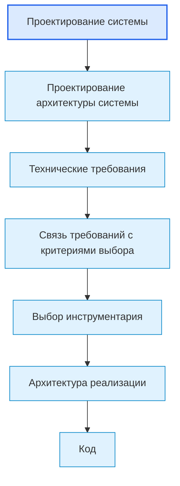
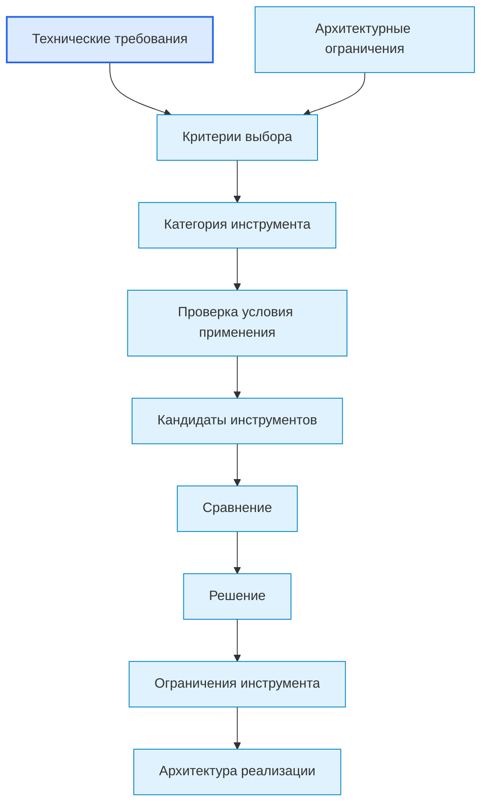

# 4.Roadmap: Toolchain Selection / Выбор инструментария

## 1. Назначение документа

`05_Roadmap_Toolchain_Selection.md` определяет порядок выбора инструментария для реализации цифровой системы.

Документ используется после [[docs/03_roadmaps/03_Roadmap_Technical_Requirements|Roadmap: Technical Requirements]] и до [[docs/03_roadmaps/06_Roadmap_Implementation_Architecture|Roadmap: Implementation Architecture]].

Документ должен помочь выбрать инструменты на основании:

- технических требований;
- архитектуры системы;
- ограничений окружения;
- требований к эксплуатации;
- требований к сопровождению;
- требований к тестируемости;
- требований к развитию системы.

Документ не должен формировать технические требования заново.

> [!info] Главное
> Roadmap ведёт пользователя по проектному этапу от входных условий к проверяемому результату.

## 2. Место документа в маршруте разработки



Выбор инструментария отвечает на вопрос:

> Какими инструментами можно реализовать систему так, чтобы выполнить утверждённые требования и сохранить архитектурные ограничения?

Выбор инструментария не отвечает на вопрос:

> Каким требованиям система должна соответствовать?

## 3. Граница ответственности

### 3.1. Что входит в выбор инструментария

Выбор инструментария не является одинаковым для всех проектов.

Инструментарий должен выбираться только в тех категориях, которые требуются конкретной системе.

#### 3.1.1. Базовый инструментарий

Базовый инструментарий рассматривается почти для любого программного проекта.

В эту группу входят:

- язык программирования;
- среда выполнения;
- редактор или IDE;
- система контроля версий;
- инструменты тестирования;
- инструменты логирования;
- инструменты документации;
- инструменты сборки или запуска;
- базовые средства отладки.

Применяется почти всегда, если создаётся программная система, скрипт, утилита, GUI-приложение, web-сервис, embedded-прошивка, PLC-программа или интеграционная система.

#### 3.1.2. Прикладной инструментарий

Прикладной инструментарий выбирается только если система требует соответствующий тип реализации.

В эту группу входят:

- GUI-инструменты — если нужен графический пользовательский интерфейс;
- web-инструменты — если нужен web-интерфейс, API или серверная часть;
- инструменты хранения — если данные должны сохраняться, искаться, обновляться или иметь историю;
- форматы файлов — если система читает, записывает, импортирует, экспортирует или обменивается файлами;
- библиотеки и фреймворки — если они закрывают конкретные требования;
- протоколы обмена — если система взаимодействует с другими системами, устройствами или сервисами;
- инструменты сборки, поставки и развёртывания — если систему нужно устанавливать, обновлять или поставлять пользователю.

#### 3.1.3. Специализированный инструментарий

Специализированный инструментарий выбирается только для проектов соответствующей области.

В эту группу входят:

- embedded-инструменты — если система разрабатывается для микроконтроллера, устройства, датчиков или исполнительных механизмов;
- PLC-инструменты — если система относится к промышленной автоматизации, PLC, HMI, safety или управлению оборудованием;
- CNC/CAM-инструменты — если система работает с NC-программами, CAM-данными, постпроцессорами, инструментом или станками;
- промышленные протоколы — если требуется обмен с промышленным оборудованием или промышленными системами;
- средства симуляции оборудования — если нужно проверять поведение без реального оборудования.

Специализированные категории не должны восприниматься как обязательные для обычного обучения программированию или создания Python-утилит.

### 3.2. Что не входит в выбор инструментария

В выбор инструментария не входят:

- изменение цели системы;
- изменение сущностей системы;
- изменение данных без пересмотра проектирования системы;
- изменение архитектуры системы без фиксации архитектурного решения;
- добавление новых технических требований без возврата к требованиям;
- проектирование конкретной структуры кода;
- написание кода;
- реализация классов, функций и модулей.

## 4. Входные условия

Перед выбором инструментария должны быть определены:

- утверждённые технические требования;
- архитектура системы;
- требования к данным;
- требования к обработке;
- требования к хранению;
- требования к интерфейсам;
- требования к производительности;
- требования к надёжности;
- требования к ошибкам и диагностике;
- требования к конфигурации;
- требования к расширяемости;
- требования к тестируемости;
- требования к безопасности;
- требования к окружению;
- требования к эксплуатации;
- требования к сопровождению;
- внешние обязательные ограничения.

Если технические требования не сформированы, выбор инструментария считается преждевременным.

## Диаграммы этапа

Основные диаграммы этого этапа вынесены в отдельный документ:

- [[docs/07_diagrams/05_Roadmap_Toolchain_Selection_Diagrams|Roadmap Toolchain Selection Diagrams]]
  - Передаёт: полный визуальный набор диаграмм выбора инструментария.
  - Используется для: визуального понимания этапа и его связей с другими документами.
  - Ограничение: не заменяет этот roadmap-документ.


## 5. Связанные документы

### 5.1. Входные документы

- [[docs/03_roadmaps/03_Roadmap_Technical_Requirements|Roadmap: Technical Requirements]]
  - Передаёт: виды требований, правила формулировки требований и критерии проверки.
  - Используется для: построения критериев выбора инструментов.
  - Ограничение: не должен выбирать инструменты.

- [[docs/04_questionnaires/03_Questionnaire_Technical_Requirements|Questionnaire: Technical Requirements]]
  - Передаёт: заполненные технические требования.
  - Используется для: практического выбора инструментов.
  - Ограничение: не должен подменять выбор инструментария.

- [[docs/00_maps/04_Requirements_To_Toolchain_Map|Requirements To Toolchain Map]]
  - Передаёт: связь между требованиями и критериями выбора.
  - Используется для: трассировки требования к инструменту.
  - Ограничение: не должен выбирать инструменты вместо этого roadmap.

- [[docs/03_roadmaps/05_Toolchain_Selection_Category_Rules|Toolchain Selection Category Rules]]
  - Передаёт: правила категоризации инструментария и условия применения специализированных категорий.
  - Используется для: предотвращения ощущения, что все категории инструментов обязательны для любого проекта.
  - Ограничение: не должен заменять выбор конкретных инструментов.

- [[docs/03_roadmaps/02_Roadmap_System_Architecture_Design|Roadmap: System Architecture Design]]
  - Передаёт: слои, модули, модели, интерфейсы, зависимости, конфигурации и точки расширения.
  - Используется для: проверки совместимости инструментов с архитектурой системы.
  - Ограничение: не должен выбирать конкретные библиотеки.

### 5.2. Выходные документы

- [[docs/04_questionnaires/05_Questionnaire_Toolchain_Selection|Questionnaire: Toolchain Selection]]
  - Получает: структуру вопросов для выбора инструментария.
  - Используется для: практического выбора инструментов.
  - Ограничение: не должен формировать требования заново.

- [[docs/03_roadmaps/06_Roadmap_Implementation_Architecture|Roadmap: Implementation Architecture]]
  - Получает: выбранные инструменты и ограничения инструментов.
  - Используется для: проектирования конкретной структуры реализации.
  - Ограничение: не должен менять выбор инструментов без фиксации причины.

## 6. Основные понятия этапа

### 6.1. Инструментарий

Инструментарий — это совокупность языков, платформ, библиотек, фреймворков, сред, форматов, протоколов, сервисов и вспомогательных средств, используемых для реализации, проверки, сопровождения и развития системы.

### 6.2. Критерий выбора

Критерий выбора — это проверяемое основание, по которому инструмент считается подходящим или неподходящим.

Критерий должен вытекать из технического требования, архитектурного ограничения или внешнего ограничения.

### 6.3. Кандидат инструмента

Кандидат инструмента — это инструмент, который может быть выбран после проверки по критериям.

### 6.4. Решение выбора

Решение выбора — это зафиксированное обоснование, почему выбран конкретный инструмент и почему отклонены альтернативы.

## 7. Виды инструментария

### 7.1. Базовый инструментарий

Базовый инструментарий рассматривается почти для любого программного проекта.

#### 7.1.1. Язык программирования

Определяет основной язык реализации системы или её части.

#### 7.1.2. Среда выполнения

Определяет, где и как будет выполняться система.

#### 7.1.3. Редактор или IDE

Определяет среду, в которой разработчик пишет, проверяет и сопровождает проект.

#### 7.1.4. Контроль версий

Определяет способ хранения истории изменений и совместной работы.

#### 7.1.5. Тестирование

Определяет средства проверки требований, модулей, интерфейсов и ошибок.

Связанный документ: [[docs/03_roadmaps/07_Roadmap_Testing|Roadmap: Testing]].

#### 7.1.6. Логирование и диагностика

Определяет средства фиксации событий, ошибок и диагностических данных.

#### 7.1.7. Документация

Определяет средства ведения технической, пользовательской и проектной документации.

Связанные документы:

- [[docs/01_regulations/Documentation_System_Regulation|Documentation System Regulation]];
- [[docs/01_regulations/Document_Writing_Rules|Document Writing Rules]];
- [[docs/01_regulations/Link_Rules|Link Rules]];
- [[docs/01_regulations/Diagram_Rules|Diagram Rules]].

### 7.2. Прикладной инструментарий

Прикладной инструментарий выбирается только при наличии соответствующей потребности системы.

#### 7.2.1. GUI-инструменты

Выбираются только если система должна иметь графический пользовательский интерфейс.

Применяется, если:

- пользователь работает через окна, формы, кнопки, таблицы, панели или визуальный редактор;
- система должна показывать предпросмотр;
- система должна работать как desktop-приложение.

Не применяется, если:

- система является простым CLI-скриптом;
- система работает полностью в фоне;
- пользовательский интерфейс не требуется.

#### 7.2.2. Web-инструменты

Выбираются только если система должна работать через браузер, API или серверную часть.

Применяется, если:

- нужен web-интерфейс;
- нужен REST API;
- система должна обслуживать несколько пользователей через сеть;
- нужна серверная логика.

Не применяется, если:

- система является локальным скриптом;
- система не имеет сетевого взаимодействия;
- desktop-интерфейса достаточно.

#### 7.2.3. Хранение и базы данных

Выбираются только если система должна сохранять данные между запусками, выполнять поиск, поддерживать историю или обеспечивать целостность данных.

Связанный документ: [[docs/05_encyclopedia/Storage|Storage]].

Применяется, если:

- данные должны сохраняться между запусками;
- нужна история изменений;
- нужен поиск по данным;
- нужна связанная структура данных;
- несколько модулей используют общие данные.

Не применяется, если:

- результат одноразовый;
- данные не сохраняются;
- достаточно временной обработки в памяти.

#### 7.2.4. Форматы файлов

Выбираются только если система читает, записывает, импортирует, экспортирует или обменивается файлами.

#### 7.2.5. Библиотеки и фреймворки

Выбираются только если они закрывают конкретные требования и не добавляют неоправданную сложность.

#### 7.2.6. Протоколы обмена

Выбираются только если система взаимодействует с другими системами, сервисами, устройствами или процессами.

#### 7.2.7. Сборка, поставка и развёртывание

Выбираются только если систему нужно устанавливать, обновлять, поставлять пользователю или запускать в повторяемой среде.

### 7.3. Специализированный инструментарий

Специализированный инструментарий выбирается только для проектов соответствующей области.

#### 7.3.1. Embedded-инструменты

Выбираются только если система разрабатывается для микроконтроллера, устройства, датчиков, исполнительных механизмов или среды с ограниченными ресурсами.

Не применяются для обычной Python-утилиты на ПК без работы с устройством.

#### 7.3.2. PLC-инструменты

Выбираются только если система относится к промышленной автоматизации, управлению оборудованием, PLC, HMI, safety, технологическим процессам или промышленным протоколам.

Не применяются, если пользователь изучает обычное программирование на Python, создаёт файловую утилиту или систему без PLC/HMI/промышленного оборудования.

#### 7.3.3. CNC/CAM-инструменты

Выбираются только если система работает с NC-программами, CAM-данными, постпроцессорами, инструментом, станками или производственными файлами.

#### 7.3.4. Промышленные протоколы

Выбираются только если система должна обмениваться данными с промышленным оборудованием или промышленными системами.

#### 7.3.5. Средства симуляции оборудования

Выбираются только если нужно проверять поведение системы без реального оборудования.

## 8. DG-TOOLS-001. Классификация инструментария

```mermaid
flowchart TD
    A[Инструментарий] --> B[Базовый инструментарий]
    A --> C[Прикладной инструментарий]
    A --> D[Специализированный инструментарий]

    B --> B1[Язык программирования]
    B --> B2[Среда выполнения]
    B --> B3[Редактор или IDE]
    B --> B4[Контроль версий]
    B --> B5[Тестирование]
    B --> B6[Логирование]
    B --> B7[Документация]

    C --> C1[GUI если нужен интерфейс]
    C --> C2[Web если нужен браузер или API]
    C --> C3[Хранение если нужны постоянные данные]
    C --> C4[Форматы файлов если есть импорт или экспорт]
    C --> C5[Библиотеки если закрывают требования]
    C --> C6[Протоколы если есть обмен]
    C --> C7[Сборка если нужна поставка]

    D --> D1[Embedded если есть микроконтроллер или устройство]
    D --> D2[PLC если есть промышленная автоматизация]
    D --> D3[CNC/CAM если есть станки или NC-программы]
    D --> D4[Промышленные протоколы если есть оборудование]
    D --> D5[Симуляция если нужно проверять без оборудования]

    classDef root fill:#dbeafe,stroke:#2563eb,stroke-width:2px
    classDef type fill:#e0f2fe,stroke:#0284c7,stroke-width:1px
    classDef step fill:#f8fafc,stroke:#64748b,stroke-width:1px
    classDef success fill:#dcfce7,stroke:#16a34a,stroke-width:2px
    classDef warning fill:#fee2e2,stroke:#dc2626,stroke-width:1px

    class A root
    class B,C,D,B1,B2,B3,B4,B5,B6,B7,C1,C2,C3,C4,C5,C6,C7,D1,D2,D3,D4,D5 type
```



## 9. Правила выбора инструментария

### RULE-TOOLS-001. Инструмент должен выбираться под требование

Нельзя выбирать инструмент только потому, что он знаком, популярен или удобен.

### RULE-TOOLS-002. Инструмент должен быть проверен по критериям

Для каждого важного инструмента необходимо указать критерии выбора и результаты проверки.

### RULE-TOOLS-003. Инструмент не должен разрушать архитектуру системы

Если инструмент требует нарушить архитектурные границы, необходимо выбрать другой инструмент или пересмотреть архитектуру с фиксацией причины.

### RULE-TOOLS-004. Альтернативы должны быть рассмотрены явно

Для важных решений необходимо указать хотя бы одну альтернативу или причину, почему альтернативы не рассматриваются.

### RULE-TOOLS-005. Ограничения инструмента должны быть зафиксированы

Выбор инструмента считается неполным, если не указаны его ограничения и риски.

### RULE-TOOLS-006. Внешний обязательный инструмент должен быть отмечен как constraint

Если инструмент задан внешней средой, заказчиком, оборудованием или платформой, он фиксируется как обязательное ограничение, а не как свободный выбор.

### RULE-TOOLS-007. Инструмент не должен добавлять неоправданную сложность

Инструмент должен соответствовать масштабу системы.

### RULE-TOOLS-008. Категория инструментария должна иметь условие применения

Категория инструментария не должна выглядеть обязательной для всех проектов.

Для каждой прикладной или специализированной категории необходимо указать, когда она применяется и когда она не применяется.

Пример: PLC-инструменты выбираются только если система относится к промышленной автоматизации, управлению оборудованием, PLC, HMI, safety или промышленным протоколам.

Если проект является обычной Python-утилитой, PLC-инструменты не рассматриваются.

Связанный документ: [[docs/03_roadmaps/05_Toolchain_Selection_Category_Rules|Toolchain Selection Category Rules]].

## 10. Порядок работы

### 10.1. Шаг 1. Собрать требования, влияющие на инструментарий

Необходимо взять требования из [[docs/04_questionnaires/03_Questionnaire_Technical_Requirements|Questionnaire: Technical Requirements]].

### 10.2. Шаг 2. Собрать архитектурные ограничения

Необходимо взять ограничения из [[docs/04_questionnaires/02_Questionnaire_System_Architecture_Design|Questionnaire: System Architecture Design]].

### 10.3. Шаг 3. Определить нужные категории инструментов

Необходимо определить, какие категории относятся к проекту:

- базовые;
- прикладные;
- специализированные.

Для прикладных и специализированных категорий нужно указать условие применения.

### 10.4. Шаг 4. Сформировать критерии выбора

Для каждой выбранной категории инструмента необходимо сформировать критерии выбора.

### 10.5. Шаг 5. Определить кандидатов

Необходимо определить возможные инструменты-кандидаты.

### 10.6. Шаг 6. Сравнить кандидатов

Необходимо сравнить кандидатов по критериям.

### 10.7. Шаг 7. Зафиксировать решение

Необходимо выбрать инструмент и указать причину выбора.

### 10.8. Шаг 8. Зафиксировать ограничения выбранного инструмента

Необходимо указать риски и ограничения выбранного инструмента.

## 11. DG-TOOLS-002. Процесс выбора инструмента



## 12. Шаблон решения по инструменту

```md
## TOOL-000. Название решения

### Категория инструмента

- Базовая / Прикладная / Специализированная.

### Условие применения категории

- 

### Требования-источники

- 

### Архитектурные ограничения

- 

### Критерии выбора

- 

### Кандидаты

- Кандидат 1:
- Кандидат 2:
- Кандидат 3:

### Выбранный инструмент

- 

### Причина выбора

- 

### Отклонённые альтернативы

- 

### Ограничения выбранного инструмента

- 

### Влияние на архитектуру реализации

- 

### Статус

- Draft / Approved / Changed / Deprecated.
```

## 13. Примеры из разных областей цифровых систем

### 13.1. Скрипт автоматизации

Категории инструментов:

- базовые:
  - язык программирования;
  - среда выполнения;
  - контроль версий;
  - тестирование;
  - логирование;
- прикладные:
  - библиотеки чтения файлов — если есть входные файлы;
  - формат результата — если система формирует отчёт;
- специализированные:
  - не применяются, если скрипт не работает с оборудованием, PLC, embedded или CNC/CAM.

Связанный пример: [[docs/06_examples/Scripts/Python_File_Processing_Utility|Python File Processing Utility]].

### 13.2. GUI-приложение

Категории инструментов:

- базовые:
  - язык программирования;
  - среда выполнения;
  - тестирование;
  - документация;
- прикладные:
  - GUI-фреймворк — если нужен графический интерфейс;
  - формат хранения шаблонов — если шаблоны должны сохраняться;
  - инструмент упаковки — если приложение нужно поставлять пользователю;
- специализированные:
  - не применяются, если приложение не управляет оборудованием и не связано с промышленной средой.

### 13.3. Embedded-система

Категории инструментов:

- базовые:
  - язык программирования;
  - контроль версий;
  - тестирование;
  - документация;
- прикладные:
  - протокол связи — если есть обмен с другими устройствами;
- специализированные:
  - микроконтроллер;
  - SDK;
  - среда сборки;
  - инструмент симуляции;
  - инструмент отладки.

### 13.4. PLC-система

Категории инструментов:

- базовые:
  - контроль версий;
  - документация;
  - тестирование или проверочные сценарии;
- прикладные:
  - протокол обмена — если есть связь с HMI, SCADA или внешней системой;
- специализированные:
  - PLC-платформа;
  - среда разработки PLC;
  - HMI-инструмент;
  - инструмент диагностики;
  - симулятор.

### 13.5. CNC/CAM-система

Категории инструментов:

- базовые:
  - язык программирования;
  - тестирование;
  - логирование;
  - документация;
- прикладные:
  - формат отчёта;
  - интеграция с таблицами;
  - способ хранения;
- специализированные:
  - инструменты работы с NC-программами — если система анализирует NC-код;
  - CAM/CNC-инструменты — если система интегрируется с CAM/CNC-процессом.

## 14. Контрольные вопросы

Перед переходом к архитектуре реализации необходимо ответить:

1. Все ли выбранные инструменты связаны с требованиями?
2. Все ли выбранные инструменты проверены по критериям?
3. Все ли архитектурные ограничения учтены?
4. Есть ли внешние обязательные ограничения?
5. Рассмотрены ли альтернативы для важных решений?
6. Зафиксированы ли ограничения выбранных инструментов?
7. Не нарушает ли инструмент архитектуру системы?
8. Не добавляет ли инструмент избыточную сложность?
9. Известно ли влияние инструмента на архитектуру реализации?
10. Для каждой прикладной и специализированной категории указано условие применения?
11. Не выглядит ли специализированная категория обязательной для всех проектов?
12. Открытые вопросы вынесены отдельно?

## 15. Критерии завершения

Roadmap выбора инструментария считается завершённым, если:

- определены категории инструментов;
- категории разделены на базовые, прикладные и специализированные;
- для прикладных и специализированных категорий указаны условия применения;
- требования преобразованы в критерии выбора;
- архитектурные ограничения учтены;
- кандидаты рассмотрены;
- решения выбора зафиксированы;
- альтернативы отклонены с причиной;
- ограничения выбранных инструментов зафиксированы;
- влияние на архитектуру реализации определено;
- открытые вопросы вынесены отдельно.

## 16. Выходные данные для следующего этапа

После завершения выбора инструментария должны быть получены:

- выбранный язык или языки реализации;
- выбранная среда выполнения;
- выбранные базовые инструменты;
- выбранные прикладные инструменты;
- выбранные специализированные инструменты, если они нужны;
- выбранные инструменты интерфейса;
- выбранные инструменты хранения;
- выбранные форматы файлов;
- выбранные библиотеки и фреймворки;
- выбранные протоколы обмена;
- выбранные инструменты тестирования;
- выбранные инструменты логирования и диагностики;
- выбранные инструменты документации;
- выбранные инструменты сборки и развёртывания;
- ограничения выбранных инструментов;
- входные данные для [[docs/03_roadmaps/06_Roadmap_Implementation_Architecture|Roadmap: Implementation Architecture]].

## 17. Открытые вопросы

Открытые вопросы должны быть вынесены отдельно.

Примеры открытых вопросов:

- Неизвестно, какая целевая операционная система обязательна.
- Неизвестно, нужен ли offline-режим.
- Неизвестно, какой объём данных будет обрабатываться.
- Неизвестно, требуется ли промышленный протокол обмена.
- Неизвестно, относятся ли требования к embedded, PLC или обычной desktop/web-разработке.
- Неизвестно, какие лицензии допустимы.

## 18. Следующий шаг

После работы с roadmap необходимо заполнить связанную анкету и проверить результат по чек-листу готовности.

## 19. История изменений

- Initial version: создан roadmap выбора инструментария как самостоятельная тема, отделённая от технических требований.
- Updated: инструментарий разделён на базовый, прикладной и специализированный; добавлены условия применения для PLC, embedded, CNC/CAM и других специальных категорий.
- Updated: документ приведён к Obsidian wikilinks.
- Updated: документ приведён к единому визуальному формату проекта.
