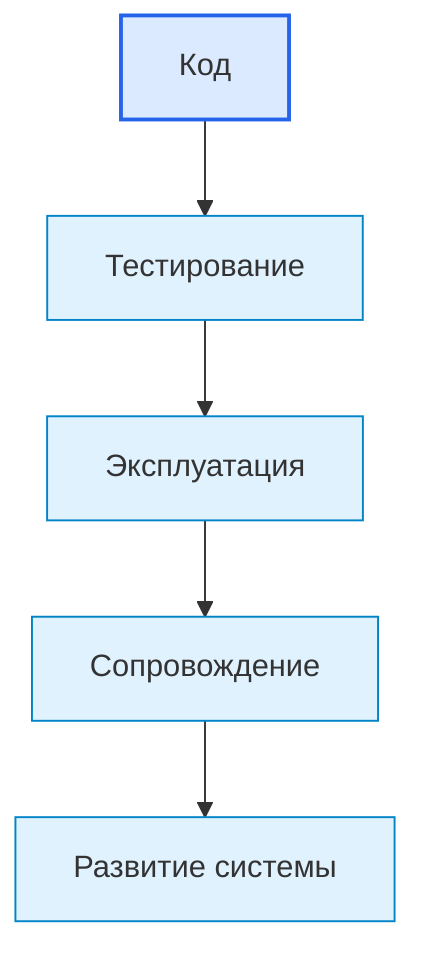
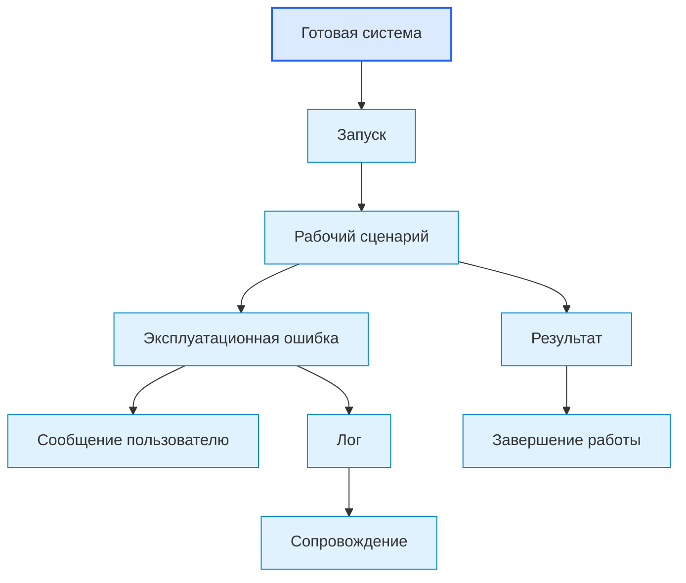

# Roadmap: Operation / Эксплуатация

## 1. Назначение документа

`08_Roadmap_Operation.md` определяет порядок подготовки цифровой системы к реальному использованию в рабочей среде.

Документ используется после [[docs/03_roadmaps/07_Roadmap_Testing|Roadmap: Testing]] и до [[docs/03_roadmaps/09_Roadmap_Maintenance|Roadmap: Maintenance]].

Документ должен помочь определить:

- как система запускается;
- кто использует систему;
- какие рабочие сценарии выполняются;
- какие входные данные используются в эксплуатации;
- какие результаты ожидаются;
- какие ошибки может увидеть пользователь или оператор;
- какие действия выполняются при сбоях;
- какие логи и отчёты нужны в рабочей среде;
- какие ограничения эксплуатации должны быть известны заранее.

Документ не должен подменять:

- проектирование системы;
- технические требования;
- тестирование;
- сопровождение;
- развитие системы.

> [!info] Главное
> Roadmap ведёт пользователя по проектному этапу от входных условий к проверяемому результату.

## 2. Место документа в маршруте разработки



Эксплуатация отвечает на вопрос:

> Как системой пользоваться в реальной рабочей среде безопасно, понятно и воспроизводимо?

## 3. Граница ответственности

### 3.1. Что входит в эксплуатацию

В эксплуатацию входят:

- запуск системы;
- остановка системы;
- рабочие сценарии пользователя или оператора;
- использование входных данных;
- получение результата;
- обработка эксплуатационных ошибок;
- эксплуатационные ограничения;
- действия при сбоях;
- рабочие логи;
- резервное копирование, если оно требуется;
- восстановление после ошибки, если оно требуется;
- инструкции для пользователя или оператора.

### 3.2. Что не входит в эксплуатацию

В эксплуатацию не входят:

- изменение требований;
- изменение архитектуры;
- исправление кода без процесса сопровождения;
- добавление новых функций без процесса развития;
- изменение выбранного инструментария;
- неформальное использование без инструкции.

## 4. Входные условия

Перед эксплуатацией должны быть определены:

- система прошла необходимые проверки;
- известны команды запуска и остановки;
- известны рабочие сценарии;
- известны ограничения окружения;
- известны действия пользователя при ошибке;
- известны места хранения логов и результатов;
- подготовлена минимальная инструкция пользователя или оператора.

## Диаграммы этапа

Основные диаграммы этого этапа вынесены в отдельный документ:

- [[docs/07_diagrams/07_Roadmap_Testing_Operation_Maintenance_Evolution_Diagrams|Roadmap Testing Operation Maintenance Evolution Diagrams]]
  - Передаёт: диаграммы эксплуатации как части жизненного цикла системы.
  - Используется для: визуального понимания этапа и его связей с другими документами.
  - Ограничение: не заменяет этот roadmap-документ.


## 5. Связанные документы

### 5.1. Входные документы

- [[docs/03_roadmaps/07_Roadmap_Testing|Roadmap: Testing]]
  - Передаёт: критерии готовности системы к использованию.
  - Используется для: подтверждения, что система может перейти в эксплуатацию.
  - Ограничение: не описывает рабочее использование системы.

- [[docs/04_questionnaires/07_Questionnaire_Testing|Questionnaire: Testing]]
  - Передаёт: результаты проверки и открытые вопросы.
  - Используется для: определения ограничений эксплуатации.
  - Ограничение: не заменяет эксплуатационную инструкцию.

- [[docs/03_roadmaps/06_Roadmap_Implementation_Architecture|Roadmap: Implementation Architecture]]
  - Передаёт: команды запуска, структуру реализации, логирование и конфигурацию.
  - Используется для: подготовки эксплуатационных процедур.
  - Ограничение: не описывает поведение пользователя в рабочей среде.

### 5.2. Выходные документы

- [[docs/04_questionnaires/08_Questionnaire_Operation|Questionnaire: Operation]]
  - Получает: структуру вопросов для подготовки эксплуатации.
  - Используется для: практической фиксации эксплуатационных правил.
  - Ограничение: не должен исправлять систему.

- [[docs/03_roadmaps/09_Roadmap_Maintenance|Roadmap: Maintenance]]
  - Получает: эксплуатационные ошибки, ограничения, логи и обратную связь.
  - Используется для: сопровождения системы после начала использования.
  - Ограничение: не должен подменять эксплуатацию.

## 6. Основные понятия этапа

### 6.1. Эксплуатационный сценарий

Эксплуатационный сценарий — это реальный порядок действий пользователя, оператора или внешней системы при использовании системы.

### 6.2. Эксплуатационная ошибка

Эксплуатационная ошибка — это ошибка, возникающая в рабочей среде при реальном использовании системы.

Связанный документ: [[docs/05_encyclopedia/Errors|Errors]].

### 6.3. Эксплуатационное ограничение

Эксплуатационное ограничение — это условие, которое пользователь должен соблюдать при работе с системой.

### 6.4. Рабочий результат

Рабочий результат — это файл, отчёт, действие, состояние, запись, команда или другой результат, ради которого система используется.

## 7. Основные области эксплуатации

### 7.1. Запуск и остановка

Необходимо определить:

- кто запускает систему;
- как система запускается;
- какие параметры нужны для запуска;
- как система останавливается;
- что считается корректным запуском;
- что считается корректной остановкой.

### 7.2. Рабочие сценарии

Необходимо определить:

- основной сценарий работы;
- дополнительные сценарии;
- сценарии с ошибками;
- повторный запуск;
- действия после завершения работы.

### 7.3. Входные данные эксплуатации

Необходимо определить:

- какие данные пользователь передаёт системе;
- где они находятся;
- как проверяется их готовность;
- что делать при некорректных данных.

Связанный документ: [[docs/05_encyclopedia/Data|Data]].

### 7.4. Результаты эксплуатации

Необходимо определить:

- что система должна выдать;
- где сохраняется результат;
- как пользователь понимает, что результат корректен;
- что делать, если результат отсутствует или неполный.

### 7.5. Ошибки в эксплуатации

Необходимо определить:

- какие ошибки может увидеть пользователь;
- какие ошибки блокируют работу;
- какие ошибки допускают повтор;
- какие ошибки требуют сопровождения;
- какие сообщения должны быть понятны пользователю.

### 7.6. Логи и диагностика в эксплуатации

Необходимо определить:

- какие логи создаются;
- где они хранятся;
- кто их читает;
- какие данные нужны для диагностики;
- какие логи пользователь должен отправить при обращении за поддержкой.

### 7.7. Резервное копирование и восстановление

Применяется, если система создаёт или хранит важные данные.

Связанный документ: [[docs/05_encyclopedia/Storage|Storage]].

### 7.8. Инструкция пользователя или оператора

Необходимо определить:

- какие действия должен знать пользователь;
- какие ошибки он может исправить сам;
- когда нужно обращаться к сопровождающему;
- какие ограничения нельзя нарушать.

## 8. DG-OP-001. Карта эксплуатации



## 9. Правила эксплуатации

### RULE-OP-001. Эксплуатация должна иметь инструкцию

Нельзя передавать систему в использование без минимального описания запуска, работы, результата и ошибок.

### RULE-OP-002. Пользователь должен понимать результат

Система должна давать пользователю понятный признак успешного выполнения.

### RULE-OP-003. Ошибки должны быть понятны на уровне пользователя

Сообщение об ошибке должно помогать пользователю выполнить действие или передать информацию сопровождению.

### RULE-OP-004. Рабочие данные не должны теряться без предупреждения

Если система изменяет, перезаписывает или удаляет данные, это должно быть явно описано.

### RULE-OP-005. Эксплуатационные ограничения должны быть известны заранее

Нельзя скрывать ограничения окружения, форматов, прав доступа, объёма данных или оборудования.

## 10. Порядок работы

### 10.1. Шаг 1. Подтвердить готовность после тестирования

Необходимо проверить, что критичные тесты пройдены или ограничения зафиксированы.

### 10.2. Шаг 2. Описать запуск и остановку

Необходимо зафиксировать команды, параметры, условия и признаки успешного запуска.

### 10.3. Шаг 3. Описать рабочие сценарии

Необходимо описать действия пользователя или оператора.

### 10.4. Шаг 4. Описать входные данные и результаты

Необходимо определить рабочие входы и выходы системы.

### 10.5. Шаг 5. Описать ошибки и действия пользователя

Необходимо определить, что делает пользователь при ошибке.

### 10.6. Шаг 6. Описать логи и диагностику

Необходимо определить, какие данные нужны для сопровождения.

### 10.7. Шаг 7. Описать ограничения эксплуатации

Необходимо зафиксировать условия, при которых система работает корректно.

## 11. Шаблон эксплуатационного сценария

```md
## OP-SCENARIO-000. Название сценария

### Назначение

- 

### Кто выполняет

- 

### Предусловия

- 

### Входные данные

- 

### Шаги

1. 
2. 
3. 

### Ожидаемый результат

- 

### Возможные ошибки

- 

### Действия при ошибке

- 
```

## 12. Примеры из разных областей цифровых систем

### 12.1. Скрипт автоматизации

Эксплуатация включает:

- запуск скрипта;
- выбор входной папки;
- проверку лога;
- получение отчёта;
- повторный запуск при исправлении данных.

Связанный пример: [[docs/06_examples/Scripts/Python_File_Processing_Utility|Python File Processing Utility]].

### 12.2. GUI-приложение

Эксплуатация включает:

- открытие приложения;
- выбор проекта;
- выполнение действия через интерфейс;
- сохранение результата;
- обработку сообщений об ошибках.

### 12.3. Embedded-система

Эксплуатация включает:

- подачу питания;
- проверку состояния устройства;
- работу с датчиками;
- реакцию на ошибки;
- безопасную остановку.

### 12.4. PLC-система

Эксплуатация включает:

- запуск режима manual или auto;
- работу оператора через HMI;
- подтверждение аварий;
- соблюдение safety-ограничений;
- передачу аварий в сопровождение.

### 12.5. CNC/CAM-система

Эксплуатация включает:

- выбор NC-файлов;
- запуск анализа;
- проверку отчёта;
- обработку неизвестных форматов;
- сохранение исходных программ без изменений.

## 13. Контрольные вопросы

Перед переходом к сопровождению необходимо ответить:

1. Описан ли запуск системы?
2. Описана ли остановка системы?
3. Описаны ли рабочие сценарии?
4. Известны ли входные данные эксплуатации?
5. Известны ли ожидаемые результаты?
6. Описаны ли ошибки пользователя или оператора?
7. Описаны ли действия при ошибке?
8. Известно ли место хранения логов?
9. Известны ли эксплуатационные ограничения?
10. Есть ли инструкция пользователя или оператора?

## 14. Критерии завершения

Roadmap эксплуатации считается завершённым, если:

- определены рабочие сценарии;
- определён запуск;
- определена остановка;
- определены входные данные;
- определены результаты;
- определены ошибки;
- определены действия при ошибках;
- определены логи и диагностика;
- определены ограничения;
- подготовлены входные данные для сопровождения.

## 15. Выходные данные для следующего этапа

После подготовки эксплуатации должны быть получены:

- эксплуатационные сценарии;
- инструкция запуска и остановки;
- список рабочих входных данных;
- список рабочих результатов;
- список эксплуатационных ошибок;
- список действий пользователя при ошибках;
- список логов и диагностических данных;
- список ограничений эксплуатации;
- входные данные для [[docs/03_roadmaps/09_Roadmap_Maintenance|Roadmap: Maintenance]].

## 16. Следующий шаг

После работы с roadmap необходимо заполнить связанную анкету и проверить результат по чек-листу готовности.

## 17. История изменений

- Initial version: создан roadmap эксплуатации.
- Updated: документ приведён к Obsidian wikilinks.
- Updated: документ приведён к единому визуальному формату проекта.
