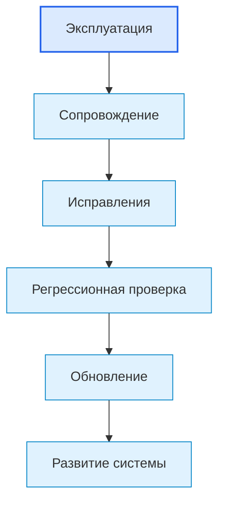
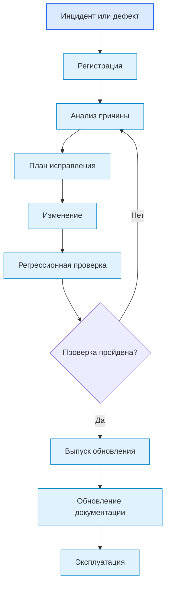

# Roadmap: Maintenance / Сопровождение

## 1. Назначение документа

`09_Roadmap_Maintenance.md` определяет порядок сопровождения цифровой системы после начала эксплуатации.

Документ используется после [[docs/03_roadmaps/08_Roadmap_Operation|Roadmap: Operation]] и до [[docs/03_roadmaps/10_Roadmap_System_Evolution|Roadmap: System Evolution]].

Документ должен помочь определить:

- как фиксируются ошибки эксплуатации;
- как анализируются дефекты;
- как выполняются исправления;
- как контролируются изменения;
- как проверяется регрессия;
- как обновляется документация;
- как поддерживается совместимость;
- как принимается решение о выпуске обновления.

Документ не должен подменять:

- эксплуатацию;
- развитие системы;
- технические требования;
- архитектуру реализации;
- тестирование.

> [!info] Главное
> Roadmap ведёт пользователя по проектному этапу от входных условий к проверяемому результату.

## 2. Место документа в маршруте разработки



Сопровождение отвечает на вопрос:

> Как исправлять, обновлять и контролировать систему после начала реального использования?

## 3. Граница ответственности

### 3.1. Что входит в сопровождение

В сопровождение входят:

- регистрация дефектов;
- анализ эксплуатационных ошибок;
- исправление ошибок;
- обновление конфигурации;
- обновление документации;
- контроль изменений;
- проверка совместимости;
- регрессионное тестирование;
- выпуск обновлений;
- откат изменений;
- диагностика после выпуска;
- ведение журнала изменений.

### 3.2. Что не входит в сопровождение

В сопровождение не входят:

- добавление крупных новых функций без процесса развития;
- изменение архитектуры без архитектурного решения;
- изменение требований без возврата к требованиям;
- хаотичное исправление без фиксации причины;
- выпуск обновления без проверки;
- скрытое изменение поведения системы без документации.

## 4. Входные условия

Перед сопровождением должны быть доступны:

- эксплуатационные сценарии;
- эксплуатационные ошибки;
- логи;
- результаты тестирования;
- структура реализации;
- правила сборки и запуска;
- правила регрессионной проверки;
- документация пользователя и разработчика.

## Диаграммы этапа

Основные диаграммы этого этапа вынесены в отдельный документ:

- [[docs/07_diagrams/07_Roadmap_Testing_Operation_Maintenance_Evolution_Diagrams|Roadmap Testing Operation Maintenance Evolution Diagrams]]
  - Передаёт: диаграммы сопровождения как части жизненного цикла системы.
  - Используется для: визуального понимания этапа и его связей с другими документами.
  - Ограничение: не заменяет этот roadmap-документ.


## 5. Связанные документы

### 5.1. Входные документы

- [[docs/03_roadmaps/08_Roadmap_Operation|Roadmap: Operation]]
  - Передаёт: эксплуатационные сценарии, ошибки, логи и ограничения.
  - Используется для: анализа проблем реального использования.
  - Ограничение: не определяет процесс исправления.

- [[docs/04_questionnaires/08_Questionnaire_Operation|Questionnaire: Operation]]
  - Передаёт: конкретные данные эксплуатации.
  - Используется для: определения входных данных сопровождения.
  - Ограничение: не заменяет журнал изменений.

- [[docs/03_roadmaps/07_Roadmap_Testing|Roadmap: Testing]]
  - Передаёт: регрессионные проверки и критерии приёмки.
  - Используется для: проверки исправлений.
  - Ограничение: не определяет процесс выпуска обновлений.

- [[docs/03_roadmaps/06_Roadmap_Implementation_Architecture|Roadmap: Implementation Architecture]]
  - Передаёт: структуру реализации и правила зависимостей.
  - Используется для: безопасного изменения кода.
  - Ограничение: не описывает эксплуатационные дефекты.

### 5.2. Выходные документы

- [[docs/04_questionnaires/09_Questionnaire_Maintenance|Questionnaire: Maintenance]]
  - Получает: структуру вопросов для сопровождения.
  - Используется для: практической фиксации исправлений, обновлений и контроля изменений.
  - Ограничение: не должен добавлять новые функции без процесса развития.

- [[docs/03_roadmaps/10_Roadmap_System_Evolution|Roadmap: System Evolution]]
  - Получает: повторяющиеся проблемы, предложения улучшений и ограничения текущей версии.
  - Используется для: планирования развития системы.
  - Ограничение: не должен подменять исправление дефектов.

## 6. Основные понятия этапа

### 6.1. Дефект

Дефект — это несоответствие системы ожидаемому поведению, требованию, сценарию эксплуатации или критерию проверки.

Связанные документы:

- [[docs/05_encyclopedia/Errors|Errors]];
- [[docs/03_roadmaps/07_Roadmap_Testing|Roadmap: Testing]].

### 6.2. Инцидент

Инцидент — это событие в эксплуатации, которое требует анализа, реакции или сопровождения.

### 6.3. Исправление

Исправление — это изменение, направленное на устранение дефекта без добавления новой функциональности.

### 6.4. Обновление

Обновление — это поставка изменённой версии системы пользователю или рабочей среде.

### 6.5. Откат

Откат — это возврат к предыдущей рабочей версии или конфигурации, если обновление привело к проблеме.

## 7. Основные области сопровождения

### 7.1. Регистрация проблем

Необходимо определить:

- кто сообщает проблему;
- какие данные нужны;
- где фиксируется проблема;
- какой приоритет присваивается;
- как проверяется воспроизводимость.

### 7.2. Анализ причины

Необходимо определить:

- ошибка в коде;
- ошибка в требованиях;
- ошибка в архитектуре;
- ошибка в данных;
- ошибка в эксплуатации;
- ошибка в конфигурации;
- ошибка во внешней системе.

### 7.3. Планирование исправления

Необходимо определить:

- что нужно изменить;
- какие файлы или модули затрагиваются;
- какие риски есть;
- какие тесты нужно выполнить;
- нужна ли документация изменений.

### 7.4. Контроль изменений

Необходимо определить:

- как фиксируется изменение;
- как называется версия;
- кто проверяет изменение;
- какие документы обновляются;
- как предотвращается скрытое изменение поведения.

### 7.5. Регрессионная проверка

Необходимо определить:

- какие старые сценарии нужно проверить;
- какие ошибки могут повториться;
- какие тесты обязательны перед выпуском;
- какие проверки можно выполнить вручную.

### 7.6. Выпуск обновления

Необходимо определить:

- что входит в обновление;
- как обновление устанавливается;
- как пользователь узнаёт об изменениях;
- как проверить успешность обновления;
- как откатиться при проблеме.

### 7.7. Обновление документации

Необходимо определить:

- какие документы изменяются;
- какие инструкции обновляются;
- какие ограничения добавляются;
- какие ошибки описываются;
- какие изменения фиксируются в журнале.

## 8. DG-MAINT-001. Карта сопровождения



## 9. Правила сопровождения

### RULE-MAINT-001. Проблема должна быть зафиксирована

Нельзя исправлять проблему, не зафиксировав её источник, проявление и условия воспроизведения.

### RULE-MAINT-002. Исправление должно иметь причину

Изменение должно быть связано с дефектом, инцидентом, требованием или техническим долгом.

### RULE-MAINT-003. Исправление должно проверяться

Любое исправление должно иметь проверку, подтверждающую устранение проблемы.

### RULE-MAINT-004. Регрессия должна контролироваться

Исправление не должно ломать ранее работавшие сценарии.

### RULE-MAINT-005. Документация должна обновляться вместе с поведением системы

Если поведение системы изменилось, соответствующие документы должны быть обновлены.

### RULE-MAINT-006. Новая функциональность не должна маскироваться как сопровождение

Если изменение добавляет новые возможности, оно должно идти через процесс развития системы.

## 10. Порядок работы

### 10.1. Шаг 1. Зарегистрировать проблему

Необходимо собрать описание, логи, входные данные, версию и условия воспроизведения.

### 10.2. Шаг 2. Определить причину

Необходимо классифицировать источник проблемы.

### 10.3. Шаг 3. Определить тип изменения

Необходимо определить, это дефект, конфигурационное изменение, документационное изменение, технический долг или запрос развития.

### 10.4. Шаг 4. Спланировать исправление

Необходимо определить затрагиваемые части системы, риски и проверки.

### 10.5. Шаг 5. Выполнить исправление

Исправление выполняется согласно архитектуре реализации и правилам зависимостей.

### 10.6. Шаг 6. Проверить исправление

Необходимо выполнить целевой тест и регрессионные проверки.

### 10.7. Шаг 7. Обновить документацию

Необходимо обновить документы, инструкции, журнал изменений или ограничения.

### 10.8. Шаг 8. Выпустить обновление

Необходимо передать обновление в эксплуатацию с описанием изменений.

## 11. Шаблон записи дефекта

```md
## BUG-000. Название дефекта

### Источник

- 

### Версия системы

- 

### Описание

- 

### Шаги воспроизведения

1. 
2. 
3. 

### Фактический результат

- 

### Ожидаемый результат

- 

### Логи или данные

- 

### Причина

- 

### Исправление

- 

### Проверка

- 

### Статус

- New / Confirmed / Fixed / Verified / Closed.
```

## 12. Примеры из разных областей цифровых систем

### 12.1. Скрипт автоматизации

Сопровождение включает:

- исправление парсинга нового варианта файла;
- обновление логики обработки ошибки;
- добавление регрессионного теста на проблемный файл;
- обновление инструкции запуска.

Связанный пример: [[docs/06_examples/Scripts/Python_File_Processing_Utility|Python File Processing Utility]].

### 12.2. GUI-приложение

Сопровождение включает:

- исправление некорректной блокировки кнопки;
- уточнение сообщения об ошибке;
- проверку старых сценариев интерфейса;
- обновление пользовательской инструкции.

### 12.3. Embedded-система

Сопровождение включает:

- диагностику ошибки датчика;
- корректировку обработки таймаута;
- проверку безопасного состояния;
- обновление прошивки.

### 12.4. PLC-система

Сопровождение включает:

- анализ аварийного журнала;
- исправление межблокировки;
- проверку manual/auto режимов;
- обновление HMI-сообщения.

### 12.5. CNC/CAM-система

Сопровождение включает:

- исправление распознавания нового формата NC-строки;
- добавление тестового NC-файла;
- обновление отчёта;
- проверку сохранности исходных файлов.

## 13. Контрольные вопросы

Перед закрытием сопровождения необходимо ответить:

1. Проблема зафиксирована?
2. Указана версия системы?
3. Есть шаги воспроизведения?
4. Определена причина?
5. Определён тип изменения?
6. Исправление связано с причиной?
7. Выполнена проверка исправления?
8. Выполнена регрессионная проверка?
9. Обновлена документация?
10. Известно, нужно ли передавать проблему в развитие системы?

## 14. Критерии завершения

Roadmap сопровождения считается завершённым, если:

- определён процесс регистрации проблем;
- определён процесс анализа причины;
- определён процесс исправления;
- определён контроль изменений;
- определена регрессионная проверка;
- определён выпуск обновления;
- определено обновление документации;
- определена граница между сопровождением и развитием системы.

## 15. Выходные данные для следующего этапа

После сопровождения должны быть получены:

- список дефектов;
- список исправлений;
- список проверок;
- журнал изменений;
- обновлённая документация;
- список повторяющихся проблем;
- список запросов на [[docs/03_roadmaps/10_Roadmap_System_Evolution|Roadmap: System Evolution]].

## 16. Следующий шаг

После работы с roadmap необходимо заполнить связанную анкету и проверить результат по чек-листу готовности.

## 17. История изменений

- Initial version: создан roadmap сопровождения.
- Updated: документ приведён к Obsidian wikilinks.
- Updated: документ приведён к единому визуальному формату проекта.
