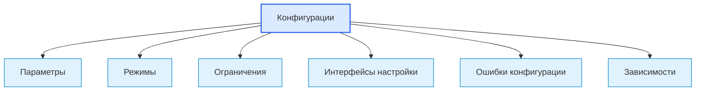

# Configurations / Конфигурации

## 1. Назначение документа

`Configurations.md` раскрывает понятие конфигурации при проектировании цифровых систем.

Документ используется как энциклопедическая статья для описания параметров, режимов, ограничений и настроек, которые управляют поведением системы без изменения кода.

> [!info] Главное
> Конфигурация отделяет изменяемые параметры от логики системы.
> Если конфигурации не определены, настройки становятся скрытыми условиями, разбросанными по коду, файлам, HMI, PLC-тегам или окружению.

## 2. Место документа в системе знаний

Документ относится к энциклопедическому слою проекта Programming Digital Systems.

Конфигурации используются после [[docs/05_encyclopedia/Dependencies|Dependencies]], потому что настройки часто создают скрытые зависимости и изменяемое поведение.



## 3. DEF-CONF-001. Определение конфигурации

Конфигурация — это набор изменяемых параметров, правил режима или внешних настроек, которые влияют на поведение системы без изменения её исходного кода или проектной логики.

Конфигурация считается определённой корректно, если указаны:

- назначение параметра;
- владелец параметра;
- источник значения;
- формат;
- допустимые значения;
- значение по умолчанию;
- правило проверки;
- поведение при ошибке;
- область действия;
- влияние на сценарии и требования.

> [!tip] Простая формула
> Если значение должно меняться без изменения кода, его нужно описать как конфигурацию.

## 4. Основные виды конфигураций

| Вид конфигурации | Что задаёт | Пример |
|---|---|---|
| Параметры запуска | Как система стартует | путь к входной папке |
| Параметры обработки | Как выполняются правила | порог допуска, режим фильтрации |
| Параметры интерфейса | Как пользователь видит или вводит данные | язык, единицы измерения |
| Параметры хранения | Где и как сохраняются данные | путь к базе, срок хранения |
| Параметры интеграции | Как подключаться к внешним системам | endpoint, адрес контроллера |
| Параметры безопасности | Кто имеет доступ и к чему | роль, ключ, разрешение |
| Параметры диагностики | Как фиксируются события и ошибки | уровень логирования |
| Технологические параметры | Условия оборудования или процесса | уставка, рецепт, режим AUTO |

> [!warning] Не путать
> Конфигурация не должна заменять требования. Если поведение обязательно для системы, оно сначала фиксируется как требование или правило, а уже потом получает настраиваемые параметры.

## 5. Правила анализа конфигураций

> [!important] Правило
> Каждая важная конфигурация должна иметь источник, допустимые значения, правило проверки и поведение при ошибке.

### RULE-CONF-001. Конфигурация должна иметь назначение

Нельзя добавлять параметр, если неизвестно, какое проектное решение он изменяет.

### RULE-CONF-002. Значения должны быть проверяемыми

Для параметров нужно определить тип, диапазон, обязательность и действие при недопустимом значении.

### RULE-CONF-003. Значение по умолчанию должно быть осмысленным

Если параметр отсутствует, система должна либо использовать безопасное значение, либо явно сообщить об ошибке.

### RULE-CONF-004. Конфигурация должна иметь владельца

Нужно определить, кто задаёт и изменяет параметр: пользователь, оператор, администратор, система, разработчик или внешний источник.

### RULE-CONF-005. Секреты не должны смешиваться с обычной конфигурацией

Ключи, пароли и токены требуют отдельного правила хранения, доступа и логирования.

## 6. Минимальная карточка конфигурации

```md
### Configuration: <Название параметра>

- Назначение:
- Владелец:
- Источник:
- Формат:
- Обязательность:
- Значение по умолчанию:
- Допустимые значения:
- Правило проверки:
- Действие при ошибке:
- Где используется:
- Связанные требования:
- Открытые вопросы:
```

## 7. Примеры применения

> [!note] Практический приём
> Конфигурации удобно искать через фразу: это значение может отличаться между проектами, стендами, пользователями, устройствами или режимами работы.

### 7.1. Скрипт автоматизации

- путь к входной папке;
- маска файлов;
- путь к отчёту;
- уровень логирования;
- правило пропуска пустых строк.

### 7.2. GUI-приложение

- язык интерфейса;
- тема отображения;
- путь к последнему проекту;
- настройки экспорта;
- параметры автосохранения.

### 7.3. Embedded-система

- частота опроса датчика;
- порог аварии;
- режим энергосбережения;
- адрес устройства;
- параметры связи.

### 7.4. PLC-система

- технологический рецепт;
- уставка давления;
- режим AUTO/MANUAL;
- задержка включения;
- порог аварии.

### 7.5. CNC/CAM-система

- таблица инструмента;
- единицы измерения;
- параметры постпроцессора;
- путь к NC-программам;
- допустимые отклонения.

## 8. Контрольные вопросы

1. Какие параметры должны меняться без изменения кода?
2. Кто владеет каждым параметром?
3. Где хранится значение?
4. Какой формат значения?
5. Какие значения допустимы?
6. Что происходит при отсутствии значения?
7. Что происходит при ошибочном значении?
8. Какие требования зависят от конфигурации?
9. Какие конфигурации являются секретами?
10. Какие конфигурации создают зависимость от окружения?

## 9. Критерии завершения работы с конфигурациями

Работа с конфигурациями считается завершённой, если:

- конфигурации перечислены;
- у каждой конфигурации есть назначение;
- определён владелец;
- определён источник значения;
- определены допустимые значения;
- определено значение по умолчанию или ошибка отсутствия;
- определены ошибки конфигурации;
- конфигурации связаны с требованиями, сценариями и модулями.

## 10. Следующий шаг

После определения конфигураций необходимо перейти к [[docs/05_encyclopedia/Extension_Points|Extension Points]] и определить места, где система должна расширяться без разрушения архитектуры.

## 11. Связанные документы

### Входные документы

- [[docs/05_encyclopedia/Dependencies|Dependencies]]
  - Передаёт: зависимости, которые могут быть связаны с настройками и окружением.
  - Используется для: выявления скрытых конфигурационных зависимостей.
  - Ограничение: не описывает параметры подробно.

- [[docs/05_encyclopedia/Rules|Rules]]
  - Передаёт: правила поведения системы.
  - Используется для: определения того, какие правила могут иметь параметры.
  - Ограничение: не должен превращать обязательное правило в необязательную настройку.

### Выходные документы

- [[docs/05_encyclopedia/Extension_Points|Extension Points]]
  - Получает: параметры, влияющие на расширяемость и варианты поведения.
  - Используется для: определения управляемых точек расширения.
  - Ограничение: не должен заменять конфигурацией архитектурное расширение.

- [[docs/03_roadmaps/02_Roadmap_System_Architecture_Design|Roadmap: System Architecture Design]]
  - Получает: правила анализа конфигураций.
  - Используется для: проектирования архитектуры системы.
  - Ограничение: не должен выбирать конкретный формат конфигурационного файла.

## 12. Интерпретация для Digital System CAD

Этот раздел переводит понятие конфигурации в рабочий элемент будущей метамодели Digital System CAD.

### 12.1. Definition

В метамодели Digital System CAD конфигурация — это типизированный элемент модели, который задаёт изменяемые параметры поведения, окружения, генерации, view, validation или import/export без изменения самой логики модели.

Конфигурацию нужно фиксировать с полями: `id`, `name`, `kind`, `definition`, `scope`, `parameters`, `default_values`, `allowed_values`, `validation_rules`, `owner`, `storage`, `open_questions`.

### 12.2. Context

Конфигурация должна отделяться от правила. Правило определяет, что допустимо, а конфигурация может задавать изменяемое значение внутри допустимых границ.

### 12.3. Not examples

Конфигурацией не следует считать:

- скрытое бизнес-правило;
- произвольный magic value;
- постоянную, которую нельзя менять без изменения модели;
- технологический выбор без описанного назначения;
- пользовательское предпочтение без области действия.

### 12.4. Related relations

Типовые связи:

- `Configuration sets Parameter`;
- `Configuration affects Rule`;
- `Configuration affects Generator`;
- `Configuration stored_in Storage`;
- `Rule validates Configuration`;
- `Interface edits Configuration`;
- `TestCase verifies Configuration`.

### 12.5. Validation questions

Конфигурация достаточно описана, если указаны назначение, область действия, параметры, допустимые значения, значения по умолчанию, владелец, хранение и правила проверки.

### 12.6. Open questions

Нужно уточнить, какие параметры Digital System CAD должны быть конфигурируемыми: правила валидации, генераторы, views, import/export форматы, ID-политика и Codex-контекст.

## 13. История изменений

- Initial version: создана энциклопедическая статья о конфигурациях цифровой системы.
- Updated: добавлена интерпретация для Digital System CAD: конфигурация отделена от правил и описана как параметризуемый элемент поведения, views, генераторов и валидации.
