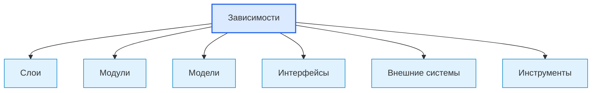

# Dependencies / Зависимости

## 1. Назначение документа

`Dependencies.md` раскрывает понятие зависимости при проектировании цифровых систем.

Документ используется как энциклопедическая статья для анализа связей между слоями, модулями, моделями, интерфейсами, конфигурациями, внешними системами и инструментами.

> [!info] Главное
> Зависимость показывает, что один элемент системы использует другой элемент.
> Если зависимости не определены, система получает скрытые связи, циклы и трудности тестирования.

## 2. Место документа в системе знаний

Документ относится к энциклопедическому слою проекта Programming Digital Systems.

Зависимости используются после [[docs/05_encyclopedia/Layers|Layers]], [[docs/05_encyclopedia/Modules|Modules]], [[docs/05_encyclopedia/Models|Models]] и [[docs/05_encyclopedia/Interfaces|Interfaces]].



## 3. DEF-DEP-001. Определение зависимости

Зависимость — это отношение, при котором один элемент системы использует другой элемент для выполнения своей ответственности.

Зависимость считается определённой корректно, если указаны:

- источник зависимости;
- целевой элемент;
- причина зависимости;
- тип зависимости;
- направление зависимости;
- обязательность;
- способ замены или изоляции;
- влияние на тестирование;
- риск изменения.

> [!tip] Простая формула
> Если изменение одного элемента может потребовать изменения другого, между ними есть зависимость.

## 4. Основные виды зависимостей

| Вид зависимости | Что означает | Пример |
|---|---|---|
| Функциональная | Один модуль вызывает другой | сервис использует валидатор |
| Данные | Один элемент требует структуру данных другого | отчёт использует `ReportData` |
| Интерфейсная | Взаимодействие идёт через контракт | UI вызывает application service |
| Инфраструктурная | Элемент зависит от среды или внешнего ресурса | storage зависит от файловой системы |
| Конфигурационная | Поведение зависит от настройки | parser зависит от режима чтения |
| Временная | Порядок действий важен | сначала загрузка, потом проверка |
| Технологическая | Решение зависит от инструмента | модуль использует библиотеку |
| Организационная | Изменение требует решения команды или заказчика | формат отчёта зависит от регламента |

> [!warning] Не путать
> Зависимость не всегда плохая. Плохой становится скрытая, циклическая, неуправляемая или лишняя зависимость.

## 5. Правила анализа зависимостей

> [!important] Правило
> Зависимости должны быть явными, направленными и проверяемыми.

### RULE-DEP-001. Зависимость должна иметь причину

Если зависимость нельзя объяснить ответственностью элемента, её нужно удалить или пересмотреть.

### RULE-DEP-002. Направление зависимости должно быть допустимым

Архитектура должна определять, какие элементы могут зависеть друг от друга.

### RULE-DEP-003. Циклические зависимости запрещены без обоснования

Если два элемента зависят друг от друга, их границы ответственности нужно пересмотреть.

### RULE-DEP-004. Внешние зависимости должны быть изолированы

Внешние сервисы, файлы, базы данных, оборудование и библиотеки должны быть отделены интерфейсами или адаптерами, если они влияют на тестирование и развитие.

### RULE-DEP-005. Конфигурация не должна становиться скрытой зависимостью

Если поведение зависит от настройки, эта настройка должна быть описана в [[docs/05_encyclopedia/Configurations|Configurations]].

## 6. Минимальная карточка зависимости

```md
### Dependency: <Источник> -> <Цель>

- Источник:
- Цель:
- Причина:
- Тип зависимости:
- Направление:
- Обязательность:
- Как изолируется:
- Как проверяется:
- Риск изменения:
- Открытые вопросы:
```

## 7. Примеры применения

> [!note] Практический приём
> Для проверки архитектуры выпишите стрелки между слоями и модулями. Каждая стрелка должна иметь причину.

### 7.1. Скрипт автоматизации

- модуль отчёта зависит от модели результата;
- парсер PDF зависит от интерфейса чтения файла;
- доменное сопоставление материала не должно зависеть от Excel-библиотеки.

### 7.2. GUI-приложение

- view зависит от application service;
- domain model не зависит от view;
- storage adapter зависит от интерфейса хранения.

### 7.3. Embedded-система

- логика управления зависит от интерфейса датчика;
- драйвер зависит от аппаратного интерфейса;
- state machine не должна зависеть от конкретного дисплея.

### 7.4. PLC-система

- аварийная логика зависит от сигналов датчиков;
- HMI зависит от тегов состояния;
- межблокировки не должны зависеть от визуального отображения.

### 7.5. CNC/CAM-система

- анализатор операций зависит от модели NC-программы;
- отчёт зависит от результата анализа;
- доменная модель инструмента не должна зависеть от формата Excel.

## 8. Контрольные вопросы

1. Какие элементы системы используют другие элементы?
2. Какие зависимости являются обязательными?
3. Какие зависимости являются лишними?
4. Какие зависимости скрыты в конфигурации?
5. Какие зависимости идут против направления архитектуры?
6. Есть ли циклы?
7. Какие внешние зависимости нужно изолировать?
8. Какие зависимости мешают тестированию?
9. Какие зависимости влияют на выбор инструментария?
10. Какие зависимости нужно зафиксировать как архитектурные ограничения?

## 9. Критерии завершения работы с зависимостями

Работа с зависимостями считается завершённой, если:

- основные зависимости перечислены;
- указано направление зависимостей;
- указана причина каждой важной зависимости;
- циклы отсутствуют или обоснованы;
- внешние зависимости изолированы;
- зависимости не смешивают архитектуру системы и архитектуру реализации;
- риски изменения зависимостей зафиксированы.

## 10. Следующий шаг

После определения зависимостей необходимо перейти к [[docs/05_encyclopedia/Configurations|Configurations]] и описать параметры, которые управляют поведением системы без изменения кода.

## 11. Связанные документы

### Входные документы

- [[docs/05_encyclopedia/Layers|Layers]]
  - Передаёт: допустимые направления взаимодействия между архитектурными областями.
  - Используется для: проверки направлений зависимостей.
  - Ограничение: не описывает каждую зависимость отдельно.

- [[docs/05_encyclopedia/Modules|Modules]]
  - Передаёт: части системы, между которыми появляются зависимости.
  - Используется для: построения карты зависимостей.
  - Ограничение: не определяет правила допустимости зависимостей.

- [[docs/05_encyclopedia/Interfaces|Interfaces]]
  - Передаёт: границы взаимодействия.
  - Используется для: изоляции зависимостей.
  - Ограничение: не заменяет анализ направления зависимостей.

### Выходные документы

- [[docs/05_encyclopedia/Configurations|Configurations]]
  - Получает: параметры, которые могут создавать скрытые зависимости.
  - Используется для: явного описания настроек и режимов.
  - Ограничение: не должен маскировать архитектурные зависимости настройками.

- [[docs/03_roadmaps/02_Roadmap_System_Architecture_Design|Roadmap: System Architecture Design]]
  - Получает: правила анализа зависимостей.
  - Используется для: проверки архитектуры системы.
  - Ограничение: не должен смешивать зависимости системы и выбор конкретных инструментов.

## 12. Интерпретация для Digital System CAD

Этот раздел переводит понятие зависимости в рабочий элемент будущей метамодели Digital System CAD.

### 12.1. Definition

В метамодели Digital System CAD зависимость — это типизированная направленная связь, показывающая, что один элемент модели использует, требует, вызывает, читает, пишет, реализует, проверяет или ограничивает другой элемент.

Зависимость нужно фиксировать с полями: `id`, `source`, `target`, `kind`, `reason`, `direction`, `required`, `stability`, `risk`, `isolation_strategy`, `open_questions`.

### 12.2. Context

Зависимость является отношением первого класса. Она не должна прятаться в тексте или на диаграмме без ID и типа.

В Digital System CAD зависимости нужны для проверки архитектуры, трассировки требований, анализа влияния изменений и генерации views.

### 12.3. Not examples

Зависимостью не следует считать:

- соседство блоков на диаграмме;
- общую тематическую похожесть;
- импорт библиотеки без описания роли;
- связь без направления;
- связь без причины.

### 12.4. Related relations

Типовые связи:

- `Module depends_on Module`;
- `Layer depends_on Layer`;
- `Module uses Interface`;
- `Flow requires Interface`;
- `Rule depends_on DataField`;
- `Requirement depends_on Requirement`;
- `View depends_on ModelElement`;
- `CodeArtifact implements ModelElement`.

### 12.5. Validation questions

Зависимость достаточно описана, если указаны источник, цель, направление, тип, причина, обязательность, риск изменения и способ изоляции.

### 12.6. Open questions

Нужно уточнить контролируемый словарь типов зависимостей и правила запрета циклов между слоями, модулями, views и генераторами Digital System CAD.

## 13. История изменений

- Initial version: создана энциклопедическая статья о зависимостях цифровой системы.
- Updated: добавлена интерпретация для Digital System CAD: зависимость описана как типизированная направленная связь первого класса с причиной, риском и правилами проверки.
