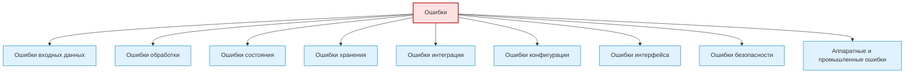
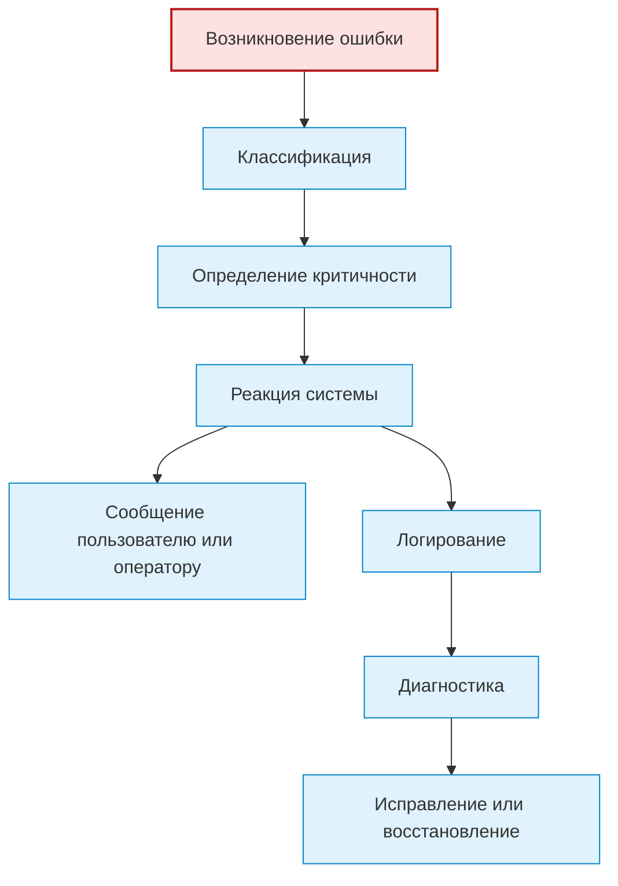

# Errors / Ошибки

## 1. Назначение документа

`Errors.md` раскрывает понятие ошибок при проектировании цифровых систем.

Документ используется как энциклопедическая статья и как опорный материал для roadmap-документов, анкет, технических требований, архитектуры системы, тестирования и примеров.

Документ не является roadmap-документом. Документ объясняет, какие виды ошибок существуют, как их выделять, классифицировать и связывать с данными, правилами, состояниями, событиями, потоками, хранением, интерфейсами и логированием.

> [!info] Главное
> Ошибки — базовый элемент проектирования цифровой системы.
> Если ошибки не определены, система не может предсказуемо реагировать на неправильные данные, сбои, недоступные ресурсы и аварийные состояния.

## 2. Место документа в системе знаний

Документ относится к энциклопедическому слою проекта Programming Digital Systems.

Документ используется после [[docs/05_encyclopedia/Storage|Storage]].

Ошибки определяются после данных, правил, состояний, событий, потоков и хранения, потому что ошибка обычно возникает как нарушение правила, недопустимое состояние, сбой потока, потеря данных, отказ внешней системы или невозможность выполнить действие.

## 3. DEF-ERR-001. Определение ошибки

Ошибка — это ситуация, при которой система не может выполнить ожидаемое действие обычным способом, получает недопустимые данные, нарушает правило, сталкивается с отказом зависимости, переходит в недопустимое состояние или теряет возможность гарантировать корректный результат.

Ошибка считается определённой корректно, если для неё указаны:

- название;
- источник;
- причина;
- условие возникновения;
- уровень критичности;
- влияние на систему;
- реакция системы;
- сообщение пользователю или оператору;
- правило логирования;
- возможность восстановления;
- связанный тест или способ проверки.

> [!tip] Простая формула
> Если действие может не выполниться корректно — нужно описать ошибку, её источник, причину, критичность и реакцию системы.

## 4. Зачем определять ошибки

Ошибки нужно определять для того, чтобы проектировщик мог:

- предотвратить потерю данных;
- предотвратить небезопасное поведение;
- определить реакцию системы на сбои;
- определить сообщения пользователю;
- определить правила логирования;
- определить аварийные состояния;
- определить тесты негативных сценариев;
- определить требования к надёжности.

Если ошибки не определены, система может скрывать сбои, выдавать неверный результат или продолжать работу в опасном состоянии.

> [!warning] Не путать
> Ошибка — это не только исключение в коде. Ошибка может быть пользовательской, предметной, интеграционной, аппаратной или эксплуатационной.

## 5. Основные виды ошибок

### 5.1. Ошибки входных данных

Ошибки входных данных возникают, если система получает некорректные, неполные, повреждённые или неподдерживаемые данные.

Примеры:

- Файл отсутствует.
- Файл имеет неподдерживаемый формат.
- Обязательное поле пустое.
- Значение находится вне допустимого диапазона.
- Таблица не содержит обязательную колонку.

### 5.2. Ошибки обработки

Ошибки обработки возникают во время преобразования, расчёта, парсинга или выполнения правила.

Примеры:

- Ошибка парсинга.
- Невозможно преобразовать значение.
- Деление на ноль.
- Не найден ожидаемый блок данных.
- Расчёт не может быть выполнен из-за недостатка данных.

### 5.3. Ошибки состояния

Ошибки состояния возникают, если действие выполняется в недопустимом состоянии.

Примеры:

- Команда запуска получена в аварийном режиме.
- Сохранение запрошено до проверки данных.
- Экспорт запрошен при незаполненных обязательных полях.
- Повторная обработка запущена до завершения предыдущей.

### 5.4. Ошибки хранения

Ошибки хранения возникают при чтении, записи, обновлении, удалении, архивировании или восстановлении данных.

Примеры:

- Нет доступа к файлу.
- Недостаточно прав для записи.
- База данных недоступна.
- Данные повреждены.
- Нарушена целостность записи.

### 5.5. Ошибки интеграции

Ошибки интеграции возникают при взаимодействии с внешними системами, API, PLC, HMI, оборудованием, файлами или сетью.

Примеры:

- Внешний сервис не отвечает.
- PLC не отправил ожидаемый сигнал.
- API вернул ошибку.
- Потеряна связь с устройством.
- Формат ответа не соответствует ожиданию.

### 5.6. Ошибки конфигурации

Ошибки конфигурации возникают, если настройки системы отсутствуют, повреждены, противоречивы или недопустимы.

Примеры:

- Не указан путь к папке.
- Неверный параметр подключения.
- Конфигурационный файл повреждён.
- Пороговое значение находится вне допустимого диапазона.

### 5.7. Ошибки интерфейса

Ошибки интерфейса возникают при невозможности корректного взаимодействия пользователя или внешней системы с системой.

Примеры:

- Пользователь не видит причину блокировки действия.
- Некорректное сообщение об ошибке.
- Интерфейс позволяет выполнить запрещённое действие.
- API принимает недопустимый запрос.

### 5.8. Ошибки безопасности

Ошибки безопасности возникают при нарушении доступа, целостности, конфиденциальности или безопасного режима работы.

Примеры:

- Недостаточно прав для действия.
- Неавторизованный запрос.
- Попытка изменить защищённые данные.
- Обход аварийной блокировки.

### 5.9. Аппаратные и промышленные ошибки

Аппаратные и промышленные ошибки возникают при работе с датчиками, приводами, контроллерами, станками или оборудованием.

Примеры:

- Потеря сигнала датчика.
- Аварийный стоп.
- Привод не достиг позиции.
- Инструмент не найден в магазине.
- Ошибка измерительного цикла.

## 6. DG-ERR-001. Общая классификация ошибок

Назначение: показать основные виды ошибок в цифровой системе.



## 7. Уровни критичности ошибок

### 7.1. Предупреждение

Система может продолжить работу, но пользователь или оператор должен быть уведомлён.

### 7.2. Восстанавливаемая ошибка

Система может продолжить работу после исправления данных, повтора операции или перехода к безопасному сценарию.

### 7.3. Блокирующая ошибка

Система не может продолжать текущий сценарий, но может оставаться работоспособной для других действий.

### 7.4. Критическая ошибка

Система не может гарантировать корректность или безопасность работы и должна перейти в безопасное состояние или остановить процесс.

## 8. Правила анализа ошибок

> [!important] Правило
> Ошибки должны быть связаны с данными, правилами, состояниями, потоками, хранением и интерфейсами.


### RULE-ERR-001. Ошибка должна иметь источник

Необходимо определить, где возникает ошибка:

- входные данные;
- правило;
- состояние;
- поток;
- хранение;
- интерфейс;
- внешняя система;
- оборудование;
- конфигурация.

### RULE-ERR-002. Ошибка должна иметь реакцию системы

Для каждой критичной ошибки необходимо определить, что делает система.

Возможные реакции:

- остановить обработку;
- пропустить элемент;
- запросить исправление;
- повторить операцию;
- записать лог;
- показать сообщение;
- перейти в безопасное состояние;
- заблокировать команду.

### RULE-ERR-003. Ошибка должна иметь уровень критичности

Нельзя описывать ошибку без понимания её влияния на систему.

### RULE-ERR-004. Ошибка должна быть видимой на нужном уровне

Ошибка должна быть видима там, где пользователь, оператор, разработчик или внешняя система может принять действие.

### RULE-ERR-005. Ошибка должна быть проверяема

Для важной ошибки должен быть тест, сценарий проверки, лог или диагностический способ подтверждения.

## 9. Жизненный цикл ошибки



## 10. Примеры применения

> [!note] Практический приём
> Практический анализ ошибок начинается с вопроса: что может пойти не так, как система это обнаружит и что она должна сделать дальше?


### 10.1. Скрипт автоматизации

Ошибки:

- Входной файл отсутствует.
- Таблица не содержит обязательные колонки.
- PDF-файл не удалось прочитать.
- Результат не удалось сохранить.

Реакции:

- Записать ошибку в лог.
- Пропустить файл или остановить обработку.
- Сообщить пользователю путь проблемного файла.

### 10.2. GUI-приложение

Ошибки:

- Пользователь пытается экспортировать незаполненный шаблон.
- Файл проекта повреждён.
- Нет прав на сохранение.

Реакции:

- Подсветить проблемное поле.
- Показать понятное сообщение.
- Заблокировать экспорт до исправления.

### 10.3. Embedded-система

Ошибки:

- Датчик не отвечает.
- Значение вне диапазона.
- Исполнительный механизм не подтвердил команду.

Реакции:

- Перейти в безопасное состояние.
- Отключить управление.
- Записать диагностический код.

### 10.4. PLC-система

Ошибки:

- Аварийный стоп активирован.
- Межблокировка запрещает запуск.
- Потерян сигнал безопасности.

Реакции:

- Остановить оборудование.
- Заблокировать автоматический режим.
- Вывести сообщение на HMI.

### 10.5. CNC/CAM-система

Ошибки:

- Инструмент отсутствует в таблице.
- NC-программа имеет неизвестный формат.
- Невозможно определить время операции.

Реакции:

- Записать предупреждение.
- Пометить деталь для ручной проверки.
- Не использовать результат в итоговом отчёте без подтверждения.

## 11. Контрольные вопросы

Перед переходом к интерфейсам необходимо ответить:

1. Какие ошибки входных данных возможны?
2. Какие ошибки обработки возможны?
3. Какие ошибки состояния возможны?
4. Какие ошибки хранения возможны?
5. Какие ошибки интеграции возможны?
6. Какие ошибки конфигурации возможны?
7. Какие ошибки интерфейса возможны?
8. Какие ошибки безопасности возможны?
9. Какие аппаратные или промышленные ошибки возможны?
10. Для каждой критичной ошибки указан уровень критичности?
11. Для каждой критичной ошибки указана реакция системы?
12. Для каждой критичной ошибки указан способ проверки?

## 12. Критерии завершения работы с ошибками

Работа с ошибками считается завершённой, если:

- ошибки разделены по видам;
- для критичных ошибок указан источник;
- для критичных ошибок указана причина;
- для критичных ошибок указан уровень критичности;
- для критичных ошибок указана реакция системы;
- для критичных ошибок указано сообщение пользователю или оператору;
- для критичных ошибок указано правило логирования;
- для критичных ошибок определён способ проверки;
- ошибки связаны с правилами, состояниями, событиями и потоками.

## 13. Следующий шаг

После работы с ошибками необходимо перейти к [[docs/05_encyclopedia/Interfaces|Interfaces]] и определить, как ошибки отображаются пользователю, оператору, внешней системе или оборудованию.

## 14. Связанные документы

### Входные документы

- [[docs/05_encyclopedia/Rules|Rules]]
  - Передаёт: правила, нарушение которых может создавать ошибки.
  - Используется для: определения ошибок нарушения правил.
  - Ограничение: не классифицирует ошибки.

- [[docs/05_encyclopedia/States|States]]
  - Передаёт: допустимые и недопустимые состояния.
  - Используется для: определения ошибок состояния.
  - Ограничение: не определяет реакцию на ошибки.

- [[docs/05_encyclopedia/Flows|Flows]]
  - Передаёт: потоки обработки, хранения, интеграции и ошибок.
  - Используется для: определения мест возникновения ошибок.
  - Ограничение: не классифицирует ошибки подробно.

- [[docs/05_encyclopedia/Storage|Storage]]
  - Передаёт: ошибки хранения, целостности и доступа.
  - Используется для: описания ошибок хранения.
  - Ограничение: не описывает все виды ошибок системы.

### Выходные документы

- [[docs/05_encyclopedia/Interfaces|Interfaces]]
  - Получает: ошибки, которые должны быть показаны пользователю, оператору или внешней системе.
  - Используется для: определения интерфейсов ошибок и сообщений.
  - Ограничение: не должен заново классифицировать ошибки.

- [[docs/03_roadmaps/01_Roadmap_System_Design|Roadmap: System Design]]
  - Получает: правила анализа ошибок.
  - Используется для: проектирования ошибок системы.
  - Ограничение: не должен смешивать ошибки с технической реализацией исключений.

- [[docs/03_roadmaps/03_Roadmap_Technical_Requirements|Roadmap: Technical Requirements]]
  - Получает: критичные ошибки, реакции, уровни и правила логирования.
  - Используется для: формулирования требований к надёжности и диагностике.
  - Ограничение: не должен подменять тестирование.

## 15. Интерпретация для Digital System CAD

Этот раздел переводит понятие ошибки в рабочий элемент будущей метамодели Digital System CAD.

### 15.1. Definition

В метамодели Digital System CAD ошибка — это типизированный элемент модели, описывающий недопустимую, исключительную, аварийную или неопределённую ситуацию и обязательную реакцию системы.

Для важной ошибки нужно фиксировать:

- `id`;
- `name`;
- `kind`;
- `definition`;
- `source`;
- `cause`;
- `trigger_condition`;
- `severity`;
- `system_impact`;
- `user_or_operator_message`;
- `reaction`;
- `recovery`;
- `logging_rule`;
- `related_rule`;
- `related_test`;
- `open_questions`.

### 15.2. Context

В Digital System CAD ошибка не должна быть только исключением в коде. Ошибка должна быть связана с нарушенным правилом, недопустимыми данными, состоянием, событием, потоком, интерфейсом, хранилищем, внешней системой или оборудованием.

Описание ошибки должно позволять построить негативный сценарий, требование к реакции, тест, сообщение, логирование и архитектурное решение.

### 15.3. Not examples

Ошибкой не следует считать:

- неопределённое “что-то пошло не так”;
- traceback без проектного смысла;
- сообщение пользователю без условия возникновения;
- технический код ошибки без причины и реакции;
- просто плохой результат без указания нарушенного правила;
- открытый вопрос, который ещё не является ошибкой.

Если неизвестно, ошибка это или ограничение модели, нужно зафиксировать открытый вопрос.

### 15.4. Related model elements

Ошибка должна быть связана с:

- `Rule` — нарушенное правило;
- `DataField` — некорректные или отсутствующие данные;
- `State` — недопустимое состояние;
- `Event` — событие возникновения или обнаружения ошибки;
- `Flow` — место возникновения и обработки ошибки;
- `Storage` — ошибка чтения, записи или целостности;
- `Interface` — отображение ошибки;
- `Requirement` — требование к реакции;
- `TestCase` — негативный сценарий проверки;
- `Module` — компонент, который обнаруживает или обрабатывает ошибку.

### 15.5. Related relations

Типовые связи:

- `Error caused_by DataField`;
- `Error caused_by Rule violation`;
- `Error occurs_in State`;
- `Event detects Error`;
- `Flow handles Error`;
- `Interface displays Error`;
- `Storage raises Error`;
- `Requirement defines Error reaction`;
- `TestCase verifies Error handling`;
- `Module handles Error`.

### 15.6. Structured facts

Примеры структурированных фактов:

```yaml
- id: FACT-ERR-001
  subject: ERR-001
  relation: caused_by
  object: RULE-001
  source: "Errors.md"

- id: FACT-ERR-002
  subject: FLOW-001
  relation: handles
  object: ERR-001
  source: "Flows.md"
```

### 15.7. Validation questions

Ошибка считается достаточно описанной для текущего этапа, если можно ответить:

1. Есть ли у ошибки `id`?
2. Понятен ли источник ошибки?
3. Понятна ли причина или нарушенное правило?
4. Указано ли условие возникновения?
5. Указана ли критичность?
6. Описано ли влияние на систему?
7. Описана ли реакция системы?
8. Указано ли сообщение пользователю, оператору или внешней системе?
9. Указано ли правило логирования?
10. Есть ли способ проверки негативного сценария?

### 15.8. Open questions

Для будущей метамодели нужно уточнить:

- как различать `Error`, `Warning`, `Fault`, `Alarm`, `Exception` и `OpenQuestion`;
- какие уровни критичности обязательны для разных типов систем;
- как связывать ошибки с безопасным состоянием;
- как фиксировать восстановление после ошибки;
- какие ошибки должны становиться требованиями надёжности и диагностики.

## 16. История изменений

- Updated: документ приведён к правилам энциклопедического слоя, рабочим Obsidian wikilinks и явному следующему шагу.
- Updated: оформление приведено к визуальному стилю `Entities.md`: добавлены callout-блоки и цветовые стили Mermaid-диаграмм.
- Updated: документ приведён к единому визуальному формату проекта.
- Updated: добавлена интерпретация для Digital System CAD: ошибка описана как элемент модели с причиной, реакцией, связями, структурированными фактами и проверками полноты.
