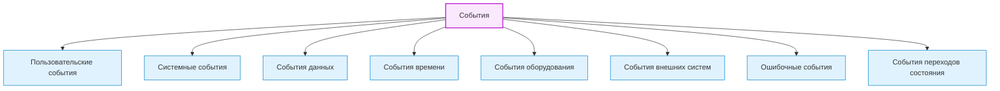
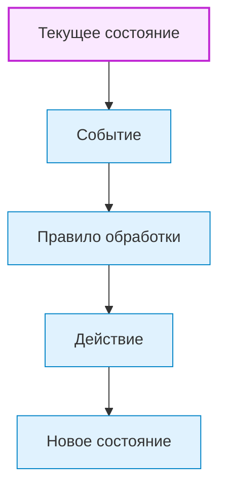
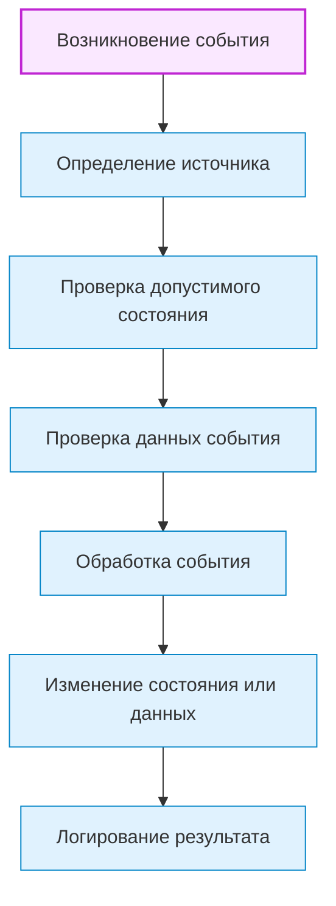

# Events / События

## 1. Назначение документа

`Events.md` раскрывает понятие события при проектировании цифровых систем.

Документ используется как энциклопедическая статья и как опорный материал для roadmap-документов, анкет, технических требований, диаграмм и примеров.

Документ не является roadmap-документом. Документ объясняет, какие виды событий существуют, как их выделять и как связывать с состояниями, правилами, потоками, ошибками и интерфейсами.

> [!info] Главное
> События — базовый элемент проектирования цифровой системы.
> Если события не определены, система теряет причинно-следственную связь между изменениями, реакциями и переходами состояния.

## 2. Место документа в системе знаний

Документ относится к энциклопедическому слою проекта Programming Digital Systems.

Документ используется после [[docs/05_encyclopedia/States|States]].

События определяются после состояний, потому что события часто запускают переходы между состояниями, обработку данных, реакции интерфейса, ошибки или команды управления.

## 3. DEF-EVENT-001. Определение события

Событие — это факт, действие, сигнал, сообщение, изменение состояния или наступление условия, на которое цифровая система должна отреагировать.

Событие считается определённым корректно, если для него указаны:

- название;
- источник;
- причина возникновения;
- данные события;
- состояние, в котором событие допустимо;
- правило обработки;
- ожидаемая реакция системы;
- возможные ошибки;
- результат обработки события.

> [!tip] Простая формула
> Если в системе что-то произошло и это должно вызвать реакцию — нужно описать событие.

## 4. Зачем определять события

События нужно определять для того, чтобы проектировщик мог:

- понять, что запускает поведение системы;
- определить реакции системы;
- определить переходы состояния;
- определить взаимодействие пользователя с системой;
- определить взаимодействие с оборудованием;
- определить взаимодействие с внешними системами;
- определить ошибки и исключительные ситуации;
- подготовить sequence diagram, state diagram и тестовые сценарии.

Если события не определены, система может не иметь понятного механизма реакции на изменения.

> [!warning] Не путать
> Событие — это факт изменения, а не процесс выполнения. Процесс может длиться, событие фиксирует момент.

## 5. Основные виды событий

### 5.1. Пользовательские события

Пользовательские события возникают из действий пользователя.

Примеры:

- Нажатие кнопки.
- Выбор файла.
- Изменение поля ввода.
- Подтверждение операции.
- Отмена действия.

### 5.2. Системные события

Системные события создаются самой системой во время работы.

Примеры:

- Запуск приложения.
- Завершение обработки.
- Сохранение результата.
- Обновление состояния.
- Завершение фоновой задачи.

### 5.3. События данных

События данных возникают при изменении, получении, проверке или сохранении данных.

Примеры:

- Данные получены.
- Данные проверены.
- Данные отклонены.
- Данные сохранены.
- Данные изменены.

### 5.4. События времени

События времени возникают по расписанию, таймеру или истечению периода ожидания.

Примеры:

- Таймер истёк.
- Наступило время плановой проверки.
- Превышено время ожидания ответа.
- Выполнен периодический цикл.

### 5.5. События оборудования

События оборудования возникают от датчиков, исполнительных механизмов, контроллеров или промышленных устройств.

Примеры:

- Датчик изменил состояние.
- Привод достиг позиции.
- Нажата аварийная кнопка.
- Потеряна связь с устройством.
- Получен сигнал готовности.

### 5.6. События внешних систем

События внешних систем возникают при взаимодействии с API, базой данных, файловой системой, PLC, HMI, CAM/CNC или другим программным компонентом.

Примеры:

- Получен API-запрос.
- Получен ответ от внешнего сервиса.
- Изменён файл в папке.
- Получено сообщение от PLC.
- Импортирован CSV-файл.

### 5.7. Ошибочные события

Ошибочные события возникают при нарушении правила, сбое, исключении или недопустимом состоянии.

Примеры:

- Файл не найден.
- Проверка данных не пройдена.
- Связь потеряна.
- Значение вне диапазона.
- Команда запрещена текущим состоянием.

### 5.8. События переходов состояния

События переходов состояния запускают изменение состояния системы, сущности, процесса, интерфейса или оборудования.

Примеры:

- `StartRequested`.
- `ValidationCompleted`.
- `ProcessingFailed`.
- `StopRequested`.
- `EmergencyDetected`.

## 6. DG-EVENT-001. Общая классификация событий

Назначение: показать основные виды событий в цифровой системе.



## 7. Связь событий с состояниями

Событие должно рассматриваться вместе с состоянием, в котором оно допустимо.

Одно и то же событие может быть допустимым в одном состоянии и запрещённым в другом.



## 8. Правила выделения событий

> [!important] Правило
> События должны иметь источник, момент возникновения, данные события, допустимое состояние и реакцию системы.


### RULE-EVENT-001. Событие должно иметь источник

Для каждого события необходимо определить источник:

- пользователь;
- система;
- данные;
- таймер;
- оборудование;
- внешняя система;
- ошибка.

### RULE-EVENT-002. Событие должно иметь причину

Необходимо определить, почему событие возникает.

### RULE-EVENT-003. Событие должно иметь данные события

Если событие переносит информацию, необходимо определить структуру этих данных.

### RULE-EVENT-004. Событие должно иметь допустимое состояние

Необходимо определить, в каких состояниях событие может быть обработано.

### RULE-EVENT-005. Событие должно иметь реакцию системы

Необходимо определить, что делает система при событии.

### RULE-EVENT-006. Запрещённые события должны быть обработаны явно

Если событие пришло в недопустимом состоянии, система должна иметь правило реакции.

## 9. Жизненный цикл события



## 10. Примеры применения

> [!note] Практический приём
> Практический анализ событий начинается с вопроса: что произошло, кто это вызвал и что система должна сделать после этого?


### 10.1. Скрипт автоматизации

Контекст: скрипт обрабатывает файлы.

События:

- `InputFolderSelected` — пользователь или конфигурация указали папку.
- `FileFound` — файл найден.
- `ValidationFailed` — проверка файла не пройдена.
- `ProcessingCompleted` — обработка завершена.
- `LogWritten` — лог сохранён.

### 10.2. GUI-приложение

Контекст: пользователь редактирует шаблон.

События:

- `TemplateOpened`.
- `FieldChanged`.
- `SaveRequested`.
- `ExportRequested`.
- `UnsavedChangesDetected`.

### 10.3. Embedded-система

Контекст: контроллер управляет клапаном.

События:

- `SensorValueChanged`.
- `ButtonPressed`.
- `TimerElapsed`.
- `ActuatorCommandSent`.
- `FaultDetected`.

### 10.4. PLC-система

Контекст: PLC управляет насосной системой.

События:

- `StartCommandReceived`.
- `StopCommandReceived`.
- `LowLevelDetected`.
- `EmergencyStopActivated`.
- `AlarmAcknowledged`.

### 10.5. CNC/CAM-система

Контекст: система анализирует NC-программы.

События:

- `NcFileLoaded`.
- `ToolCallFound`.
- `OperationParsed`.
- `ToolTimeCalculated`.
- `ReportExported`.
- `ParseErrorDetected`.

## 11. Контрольные вопросы

Перед переходом к потокам необходимо ответить:

1. Какие пользовательские события существуют?
2. Какие системные события существуют?
3. Какие события данных существуют?
4. Какие события времени существуют?
5. Какие события оборудования существуют?
6. Какие события внешних систем существуют?
7. Какие ошибочные события существуют?
8. Какие события запускают переходы состояния?
9. Для каждого события указан источник?
10. Для каждого события указана реакция системы?
11. Для каждого события указаны допустимые состояния?
12. Для запрещённых событий определена реакция?

## 12. Критерии завершения работы с событиями

Работа с событиями считается завершённой, если:

- события разделены по видам;
- для каждого важного события указан источник;
- для каждого важного события указана причина возникновения;
- для каждого важного события указаны данные события;
- для каждого важного события указаны допустимые состояния;
- для каждого важного события указана реакция системы;
- ошибочные события выделены отдельно;
- события связаны с правилами, состояниями и потоками;
- открытые вопросы вынесены отдельно;
- события могут быть использованы в roadmap-документах и технических требованиях.

## 13. Следующий шаг

После работы с событиями необходимо перейти к [[docs/05_encyclopedia/Flows|Flows]] и определить потоки данных, команд, событий, состояний и ошибок.

## 14. Связанные документы

### Входные документы

- [[docs/05_encyclopedia/States|States]]
  - Передаёт: состояния и переходы между ними.
  - Используется для: определения событий, которые запускают переходы.
  - Ограничение: не классифицирует события.

- [[docs/05_encyclopedia/Rules|Rules]]
  - Передаёт: правила обработки и ограничения поведения.
  - Используется для: определения реакции на события.
  - Ограничение: не описывает источники событий.

### Выходные документы

- [[docs/05_encyclopedia/Flows|Flows]]
  - Получает: события как точки запуска потоков.
  - Используется для: описания потоков данных, управления, ошибок и интеграций.
  - Ограничение: не должен заново классифицировать события.

- [[docs/03_roadmaps/01_Roadmap_System_Design|Roadmap: System Design]]
  - Получает: правила выделения событий.
  - Используется для: проектирования реакции системы на изменения.
  - Ограничение: не должен смешивать события с состояниями и процессами.

## 15. Интерпретация для Digital System CAD

Этот раздел переводит понятие события в рабочий элемент будущей метамодели Digital System CAD.

### 15.1. Definition

В метамодели Digital System CAD событие — это типизированный элемент модели, который фиксирует факт изменения, действия, сигнала, сообщения или наступления условия, требующего реакции системы.

Для важного события нужно фиксировать:

- `id`;
- `name`;
- `kind`;
- `definition`;
- `source`;
- `cause`;
- `event_data`;
- `allowed_states`;
- `handling_rule`;
- `reaction`;
- `result`;
- `related_flow`;
- `possible_errors`;
- `open_questions`.

### 15.2. Context

В Digital System CAD событие нужно использовать для связи причин и последствий. Оно объясняет, почему запускается поток, почему меняется состояние, почему применяется правило или почему возникает ошибка.

Событие не является процессом. Процесс может длиться, а событие фиксирует факт, который уже произошёл или должен быть обнаружен.

### 15.3. Not examples

Событием не следует считать:

- длительный процесс;
- состояние;
- правило;
- команду без факта возникновения;
- логическую проверку без результата;
- UI-элемент;
- сообщение без источника и реакции.

Если непонятно, это событие, команда или состояние, нужно зафиксировать открытый вопрос.

### 15.4. Related model elements

Событие должно быть связано с:

- `Entity` — объект, с которым событие произошло;
- `State` — состояние, в котором событие допустимо;
- `Rule` — правило обработки события;
- `Flow` — поток, который событие запускает;
- `DataField` — данные события;
- `Error` — ошибка, которая может возникнуть;
- `Interface` — источник или получатель события;
- `Requirement` — требование к реакции;
- `TestCase` — проверка реакции на событие.

### 15.5. Related relations

Типовые связи:

- `Entity emits Event`;
- `Interface sends Event`;
- `Event carries DataField`;
- `State allows Event`;
- `Event triggers Flow`;
- `Event triggers StateTransition`;
- `Rule handles Event`;
- `Event may_raise Error`;
- `TestCase verifies Event reaction`.

### 15.6. Structured facts

Примеры структурированных фактов:

```yaml
- id: FACT-EVENT-001
  subject: EVENT-001
  relation: triggers
  object: FLOW-001
  source: "Events.md"

- id: FACT-EVENT-002
  subject: EVENT-001
  relation: carries
  object: DATA-001
  source: "Data.md"
```

### 15.7. Validation questions

Событие считается достаточно описанным для текущего этапа, если можно ответить:

1. Есть ли у события `id`?
2. Понятен ли источник события?
3. Понятна ли причина возникновения?
4. Указаны ли данные события?
5. Указаны ли допустимые состояния?
6. Указано ли правило обработки?
7. Описана ли реакция системы?
8. Описан ли результат обработки?
9. Указаны ли возможные ошибки?
10. Есть ли способ проверить реакцию на событие?

### 15.8. Open questions

Для будущей метамодели нужно уточнить:

- как различать `Event`, `Command`, `Signal`, `Message` и `Notification`;
- какие события должны сохраняться в журнале;
- как описывать синхронные и асинхронные события;
- как фиксировать запрещённые события;
- как связывать событие с несколькими потоками и переходами.

## 16. История изменений

- Updated: документ приведён к правилам энциклопедического слоя, рабочим Obsidian wikilinks и явному следующему шагу.
- Updated: оформление приведено к визуальному стилю `Entities.md`: добавлены callout-блоки и цветовые стили Mermaid-диаграмм.
- Updated: документ приведён к единому визуальному формату проекта.
- Updated: добавлена интерпретация для Digital System CAD: событие описано как элемент модели причинности с источником, данными, реакцией, потоками, переходами и проверками полноты.
