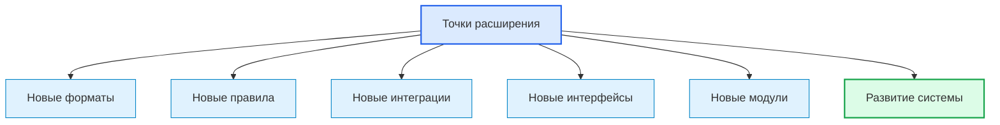

# Extension Points / Точки расширения

## 1. Назначение документа

`Extension_Points.md` раскрывает понятие точки расширения при проектировании цифровых систем.

Документ используется как энциклопедическая статья для проектирования архитектуры, которая может развиваться без разрушения существующих слоёв, модулей, моделей, интерфейсов и зависимостей.

> [!info] Главное
> Точка расширения — заранее определённое место контролируемого развития системы.
> Если точки расширения не определены, новое поведение добавляется случайно и разрушает архитектурные границы.

## 2. Место документа в системе знаний

Документ относится к энциклопедическому слою проекта Programming Digital Systems.

Точки расширения используются после [[docs/05_encyclopedia/Configurations|Configurations]] и связаны с [[docs/03_roadmaps/10_Roadmap_System_Evolution|Roadmap: System Evolution]].



## 3. DEF-EXT-001. Определение точки расширения

Точка расширения — это заранее определённое место в архитектуре, где система может получить новый вариант поведения, формат, интеграцию, модуль, правило или интерфейс без разрушения существующей ответственности.

Точка расширения считается определённой корректно, если указаны:

- назначение расширения;
- причина появления;
- что может расширяться;
- что запрещено менять;
- контракт расширения;
- владелец точки расширения;
- ограничения;
- критерии проверки нового расширения;
- влияние на существующие сценарии.

> [!tip] Простая формула
> Если ожидается несколько вариантов одного типа поведения, нужно определить точку расширения.

## 4. Основные виды точек расширения

| Вид точки расширения | Что позволяет добавить | Пример |
|---|---|---|
| Формат данных | Новый входной или выходной формат | CSV, PDF, NC, JSON |
| Правило обработки | Новый вариант проверки или расчёта | новый валидатор |
| Интерфейс | Новый способ взаимодействия | CLI, GUI, API, HMI |
| Интеграция | Новую внешнюю систему | ERP, PLC, база данных |
| Хранение | Новый способ сохранения | файл, DB, облако |
| Отчёт | Новый формат результата | Excel, PDF, HTML |
| Драйвер | Новое устройство или протокол | датчик, привод, контроллер |
| Стратегия | Новый алгоритм выбора или расчёта | matching strategy |

> [!warning] Не путать
> Точка расширения не означает преждевременное усложнение. Она нужна только там, где расширение ожидаемо, связано с требованиями или снижает риск будущих изменений.

## 5. Правила анализа точек расширения

> [!important] Правило
> Точка расширения должна иметь реальную причину, контракт и критерий проверки.

### RULE-EXT-001. Расширение должно быть ожидаемым

Точка расширения нужна, если есть требование, сценарий развития, частая вариативность или известный риск изменения.

### RULE-EXT-002. Расширение должно иметь границу

Нужно определить, что новая реализация может менять, а что должно оставаться стабильным.

### RULE-EXT-003. Расширение должно иметь контракт

Новый вариант должен подключаться через интерфейс, модель, событие, адаптер, стратегию или другой явный механизм.

### RULE-EXT-004. Расширение не должно ломать существующие сценарии

Для точки расширения должны быть критерии совместимости и проверки регрессии.

### RULE-EXT-005. Избыточные точки расширения нужно удалять

Если расширение гипотетическое и не связано с проектным маршрутом, его лучше не добавлять.

## 6. Минимальная карточка точки расширения

```md
### Extension Point: <Название точки расширения>

- Назначение:
- Причина:
- Что расширяется:
- Что запрещено менять:
- Контракт:
- Владелец:
- Связанные модули:
- Связанные интерфейсы:
- Связанные конфигурации:
- Критерии проверки:
- Риски:
- Открытые вопросы:
```

## 7. Примеры применения

> [!note] Практический приём
> Точки расширения лучше искать в местах, где система уже имеет несколько похожих вариантов или ожидает новый вариант от пользователя, оборудования или внешней системы.

### 7.1. Скрипт автоматизации

- новый формат входного файла;
- новый тип отчёта;
- новая стратегия сопоставления материала;
- новый обработчик ошибок.

### 7.2. GUI-приложение

- новый тип шаблона;
- новый экспортный формат;
- новый редактор свойства;
- новый провайдер хранения проекта.

### 7.3. Embedded-система

- новый датчик;
- новый протокол связи;
- новый режим управления;
- новый обработчик аварии.

### 7.4. PLC-система

- новый технологический узел;
- новый рецепт;
- новый режим работы;
- новый HMI-экран.

### 7.5. CNC/CAM-система

- новый формат NC-программы;
- новый тип инструмента;
- новый постпроцессор;
- новый формат отчёта.

## 8. Контрольные вопросы

1. Где система ожидаемо будет развиваться?
2. Какие варианты поведения уже существуют?
3. Какие новые форматы могут появиться?
4. Какие новые интерфейсы могут появиться?
5. Какие внешние системы могут быть подключены?
6. Какой контракт нужен для расширения?
7. Что запрещено менять при расширении?
8. Какие тесты должны подтверждать совместимость?
9. Какие точки расширения являются избыточными?
10. Какие точки расширения связаны с roadmap развития системы?

## 9. Критерии завершения работы с точками расширения

Работа с точками расширения считается завершённой, если:

- точки расширения перечислены;
- у каждой точки есть причина;
- указан контракт расширения;
- указано, что можно менять;
- указано, что нельзя менять;
- определены критерии проверки нового расширения;
- избыточные расширения удалены или перенесены в открытые вопросы;
- точки расширения связаны с развитием системы.

## 10. Следующий шаг

После определения точек расширения необходимо перейти к [[docs/03_roadmaps/02_Roadmap_System_Architecture_Design|Roadmap: System Architecture Design]] и использовать архитектурные понятия для проектирования системы.

## 11. Связанные документы

### Входные документы

- [[docs/05_encyclopedia/Configurations|Configurations]]
  - Передаёт: параметры и режимы, которые могут управлять вариантами поведения.
  - Используется для: определения управляемых расширений.
  - Ограничение: не заменяет архитектурный контракт расширения.

- [[docs/05_encyclopedia/Interfaces|Interfaces]]
  - Передаёт: границы взаимодействия.
  - Используется для: описания контрактов расширения.
  - Ограничение: не определяет причину расширения.

- [[docs/05_encyclopedia/Dependencies|Dependencies]]
  - Передаёт: зависимости, которые расширение может создавать или ослаблять.
  - Используется для: проверки влияния расширения на архитектуру.
  - Ограничение: не определяет сценарии развития.

### Выходные документы

- [[docs/03_roadmaps/02_Roadmap_System_Architecture_Design|Roadmap: System Architecture Design]]
  - Получает: правила проектирования точек расширения.
  - Используется для: завершения архитектурной модели системы.
  - Ограничение: не должен добавлять расширения без причины.

- [[docs/03_roadmaps/10_Roadmap_System_Evolution|Roadmap: System Evolution]]
  - Получает: места управляемого развития системы.
  - Используется для: добавления новых возможностей без разрушения архитектуры.
  - Ограничение: не должен маскировать исправление дефекта как развитие.

## 12. Интерпретация для Digital System CAD

Этот раздел переводит понятие точки расширения в рабочий элемент будущей метамодели Digital System CAD.

### 12.1. Definition

В метамодели Digital System CAD точка расширения — это типизированный элемент архитектурной модели, который описывает управляемое место добавления новых metamodels, views, validation rules, transformations, import/export форматов, генераторов или интеграций без разрушения ядра модели.

Точку расширения нужно фиксировать с полями: `id`, `name`, `kind`, `definition`, `purpose`, `extension_contract`, `allowed_extensions`, `forbidden_extensions`, `affected_layers`, `dependencies`, `validation_rules`, `open_questions`.

### 12.2. Context

Digital System CAD по цели должен поддерживать разные языки моделирования и разные views одной модели. Поэтому расширяемость является не украшением, а архитектурным свойством будущей системы.

Но на текущем исследовательском этапе точка расширения должна фиксироваться как требование к будущей архитектуре, а не как немедленная реализация plugin-системы.

### 12.3. Not examples

Точкой расширения не следует считать:

- произвольное место, куда можно добавить код;
- нарушение архитектурной границы;
- конфигурационный параметр без нового поведения;
- fork системы;
- временный workaround;
- расширение без контракта и правил проверки.

### 12.4. Related relations

Типовые связи:

- `ExtensionPoint extends Layer`;
- `ExtensionPoint accepts Extension`;
- `ExtensionPoint requires Interface`;
- `ExtensionPoint constrained_by Rule`;
- `ExtensionPoint affects View`;
- `ExtensionPoint affects Transformation`;
- `ExtensionPoint may_create Dependency`;
- `TestCase verifies ExtensionPoint contract`.

### 12.5. Validation questions

Точка расширения достаточно описана, если понятны причина расширения, контракт, допустимые расширения, запрещённые расширения, affected layers, зависимости, правила проверки и риск для ядра модели.

### 12.6. Open questions

Нужно уточнить, какие точки расширения обязательны для Digital System CAD: новые metamodels, новые element types, новые relation types, новые views, новые validators, новые generators, новые import/export adapters и новые Codex-context builders.

## 13. История изменений

- Initial version: создана энциклопедическая статья о точках расширения цифровой системы.
- Updated: добавлена интерпретация для Digital System CAD: точка расширения описана как управляемый архитектурный элемент для metamodels, views, validators, transformations, generators и import/export адаптеров.
