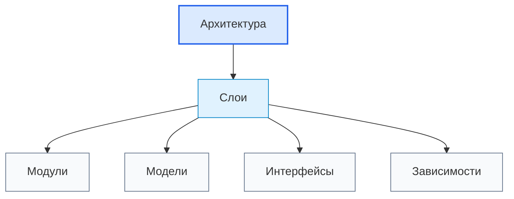

# Layers / Слои

## 1. Назначение документа

`Layers.md` раскрывает понятие архитектурного слоя при проектировании цифровых систем.

Документ используется как энциклопедическая статья для этапа [[docs/03_roadmaps/02_Roadmap_System_Architecture_Design|Roadmap: System Architecture Design]].

Слой помогает отделить крупные области ответственности системы до выбора конкретных библиотек, фреймворков, структуры файлов и деталей реализации.

> [!info] Главное
> Слой отвечает за крупную область ответственности системы.
> Если слои не определены, правила, интерфейсы, хранение, конфигурации и инфраструктура смешиваются в одном месте.

## 2. Место документа в системе знаний

Документ относится к энциклопедическому слою проекта Programming Digital Systems.

Слои используются после общего понятия [[docs/05_encyclopedia/Architecture|Architecture]] и перед детализацией [[docs/05_encyclopedia/Modules|Modules]], [[docs/05_encyclopedia/Models|Models]], [[docs/05_encyclopedia/Dependencies|Dependencies]] и [[docs/05_encyclopedia/Extension_Points|Extension Points]].



## 3. DEF-LAYER-001. Определение слоя

Слой — это крупная архитектурная область ответственности, которая группирует близкие по смыслу модули, модели, интерфейсы и правила взаимодействия.

Слой считается определённым корректно, если указаны:

- назначение слоя;
- ответственность слоя;
- входные данные или команды;
- выходные данные или результаты;
- разрешённые зависимости;
- запрещённые зависимости;
- связанные модули;
- связанные интерфейсы;
- ошибки, которые слой создаёт или обрабатывает;
- критерии проверки слоя.

> [!tip] Простая формула
> Если часть системы отвечает за отдельную крупную область работы, её можно рассматривать как слой.

## 4. Основные виды слоёв

| Слой | Ответственность | Что не должен делать |
|---|---|---|
| Представление | Взаимодействие с пользователем или оператором | Хранить бизнес-правила |
| Сценарии приложения | Координация действий пользователя или системы | Выполнять низкоуровневую инфраструктуру |
| Доменная логика | Предметные правила и решения | Зависеть от GUI, файлов и внешних API |
| Данные | Структуры данных, DTO, преобразования | Выбирать инструмент хранения |
| Хранение | Сохранение и извлечение данных | Содержать бизнес-решения |
| Инфраструктура | Файлы, сеть, оборудование, внешние сервисы | Управлять предметными правилами |
| Конфигурация | Настройки и режимы работы | Подменять требования |
| Ошибки и логирование | Диагностика, сообщения, след выполнения | Скрывать причины ошибок |

> [!warning] Не путать
> Слой не равен папке в проекте. Папка может быть способом реализации слоя, но слой определяется ответственностью.

## 5. Правила анализа слоёв

> [!important] Правило
> Каждый слой должен иметь одну крупную область ответственности и явно заданные допустимые зависимости.

### RULE-LAYER-001. Слой должен иметь назначение

Нельзя добавлять слой только потому, что так принято в конкретном фреймворке.

### RULE-LAYER-002. Слой должен иметь границу ответственности

Для слоя должно быть понятно, какие решения он принимает и какие решения ему запрещены.

### RULE-LAYER-003. Слои должны иметь направление зависимостей

Если слой использует другой слой, это отношение должно быть допустимым и объяснённым.

### RULE-LAYER-004. Доменная логика не должна зависеть от инфраструктуры

Правила предметной области должны оставаться проверяемыми без GUI, файловой системы, базы данных или внешнего API.

### RULE-LAYER-005. Малые системы могут иметь меньше слоёв

Скрипт автоматизации не обязан иметь все возможные слои, но его обязанности всё равно должны быть разделены.

## 6. Минимальная карточка слоя

```md
### Layer: <Название слоя>

- Назначение:
- Ответственность:
- Вход:
- Выход:
- Разрешённые зависимости:
- Запрещённые зависимости:
- Связанные модули:
- Связанные модели:
- Связанные интерфейсы:
- Ошибки:
- Критерии проверки:
- Открытые вопросы:
```

## 7. Примеры применения

> [!note] Практический приём
> Слои удобнее выделять через вопрос: какая крупная ответственность должна быть отделена, чтобы система оставалась проверяемой и расширяемой?

### 7.1. Скрипт автоматизации

- слой чтения входных файлов;
- слой проверки данных;
- слой обработки;
- слой формирования отчёта;
- слой логирования.

### 7.2. GUI-приложение

- слой представления;
- слой сценариев приложения;
- доменный слой;
- слой хранения;
- слой инфраструктуры.

### 7.3. Embedded-система

- слой драйверов;
- слой чтения датчиков;
- слой управления состоянием;
- слой управления исполнительными механизмами;
- слой диагностики.

### 7.4. PLC-система

- слой входных сигналов;
- слой режимов работы;
- слой межблокировок;
- слой аварий;
- слой HMI.

### 7.5. CNC/CAM-система

- слой чтения NC-файлов;
- слой анализа операций;
- слой модели инструмента;
- слой расчётов;
- слой отчётов.

## 8. Контрольные вопросы

1. Какие крупные области ответственности есть в системе?
2. Какие слои обязательны для текущей системы?
3. Какие слои будут избыточными?
4. Что входит в ответственность каждого слоя?
5. Что каждому слою запрещено делать?
6. Какие зависимости между слоями разрешены?
7. Какие зависимости между слоями запрещены?
8. Какие модули относятся к каждому слою?
9. Какие интерфейсы проходят между слоями?
10. Какие ошибки возникают или обрабатываются на уровне слоя?

## 9. Критерии завершения работы со слоями

Работа со слоями считается завершённой, если:

- список слоёв определён;
- у каждого слоя есть назначение;
- у каждого слоя есть граница ответственности;
- указаны разрешённые и запрещённые зависимости;
- модули распределены по слоям;
- интерфейсы между слоями определены;
- избыточные слои удалены или обоснованы.

## 10. Следующий шаг

После определения слоёв необходимо перейти к [[docs/05_encyclopedia/Modules|Modules]] и распределить функциональные части системы внутри архитектурных слоёв.

## 11. Связанные документы

### Входные документы

- [[docs/05_encyclopedia/Architecture|Architecture]]
  - Передаёт: общее понятие архитектуры и архитектурных элементов.
  - Используется для: понимания места слоёв в архитектуре системы.
  - Ограничение: не раскрывает слои подробно.

- [[docs/05_encyclopedia/Flows|Flows]]
  - Передаёт: движение данных, команд, событий и ошибок.
  - Используется для: определения границ между слоями.
  - Ограничение: не задаёт архитектурные ответственности.

### Выходные документы

- [[docs/05_encyclopedia/Modules|Modules]]
  - Получает: слои как контейнеры ответственности для модулей.
  - Используется для: детализации частей системы внутри слоёв.
  - Ограничение: не должен менять назначение слоёв без причины.

- [[docs/03_roadmaps/02_Roadmap_System_Architecture_Design|Roadmap: System Architecture Design]]
  - Получает: правила выделения слоёв.
  - Используется для: проектирования архитектуры системы.
  - Ограничение: не должен превращать слои в конкретные папки реализации.

## 12. Интерпретация для Digital System CAD

Этот раздел переводит понятие слоя в рабочий элемент будущей метамодели Digital System CAD.

### 12.1. Definition

В метамодели Digital System CAD слой — это типизированная архитектурная область ответственности, которая группирует модули, модели, интерфейсы, правила и зависимости по уровню абстракции.

Слой нужно фиксировать с полями: `id`, `name`, `definition`, `responsibility`, `allowed_dependencies`, `forbidden_dependencies`, `contained_modules`, `provided_interfaces`, `related_rules`, `related_views`, `open_questions`.

### 12.2. Context

Слой относится к архитектурному представлению модели. Он не является папкой проекта и не должен появляться как случайное техническое разбиение.

В Digital System CAD слои нужны, чтобы проверять направления зависимостей, отделять модель от view, генератор от репозитория, интерфейс от реализации.

### 12.3. Not examples

Слоем не следует считать:

- папку без архитектурной ответственности;
- один модуль;
- библиотеку или фреймворк;
- диаграммный блок без правил зависимостей;
- набор файлов, сгруппированных только по удобству.

### 12.4. Related relations

Типовые связи:

- `Layer contains Module`;
- `Layer provides Interface`;
- `Layer depends_on Layer`;
- `Layer forbids Dependency`;
- `Rule constrains Layer`;
- `View represents Layer`;
- `TestCase verifies Layer constraint`.

### 12.5. Validation questions

Слой достаточно описан, если понятны его ответственность, разрешённые зависимости, запрещённые зависимости, входы, выходы, модули, интерфейсы и критерии проверки.

### 12.6. Open questions

Нужно уточнить, какие слои обязательны для Digital System CAD: `Model Repository`, `Metamodel Registry`, `View Engine`, `Validation Engine`, `Transformation Engine`, `Import/Export Layer`, `Codex Context Layer`.

## 13. История изменений

- Initial version: создана энциклопедическая статья о слоях архитектуры системы.
- Updated: добавлена интерпретация для Digital System CAD: слой описан как архитектурный элемент модели с ответственностью, допустимыми зависимостями и проверяемыми ограничениями.
