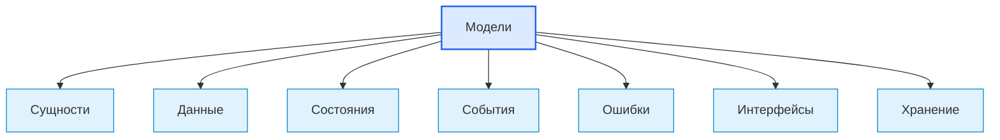

# Models / Модели

## 1. Назначение документа

`Models.md` раскрывает понятие модели при проектировании цифровых систем.

Документ используется как энциклопедическая статья для описания формальных представлений сущностей, данных, состояний, событий, правил, ошибок, интерфейсов, конфигураций и хранения.

> [!info] Главное
> Модель фиксирует структуру смысла в системе.
> Если модели не определены, данные начинают передаваться как случайные словари, строки, теги или неявные структуры.

## 2. Место документа в системе знаний

Документ относится к энциклопедическому слою проекта Programming Digital Systems.

Модели связывают [[docs/05_encyclopedia/Entities|Entities]], [[docs/05_encyclopedia/Data|Data]], [[docs/05_encyclopedia/States|States]], [[docs/05_encyclopedia/Events|Events]], [[docs/05_encyclopedia/Errors|Errors]], [[docs/05_encyclopedia/Modules|Modules]] и [[docs/05_encyclopedia/Interfaces|Interfaces]].



## 3. DEF-MODEL-001. Определение модели

Модель — это формальное представление объекта, данных, состояния, события, правила, ошибки, конфигурации или связи, которое система может использовать, проверять, передавать, хранить или отображать.

Модель считается определённой корректно, если указаны:

- назначение;
- представляемый смысл;
- поля или атрибуты;
- обязательные значения;
- допустимые значения;
- правила проверки;
- связи с другими моделями;
- источник данных;
- место использования;
- жизненный цикл.

> [!tip] Простая формула
> Если системе нужно одинаково понимать, проверять или передавать структуру данных, нужна модель.

## 4. Основные виды моделей

| Вид модели | Что представляет | Пример |
|---|---|---|
| Доменная модель | Смысловой объект предметной области | `Tool`, `Order`, `Recipe` |
| Модель данных | Структуру входных, внутренних или выходных данных | `InputRow`, `ReportData` |
| Модель состояния | Возможные состояния объекта или процесса | `MachineState`, `OrderStatus` |
| Модель события | Факт действия или изменения | `ToolMeasuredEvent` |
| Модель ошибки | Ошибку, причину и реакцию | `ValidationError` |
| Модель хранения | Представление для сохранения | DB row, JSON record |
| Модель интерфейса | Контракт обмена через интерфейс | DTO, API request |
| Модель конфигурации | Настройки и режимы работы | `AppConfig` |

> [!warning] Не путать
> Модель не обязана быть классом. Модель может быть таблицей, схемой, структурой, теговым блоком, JSON-объектом или документированным контрактом.

## 5. Правила анализа моделей

> [!important] Правило
> Модель должна иметь назначение, структуру, правила проверки и место использования.

### RULE-MODEL-001. Модель должна представлять один смысл

Одна модель не должна одновременно быть входной строкой, доменной сущностью, записью хранения и отображением интерфейса, если у этих представлений разные правила.

### RULE-MODEL-002. Модель должна иметь проверяемые поля

Для важных полей необходимо указать тип, обязательность, допустимые значения и правило проверки.

### RULE-MODEL-003. Модель должна быть связана с источником

Должно быть понятно, откуда модель появляется: от пользователя, файла, API, датчика, вычисления или хранения.

### RULE-MODEL-004. Модель должна иметь владельца

Нужно определить, какой модуль или слой создаёт, изменяет и использует модель.

### RULE-MODEL-005. Модели разных слоёв можно разделять

Если доменная модель, DTO и модель хранения имеют разные ограничения, они должны быть разделены.

## 6. Минимальная карточка модели

```md
### Model: <Название модели>

- Вид модели:
- Назначение:
- Источник:
- Владелец:
- Поля:
- Обязательные поля:
- Правила проверки:
- Связанные модели:
- Где используется:
- Как хранится:
- Ошибки модели:
- Открытые вопросы:
```

## 7. Примеры применения

> [!note] Практический приём
> Модели удобно выделять после сущностей и данных: сначала определяется смысл, затем структура, затем правила проверки.

### 7.1. Скрипт автоматизации

- `InputFile` — модель входного файла.
- `PartRow` — модель строки таблицы.
- `MaterialMatch` — модель результата сопоставления.
- `ProcessingError` — модель ошибки обработки.

### 7.2. GUI-приложение

- `ProjectModel` — модель проекта.
- `TemplateModel` — модель шаблона.
- `EditorState` — модель состояния редактора.
- `ExportRequest` — модель запроса экспорта.

### 7.3. Embedded-система

- `SensorMeasurement` — модель измерения.
- `ControllerState` — модель состояния контроллера.
- `ControlCommand` — модель команды.
- `FaultCode` — модель ошибки.

### 7.4. PLC-система

- `ModeState` — модель режима.
- `AlarmRecord` — модель аварии.
- `RecipeData` — модель рецепта.
- `HmiCommand` — модель команды HMI.

### 7.5. CNC/CAM-система

- `ToolModel` — модель инструмента.
- `NcOperation` — модель операции.
- `ToolMeasurement` — модель измерения.
- `MachiningReport` — модель отчёта.

## 8. Контрольные вопросы

1. Какие сущности требуют моделей?
2. Какие данные должны иметь формальную структуру?
3. Какие состояния должны быть описаны как модель?
4. Какие события передаются между модулями?
5. Какие ошибки должны иметь модель?
6. Какие модели нужны для интерфейсов?
7. Какие модели нужны для хранения?
8. Какие поля обязательны?
9. Какие правила проверки есть у модели?
10. Какие модели нужно разделить по слоям?

## 9. Критерии завершения работы с моделями

Работа с моделями считается завершённой, если:

- модели названы понятно;
- у каждой модели есть назначение;
- указаны поля и обязательность;
- указаны правила проверки;
- указаны источники данных;
- указаны владельцы моделей;
- модели связаны с модулями, интерфейсами, хранением и ошибками.

## 10. Следующий шаг

После определения моделей необходимо перейти к [[docs/05_encyclopedia/Interfaces|Interfaces]] и уточнить, какие модели передаются через границы взаимодействия.

## 11. Связанные документы

### Входные документы

- [[docs/05_encyclopedia/Entities|Entities]]
  - Передаёт: смысловые объекты системы.
  - Используется для: построения доменных моделей.
  - Ограничение: не задаёт все представления данных.

- [[docs/05_encyclopedia/Data|Data]]
  - Передаёт: виды данных и правила анализа данных.
  - Используется для: определения полей, источников и форматов моделей.
  - Ограничение: не определяет архитектурного владельца модели.

- [[docs/05_encyclopedia/Modules|Modules]]
  - Передаёт: части системы, которые создают и используют модели.
  - Используется для: определения владельца модели.
  - Ограничение: не задаёт структуру модели.

### Выходные документы

- [[docs/05_encyclopedia/Interfaces|Interfaces]]
  - Получает: модели, которые передаются через интерфейсы.
  - Используется для: описания контрактов взаимодействия.
  - Ограничение: не должен смешивать модель и интерфейс.

- [[docs/05_encyclopedia/Storage|Storage]]
  - Получает: модели, которые нужно сохранять.
  - Используется для: проектирования хранения.
  - Ограничение: не должен подменять доменную модель моделью хранения.

## 12. Интерпретация для Digital System CAD

Этот раздел переводит понятие модели в рабочий элемент будущей метамодели Digital System CAD.

### 12.1. Definition

В метамодели Digital System CAD модель — это структурированное описание конкретной системы или её части, построенное по правилам метамодели.

Модель должна отличаться от метамодели, view, документа и реализации. Для модели нужно фиксировать: `id`, `name`, `metamodel`, `elements`, `relations`, `facts`, `views`, `validation_rules`, `source`, `open_questions`.

### 12.2. Context

Модель является рабочим предметом Digital System CAD. Документы, диаграммы, таблицы, формы, SDD и Codex-контекст должны строиться из модели как views или transformations.

### 12.3. Not examples

Моделью не следует считать:

- произвольный текст без структуры;
- диаграмму без модельных элементов;
- класс в коде без связи с метамоделью;
- таблицу без идентификаторов и связей;
- SDD-документ как единственный источник истины.

### 12.4. Related relations

Типовые связи:

- `Model conforms_to Metamodel`;
- `Model contains ModelElement`;
- `Model contains Relation`;
- `Model produces View`;
- `ValidationRule checks Model`;
- `Transformation reads Model`;
- `DocumentSection generated_from Model`.

### 12.5. Validation questions

Модель достаточно описана, если известны её метамодель, элементы, связи, структурированные факты, источники, правила проверки, views и открытые вопросы.

### 12.6. Open questions

Нужно уточнить минимальный формат модели Digital System CAD: JSON/YAML/Markdown-table/DSL, правила ID, контроль типов связей и форму модельного репозитория.

## 13. История изменений

- Initial version: создана энциклопедическая статья о моделях цифровой системы.
- Updated: добавлена интерпретация для Digital System CAD: модель отделена от метамодели, view, документа и реализации и описана как источник структурированных элементов и связей.
