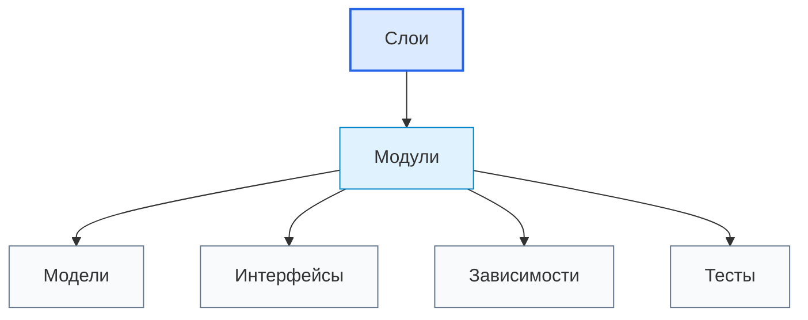

# Modules / Модули

## 1. Назначение документа

`Modules.md` раскрывает понятие модуля при проектировании цифровых систем.

Документ используется как энциклопедическая статья для проектирования архитектуры системы и архитектуры реализации.

Модуль помогает разделить систему на управляемые части с понятным назначением, входом, выходом, зависимостями и критериями проверки.

> [!info] Главное
> Модуль — это часть системы с определённой ответственностью.
> Если модули не определены, система превращается в набор функций, классов или блоков без понятных границ.

## 2. Место документа в системе знаний

Документ относится к энциклопедическому слою проекта Programming Digital Systems.

Модули используются после [[docs/05_encyclopedia/Layers|Layers]], потому что модуль обычно находится внутри слоя или обслуживает границу между слоями.



## 3. DEF-MOD-001. Определение модуля

Модуль — это отдельная часть системы, которая выполняет ограниченную ответственность и взаимодействует с другими частями через явный вход, выход и интерфейс.

Модуль считается определённым корректно, если указаны:

- назначение;
- слой или архитектурная область;
- входные данные;
- выходные данные;
- выполняемые правила;
- используемые модели;
- предоставляемые интерфейсы;
- зависимости;
- ошибки;
- критерии проверки.

> [!tip] Простая формула
> Если часть системы можно назвать, проверить и заменить без разрушения всей системы, это кандидат в модуль.

## 4. Основные виды модулей

| Вид модуля | Ответственность | Пример |
|---|---|---|
| Входной модуль | Получает данные, команды или сигналы | file reader, API controller |
| Модуль парсинга | Преобразует внешний формат во внутреннее представление | PDF parser, NC parser |
| Модуль проверки | Проверяет данные и правила | validator, rule checker |
| Модуль обработки | Выполняет расчёты или преобразования | calculator, processor |
| Модуль хранения | Читает и записывает данные | repository, storage gateway |
| Модуль отчётов | Формирует выходной результат | report writer, exporter |
| Модуль интерфейса | Предоставляет контракт взаимодействия | UI view, service API |
| Модуль ошибок | Обрабатывает ошибки и диагностику | fault handler, logger |
| Модуль конфигурации | Загружает и проверяет настройки | config loader |

> [!warning] Не путать
> Модуль не равен одному файлу. Один файл может содержать несколько мелких частей, а один модуль может быть реализован несколькими файлами.

## 5. Правила анализа модулей

> [!important] Правило
> Модуль должен иметь одну основную ответственность, явный вход, явный выход и минимально необходимые зависимости.

### RULE-MOD-001. Модуль должен иметь назначение

Если назначение модуля нельзя сформулировать одной проверяемой фразой, границы модуля не определены.

### RULE-MOD-002. Модуль не должен знать лишнее

Модуль должен получать только те данные и зависимости, которые нужны для его ответственности.

### RULE-MOD-003. Модуль должен быть проверяемым

Должно быть понятно, как проверить результат работы модуля отдельно от всей системы.

### RULE-MOD-004. Модуль не должен смешивать уровни

Один модуль не должен одновременно читать файл, применять бизнес-правила, показывать GUI и сохранять результат, если эти ответственности можно разделить.

### RULE-MOD-005. Модуль должен взаимодействовать через интерфейс

Зависимости модуля должны быть видимыми через параметры, контракты, порты, события или явно описанные связи.

## 6. Минимальная карточка модуля

```md
### Module: <Название модуля>

- Слой:
- Назначение:
- Вход:
- Выход:
- Основные действия:
- Используемые модели:
- Предоставляемые интерфейсы:
- Зависимости:
- Возможные ошибки:
- Критерии проверки:
- Открытые вопросы:
```

## 7. Примеры применения

> [!note] Практический приём
> Начинайте с списка действий системы, затем группируйте действия в модули по ответственности.

### 7.1. Скрипт автоматизации

- `ExcelReader` читает строки таблицы.
- `PdfParser` извлекает данные из PDF.
- `MaterialMatcher` сопоставляет материалы.
- `ReportWriter` формирует отчёт.
- `ErrorLogWriter` фиксирует ошибки.

### 7.2. GUI-приложение

- `EditorView` показывает форму редактирования.
- `ProjectService` управляет сценариями проекта.
- `TemplateValidator` проверяет шаблон.
- `ExportService` формирует результат.

### 7.3. Embedded-система

- `SensorReader` читает измерения.
- `ValveController` управляет исполнительным механизмом.
- `StateMachine` управляет состояниями.
- `FaultHandler` обрабатывает аварии.

### 7.4. PLC-система

- `ModeManager` управляет режимами.
- `InterlockLogic` проверяет межблокировки.
- `AlarmLogic` формирует аварии.
- `HmiMapping` связывает HMI и теги.

### 7.5. CNC/CAM-система

- `NcParser` читает NC-программу.
- `ToolUsageAnalyzer` анализирует инструмент.
- `OperationModelBuilder` строит операции.
- `ReportExporter` формирует отчёт.

## 8. Контрольные вопросы

1. Какие действия должна выполнять система?
2. Какие действия можно объединить в один модуль?
3. Какая ответственность у каждого модуля?
4. Какой вход у модуля?
5. Какой выход у модуля?
6. Какие модели использует модуль?
7. Какие интерфейсы предоставляет модуль?
8. От каких модулей он зависит?
9. Какие ошибки может создать модуль?
10. Как проверить модуль отдельно?

## 9. Критерии завершения работы с модулями

Работа с модулями считается завершённой, если:

- модули названы понятно;
- каждый модуль привязан к слою или архитектурной области;
- у каждого модуля есть назначение;
- у каждого модуля определены вход и выход;
- зависимости модулей указаны явно;
- ошибки модулей определены;
- модули можно проверить отдельно.

## 10. Следующий шаг

После определения модулей необходимо перейти к [[docs/05_encyclopedia/Models|Models]] и определить формальные представления данных, сущностей, состояний, событий и ошибок, которые используют модули.

## 11. Связанные документы

### Входные документы

- [[docs/05_encyclopedia/Layers|Layers]]
  - Передаёт: архитектурные области ответственности.
  - Используется для: распределения модулей по слоям.
  - Ограничение: не описывает внутреннюю ответственность каждого модуля.

- [[docs/05_encyclopedia/Entities|Entities]]
  - Передаёт: значимые объекты системы.
  - Используется для: выделения доменных модулей.
  - Ограничение: не определяет модульные границы.

### Выходные документы

- [[docs/05_encyclopedia/Models|Models]]
  - Получает: потребность модулей в формальных представлениях.
  - Используется для: определения моделей, которыми обмениваются модули.
  - Ограничение: не должен превращать каждую модель в отдельный модуль.

- [[docs/05_encyclopedia/Dependencies|Dependencies]]
  - Получает: связи между модулями.
  - Используется для: проверки допустимости зависимостей.
  - Ограничение: не должен менять ответственность модулей без причины.

## 12. Интерпретация для Digital System CAD

Этот раздел переводит понятие модуля в рабочий элемент будущей метамодели Digital System CAD.

### 12.1. Definition

В метамодели Digital System CAD модуль — это типизированный элемент архитектурной модели, который описывает ограниченную ответственность будущей системы, её входы, выходы, интерфейсы, зависимости, правила, ошибки и проверяемый результат.

Модуль не должен появляться раньше смысловой модели. Он выводится из сущностей, правил, потоков, интерфейсов, хранения и требований.

### 12.2. Context

Модуль относится к переходу от модели цифровой системы к архитектуре реализации. Поэтому в текущем исследовательском этапе модуль должен фиксироваться осторожно: как кандидат архитектурной ответственности, а не как готовый файл, класс или пакет.

### 12.3. Not examples

Модулем не следует считать:

- любой файл кода;
- случайную группу функций;
- технологическую библиотеку;
- диаграммный блок без ответственности;
- сущность предметной области;
- слой архитектуры целиком;
- генератор без описанного входа и выхода.

Если граница ответственности неясна, нужно зафиксировать открытый вопрос.

### 12.4. Related model elements

Модуль должен быть связан с:

- `Layer` — архитектурная область;
- `Interface` — предоставляемые и используемые контракты;
- `Flow` — выполняемые сценарии;
- `Rule` — реализуемые проверки или ограничения;
- `Entity` — модели, с которыми работает модуль;
- `DataField` — входы и выходы;
- `Error` — ошибки, которые модуль обнаруживает или обрабатывает;
- `Requirement` — требование, которое модуль поддерживает;
- `TestCase` — проверка поведения модуля;
- `CodeArtifact` — будущая реализация.

### 12.5. Related relations

Типовые связи:

- `Module belongs_to Layer`;
- `Module provides Interface`;
- `Module uses Interface`;
- `Module executes Flow`;
- `Module implements Rule`;
- `Module reads DataField`;
- `Module writes DataField`;
- `Module handles Error`;
- `Requirement allocated_to Module`;
- `CodeArtifact implements Module`.

### 12.6. Structured facts

Примеры структурированных фактов:

```yaml
- id: FACT-MOD-001
  subject: MODULE-001
  relation: provides
  object: INTERFACE-001
  source: "Modules.md"

- id: FACT-MOD-002
  subject: MODULE-001
  relation: executes
  object: FLOW-001
  source: "Flows.md"
```

### 12.7. Validation questions

Модуль считается достаточно описанным для текущего этапа, если можно ответить:

1. Есть ли у модуля `id`?
2. Понятна ли основная ответственность?
3. Указан ли слой или архитектурная область?
4. Указаны ли входы и выходы?
5. Указаны ли предоставляемые интерфейсы?
6. Указаны ли используемые интерфейсы или зависимости?
7. Понятно ли, какие правила он реализует?
8. Понятно ли, какие ошибки он обрабатывает?
9. Есть ли критерии проверки?
10. Не является ли модуль преждевременной реализацией?

### 12.8. Open questions

Для будущей метамодели нужно уточнить:

- как различать `Module`, `Component`, `Service`, `Adapter`, `Layer` и `CodeArtifact`;
- когда кандидат в модуль становится архитектурным решением;
- как связывать модуль с несколькими viewpoints;
- как описывать генераторы и валидаторы как модули Digital System CAD;
- какие модули должны быть производными от модели, а какие задаются вручную.

## 13. История изменений

- Initial version: создана энциклопедическая статья о модулях цифровой системы.
- Updated: добавлена интерпретация для Digital System CAD: модуль описан как осторожный архитектурный элемент, выводимый из модели, а не как преждевременный файл или класс реализации.
