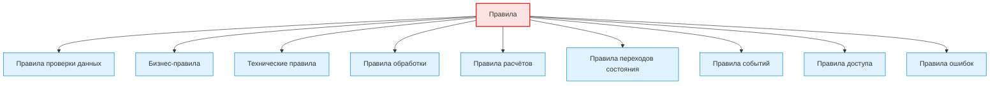
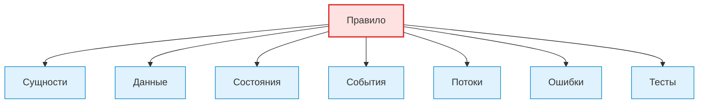
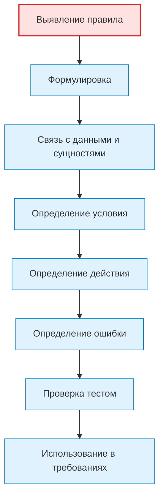

# Rules / Правила

## 1. Назначение документа

`Rules.md` раскрывает понятие правил при проектировании цифровых систем.

Документ используется как энциклопедическая статья и как опорный материал для roadmap-документов, анкет, технических требований и примеров.

Документ не является roadmap-документом. Документ объясняет, какие виды правил существуют в цифровых системах, как их выделять и как связывать с данными, состояниями, событиями, потоками, хранением и ошибками.

> [!info] Главное
> Правила — базовый элемент проектирования цифровой системы.
> Если правила не определены явно, система начинает принимать решения по скрытым условиям, догадкам и случайным проверкам в коде.

## 2. Место документа в системе знаний

Документ относится к энциклопедическому слою проекта Programming Digital Systems.

Документ используется после [[docs/05_encyclopedia/Entities|Entities]] и [[docs/05_encyclopedia/Data|Data]].

Правила определяются после сущностей и данных, потому что правила описывают, как система должна проверять, изменять, обрабатывать, разрешать или запрещать действия над сущностями и данными.

## 3. DEF-RULE-001. Определение правила

Правило — это зафиксированное условие, ограничение, зависимость, алгоритмическое условие или критерий, по которому цифровая система принимает решение, выполняет действие, запрещает действие, проверяет данные или изменяет состояние.

Правило считается определённым корректно, если для него указаны:

- назначение;
- область применения;
- входные данные;
- условие применения;
- результат применения;
- действие при нарушении;
- связанные сущности;
- связанные данные;
- связанные состояния или события;
- способ проверки выполнения.

> [!tip] Простая формула
> Если нужно определить, что разрешено, запрещено, проверяется, рассчитывается или изменяется — нужно выделить правило.

## 4. Зачем определять правила

Правила нужно определять для того, чтобы проектировщик мог:

- описать поведение системы;
- отделить допустимые действия от недопустимых;
- определить условия обработки данных;
- определить условия переходов состояния;
- определить бизнес-ограничения;
- определить технические ограничения;
- определить ошибки и исключительные ситуации;
- подготовить тестовые сценарии.

Если правила не определены, система может работать непредсказуемо.

> [!warning] Не путать
> Правило — это не инструмент и не строка кода. Правило должно описывать условие, результат и действие при нарушении.

## 5. Основные виды правил

### 5.1. Правила проверки данных

Правила проверки данных определяют, какие данные считаются корректными.

Примеры:

- Скрипт автоматизации
  - Excel-файл должен содержать обязательные колонки.
  - Количество должно быть числом больше нуля.
- GUI-приложение
  - Поле имени проекта не должно быть пустым.
  - Пользователь не должен сохранять шаблон с незаполненными обязательными полями.
- Embedded-система
  - Значение датчика должно находиться в допустимом диапазоне.
- PLC-система
  - Команда запуска не должна приниматься при активной аварии.
- CNC/CAM-система
  - Номер инструмента должен существовать в таблице инструмента.

### 5.2. Бизнес-правила

Бизнес-правила определяют смысловые ограничения предметной области.

Примеры:

- Заказ не считается завершённым, если не изготовлено требуемое количество деталей.
- Материал не должен списываться повторно.
- Инструмент не должен использоваться после превышения допустимого износа.

### 5.3. Технические правила

Технические правила определяют ограничения работы системы как цифрового решения.

Примеры:

- Система должна записывать лог после каждого запуска.
- Система должна сохранять результат обработки в структурированном виде.
- Система должна отклонять файл неподдерживаемого формата.

### 5.4. Правила обработки

Правила обработки определяют, как система преобразует входные данные во внутренние или выходные данные.

Примеры:

- Строки с пустым идентификатором должны пропускаться.
- Повторяющиеся записи должны объединяться по ключу.
- Значение должно округляться по заданному правилу.

### 5.5. Правила расчётов

Правила расчётов определяют формулы, алгоритмы и условия вычисления.

Примеры:

- Общее количество материала считается как количество деталей, умноженное на расход на одну деталь.
- Время обработки суммируется по операциям.
- Итоговое значение должно округляться до заданной точности.

### 5.6. Правила переходов состояния

Правила переходов состояния определяют, при каких условиях система, сущность или процесс переходит из одного состояния в другое.

Примеры:

- Заказ переходит в состояние `готов`, если изготовлено всё требуемое количество.
- Контроллер переходит в состояние `ошибка`, если сигнал датчика отсутствует дольше допустимого времени.
- Интерфейс переходит в состояние `заблокирован`, если выполняется длительная операция.

### 5.7. Правила событий

Правила событий определяют, какие события должны быть созданы, обработаны или проигнорированы.

Примеры:

- При успешном импорте файла должно быть создано событие `ImportCompleted`.
- При ошибке проверки данных должно быть создано событие `ValidationFailed`.
- Повторяющееся событие не должно запускать обработку повторно, если предыдущая обработка не завершена.

### 5.8. Правила доступа

Правила доступа определяют, кто или что имеет право выполнять действие.

Примеры:

- Только оператор может подтвердить аварийное сообщение.
- Только администратор может изменять справочные данные.
- Внешняя система не должна изменять внутренние настройки без авторизации.

### 5.9. Правила ошибок

Правила ошибок определяют, какие ситуации считаются ошибками и как система должна реагировать.

Примеры:

- Если входной файл отсутствует, обработка должна быть остановлена.
- Если одна строка содержит ошибку, система может пропустить строку и продолжить обработку.
- Если потерян сигнал безопасности, PLC-система должна перейти в аварийное состояние.

## 6. DG-RULE-001. Общая классификация правил

Назначение: показать основные виды правил в цифровой системе.



## 7. Связь правил с другими понятиями



Пояснение: правило не должно существовать отдельно от системы. Правило должно быть связано с тем, что оно проверяет, изменяет, разрешает или запрещает.

## 8. Правила выделения правил

> [!important] Правило
> Правила должны быть связаны с сущностями, данными, состояниями, событиями, потоками или ошибками.


### RULE-RULE-001. Правило должно быть проверяемым

Правило должно быть сформулировано так, чтобы можно было определить, выполнено оно или нарушено.

Неправильно:

> Система должна работать правильно.

Правильно:

> Система должна отклонять входной файл, если в нём отсутствует обязательная колонка `Detail`.

### RULE-RULE-002. Правило должно иметь условие применения

Необходимо определить, когда правило действует.

### RULE-RULE-003. Правило должно иметь результат применения

Необходимо определить, что происходит, если условие правила выполнено.

### RULE-RULE-004. Правило должно иметь действие при нарушении

Необходимо определить, что делает система, если правило нарушено.

### RULE-RULE-005. Правило не должно смешиваться с инструментом реализации

Неправильно:

> Проверять данные через pandas.

Правильно:

> Система должна проверять наличие обязательных колонок перед обработкой таблицы.

## 9. Жизненный цикл правила



## 10. Примеры применения

> [!note] Практический приём
> Практический анализ правил начинается с поиска условий: когда система должна действовать, когда должна отказать и что считается нарушением.


### 10.1. Скрипт автоматизации

Контекст: скрипт обрабатывает таблицы и формирует отчёт.

Правила:

- Входной файл должен существовать.
- Таблица должна содержать обязательные колонки.
- Строки без идентификатора детали должны быть пропущены.
- Ошибки обработки должны быть записаны в лог.

### 10.2. GUI-приложение

Контекст: пользователь редактирует шаблон.

Правила:

- Пользователь не должен сохранять пустой шаблон.
- Изменение шаблона должно помечать документ как изменённый.
- Экспорт запрещён, если обязательные поля не заполнены.

### 10.3. Embedded-система

Контекст: контроллер управляет клапаном.

Правила:

- Клапан не должен открываться при аварийном состоянии.
- Если датчик не отвечает, система должна перейти в безопасное состояние.
- Измерение должно фильтроваться перед использованием в логике управления.

### 10.4. PLC-система

Контекст: PLC управляет насосом.

Правила:

- Насос не должен запускаться при низком уровне жидкости.
- Авария должна блокировать автоматический режим.
- Ручной режим не должен обходить safety-блокировки.

### 10.5. CNC/CAM-система

Контекст: система анализирует NC-программы.

Правила:

- Инструмент должен быть найден до расчёта времени использования.
- Операции должны группироваться по детали и инструменту.
- Ошибки парсинга должны фиксироваться без потери исходного файла.

## 11. Контрольные вопросы

Перед переходом к состояниям необходимо ответить:

1. Какие правила проверки данных существуют?
2. Какие бизнес-правила действуют в предметной области?
3. Какие технические правила должна соблюдать система?
4. Какие правила обработки нужны?
5. Какие правила расчётов нужны?
6. Какие правила переходов состояния нужны?
7. Какие правила событий нужны?
8. Какие правила доступа нужны?
9. Какие правила ошибок нужны?
10. Для каждого правила указано условие применения?
11. Для каждого правила указан результат применения?
12. Для каждого критичного правила указано действие при нарушении?

## 12. Критерии завершения работы с правилами

Работа с правилами считается завершённой, если:

- правила разделены по видам;
- каждое важное правило связано с сущностями или данными;
- каждое важное правило имеет условие применения;
- каждое важное правило имеет результат применения;
- для критичных правил определено действие при нарушении;
- правила можно проверить тестом, логом, сценарием или ручной проверкой;
- открытые вопросы вынесены отдельно;
- правила могут быть использованы в roadmap-документах и технических требованиях.

## 13. Следующий шаг

После работы с правилами необходимо перейти к [[docs/05_encyclopedia/States|States]] и определить состояния, переходы и ограничения поведения системы.

## 14. Связанные документы

### Входные документы

- [[docs/05_encyclopedia/Entities|Entities]]
  - Передаёт: сущности, к которым применяются правила.
  - Используется для: связывания правил с объектами системы.
  - Ограничение: не определяет сами правила.

- [[docs/05_encyclopedia/Data|Data]]
  - Передаёт: данные, которые правила проверяют, изменяют или используют.
  - Используется для: определения правил проверки и обработки данных.
  - Ограничение: не описывает бизнес-логику.

### Выходные документы

- [[docs/05_encyclopedia/States|States]]
  - Получает: правила переходов и ограничения поведения.
  - Используется для: определения допустимых состояний и переходов.
  - Ограничение: не должен заново классифицировать правила.

- [[docs/03_roadmaps/01_Roadmap_System_Design|Roadmap: System Design]]
  - Получает: правила выделения и классификации правил.
  - Используется для: проектирования поведения системы.
  - Ограничение: не должен смешивать правила с инструментами реализации.

- [[docs/03_roadmaps/03_Roadmap_Technical_Requirements|Roadmap: Technical Requirements]]
  - Получает: проверяемые правила.
  - Используется для: формирования требований к проверке, обработке, ошибкам и тестируемости.
  - Ограничение: не должен изменять смысл правил без фиксации изменения.

## 15. Интерпретация для Digital System CAD

Этот раздел переводит понятие правила в рабочий элемент будущей метамодели Digital System CAD.

### 15.1. Definition

В метамодели Digital System CAD правило — это типизированный элемент модели, который фиксирует условие, ограничение, расчёт, переход, разрешение, запрет или реакцию системы.

Для важного правила нужно фиксировать:

- `id`;
- `name`;
- `kind`;
- `definition`;
- `purpose`;
- `scope`;
- `condition`;
- `input_elements`;
- `affected_elements`;
- `expected_result`;
- `violation_behavior`;
- `related_errors`;
- `verification_method`;
- `open_questions`.

### 15.2. Context

Правило должно быть связано с тем, что оно проверяет, ограничивает, рассчитывает, разрешает, запрещает или изменяет.

В Digital System CAD правило является не строкой кода и не текстовым пожеланием, а проверяемым фактом модели. На его основе должны формироваться требования, тесты, ошибки, SDD-разделы и будущие генераторы.

### 15.3. Not examples

Правилом не следует считать:

- неопределённое пожелание;
- фразу без проверяемого условия;
- конкретную библиотеку реализации;
- случайную проверку в коде без связи с моделью;
- сообщение об ошибке без условия возникновения;
- диаграммную стрелку без описанного условия.

Если правило нельзя проверить, его нужно переформулировать или вынести в открытый вопрос.

### 15.4. Related model elements

Правило должно быть связано с:

- `Entity` — объект, на который правило действует;
- `DataField` — данные, которые правило проверяет или рассчитывает;
- `State` — состояние, в котором правило действует;
- `Event` — событие, которое запускает правило;
- `Flow` — поток, в котором правило применяется;
- `Error` — нарушение правила;
- `Interface` — место, где правило видно пользователю или внешней системе;
- `Requirement` — требование, выражающее правило;
- `TestCase` — проверка правила.

### 15.5. Related relations

Типовые связи:

- `Rule constrains Entity`;
- `Rule validates DataField`;
- `Rule calculates DataField`;
- `Rule guards StateTransition`;
- `Rule handles Event`;
- `Rule applies_in Flow`;
- `Rule raises Error`;
- `Requirement defines Rule`;
- `TestCase verifies Rule`;
- `Module implements Rule`.

### 15.6. Structured facts

Примеры структурированных фактов:

```yaml
- id: FACT-RULE-001
  subject: RULE-001
  relation: validates
  object: DATA-001
  source: "Rules.md"

- id: FACT-RULE-002
  subject: RULE-001
  relation: raises
  object: ERR-001
  source: "Errors.md"
```

### 15.7. Validation questions

Правило считается достаточно описанным для текущего этапа, если можно ответить:

1. Есть ли у правила `id`?
2. Понятно ли, что именно правило проверяет или ограничивает?
3. Указана ли область действия?
4. Указано ли условие применения?
5. Указаны ли входные элементы?
6. Указан ли ожидаемый результат?
7. Определено ли поведение при нарушении?
8. Связано ли правило с ошибкой или реакцией?
9. Есть ли способ проверки правила?
10. Зафиксированы ли открытые вопросы?

### 15.8. Open questions

Для будущей метамодели нужно уточнить:

- как различать бизнес-правила, технические правила, правила данных и правила переходов;
- какие правила должны быть выражены декларативно;
- как описывать приоритеты и конфликты правил;
- как связывать правило с несколькими состояниями и потоками;
- когда правило становится требованием, тестом или кодовой проверкой.

## 16. История изменений

- Updated: документ приведён к правилам энциклопедического слоя, рабочим Obsidian wikilinks и явному следующему шагу.
- Updated: оформление приведено к визуальному стилю `Entities.md`: добавлены callout-блоки и цветовые стили Mermaid-диаграмм.
- Updated: документ приведён к единому визуальному формату проекта.
- Updated: добавлена интерпретация для Digital System CAD: правило описано как проверяемый элемент модели с условием, результатом, нарушением, связями и проверками полноты.
