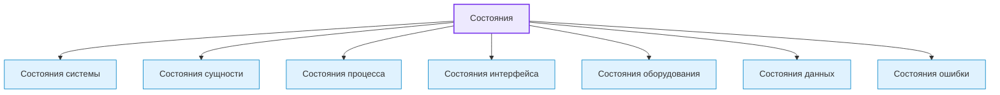
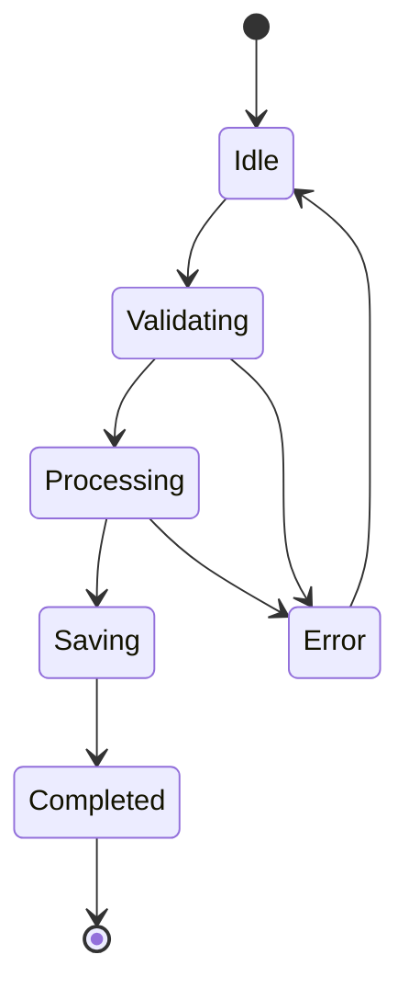
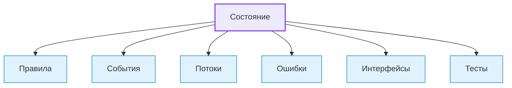

# States / Состояния

## 1. Назначение документа

`States.md` раскрывает понятие состояния при проектировании цифровых систем.

Документ используется как энциклопедическая статья и как опорный материал для roadmap-документов, анкет, технических требований, диаграмм и примеров.

Документ не является roadmap-документом. Документ объясняет, какие виды состояний существуют, как их выделять и как связывать с правилами, событиями, потоками, ошибками и интерфейсами.

> [!info] Главное
> Состояния — базовый элемент проектирования цифровой системы.
> Если состояния не определены, система может выполнять действия в неподходящий момент и смешивать нормальные, переходные и ошибочные режимы.

## 2. Место документа в системе знаний

Документ относится к энциклопедическому слою проекта Programming Digital Systems.

Документ используется после [[docs/05_encyclopedia/Rules|Rules]].

Состояния определяются после правил, потому что правила часто определяют, при каких условиях система переходит из одного состояния в другое.

## 3. DEF-STATE-001. Определение состояния

Состояние — это зафиксированное положение системы, сущности, процесса, интерфейса, оборудования или данных в определённый момент времени, которое влияет на допустимые действия, правила обработки, реакции на события и возможные переходы.

Состояние считается определённым корректно, если для него указаны:

- название;
- владелец состояния;
- смысл состояния;
- условия входа;
- допустимые действия;
- запрещённые действия;
- условия выхода;
- связанные события;
- связанные ошибки;
- следующий допустимый переход.

> [!tip] Простая формула
> Если объект или система может быть в разных положениях, режимах или фазах — нужно описать состояние.

## 4. Зачем определять состояния

Состояния нужно определять для того, чтобы проектировщик мог:

- понять, в каких режимах работает система;
- определить допустимые и запрещённые действия;
- описать жизненный цикл сущностей;
- описать реакцию на события;
- описать ошибки и аварийные режимы;
- подготовить state diagram;
- подготовить тестовые сценарии;
- предотвратить хаотичную обработку условий.

Если состояния не определены, система может принимать действия в неподходящий момент.

> [!warning] Не путать
> Состояние — это не событие и не действие. Состояние отвечает на вопрос, в каком положении сейчас находится система или объект.

## 5. Основные виды состояний

### 5.1. Состояния системы

Состояния системы описывают общий режим работы цифровой системы.

Примеры:

- `idle` — система ожидает действия.
- `running` — система выполняет обработку.
- `paused` — система приостановлена.
- `error` — система находится в ошибке.
- `completed` — система завершила работу.

### 5.2. Состояния сущности

Состояния сущности описывают жизненный цикл конкретного объекта.

Примеры:

- Заказ
  - `new`.
  - `in_progress`.
  - `completed`.
  - `cancelled`.
- Файл
  - `selected`.
  - `validated`.
  - `processed`.
  - `failed`.
- Инструмент
  - `available`.
  - `in_use`.
  - `worn`.
  - `blocked`.

### 5.3. Состояния процесса

Состояния процесса описывают этап выполнения сценария или обработки.

Примеры:

- `waiting_input`.
- `validating`.
- `processing`.
- `saving_result`.
- `finished`.
- `failed`.

### 5.4. Состояния интерфейса

Состояния интерфейса описывают доступность элементов взаимодействия.

Примеры:

- `enabled`.
- `disabled`.
- `loading`.
- `editing`.
- `dirty`.
- `readonly`.

### 5.5. Состояния оборудования

Состояния оборудования описывают режим физического устройства или промышленного объекта.

Примеры:

- `ready`.
- `running`.
- `stopped`.
- `fault`.
- `maintenance`.
- `emergency_stop`.

### 5.6. Состояния данных

Состояния данных описывают качество, обработанность или готовность данных.

Примеры:

- `raw` — данные получены, но не проверены.
- `validated` — данные проверены.
- `invalid` — данные содержат ошибку.
- `transformed` — данные преобразованы.
- `stored` — данные сохранены.

### 5.7. Состояния ошибки

Состояния ошибки описывают ситуацию, в которой система не может продолжать работу обычным способом.

Примеры:

- `warning` — система может продолжить работу.
- `recoverable_error` — ошибка исправима без остановки всей системы.
- `blocking_error` — дальнейшая работа невозможна.
- `critical_error` — требуется безопасная остановка или вмешательство.

## 6. DG-STATE-001. Общая классификация состояний

Назначение: показать основные виды состояний в цифровой системе.



## 7. DG-STATE-002. Пример жизненного цикла состояния

Назначение: показать типовую логику переходов состояния.



Пояснение: диаграмма показывает пример жизненного цикла процесса обработки. Конкретная система должна иметь собственные состояния и переходы.

## 8. Правила выделения состояний

> [!important] Правило
> Состояния должны иметь условия входа, допустимые действия, условия выхода и связанные события.


### RULE-STATE-001. Состояние должно влиять на поведение

Состояние нужно фиксировать только если оно влияет на допустимые действия, правила, события, интерфейс, обработку или ошибки.

### RULE-STATE-002. Состояние должно иметь владельца

Необходимо определить, чему принадлежит состояние:

- системе;
- сущности;
- процессу;
- интерфейсу;
- оборудованию;
- данным;
- ошибке.

### RULE-STATE-003. Состояние должно иметь условия входа и выхода

Для каждого важного состояния необходимо определить:

- когда система входит в состояние;
- какие события вызывают вход;
- какие действия разрешены;
- какие действия запрещены;
- когда система выходит из состояния.

### RULE-STATE-004. Переходы должны быть явными

Нельзя описывать состояния без допустимых переходов.

### RULE-STATE-005. Аварийные и ошибочные состояния должны быть выделены отдельно

Ошибочные состояния не должны быть скрыты внутри обычного состояния.

## 9. Связь состояний с другими понятиями



Пояснение: состояние определяет, какие правила применяются, какие события допустимы, какие потоки выполняются и какие ошибки возможны.

## 10. Примеры применения

> [!note] Практический приём
> Практический анализ состояний начинается с вопроса: что сейчас разрешено, что запрещено и какое событие может изменить положение?


### 10.1. Скрипт автоматизации

Контекст: скрипт обрабатывает входные файлы.

Состояния:

- `waiting_input` — файл ещё не выбран.
- `validating` — файл проверяется.
- `processing` — данные обрабатываются.
- `writing_log` — система формирует лог.
- `completed` — обработка завершена.
- `failed` — обработка завершилась ошибкой.

### 10.2. GUI-приложение

Контекст: пользователь редактирует шаблон.

Состояния:

- `viewing` — пользователь просматривает шаблон.
- `editing` — пользователь изменяет шаблон.
- `dirty` — есть несохранённые изменения.
- `saving` — система сохраняет изменения.
- `export_ready` — документ готов к экспорту.
- `blocked` — экспорт запрещён из-за ошибки.

### 10.3. Embedded-система

Контекст: контроллер управляет клапаном.

Состояния:

- `boot` — запуск контроллера.
- `idle` — ожидание условия.
- `measuring` — считывание датчика.
- `control_active` — управление клапаном.
- `safe_state` — безопасное состояние.
- `fault` — ошибка устройства.

### 10.4. PLC-система

Контекст: PLC управляет насосом.

Состояния:

- `manual_mode`.
- `auto_mode`.
- `starting`.
- `running`.
- `stopping`.
- `alarm`.
- `emergency_stop`.

### 10.5. CNC/CAM-система

Контекст: система анализирует NC-программы.

Состояния:

- `file_loaded`.
- `tool_searching`.
- `tool_found`.
- `operation_analyzing`.
- `time_calculated`.
- `report_generated`.
- `parse_error`.

## 11. Контрольные вопросы

Перед переходом к событиям необходимо ответить:

1. Какие состояния есть у системы?
2. Какие состояния есть у ключевых сущностей?
3. Какие состояния есть у процессов?
4. Какие состояния есть у интерфейса?
5. Какие состояния есть у данных?
6. Какие ошибочные состояния существуют?
7. Для каждого состояния определён владелец?
8. Для каждого важного состояния определены условия входа?
9. Для каждого важного состояния определены условия выхода?
10. Для каждого важного состояния определены допустимые события?
11. Для каждого важного состояния определены запрещённые действия?

## 12. Критерии завершения работы с состояниями

Работа с состояниями считается завершённой, если:

- состояния разделены по видам;
- для каждого важного состояния указан владелец;
- для каждого важного состояния указаны условия входа;
- для каждого важного состояния указаны условия выхода;
- ошибочные состояния выделены отдельно;
- переходы между состояниями описаны явно;
- состояния связаны с правилами и событиями;
- открытые вопросы вынесены отдельно;
- состояния могут быть использованы в roadmap-документах и технических требованиях.

## 13. Следующий шаг

После работы с состояниями необходимо перейти к [[docs/05_encyclopedia/Events|Events]] и определить события, которые запускают переходы, реакции и изменения системы.

## 14. Связанные документы

### Входные документы

- [[docs/05_encyclopedia/Rules|Rules]]
  - Передаёт: правила переходов, ограничения поведения и условия ошибок.
  - Используется для: определения допустимых состояний и переходов.
  - Ограничение: не описывает жизненный цикл состояний полностью.

- [[docs/05_encyclopedia/Data|Data]]
  - Передаёт: данные, которые могут иметь состояние обработки или качества.
  - Используется для: определения состояний данных.
  - Ограничение: не описывает переходы состояния.

### Выходные документы

- [[docs/05_encyclopedia/Events|Events]]
  - Получает: состояния и переходы между ними.
  - Используется для: определения событий, которые запускают переходы.
  - Ограничение: не должен заново классифицировать состояния.

- [[docs/03_roadmaps/01_Roadmap_System_Design|Roadmap: System Design]]
  - Получает: правила выделения состояний.
  - Используется для: проектирования жизненных циклов системы и сущностей.
  - Ограничение: не должен смешивать состояния с действиями и процессами.

## 15. Интерпретация для Digital System CAD

Этот раздел переводит понятие состояния в рабочий элемент будущей метамодели Digital System CAD.

### 15.1. Definition

В метамодели Digital System CAD состояние — это типизированный элемент модели, который фиксирует допустимое положение системы, сущности, процесса, интерфейса, оборудования или данных и определяет, какие действия, события, правила и переходы возможны.

Для важного состояния нужно фиксировать:

- `id`;
- `name`;
- `owner`;
- `kind`;
- `definition`;
- `entry_condition`;
- `allowed_actions`;
- `forbidden_actions`;
- `exit_condition`;
- `incoming_events`;
- `outgoing_events`;
- `transitions`;
- `related_rules`;
- `related_errors`;
- `open_questions`.

### 15.2. Context

В Digital System CAD состояние нужно описывать как часть модели поведения. Оно не является просто словом статуса в интерфейсе или поле в базе данных.

Состояние должно объяснять, что разрешено, что запрещено, какие события допустимы и какие переходы возможны.

### 15.3. Not examples

Состоянием не следует считать:

- случайный флаг без смысла;
- событие изменения;
- действие пользователя;
- этап процесса без условий входа и выхода;
- цвет интерфейса;
- код статуса без определения;
- ошибку без описанного режима поведения.

Если непонятно, является ли термин состоянием, событием или фазой процесса, нужно зафиксировать открытый вопрос.

### 15.4. Related model elements

Состояние должно быть связано с:

- `Entity` — владелец состояния;
- `Event` — событие входа, выхода или перехода;
- `Rule` — условие допустимости перехода;
- `Flow` — поведенческий маршрут;
- `Error` — ошибочное или аварийное состояние;
- `Interface` — отображение состояния;
- `Requirement` — требование к поведению;
- `TestCase` — проверка допустимых и запрещённых переходов.

### 15.5. Related relations

Типовые связи:

- `Entity has State`;
- `State allows Event`;
- `State forbids Event`;
- `Event triggers StateTransition`;
- `Rule guards StateTransition`;
- `StateTransition leads_to State`;
- `Error puts Entity into State`;
- `Interface displays State`;
- `TestCase verifies StateTransition`.

### 15.6. Structured facts

Примеры структурированных фактов:

```yaml
- id: FACT-STATE-001
  subject: ENT-001
  relation: has_state
  object: STATE-001
  source: "States.md"

- id: FACT-STATE-002
  subject: EVENT-001
  relation: triggers_transition
  object: TRANSITION-001
  source: "Events.md"
```

### 15.7. Validation questions

Состояние считается достаточно описанным для текущего этапа, если можно ответить:

1. Есть ли у состояния `id`?
2. Понятен ли владелец состояния?
3. Дано ли определение состояния?
4. Указаны ли условия входа?
5. Указаны ли допустимые действия?
6. Указаны ли запрещённые действия?
7. Указаны ли условия выхода?
8. Описаны ли события входа, выхода и переходов?
9. Описаны ли ошибки или аварийные переходы?
10. Есть ли способ проверить переходы?

### 15.8. Open questions

Для будущей метамодели нужно уточнить:

- как различать `State`, `Mode`, `Phase`, `Status` и `ErrorState`;
- как описывать вложенные и параллельные состояния;
- какие поля обязательны для состояния сущности, процесса, интерфейса и оборудования;
- как фиксировать запрещённые переходы;
- как связывать состояние с пользовательским интерфейсом и логами.

## 16. История изменений

- Updated: документ приведён к правилам энциклопедического слоя, рабочим Obsidian wikilinks и явному следующему шагу.
- Updated: оформление приведено к визуальному стилю `Entities.md`: добавлены callout-блоки и цветовые стили Mermaid-диаграмм.
- Updated: документ приведён к единому визуальному формату проекта.
- Updated: добавлена интерпретация для Digital System CAD: состояние описано как элемент модели поведения с владельцем, переходами, событиями, правилами и проверками полноты.
