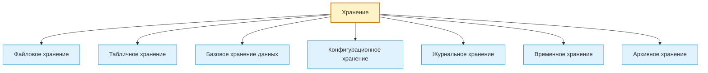
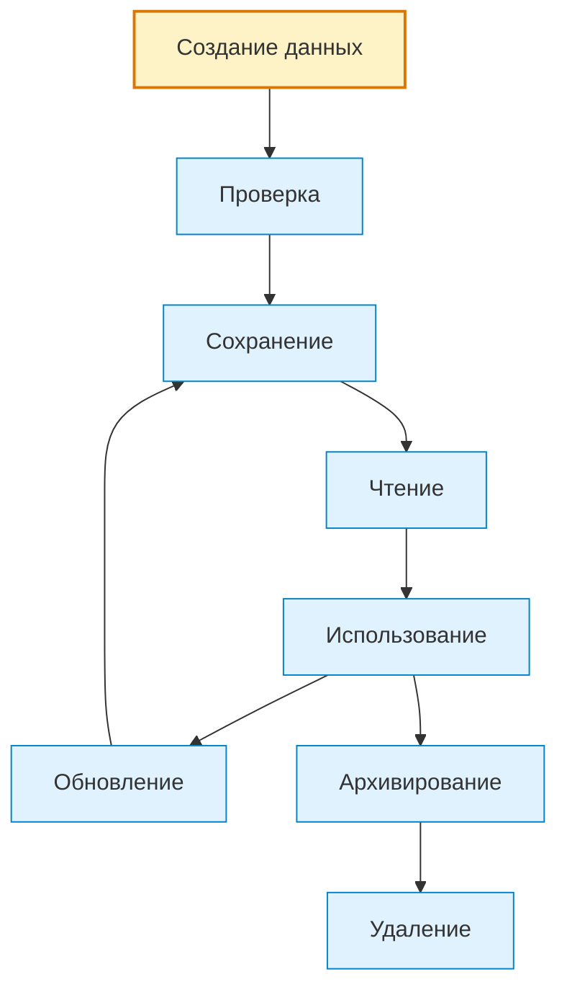

# Storage / Хранение

## 1. Назначение документа

`Storage.md` раскрывает понятие хранения при проектировании цифровых систем.

Документ используется как энциклопедическая статья и как опорный материал для roadmap-документов, анкет, технических требований, архитектуры системы и примеров.

Документ не является roadmap-документом. Документ объясняет, какие виды хранения существуют, какие данные нужно сохранять, как определять жизненный цикл хранимых данных и какие требования должны быть сформированы до выбора конкретного инструмента хранения.

> [!info] Главное
> Хранение — базовый элемент проектирования цифровой системы.
> Если хранение не определено, система может потерять данные, нарушить целостность или сохранить лишнюю временную информацию.

## 2. Место документа в системе знаний

Документ относится к энциклопедическому слою проекта Programming Digital Systems.

Документ используется после [[docs/05_encyclopedia/Flows|Flows]].

Хранение определяется после потоков, потому что сначала необходимо понять, какие данные движутся через систему, какие данные являются временными, а какие должны сохраняться между запусками или передаваться другим системам.

## 3. DEF-STOR-001. Определение хранения

Хранение — это организованный способ сохранения данных, состояния, конфигурации, журналов, результатов, истории изменений или справочной информации так, чтобы система могла использовать эти данные позже.

Хранение считается определённым корректно, если для него указаны:

- что сохраняется;
- зачем сохраняется;
- кто создаёт данные;
- кто использует данные;
- срок жизни данных;
- правило обновления;
- правило удаления или архивирования;
- требования к целостности;
- требования к доступу;
- действие при ошибке хранения.

> [!tip] Простая формула
> Если данные, состояние, результат или след выполнения нужны после текущего действия — нужно описать хранение.

## 4. Зачем определять хранение

Хранение нужно определять для того, чтобы проектировщик мог:

- отделить временные данные от постоянных;
- определить, какие данные нужны после перезапуска системы;
- определить, какие данные нужны для отчётов;
- определить, какие данные нужны для аудита и диагностики;
- определить требования к целостности данных;
- определить требования к резервному копированию;
- определить требования к миграции данных;
- подготовить технические требования к выбору инструмента хранения.

Если хранение не определено, система может терять важные данные или сохранять лишние данные без причины.

> [!warning] Не путать
> Хранение — это не выбор базы данных. Сначала нужно определить, что хранится, зачем, как долго и с какими требованиями к целостности.

## 5. Основные виды хранения

### 5.1. Файловое хранение

Файловое хранение используется для сохранения данных в файлах.

Примеры:

- JSON-файл результата.
- CSV-отчёт.
- TXT-лог.
- XML-конфигурация.
- NC-программа.

### 5.2. Табличное хранение

Табличное хранение используется для данных, которые удобно представлять строками и столбцами.

Примеры:

- Excel-таблица.
- CSV-файл.
- Таблица базы данных.
- Журнал измерений.

### 5.3. Базовое хранение данных

Базовое хранение данных используется для структурированных данных с отношениями, поиском и обновлением.

Примеры:

- База деталей.
- База инструментов.
- Складской учёт.
- История измерений.

### 5.4. Конфигурационное хранение

Конфигурационное хранение используется для параметров, которые управляют поведением системы без изменения кода.

Примеры:

- Пути к папкам.
- Пороги предупреждений.
- Список допустимых материалов.
- Настройки интерфейса.
- Параметры подключения.

### 5.5. Журнальное хранение

Журнальное хранение используется для фиксации событий, ошибок, действий пользователя и технической диагностики.

Примеры:

- Лог обработки.
- Журнал ошибок.
- Журнал действий пользователя.
- Журнал аварий PLC.
- Журнал измерений инструмента.

### 5.6. Временное хранение

Временное хранение используется для данных, которые нужны только во время выполнения процесса.

Примеры:

- Кэш.
- Буфер.
- Временный список.
- Промежуточный результат расчёта.

### 5.7. Архивное хранение

Архивное хранение используется для данных, которые больше не участвуют в текущей работе, но должны быть сохранены для истории, аудита или анализа.

Примеры:

- Старые отчёты.
- История заказов.
- Архив логов.
- Старые версии конфигурации.

## 6. DG-STOR-001. Общая классификация хранения

Назначение: показать основные виды хранения в цифровой системе.



## 7. Правила анализа хранения

> [!important] Правило
> Хранение должно быть связано с жизненным циклом данных, правилами обновления, ошибками и требованиями к восстановлению.


### RULE-STOR-001. Хранение должно иметь назначение

Нельзя сохранять данные без объяснения, зачем они нужны после текущей операции.

### RULE-STOR-002. Хранимые данные должны иметь владельца

Необходимо определить, какой модуль, слой, пользователь или внешняя система создаёт и использует данные.

### RULE-STOR-003. Хранение должно иметь жизненный цикл

Для хранимых данных необходимо определить:

- когда данные создаются;
- когда данные читаются;
- когда данные изменяются;
- когда данные архивируются;
- когда данные удаляются.

### RULE-STOR-004. Хранение должно иметь правило целостности

Необходимо определить, какие данные не должны быть потеряны, дублированы, повреждены или сохранены в противоречивом состоянии.

### RULE-STOR-005. Хранение не должно смешиваться с выбором инструмента

Неправильно:

> Использовать SQLite.

Правильно:

> Система должна сохранять данные между запусками в структурированном виде с возможностью поиска по ключевым полям.

Выбор SQLite, PostgreSQL, JSON, CSV или другого инструмента относится к Roadmap выбора инструментария.

## 8. DG-STOR-002. Жизненный цикл хранимых данных



## 9. Примеры применения

> [!note] Практический приём
> Практический анализ хранения начинается с вопроса: что должно остаться после завершения процесса и кто будет использовать эти данные позже?


### 9.1. Скрипт автоматизации

Хранение:

- JSON-файл результата.
- Лог обработки.
- CSV-отчёт.
- Конфигурационный файл путей.

### 9.2. GUI-приложение

Хранение:

- Пользовательские настройки.
- Шаблоны.
- Последний открытый проект.
- История экспорта.

### 9.3. Embedded-система

Хранение:

- Конфигурация устройства.
- Последнее состояние.
- Диагностический журнал.
- Калибровочные параметры.

### 9.4. PLC-система

Хранение:

- Retain-переменные.
- Журнал аварий.
- Уставки оператора.
- Счётчики циклов.

### 9.5. CNC/CAM-система

Хранение:

- Таблица инструмента.
- История использования инструмента.
- Архив NC-программ.
- Журнал измерений.

## 10. Контрольные вопросы

Перед переходом к ошибкам необходимо ответить:

1. Какие данные должны сохраняться между запусками?
2. Какие данные являются временными?
3. Какие данные являются конфигурационными?
4. Какие данные являются журнальными?
5. Какие данные нужно архивировать?
6. Для каждого вида хранения указано назначение?
7. Для каждого вида хранения указан владелец?
8. Для каждого вида хранения указан жизненный цикл?
9. Какие ошибки хранения возможны?
10. Какие требования к целостности данных существуют?

## 11. Критерии завершения работы с хранением

Работа с хранением считается завершённой, если:

- определены все данные, которые нужно сохранять;
- временные данные отделены от постоянных;
- конфигурационные данные выделены отдельно;
- журнальные данные выделены отдельно;
- определён жизненный цикл хранимых данных;
- определены требования к целостности;
- определены возможные ошибки хранения;
- выбор конкретного инструмента хранения не смешан с требованиями к хранению.

## 12. Следующий шаг

После работы с хранением необходимо перейти к [[docs/05_encyclopedia/Errors|Errors]] и определить ошибки записи, чтения, целостности, доступа и восстановления.

## 13. Связанные документы

### Входные документы

- [[docs/05_encyclopedia/Data|Data]]
  - Передаёт: виды данных и жизненный цикл данных.
  - Используется для: определения хранимых данных.
  - Ограничение: не описывает хранение как отдельную ответственность.

- [[docs/05_encyclopedia/Flows|Flows]]
  - Передаёт: потоки хранения и движение данных.
  - Используется для: определения моментов сохранения, чтения и архивирования.
  - Ограничение: не определяет правила целостности хранения.

### Выходные документы

- [[docs/05_encyclopedia/Errors|Errors]]
  - Получает: возможные ошибки хранения.
  - Используется для: описания реакции на ошибки записи, чтения, целостности и доступа.
  - Ограничение: не должен выбирать инструмент хранения.

- [[docs/03_roadmaps/01_Roadmap_System_Design|Roadmap: System Design]]
  - Получает: правила анализа хранения.
  - Используется для: проектирования хранения системы.
  - Ограничение: не должен смешивать хранение с выбором базы данных или библиотеки.

- [[docs/03_roadmaps/03_Roadmap_Technical_Requirements|Roadmap: Technical Requirements]]
  - Получает: требования к хранимым данным, целостности и жизненному циклу.
  - Используется для: формулирования технических требований к хранению.
  - Ограничение: не должен подменять Roadmap выбора инструментария.

## 14. Интерпретация для Digital System CAD

Этот раздел переводит понятие хранения в рабочий элемент будущей метамодели Digital System CAD.

### 14.1. Definition

В метамодели Digital System CAD хранение — это типизированный элемент модели, который описывает, какие данные, состояния, события, результаты или журналы должны сохраняться, зачем они сохраняются, как долго живут и какие правила целостности должны соблюдаться.

Для важного хранения нужно фиксировать:

- `id`;
- `name`;
- `kind`;
- `definition`;
- `stored_elements`;
- `purpose`;
- `owner`;
- `creator`;
- `consumer`;
- `lifecycle`;
- `integrity_rules`;
- `access_rules`;
- `retention`;
- `related_errors`;
- `open_questions`.

### 14.2. Context

В Digital System CAD хранение не должно подменяться выбором базы данных, файла или библиотеки. Сначала фиксируется смысл: что сохраняется, зачем, кто использует, как проверяется целостность и что делать при ошибке.

Только после этого хранение может быть связано с архитектурным решением или реализацией.

### 14.3. Not examples

Хранением не следует считать:

- название технологии без требований;
- временную переменную;
- кэш без цели и срока жизни;
- файл без описания структуры;
- базу данных без указания хранимых элементов;
- лог без правила записи и использования.

Если неясно, данные временные или долговременные, нужно зафиксировать открытый вопрос.

### 14.4. Related model elements

Хранение должно быть связано с:

- `DataField` — сохраняемые данные;
- `Entity` — сохраняемая сущность или её представление;
- `Event` — журнальные события;
- `State` — сохраняемое состояние;
- `Flow` — чтение, запись, обновление, архивирование;
- `Rule` — правило целостности, доступа или срока хранения;
- `Error` — ошибка хранения;
- `Interface` — контракт доступа;
- `Requirement` — требование к хранению;
- `TestCase` — проверка сохранения, восстановления и ошибок.

### 14.5. Related relations

Типовые связи:

- `Storage stores DataField`;
- `Storage stores Entity`;
- `Storage records Event`;
- `Storage persists State`;
- `Flow reads_from Storage`;
- `Flow writes_to Storage`;
- `Rule constrains Storage`;
- `Error occurs_in Storage`;
- `Interface provides_access_to Storage`;
- `TestCase verifies Storage behavior`.

### 14.6. Structured facts

Примеры структурированных фактов:

```yaml
- id: FACT-STOR-001
  subject: STORAGE-001
  relation: stores
  object: DATA-001
  source: "Storage.md"

- id: FACT-STOR-002
  subject: FLOW-001
  relation: writes_to
  object: STORAGE-001
  source: "Flows.md"
```

### 14.7. Validation questions

Хранение считается достаточно описанным для текущего этапа, если можно ответить:

1. Есть ли у хранения `id`?
2. Понятно ли, что именно сохраняется?
3. Понятно ли, зачем это сохраняется?
4. Указан ли владелец данных?
5. Описан ли жизненный цикл?
6. Указаны ли правила обновления, удаления или архивирования?
7. Описаны ли требования к целостности?
8. Описаны ли правила доступа?
9. Описаны ли ошибки хранения?
10. Понятно ли, какие тесты нужны для проверки хранения?

### 14.8. Open questions

Для будущей метамодели нужно уточнить:

- как различать `Storage`, `Repository`, `Archive`, `Log`, `Cache` и `ConfigurationStore`;
- какие хранимые элементы требуют истории изменений;
- как описывать миграции модели хранения;
- какие правила целостности должны быть универсальными;
- как хранить сам модельный репозиторий Digital System CAD.

## 15. История изменений

- Updated: документ приведён к правилам энциклопедического слоя, рабочим Obsidian wikilinks и явному следующему шагу.
- Updated: оформление приведено к визуальному стилю `Entities.md`: добавлены callout-блоки и цветовые стили Mermaid-диаграмм.
- Updated: документ приведён к единому визуальному формату проекта.
- Updated: добавлена интерпретация для Digital System CAD: хранение описано как элемент модели с сохраняемыми элементами, жизненным циклом, правилами целостности, ошибками и проверками полноты.
