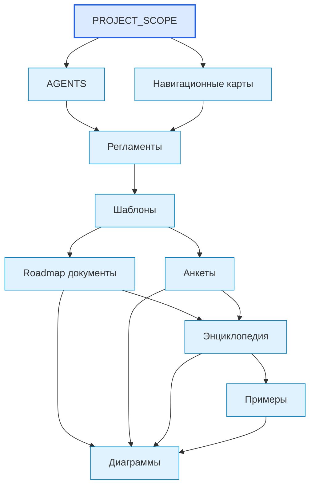
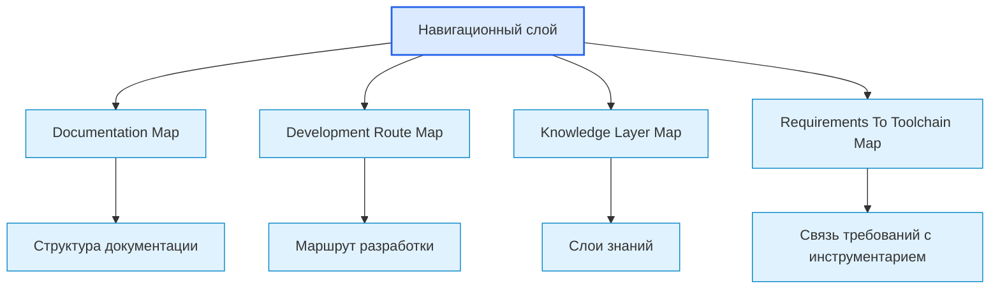
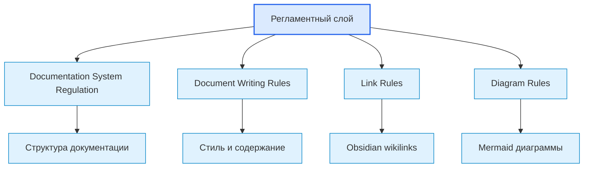
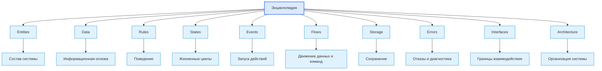
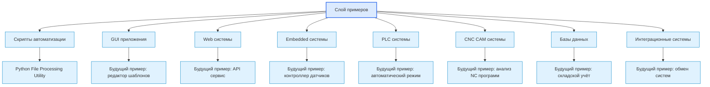
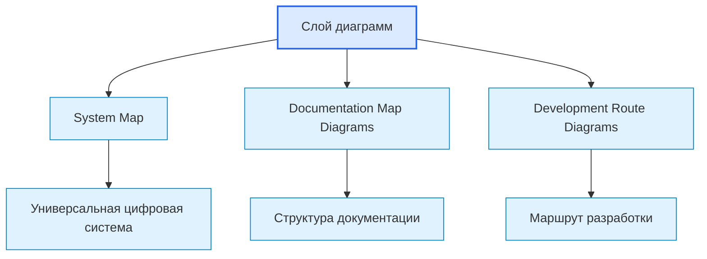

# Documentation Map Diagrams / Диаграммы карты документации

## 1. Назначение документа

`00_00_Documentation_Map_Diagrams.md` хранит крупные диаграммы структуры документации проекта Programming Digital Systems.

Документ показывает, как связаны между собой уровни базы знаний: масштаб проекта, агентные правила, карты, регламенты, шаблоны, roadmap-документы, анкеты, энциклопедия, примеры и диаграммы.

Документ не заменяет [[docs/00_maps/00_Documentation_Map|Documentation Map]]. Он визуализирует её ключевые связи.

> [!info] Главное
> Документ хранит визуальные схемы, которые помогают читать структуру, связи и маршрут.

## 2. Связанные документы

### Входные документы

- [[PROJECT_SCOPE|PROJECT_SCOPE]]
  - Передаёт: масштаб проекта и идею большой связанной базы знаний.
  - Используется для: построения верхнего уровня документации.
  - Ограничение: не описывает все слои подробно.

- [[AGENTS|AGENTS]]
  - Передаёт: правила, которые должен учитывать AI-агент.
  - Используется для: связи агентного слоя с регламентами и картами.
  - Ограничение: не является картой документации.

- [[docs/00_maps/00_Documentation_Map|Documentation Map]]
  - Передаёт: полный список слоёв документации.
  - Используется для: построения диаграмм структуры.
  - Ограничение: текстовая карта не заменяет визуальные схемы.

- [[docs/00_maps/00_Knowledge_Layer_Map|Knowledge Layer Map]]
  - Передаёт: назначение каждого слоя знаний.
  - Используется для: детализации связей между слоями.
  - Ограничение: не показывает все рабочие переходы.

## 3. DG-DOC-001. Верхний уровень документации

Назначение диаграммы: показать основные слои базы знаний от масштаба проекта до диаграмм.

## 4. DG-DOC-002. Навигационный слой

Назначение диаграммы: показать документы, которые помогают пользователю ориентироваться в базе знаний.

Связанные документы:

- [[docs/00_maps/00_Documentation_Map|Documentation Map]]
- [[docs/00_maps/00_Development_Route_Map|Development Route Map]]
- [[docs/00_maps/00_Knowledge_Layer_Map|Knowledge Layer Map]]
- [[docs/00_maps/04_Requirements_To_Toolchain_Map|Requirements To Toolchain Map]]

## 5. DG-DOC-003. Регламентный слой

Назначение диаграммы: показать, какие правила управляют созданием и изменением документов.

Связанные документы:

- [[docs/01_regulations/Documentation_System_Regulation|Documentation System Regulation]]
- [[docs/01_regulations/Document_Writing_Rules|Document Writing Rules]]
- [[docs/01_regulations/Link_Rules|Link Rules]]
- [[docs/01_regulations/Diagram_Rules|Diagram Rules]]

## 6. DG-DOC-004. Roadmap и анкеты

Назначение диаграммы: показать парную связь roadmap-документов и анкет.

```mermaid
flowchart TD
    A[Roadmap System Design] --> B[Questionnaire System Design]
    C[Roadmap System Architecture Design] --> D[Questionnaire System Architecture Design]
    E[Roadmap Technical Requirements] --> F[Questionnaire Technical Requirements]
    G[Roadmap Toolchain Selection] --> H[Questionnaire Toolchain Selection]
    I[Roadmap Implementation Architecture] --> J[Questionnaire Implementation Architecture]
    K[Roadmap Testing] --> L[Questionnaire Testing]
    M[Roadmap Operation] --> N[Questionnaire Operation]
    O[Roadmap Maintenance] --> P[Questionnaire Maintenance]
    Q[Roadmap System Evolution] --> R[Questionnaire System Evolution]

    classDef root fill:#dbeafe,stroke:#2563eb,stroke-width:2px
    classDef type fill:#e0f2fe,stroke:#0284c7,stroke-width:1px
    classDef step fill:#f8fafc,stroke:#64748b,stroke-width:1px
    classDef success fill:#dcfce7,stroke:#16a34a,stroke-width:2px
    classDef warning fill:#fee2e2,stroke:#dc2626,stroke-width:1px

    class A root
    class B,C,D,E,F,G,H,I,J,K,L,M,N,O,P,Q,R type
```

Правило чтения диаграммы: roadmap определяет правила этапа, анкета превращает эти правила в вопросы для конкретного проекта.

## 7. DG-DOC-005. Энциклопедический слой

Назначение диаграммы: показать ключевые понятия цифровой системы как отдельный слой знаний.

Связанные документы:

- [[docs/05_encyclopedia/Entities|Entities]]
- [[docs/05_encyclopedia/Data|Data]]
- [[docs/05_encyclopedia/Rules|Rules]]
- [[docs/05_encyclopedia/States|States]]
- [[docs/05_encyclopedia/Events|Events]]
- [[docs/05_encyclopedia/Flows|Flows]]
- [[docs/05_encyclopedia/Storage|Storage]]
- [[docs/05_encyclopedia/Errors|Errors]]
- [[docs/05_encyclopedia/Interfaces|Interfaces]]
- [[docs/05_encyclopedia/Architecture|Architecture]]

## 8. DG-DOC-006. Слой примеров

Назначение диаграммы: показать категории примеров без смешивания категорий и конкретных примеров.

Связанные документы:

- [[docs/06_examples/Examples_Index|Examples Index]]
- [[docs/06_examples/Scripts/Python_File_Processing_Utility|Python File Processing Utility]]

## 9. DG-DOC-007. Слой диаграмм

Назначение диаграммы: показать, какие документы входят в слой крупных диаграмм.

Связанные документы:

- [[docs/07_diagrams/00_System_Map|System Map]]
- [[docs/07_diagrams/00_Documentation_Map_Diagrams|Documentation Map Diagrams]]
- [[docs/07_diagrams/00_Development_Route_Diagrams|Development Route Diagrams]]

## 10. Правила использования диаграмм из документа

- Диаграммы используются для навигации по документации.
- Диаграммы не должны заменять текстовые определения и правила.
- Если структура документации меняется, этот документ должен обновляться вместе с [[docs/00_maps/00_Documentation_Map|Documentation Map]].
- Диаграммы должны сохранять совместимость с Obsidian Mermaid.
- Категории и примеры должны оставаться на разных уровнях графа.

## 11. Выходные связи

Этот документ должен использоваться в:

- [[docs/00_maps/00_Documentation_Map|Documentation Map]]
- [[docs/00_maps/00_Knowledge_Layer_Map|Knowledge Layer Map]]
- [[docs/07_diagrams/00_System_Map|System Map]]

## 12. Следующий шаг

После просмотра диаграмм необходимо вернуться к связанному roadmap-документу или карте, где эти схемы применяются.

## 13. История изменений

- Initial version: созданы диаграммы структуры документации, слоёв базы знаний, roadmap, анкет, энциклопедии, примеров и диаграмм.
- Updated: документ приведён к единому визуальному формату проекта.
