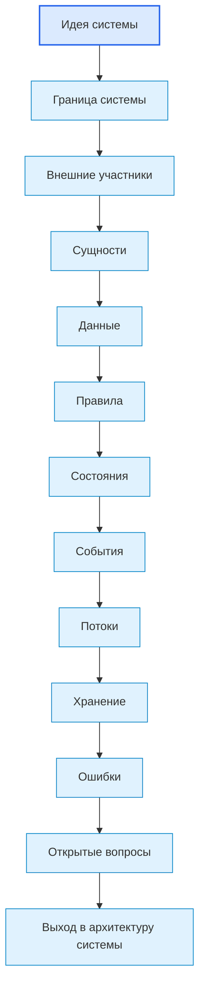
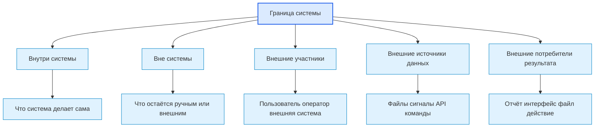
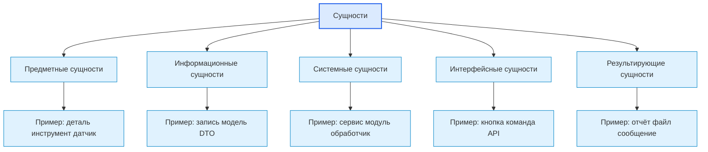
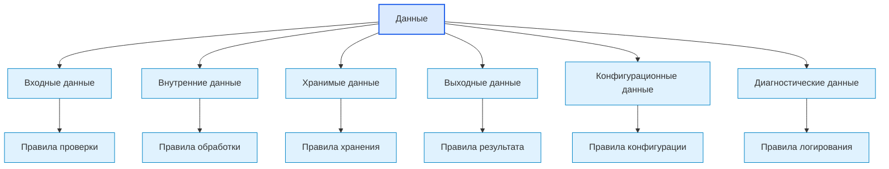
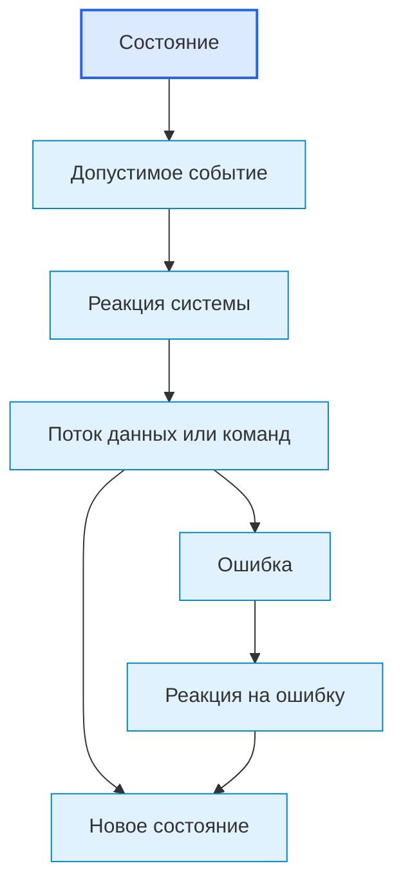
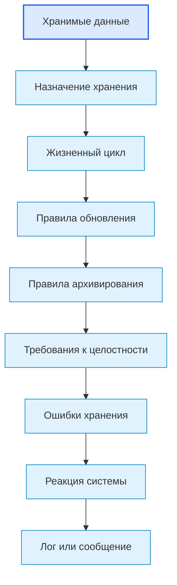
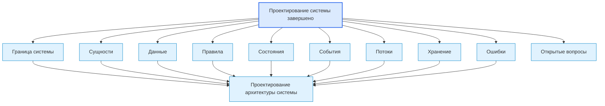

# Roadmap System Design Diagrams / Диаграммы проектирования системы

## 1. Назначение документа

`01_Roadmap_System_Design_Diagrams.md` хранит диаграммы этапа проектирования системы.

Документ визуализирует, как из идеи системы выделяются граница, сущности, данные, правила, состояния, события, потоки, хранение и ошибки.

Документ не заменяет [[docs/03_roadmaps/01_Roadmap_System_Design|Roadmap: System Design]] и [[docs/04_questionnaires/01_Questionnaire_System_Design|Questionnaire: System Design]].

> [!info] Главное
> Документ хранит визуальные схемы, которые помогают читать структуру, связи и маршрут.

## 2. Связанные документы

- [[docs/03_roadmaps/01_Roadmap_System_Design|Roadmap: System Design]]
- [[docs/04_questionnaires/01_Questionnaire_System_Design|Questionnaire: System Design]]
- [[docs/05_encyclopedia/Entities|Entities]]
- [[docs/05_encyclopedia/Data|Data]]
- [[docs/05_encyclopedia/Rules|Rules]]
- [[docs/05_encyclopedia/States|States]]
- [[docs/05_encyclopedia/Events|Events]]
- [[docs/05_encyclopedia/Flows|Flows]]
- [[docs/05_encyclopedia/Storage|Storage]]
- [[docs/05_encyclopedia/Errors|Errors]]
- [[docs/07_diagrams/00_System_Map|System Map]]
- [[docs/07_diagrams/00_Development_Route_Diagrams|Development Route Diagrams]]

## 3. DG-SD-001. Последовательность проектирования системы

## 4. DG-SD-002. Граница системы

## 5. DG-SD-003. Классификация сущностей

Правило чтения диаграммы: верхний уровень содержит виды сущностей, нижний уровень содержит примеры внутри вида.

## 6. DG-SD-004. Данные и правила

## 7. DG-SD-005. Состояния, события и потоки

## 8. DG-SD-006. Хранение и ошибки

## 9. DG-SD-007. Выходные данные этапа

## 10. Следующий шаг

После просмотра диаграмм необходимо вернуться к связанному roadmap-документу или карте, где эти схемы применяются.

## 11. История изменений

- Initial version: созданы диаграммы этапа проектирования системы.
- Updated: документ приведён к единому визуальному формату проекта.
