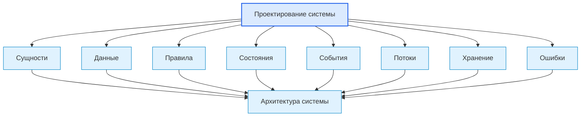
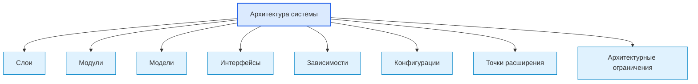
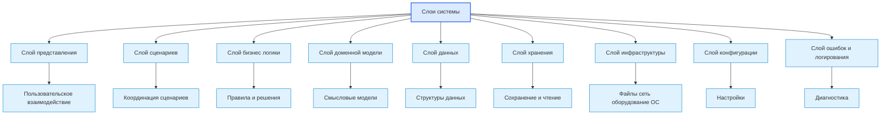
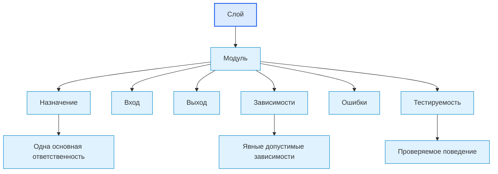
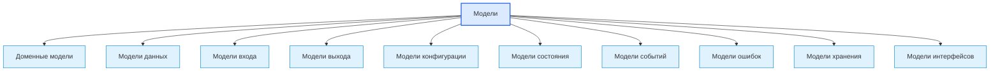
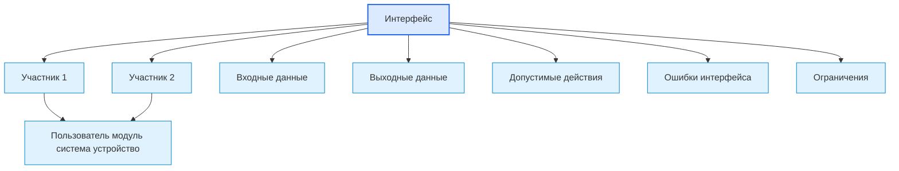
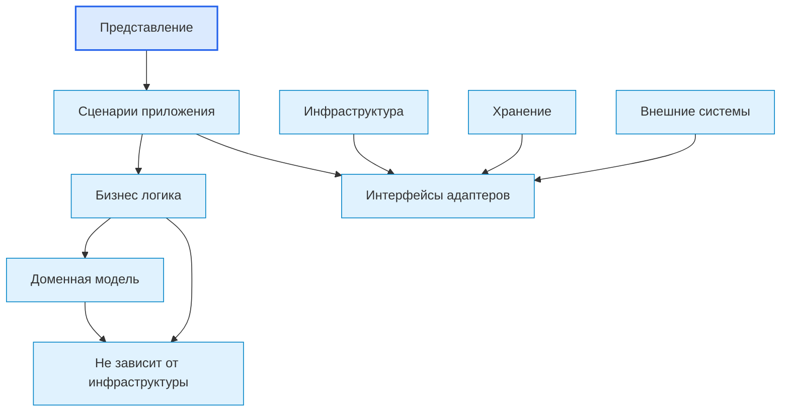
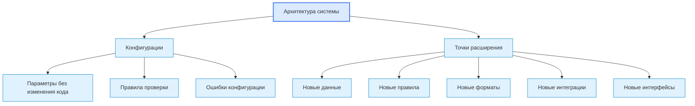
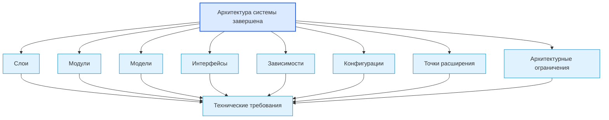

# Roadmap System Architecture Diagrams / Диаграммы архитектуры системы

## 1. Назначение документа

`02_Roadmap_System_Architecture_Diagrams.md` хранит диаграммы этапа проектирования архитектуры системы.

Документ визуализирует, как результаты проектирования системы превращаются в слои, модули, модели, интерфейсы, зависимости, конфигурации и точки расширения.

Документ не заменяет [[docs/03_roadmaps/02_Roadmap_System_Architecture_Design|Roadmap: System Architecture Design]] и [[docs/04_questionnaires/02_Questionnaire_System_Architecture_Design|Questionnaire: System Architecture Design]].

> [!info] Главное
> Документ хранит визуальные схемы, которые помогают читать структуру, связи и маршрут.

## 2. Связанные документы

- [[docs/03_roadmaps/02_Roadmap_System_Architecture_Design|Roadmap: System Architecture Design]]
- [[docs/04_questionnaires/02_Questionnaire_System_Architecture_Design|Questionnaire: System Architecture Design]]
- [[docs/03_roadmaps/01_Roadmap_System_Design|Roadmap: System Design]]
- [[docs/04_questionnaires/01_Questionnaire_System_Design|Questionnaire: System Design]]
- [[docs/05_encyclopedia/Architecture|Architecture]]
- [[docs/05_encyclopedia/Interfaces|Interfaces]]
- [[docs/07_diagrams/01_Roadmap_System_Design_Diagrams|Roadmap System Design Diagrams]]

## 3. DG-ARCH-001. Вход в архитектуру системы

## 4. DG-ARCH-002. Основные элементы архитектуры системы

## 5. DG-ARCH-003. Слои архитектуры

## 6. DG-ARCH-004. Модули внутри слоёв

## 7. DG-ARCH-005. Модели архитектуры

## 8. DG-ARCH-006. Интерфейсы и границы взаимодействия

## 9. DG-ARCH-007. Направление зависимостей

## 10. DG-ARCH-008. Конфигурации и точки расширения

## 11. DG-ARCH-009. Выход в технические требования

## 12. Следующий шаг

После просмотра диаграмм необходимо вернуться к связанному roadmap-документу или карте, где эти схемы применяются.

## 13. История изменений

- Initial version: созданы диаграммы этапа проектирования архитектуры системы.
- Updated: документ приведён к единому визуальному формату проекта.
