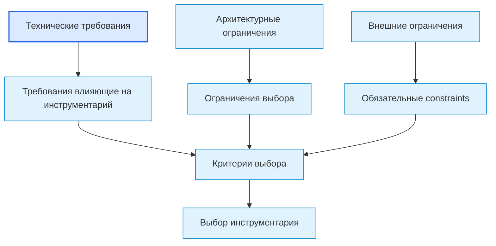
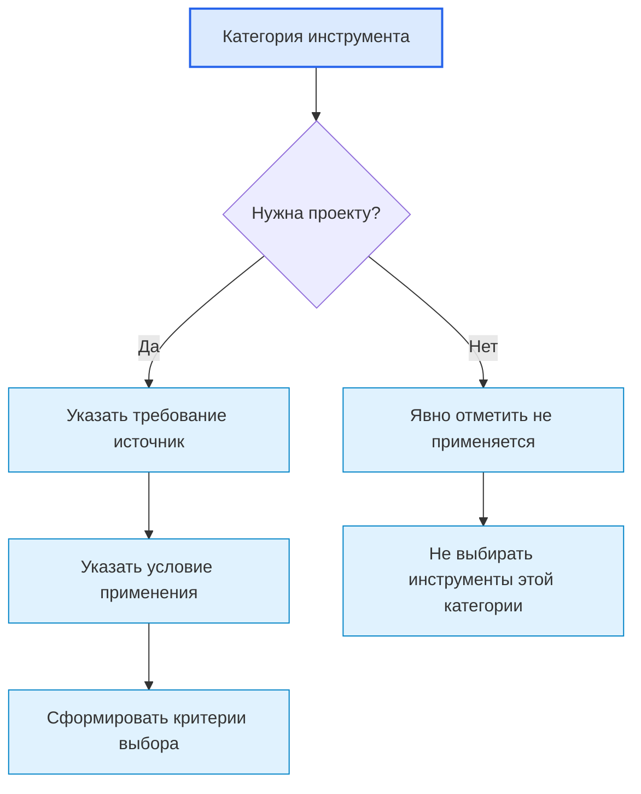
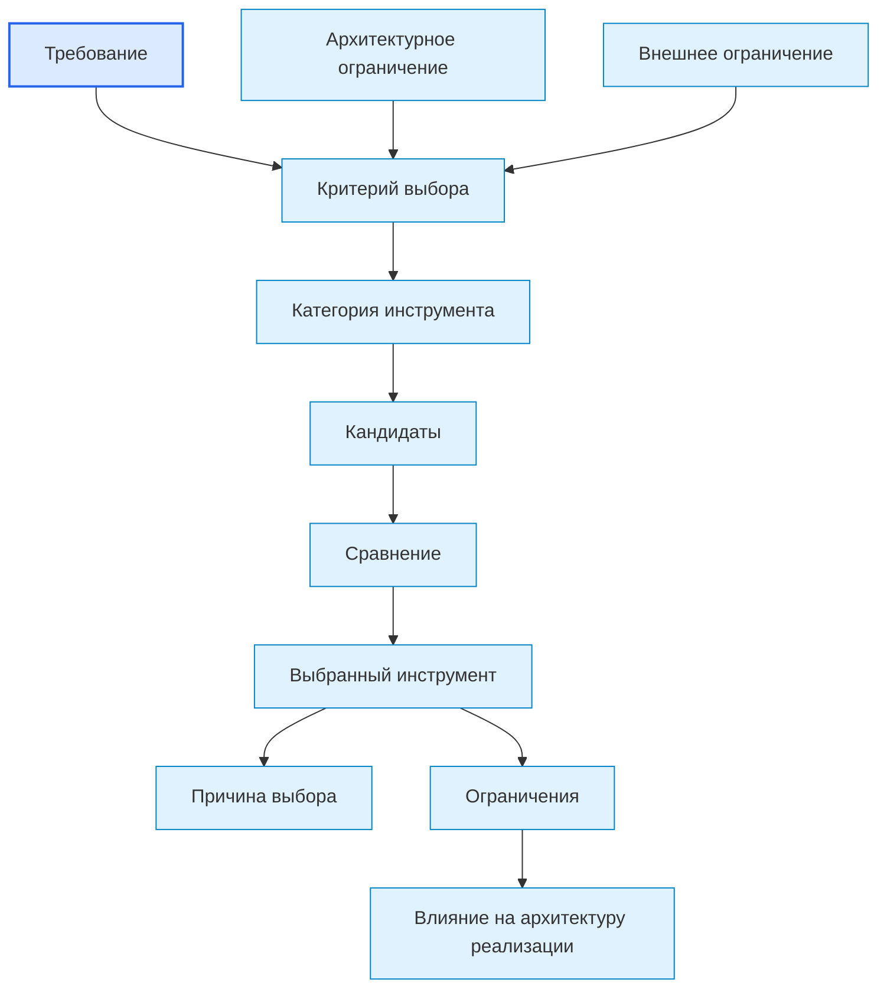
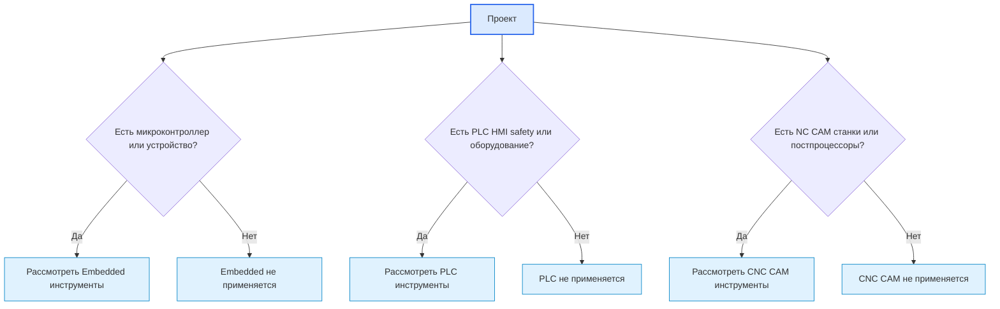
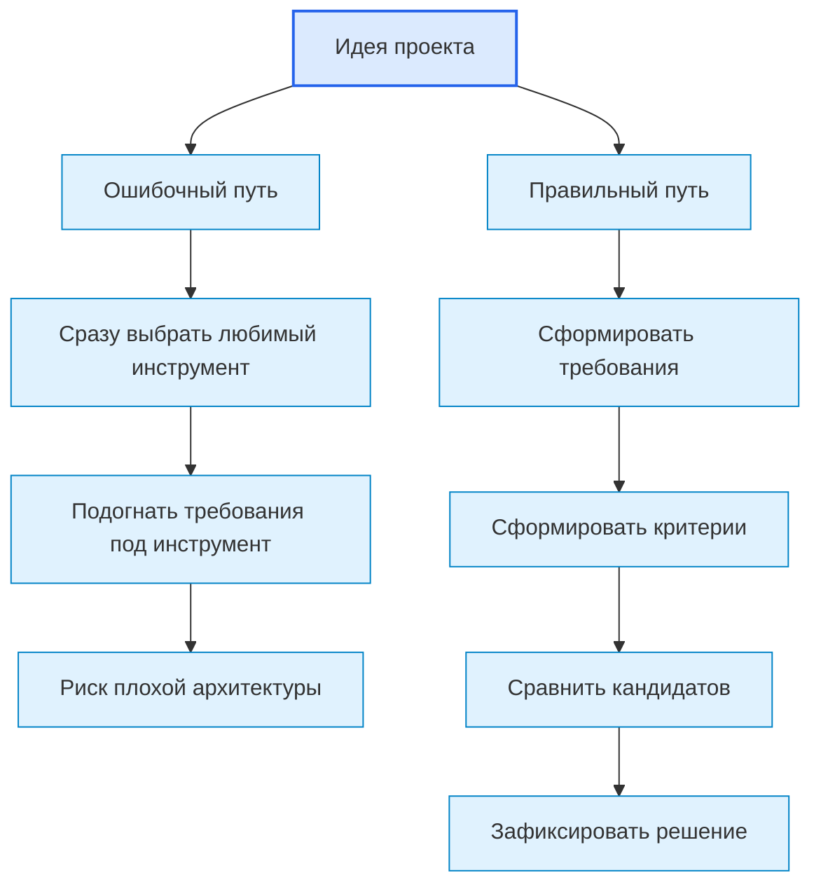
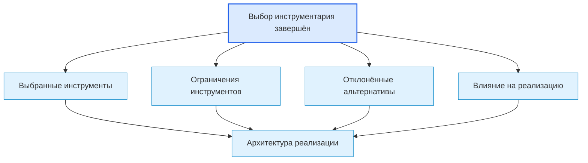

# Roadmap Toolchain Selection Diagrams / Диаграммы выбора инструментария

## 1. Назначение документа

`05_Roadmap_Toolchain_Selection_Diagrams.md` хранит диаграммы этапа выбора инструментария.

Документ визуализирует, как технические требования и архитектурные ограничения превращаются в критерии выбора, категории инструментария, кандидатов, решения и ограничения выбранных инструментов.

Документ не заменяет [[docs/03_roadmaps/05_Roadmap_Toolchain_Selection|Roadmap: Toolchain Selection]] и [[docs/04_questionnaires/05_Questionnaire_Toolchain_Selection|Questionnaire: Toolchain Selection]].

> [!info] Главное
> Документ хранит визуальные схемы, которые помогают читать структуру, связи и маршрут.

## 2. Связанные документы

- [[docs/03_roadmaps/05_Roadmap_Toolchain_Selection|Roadmap: Toolchain Selection]]
- [[docs/04_questionnaires/05_Questionnaire_Toolchain_Selection|Questionnaire: Toolchain Selection]]
- [[docs/03_roadmaps/05_Toolchain_Selection_Category_Rules|Toolchain Selection Category Rules]]
- [[docs/03_roadmaps/03_Roadmap_Technical_Requirements|Roadmap: Technical Requirements]]
- [[docs/04_questionnaires/03_Questionnaire_Technical_Requirements|Questionnaire: Technical Requirements]]
- [[docs/00_maps/04_Requirements_To_Toolchain_Map|Requirements To Toolchain Map]]
- [[docs/07_diagrams/03_Roadmap_Technical_Requirements_Diagrams|Roadmap Technical Requirements Diagrams]]

## 3. DG-TOOLS-001. Вход в выбор инструментария

## 4. DG-TOOLS-002. Категории инструментария

```mermaid
flowchart TD
    A[Инструментарий] --> B[Базовый инструментарий]
    A --> C[Прикладной инструментарий]
    A --> D[Специализированный инструментарий]

    B --> B1[Язык программирования]
    B --> B2[Среда выполнения]
    B --> B3[Редактор или IDE]
    B --> B4[Контроль версий]
    B --> B5[Тестирование]
    B --> B6[Логирование]
    B --> B7[Документация]

    C --> C1[GUI если нужен интерфейс]
    C --> C2[Web если нужен браузер или API]
    C --> C3[Хранение если нужны постоянные данные]
    C --> C4[Форматы файлов если есть импорт или экспорт]
    C --> C5[Библиотеки если закрывают требования]
    C --> C6[Протоколы если есть обмен]
    C --> C7[Сборка если нужна поставка]

    D --> D1[Embedded если есть микроконтроллер]
    D --> D2[PLC если есть промышленная автоматизация]
    D --> D3[CNC CAM если есть станки или NC программы]
    D --> D4[Промышленные протоколы если есть оборудование]
    D --> D5[Симуляция если нужно проверять без оборудования]

    classDef root fill:#dbeafe,stroke:#2563eb,stroke-width:2px
    classDef type fill:#e0f2fe,stroke:#0284c7,stroke-width:1px
    classDef step fill:#f8fafc,stroke:#64748b,stroke-width:1px
    classDef success fill:#dcfce7,stroke:#16a34a,stroke-width:2px
    classDef warning fill:#fee2e2,stroke:#dc2626,stroke-width:1px

    class A root
    class B,C,D,B1,B2,B3,B4,B5,B6,B7,C1,C2,C3,C4,C5,C6,C7,D1,D2,D3,D4,D5 type
```

## 5. DG-TOOLS-003. Условие применения категории

## 6. DG-TOOLS-004. Процесс выбора инструмента

## 7. DG-TOOLS-005. Специализированный инструментарий не является обязательным

## 8. DG-TOOLS-006. Матрица решения по инструменту

```mermaid
flowchart TD
    A[TOOL решение] --> B[Категория]
    A --> C[Условие применения]
    A --> D[Требования источники]
    A --> E[Архитектурные ограничения]
    A --> F[Критерии выбора]
    A --> G[Кандидаты]
    A --> H[Выбранный инструмент]
    A --> I[Отклонённые альтернативы]
    A --> J[Ограничения]
    A --> K[Влияние на реализацию]
    A --> L[Статус]

    classDef root fill:#dbeafe,stroke:#2563eb,stroke-width:2px
    classDef type fill:#e0f2fe,stroke:#0284c7,stroke-width:1px
    classDef step fill:#f8fafc,stroke:#64748b,stroke-width:1px
    classDef success fill:#dcfce7,stroke:#16a34a,stroke-width:2px
    classDef warning fill:#fee2e2,stroke:#dc2626,stroke-width:1px

    class A root
    class B,C,D,E,F,G,H,I,J,K,L type
```

## 9. DG-TOOLS-007. Ошибочный и правильный выбор

## 10. DG-TOOLS-008. Выход в архитектуру реализации

## 11. Следующий шаг

После просмотра диаграмм необходимо вернуться к связанному roadmap-документу или карте, где эти схемы применяются.

## 12. История изменений

- Initial version: созданы диаграммы этапа выбора инструментария.
- Updated: документ приведён к единому визуальному формату проекта.
