# Roadmap Implementation Architecture Diagrams / Диаграммы архитектуры реализации

## 1. Назначение документа

`06_Roadmap_Implementation_Architecture_Diagrams.md` хранит диаграммы этапа проектирования архитектуры реализации.

Документ визуализирует, как архитектура системы, технические требования и выбранный инструментарий превращаются в структуру проекта, директории, модули реализации, точки входа, адаптеры, конфигурацию, ошибки, логирование, тесты и правила зависимостей.

Документ не заменяет [[docs/03_roadmaps/06_Roadmap_Implementation_Architecture|Roadmap: Implementation Architecture]] и [[docs/04_questionnaires/06_Questionnaire_Implementation_Architecture|Questionnaire: Implementation Architecture]].

> [!info] Главное
> Документ хранит визуальные схемы, которые помогают читать структуру, связи и маршрут.

## 2. Связанные документы

- [[docs/03_roadmaps/06_Roadmap_Implementation_Architecture|Roadmap: Implementation Architecture]]
- [[docs/04_questionnaires/06_Questionnaire_Implementation_Architecture|Questionnaire: Implementation Architecture]]
- [[docs/03_roadmaps/02_Roadmap_System_Architecture_Design|Roadmap: System Architecture Design]]
- [[docs/03_roadmaps/03_Roadmap_Technical_Requirements|Roadmap: Technical Requirements]]
- [[docs/03_roadmaps/05_Roadmap_Toolchain_Selection|Roadmap: Toolchain Selection]]
- [[docs/07_diagrams/02_Roadmap_System_Architecture_Diagrams|Roadmap System Architecture Diagrams]]
- [[docs/07_diagrams/03_Roadmap_Technical_Requirements_Diagrams|Roadmap Technical Requirements Diagrams]]
- [[docs/07_diagrams/05_Roadmap_Toolchain_Selection_Diagrams|Roadmap Toolchain Selection Diagrams]]

## 3. DG-IMPL-001. Вход в архитектуру реализации

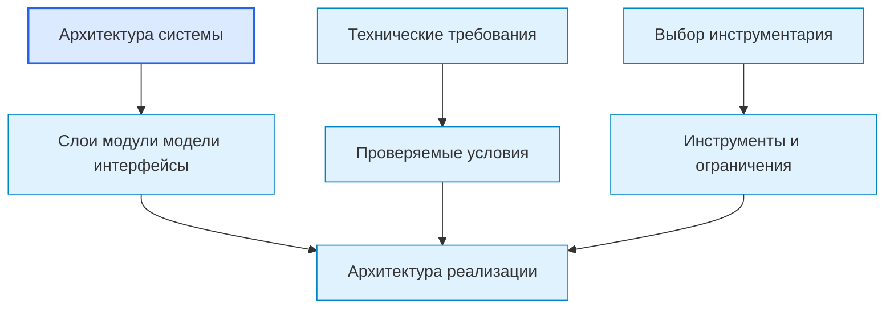

## 4. DG-IMPL-002. Основные области архитектуры реализации

```mermaid
flowchart TD
    A[Архитектура реализации] --> B[Структура проекта]
    A --> C[Директории]
    A --> D[Модули реализации]
    A --> E[Точки входа]
    A --> F[Модели реализации]
    A --> G[Интерфейсы и адаптеры]
    A --> H[Конфигурация]
    A --> I[Ошибки и логирование]
    A --> J[Тестовая структура]
    A --> K[Сборка и запуск]
    A --> L[Правила зависимостей]

    classDef root fill:#dbeafe,stroke:#2563eb,stroke-width:2px
    classDef type fill:#e0f2fe,stroke:#0284c7,stroke-width:1px
    classDef step fill:#f8fafc,stroke:#64748b,stroke-width:1px
    classDef success fill:#dcfce7,stroke:#16a34a,stroke-width:2px
    classDef warning fill:#fee2e2,stroke:#dc2626,stroke-width:1px

    class A root
    class B,C,D,E,F,G,H,I,J,K,L type
```

## 5. DG-IMPL-003. От архитектурного слоя к директории

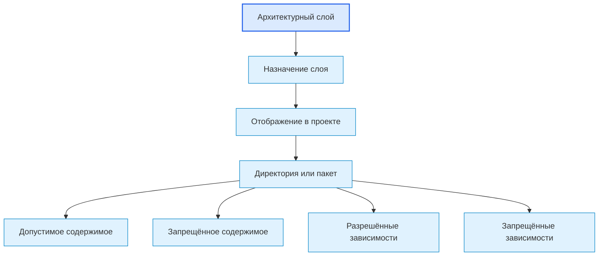

## 6. DG-IMPL-004. Модуль реализации

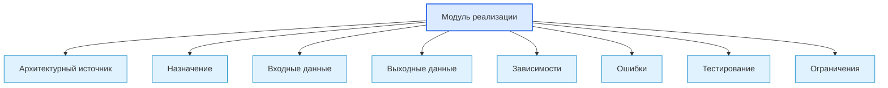

## 7. DG-IMPL-005. Точки входа

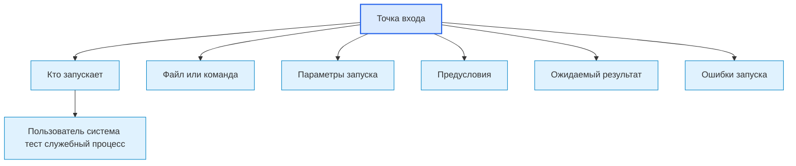

## 8. DG-IMPL-006. Адаптер внешней зависимости

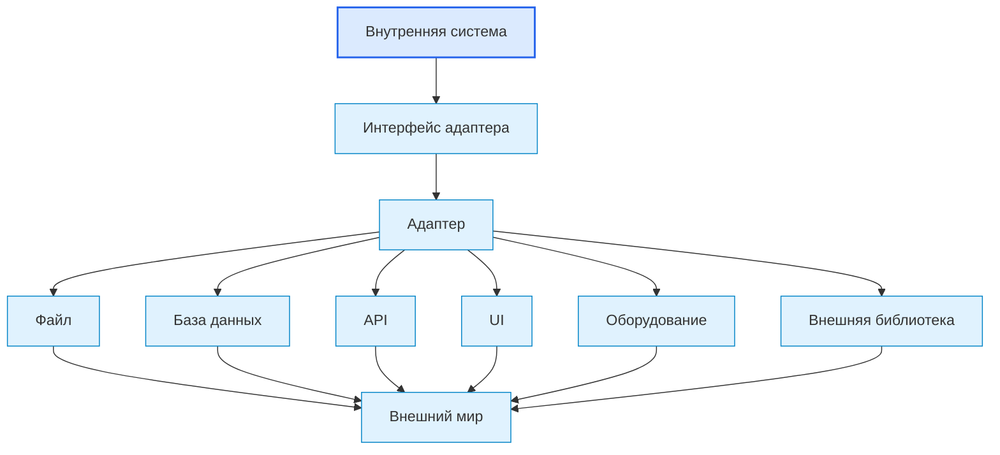

## 9. DG-IMPL-007. Конфигурация реализации

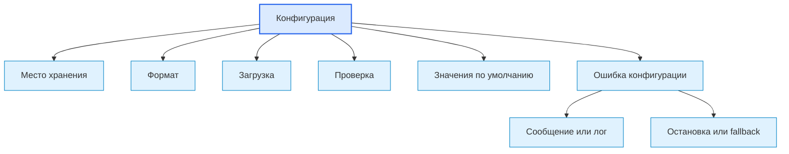

## 10. DG-IMPL-008. Маршрут ошибки в реализации

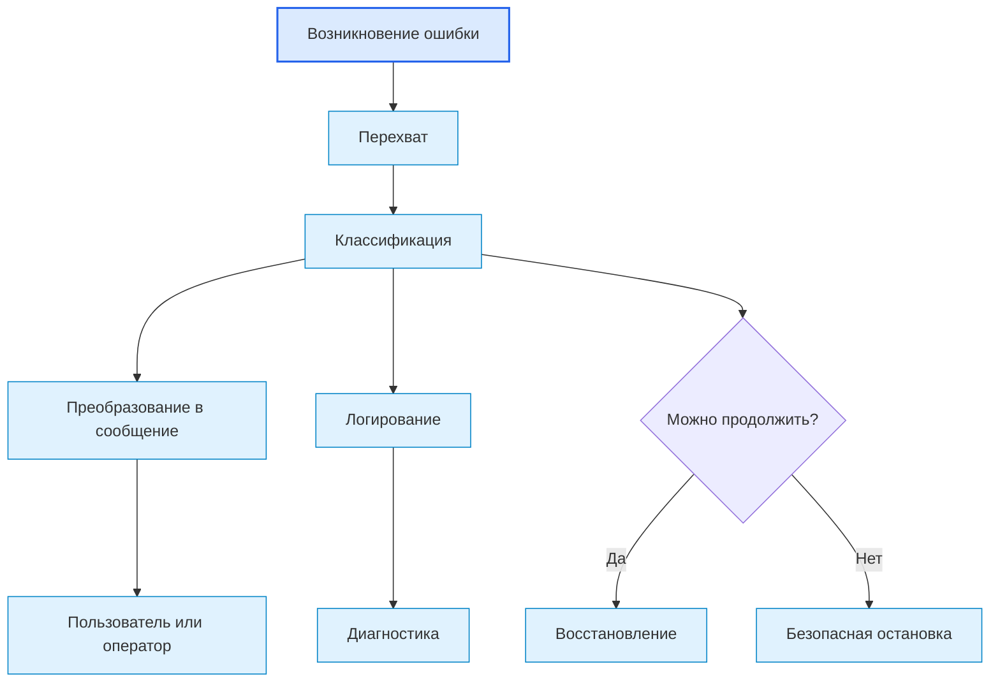

## 11. DG-IMPL-009. Тестовая структура как часть реализации

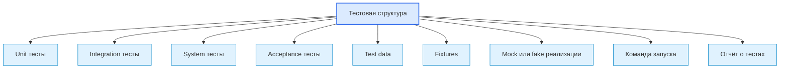

## 12. DG-IMPL-010. Правила зависимостей реализации

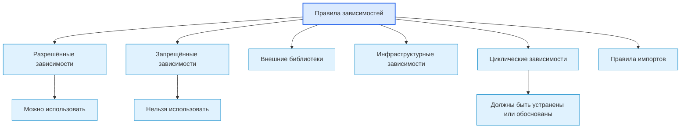

## 13. DG-IMPL-011. Выход в код и тестирование

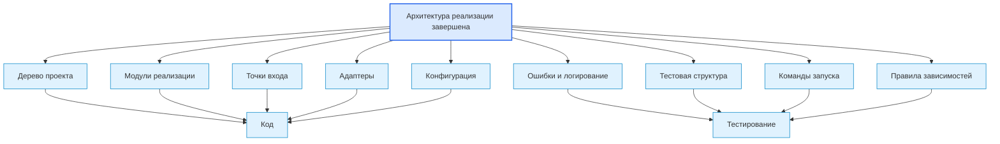

## 14. Следующий шаг

После просмотра диаграмм необходимо вернуться к связанному roadmap-документу или карте, где эти схемы применяются.

## 15. История изменений

- Initial version: созданы диаграммы этапа архитектуры реализации.
- Updated: документ приведён к единому визуальному формату проекта.
