# Roadmap Testing Operation Maintenance Evolution Diagrams / Диаграммы тестирования, эксплуатации, сопровождения и развития

## 1. Назначение документа

`07_07_Roadmap_Testing_Operation_Maintenance_Evolution_Diagrams.md` хранит диаграммы жизненного цикла системы после архитектуры реализации и кода.

Документ визуализирует тестирование, эксплуатацию, сопровождение, развитие системы и возвраты к предыдущим этапам.

Документ не заменяет roadmap-документы и анкеты этих этапов.

> [!info] Главное
> Документ хранит визуальные схемы, которые помогают читать структуру, связи и маршрут.

## 2. Связанные документы

- [[docs/03_roadmaps/07_Roadmap_Testing|Roadmap: Testing]]
- [[docs/04_questionnaires/07_Questionnaire_Testing|Questionnaire: Testing]]
- [[docs/03_roadmaps/08_Roadmap_Operation|Roadmap: Operation]]
- [[docs/04_questionnaires/08_Questionnaire_Operation|Questionnaire: Operation]]
- [[docs/03_roadmaps/09_Roadmap_Maintenance|Roadmap: Maintenance]]
- [[docs/04_questionnaires/09_Questionnaire_Maintenance|Questionnaire: Maintenance]]
- [[docs/03_roadmaps/10_Roadmap_System_Evolution|Roadmap: System Evolution]]
- [[docs/04_questionnaires/10_Questionnaire_System_Evolution|Questionnaire: System Evolution]]
- [[docs/07_diagrams/06_Roadmap_Implementation_Architecture_Diagrams|Roadmap Implementation Architecture Diagrams]]
- [[docs/07_diagrams/00_Development_Route_Diagrams|Development Route Diagrams]]

## 3. DG-LIFE-001. Переход от реализации к жизненному циклу

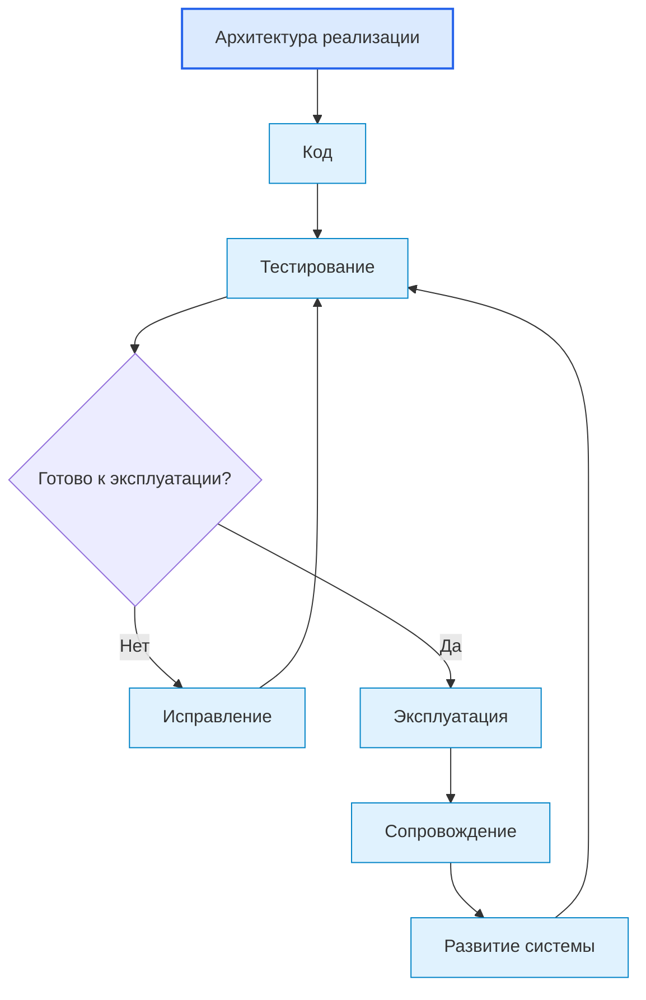

## 4. DG-LIFE-002. Карта тестирования

```mermaid
flowchart TD
    A[Тестирование] --> B[Проверка требований]
    A --> C[Unit тесты]
    A --> D[Integration тесты]
    A --> E[System тесты]
    A --> F[Acceptance тесты]
    A --> G[Тестирование данных]
    A --> H[Тестирование ошибок]
    A --> I[Тестирование интерфейсов]
    A --> J[Производительность]
    A --> K[Безопасность]
    A --> L[Регрессия]
    A --> M[Ручная проверка]

    classDef root fill:#dbeafe,stroke:#2563eb,stroke-width:2px
    classDef type fill:#e0f2fe,stroke:#0284c7,stroke-width:1px
    classDef step fill:#f8fafc,stroke:#64748b,stroke-width:1px
    classDef success fill:#dcfce7,stroke:#16a34a,stroke-width:2px
    classDef warning fill:#fee2e2,stroke:#dc2626,stroke-width:1px

    class A root
    class B,C,D,E,F,G,H,I,J,K,L,M type
```

## 5. DG-LIFE-003. Жизненный цикл теста

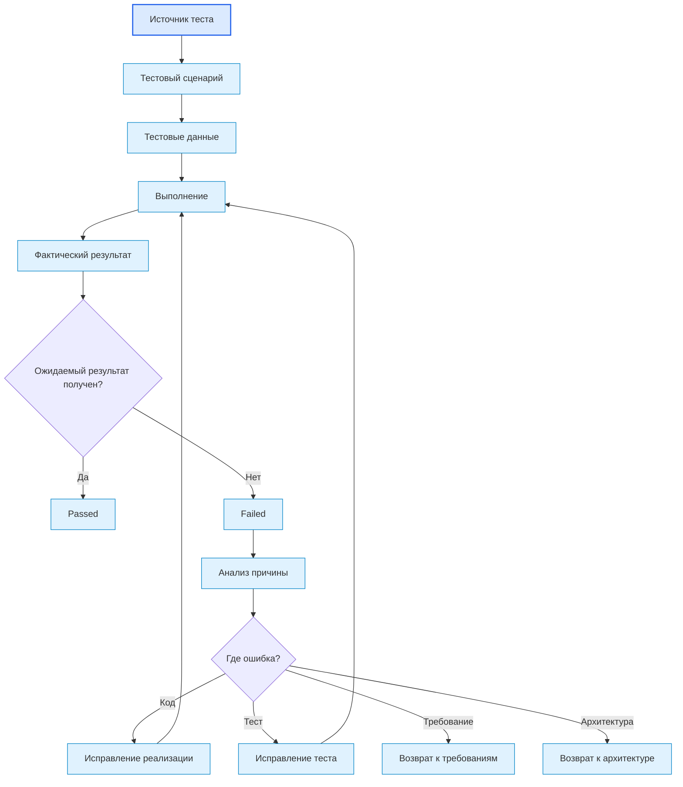

## 6. DG-LIFE-004. Карта эксплуатации

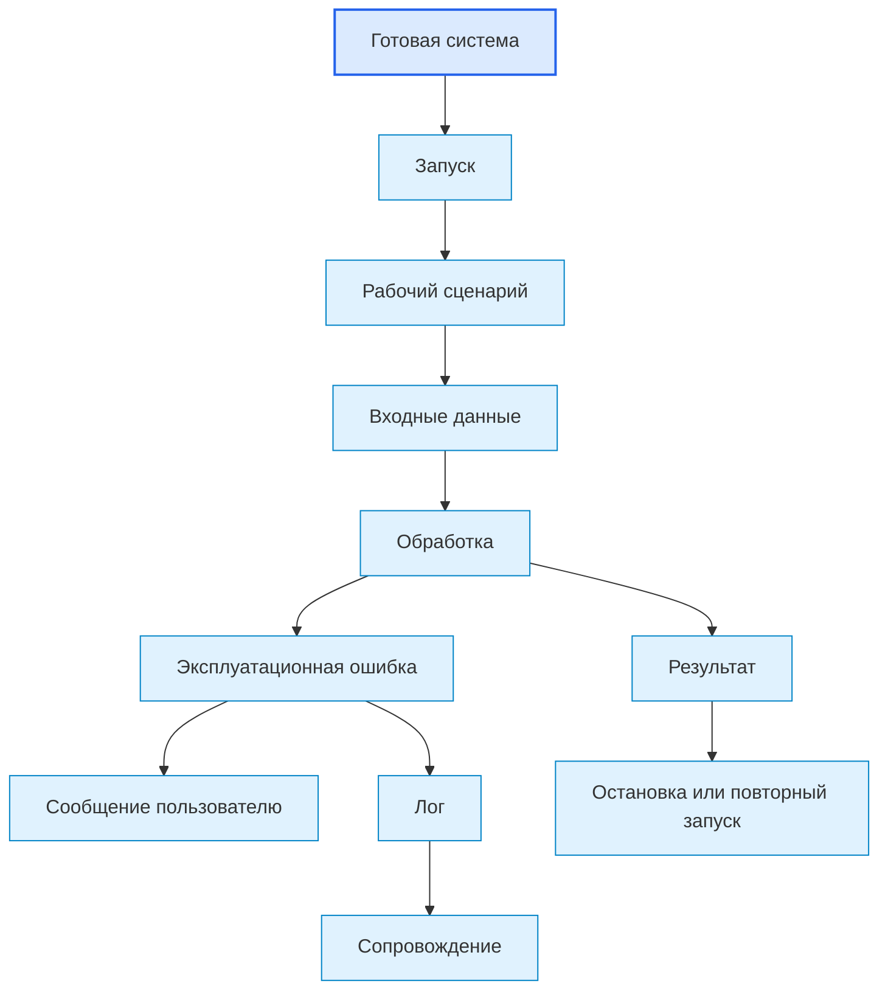

## 7. DG-LIFE-005. Эксплуатационные данные для сопровождения

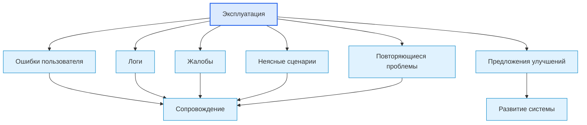

## 8. DG-LIFE-006. Карта сопровождения

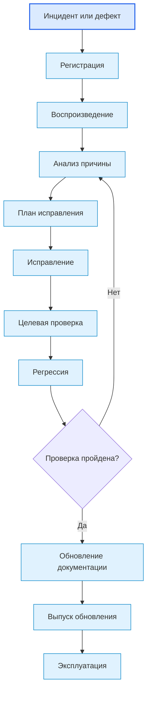

## 9. DG-LIFE-007. Разделение сопровождения и развития

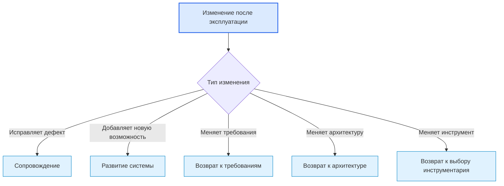

## 10. DG-LIFE-008. Карта развития системы

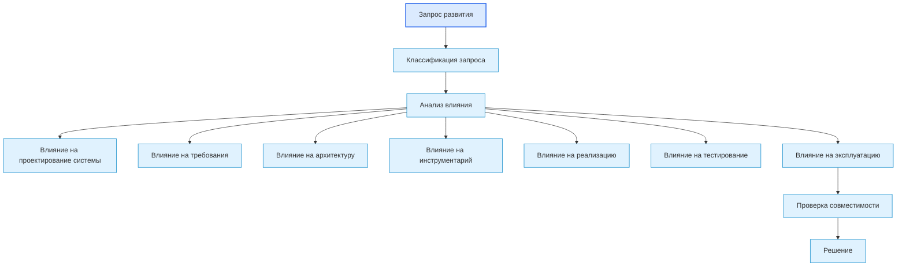

## 11. DG-LIFE-009. Обратная совместимость и миграция

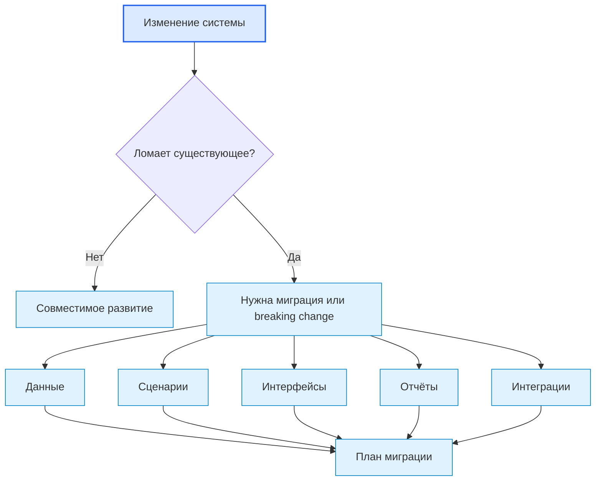

## 12. DG-LIFE-010. Возврат из развития к нужному этапу

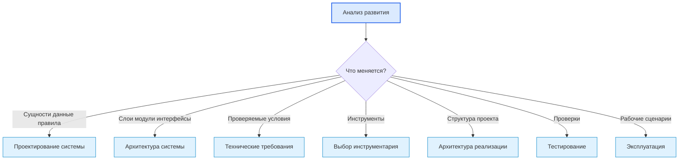

## 13. DG-LIFE-011. Полный цикл после выпуска

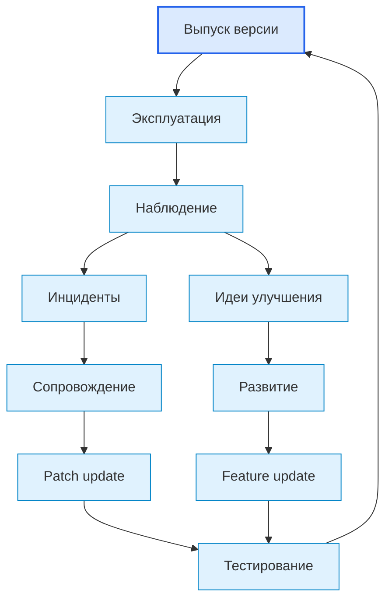

## 14. Следующий шаг

После просмотра диаграмм необходимо вернуться к связанному roadmap-документу или карте, где эти схемы применяются.

## 15. История изменений

- Initial version: созданы диаграммы тестирования, эксплуатации, сопровождения, развития и возвратов по жизненному циклу системы.
- Updated: документ приведён к единому визуальному формату проекта.
