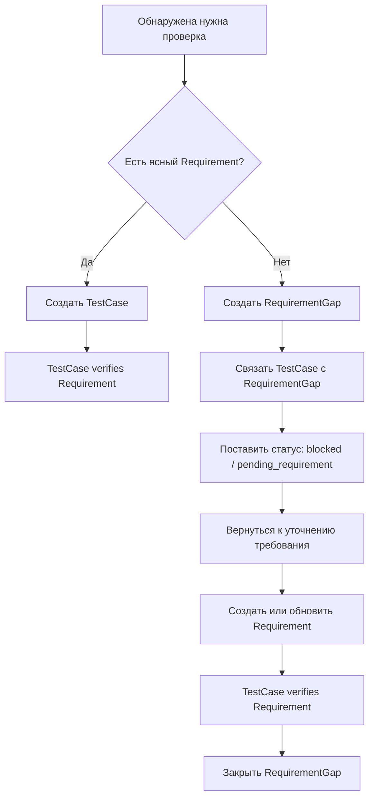

# Traceability

## 1. Назначение документа

`06_Traceability.md` описывает правила трассировки для рабочей метамодели Digital System CAD.

Traceability нужна, чтобы каждый важный элемент модели можно было связать с источником, требованием, правилом, ошибкой, задачей, кодовым артефактом, тестом, SDD-разделом и open questions.

> [!info] Главное
> Трассировка показывает, почему элемент существует, что он влияет, как он проверяется и где он реализуется. Без трассировки модель превращается в набор разрозненных описаний.

## 2. Базовая идея

Трассировка строится не как ручной список ссылок, а как сеть structured facts.

Минимальная рабочая цепочка:

```text
Requirement -> Task -> CodeArtifact -> TestCase
```

Желательная расширенная цепочка:

```text
Requirement -> Module -> Service -> Entity -> DataField -> Rule -> Error -> TestCase -> Task -> CodeArtifact
```

Дополнительная цепочка для SDD:

```text
ModelElement -> StructuredFact -> View -> SDD section -> Task -> TestCase
```

### 2.1. Приоритет Requirement над TestCase

Requirement имеет приоритет над TestCase как источник ожидаемого поведения системы.

TestCase проверяет ожидаемое поведение, но не должен сам задавать это поведение. Если при проектировании проверки выясняется, что ясного Requirement нет, нужно создать `RequirementGap`, связать с ним TestCase и поставить TestCase в статус `blocked` или `pending_requirement`.

Рабочий поток:



## 3. Что traceability решает

Traceability нужна для того, чтобы:

- понимать источник требований;
- видеть, какие элементы модели поддерживают требование;
- проверять, какие правила имеют тесты;
- видеть, какие ошибки покрыты негативными сценариями;
- связывать задачи с требованиями и open questions;
- связывать кодовые артефакты с моделью;
- проверять полноту SDD;
- давать Codex контекст без потери смысла;
- находить gaps перед реализацией.

## 4. Что не является traceability

Traceability не является:

- свободным списком “см. также”;
- Obsidian wikilink без relation type;
- ссылкой на файл без объяснения связи;
- диаграммной стрелкой без structured fact;
- TODO без source;
- тестом без target;
- кодом без связи с задачей или моделью.

Если связь важна, она должна быть structured fact.

## 5. Traceability units

Трассировка строится из:

- model elements;
- relation types;
- structured facts;
- registers;
- validation rules;
- SDD views;
- tasks;
- code artifacts;
- test cases;
- open questions.

Главное правило:

```text
Traceability = selected structured facts + validation rules + gap detection
```

## 6. Основные traceability relations

| Relation | Source | Target | Назначение |
|---|---|---|---|
| `sourced_from` | ModelElement / Fact | Document / UserAnswer / Standard / Example | источник утверждения |
| `contains` | Project / Model / Module / Entity | ModelElement / Service / DataField | состав, включая связь Module -> Service |
| `references` | Requirement / View / SDD section | ModelElement | смысловая ссылка |
| `defines` | Requirement / Rule / Viewpoint | Rule / View / Constraint | определение смысла |
| `validates` | Rule / ValidationRule | DataField / Model / Fact | проверка корректности |
| `raises` | Rule / Flow / Interface | Error | негативный сценарий |
| `triggers` | Event | Flow / StateTransition | поведение |
| `provides` | Module | Interface | архитектурная граница |
| `processes` | Service / Flow | Entity / DataField / Event | активная обработка объекта данных |
| `creates` | Service / Flow / Transformation | Entity / Report / CodeArtifact | создание результата |
| `is_implemented_by` | Service / Module / Interface | CodeArtifact | связь модели с реализацией |
| `implements` | Task / CodeArtifact | Requirement / Service / Module / Rule / Interface | реализация |
| `verifies` | TestCase | Requirement / Rule / Error / CodeArtifact | проверка |
| `tests` | TestCase | Service / CodeArtifact / Interface / Flow | что именно исполняет тест |
| `reveals_gap` | TestCase / ValidationRule / Review | RequirementGap | проверка обнаружила отсутствующее или неясное требование |
| `blocked_by` | TestCase / Task / SDD section | RequirementGap / OpenQuestion | работа заблокирована неопределённостью |
| `generated_from` | SDD section / View / TaskList | Model / Fact / Transformation | происхождение view |
| `affects` | OpenQuestion / RequirementGap / Configuration / Decision | ModelElement / Fact / View | влияние |
| `resolves` | Task / Decision / Requirement | OpenQuestion / RequirementGap | закрытие неопределённости |

## 7. Traceability levels

### 7.1. Level 0. Source traceability

Цель: каждый важный элемент имеет источник.

Pattern:

```text
ModelElement sourced_from SourceDocument
StructuredFact sourced_from SourceDocument
```

Validation:

- important element without source -> `error`;
- important fact without source -> `error`;
- element from memory only -> OpenQuestion.

### 7.2. Level 1. Requirement traceability

Цель: требования связаны с модельными элементами и проверкой.

Patterns:

```text
Project contains Requirement
Requirement references ModelElement
Requirement is_verified_by TestCase
```

Validation:

- Requirement without TestCase -> `error` or OpenQuestion;
- Requirement without source -> `error`;
- Requirement without model target -> `warning`, если требование ещё слишком общее.
- TestCase without clear Requirement -> create RequirementGap and set TestCase status to `blocked` or `pending_requirement`.

### 7.3. Level 2. Logical model traceability

Цель: сущности, данные, правила, события, потоки и ошибки связаны между собой.

Patterns:

```text
Entity contains DataField
Rule validates DataField
Rule raises Error
Event triggers Flow
Flow transfers DataField
Storage stores Entity
Interface accepts DataField
```

Validation:

- DataField without owner -> `blocker`;
- Rule without target -> `blocker`;
- Error without cause/reaction -> `error`;
- Flow without source/target/transferred object -> `error`.

### 7.4. Level 3. Architecture traceability

Цель: архитектура выводится из модели, а не создаётся произвольно.

Patterns:

```text
Module provides Interface
Module contains Service
Service processes Entity
Service creates Entity
Service is_implemented_by CodeArtifact
Module executes Flow
Module implements Rule
Layer contains Module
Module depends_on Module
```

Validation:

- Module without responsibility -> `error`;
- Module without Service/interface or reason -> `warning`;
- Service without operation or processed/created target -> `error`;
- dependency without direction/reason -> `error`;
- architecture decision without source -> OpenQuestion.

### 7.5. Level 4. Implementation traceability

Цель: задачи и код связаны с требованиями и моделью.

Patterns:

```text
Task implements Requirement
Task updates ModelElement
Task changes CodeArtifact
CodeArtifact implements Module
CodeArtifact implements Rule
```

Validation:

- Task without source -> `error`;
- Task without expected output -> `error`;
- CodeArtifact without model link -> `warning`;
- code change without TestCase or reason -> `warning`.

### 7.6. Level 5. Verification traceability

Цель: тесты проверяют требования, правила, ошибки, потоки и код.

Patterns:

```text
TestCase verifies Requirement
TestCase verifies Rule
TestCase verifies Error
TestCase verifies Flow
TestCase verifies CodeArtifact
```

Validation:

- critical Rule without TestCase -> `error`;
- critical Error without negative TestCase -> `error`;
- Requirement without verification -> `error`;
- TestCase without target -> `blocker`.

### 7.7. Level 6. SDD traceability

Цель: SDD является view/transformation модели.

Patterns:

```text
SDDSection generated_from StructuredFact
SDDSection represents ModelElement
SDDSection conforms_to Viewpoint
Transformation produces SDDSection
```

Validation:

- SDD claim without source fact -> `warning`;
- generated SDD section manually edited without divergence record -> `warning`;
- SDD section without viewpoint -> `warning`.

## 8. Minimal traceability chain

Минимальная цепочка для практической разработки:

```text
REQ-001 -> TASK-001 -> CODE-001 -> TEST-001
```

Факты:

```yaml
- id: FACT-TRACE-001
  subject: TASK-001
  relation: implements
  object: REQ-001
  source: "TODO.md"
  validation_status: not_checked

- id: FACT-TRACE-002
  subject: TASK-001
  relation: updates
  object: CODE-001
  source: "implementation plan"
  validation_status: not_checked

- id: FACT-TRACE-003
  subject: TEST-001
  relation: verifies
  object: CODE-001
  source: "test plan"
  validation_status: not_checked
```

Minimum validation:

- requirement exists;
- task exists;
- expected code artifact exists or is planned;
- test case exists or OpenQuestion explains why not.

## 9. Strong traceability chain

Желательная цепочка для Digital System CAD:

```text
Requirement
-> Module
-> Service
-> Entity
-> DataField
-> Rule
-> Error
-> TestCase
-> Task
-> CodeArtifact
```

Пример:

```yaml
- id: FACT-TRACE-010
  subject: REQ-001
  relation: references
  object: ENT-001

- id: FACT-TRACE-011
  subject: ENT-001
  relation: contains
  object: DATA-001

- id: FACT-TRACE-012
  subject: RULE-001
  relation: validates
  object: DATA-001

- id: FACT-TRACE-013
  subject: RULE-001
  relation: raises
  object: ERR-001

- id: FACT-TRACE-014
  subject: TEST-001
  relation: verifies
  object: ERR-001

- id: FACT-TRACE-015
  subject: TASK-001
  relation: implements
  object: REQ-001

- id: FACT-TRACE-016
  subject: CODE-001
  relation: implements
  object: MOD-001
```

Эта цепочка не всегда нужна полностью для маленькой утилиты, но она показывает идеал проверки модели.

## 10. Traceability matrix

Минимальная таблица:

```text
Requirement | Source | Related elements | Rules | Errors | Tasks | Code artifacts | Test cases | Gaps
```

Пример:

```text
REQ-001 | Questionnaire | ENT-001, DATA-001 | RULE-001 | ERR-001 | TASK-001 | CODE-001 | TEST-001 | none
```

Расширенная таблица:

```text
Requirement | Entity | DataField | Rule | Error | Flow | Interface | Module | Service | Task | CodeArtifact | TestCase | SDD section | OpenQuestion
```

## 11. Gap types

| Gap | Значение | Severity |
|---|---|---|
| `missing_source` | нет источника | error |
| `missing_definition` | нет определения | error |
| `missing_owner` | нет владельца данных / состояния / события | blocker |
| `missing_relation` | нет обязательной связи | error |
| `missing_test` | нет проверки | error |
| `missing_error_behavior` | нет реакции на ошибку | error |
| `missing_task` | требование не имеет работы по реализации | warning |
| `missing_code_artifact` | задача реализации не связана с артефактом | warning |
| `unknown_term` | термин отсутствует в vocabulary | warning |
| `view_without_fact` | view содержит смысл без fact | warning |
| `conflicting_fact` | facts противоречат друг другу | error |

## 12. Traceability validation rules

### 12.1. TRACE-VAL-001. Requirement must be verifiable

Каждый Requirement должен иметь TestCase или OpenQuestion/RequirementGap о способе проверки.

Severity: `error`

### 12.2. TRACE-VAL-002. Task must have source

Каждая Task должна быть связана с Requirement, OpenQuestion, ModelElement, Rule, Error или explicit decision.

Severity: `error`

### 12.3. TRACE-VAL-003. CodeArtifact must link back to model

Каждый CodeArtifact должен быть связан с Task, Service, Module, Rule, Interface, TestCase или Transformation output.

Severity: `warning`

### 12.4. TRACE-VAL-004. Critical Error must have test

Каждый critical Error должен иметь TestCase или OpenQuestion.

Severity: `error`

### 12.5. TRACE-VAL-005. Rule must have target

Каждый Rule должен валидировать, ограничивать, рассчитывать или guard конкретный элемент модели.

Severity: `blocker`

### 12.6. TRACE-VAL-006. SDD section must be generated_from model facts

SDD section должен ссылаться на ModelElement или StructuredFact, из которого он получен.

Severity: `warning`

### 12.7. TRACE-VAL-007. OpenQuestion must affect something

Каждый OpenQuestion должен иметь relation `affects` к ModelElement, Relation, View, Transformation, Register или SDD section.

Severity: `error`

### 12.8. TRACE-VAL-008. TestCase must not define expected behavior

TestCase должен проверять Requirement, Rule, Error, Flow или CodeArtifact. Если TestCase описывает ожидаемое поведение, для которого нет ясного Requirement, это не полноценная проверка, а сигнал создать RequirementGap.

Severity: `blocker`

### 12.9. TRACE-VAL-009. RequirementGap must be closed by Requirement

RequirementGap закрывается только созданием или уточнением Requirement, либо явным решением `rejected`. Закрывать RequirementGap одним TestCase нельзя.

Severity: `error`

## 13. Traceability and Codex

Codex task context должен получать traceability block:

```yaml
task_context:
  task: TASK-001
  implements:
    - REQ-001
  affected_model_elements:
    - ENT-001
    - DATA-001
    - RULE-001
  affected_code_artifacts:
    - CODE-001
  must_preserve:
    - INTERFACE-001
    - TEST-001
  must_verify:
    - TEST-001
  open_questions:
    - OQ-001
```

Это нужно, чтобы Codex не работал только по свободному описанию задачи.

## 14. Traceability and SDD

Каждый SDD-раздел должен показывать происхождение:

```yaml
sdd_section:
  id: SDD-REQ-001
  title: "Requirements"
  generated_from:
    - REQ-001
    - FACT-REQ-001
  validation_before_generation:
    - TRACE-VAL-001
```

Если SDD содержит утверждение без source fact, это gap.

## 15. Traceability for first validation example

Первый пример:

- [[docs/06_examples/Scripts/Python_File_Processing_Utility|Python File Processing Utility]]

Минимальная проверка:

1. Выделить 3-5 Requirements.
2. Для каждого Requirement найти Entity/DataField/Rule/Error.
3. Создать TestCase для каждого важного Rule/Error.
4. Создать Task для реализации или проверки.
5. Связать Task с CodeArtifact, если code artifact уже известен или планируется.
6. Зафиксировать gaps.

Не нужно пытаться сразу построить полную промышленную трассировку. Первый пример должен показать, работает ли форма.

## 16. Открытые вопросы

- Нужно ли вводить отдельный element type `Decision`?
- Нужно ли вводить отдельный element type `SDDSection`?
- Должна ли traceability matrix быть generated view или ручной Markdown-table?
- Какие validation rules являются blocker перед первым SDD?
- Как хранить историю изменения traceability facts?
- Как фиксировать частичное покрытие requirement несколькими tests?
- Как отличать acceptance test от implementation test?

## 17. Связанные документы

### Входные документы

- [[docs/08_digital_system_cad/metamodel/01_Model_Elements|Model Elements]]
  - Передаёт: element types, участвующие в traceability chains.
  - Используется для: определения допустимых узлов трассировки.
  - Ограничение: не описывает цепочки.

- [[docs/08_digital_system_cad/metamodel/02_Model_Relations|Model Relations]]
  - Передаёт: relation types.
  - Используется для: построения traceability facts.
  - Ограничение: не задаёт обязательные цепочки.

- [[docs/08_digital_system_cad/metamodel/03_Structured_Facts|Structured Facts]]
  - Передаёт: форму фактов.
  - Используется для: записи traceability relations.
  - Ограничение: не описывает gaps и цепочки.

- [[docs/08_digital_system_cad/metamodel/04_Model_Registers|Model Registers]]
  - Передаёт: Traceability Matrix as register view.
  - Используется для: табличного отображения цепочек.
  - Ограничение: register is not source of truth.

- [[docs/08_digital_system_cad/metamodel/05_Controlled_Vocabulary|Controlled Vocabulary]]
  - Передаёт: стабильные термины.
  - Используется для: устранения неоднозначности в цепочках.
  - Ограничение: не задаёт обязательные связи.

### Выходные документы

- Будущий [[docs/08_digital_system_cad/metamodel/07_SDD_From_Model|SDD From Model]]
  - Получает: правила traceability для SDD sections.
  - Используется для: проверки происхождения SDD из модели.
  - Ограничение: не должен дублировать все traceability validation rules.

## 18. История изменений

- Initial version: создана спецификация traceability для Digital System CAD с уровнями трассировки, минимальной и расширенной цепочкой, gap types, validation rules, Codex context и SDD traceability.
