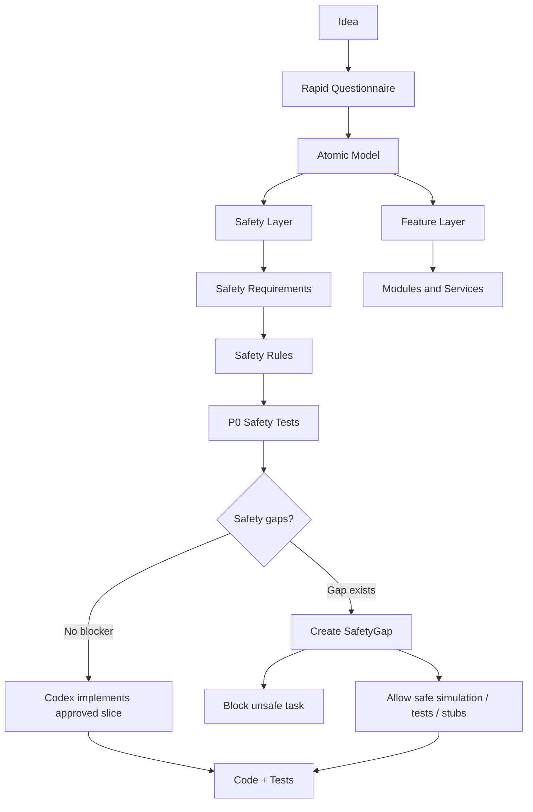

# Safety as Model Layer

## 1. Назначение документа

`08_Safety_As_Model_Layer.md` фиксирует принцип включения safety в рабочую метамодель Digital System CAD.

Документ нужен для того, чтобы safety не воспринималась как внешняя бюрократическая преграда, а была частью модели цифровой системы, SDD, validation rules, test plan и Codex task pack.

> [!info] Главное
> Safety не должна останавливать разработку по умолчанию. Safety должна быть атомизирована как часть модели и блокировать только те execution paths, которые могут привести к опасному поведению.

## 2. Основной принцип

Safety — не внешний запрет и не отдельный PDF-документ.

Safety — это часть системы и часть модели системы.

Правильная формула:

```text
Safety is not a blocker by default.
Unresolved critical safety behavior blocks unsafe execution paths only.
```

По-русски:

```text
Safety не блокирует весь процесс разработки.
Safety блокирует только опасные ветки реализации, эксплуатации или интеграции.
```

Это означает:

- safety должна входить в метамодель;
- safety должна иметь собственные требования, правила, события, состояния, ошибки и тесты;
- safety tests должны иметь высший приоритет;
- safety gaps должны фиксироваться как model facts, а не как свободные комментарии;
- Codex должен продолжать безопасные работы даже при наличии unresolved safety gaps;
- Codex не должен реализовывать unsafe task, если соответствующий safety gap не закрыт.

## 3. Что нужно сломать

Нужно сломать не safety, а ручную бюрократию вокруг safety.

Неправильный процесс:

```text
Идея -> много свободного текста -> отдельный safety-документ -> ручное согласование -> Codex пытается понять контекст -> код
```

Правильный процесс:

```text
Идея -> атомарная модель -> safety layer -> validation rules -> P0 safety tests -> SDD -> Codex task pack -> код и тесты
```

Safety должна ускорять разработку за счёт точности, а не тормозить её за счёт неопределённости.

## 4. Safety как специализация существующих element types

На текущем этапе не нужно сразу создавать отдельную тяжёлую safety-метамодель.

Safety-элементы можно описывать как специализации существующих element types:

| Safety concept | Base element type | Meaning |
|---|---|---|
| SafetyRequirement | Requirement | Проверяемое требование безопасности |
| SafetyRule | Rule | Условие, ограничение или обязательная реакция |
| CriticalEvent | Event | Событие, которое может привести к опасной ситуации |
| FailsafeState | State | Безопасное состояние системы или элемента |
| SafetyError | Error | Критическая ошибка или нарушение safety-условия |
| SafetyTestCase | TestCase | Проверка safety requirement или safety rule |
| SafetyValidationRule | ValidationRule | Проверка целостности safety-слоя модели |
| SafetyGap | RequirementGap / OpenQuestion | Неопределённое safety-поведение, требующее решения |
| SafetyGate | ValidationRule / Governance element | Правило, которое разрешает или блокирует конкретный execution path |
| ForbiddenBehavior | Rule / Constraint | Явно запрещённое поведение системы |

Правило:

> Safety-специализации не должны дублировать базовые типы. Они должны уточнять роль элемента в safety viewpoint.

## 5. Минимальный safety layer

Минимальный safety layer должен содержать:

```text
SafetyRequirement
SafetyRule
CriticalEvent
FailsafeState
SafetyError
SafetyTestCase
SafetyGap
SafetyGate
ForbiddenBehavior
```

Минимальная форма safety requirement:

```text
ID:
Type: Requirement
Safety profile: SafetyRequirement
Name:
Definition:
Hazard / unsafe condition:
Required safe behavior:
Priority:
Severity:
Verification method:
Related safety rules:
Related test cases:
Blocked unsafe tasks:
Open questions:
```

Минимальная форма safety rule:

```text
ID:
Type: Rule
Safety profile: SafetyRule
Name:
Condition:
Required action:
Forbidden behavior:
Failure reaction:
Severity:
Related events:
Related states:
Related errors:
Verified by:
Open questions:
```

Минимальная форма safety gate:

```text
ID:
Type: ValidationRule
Safety profile: SafetyGate
Name:
Condition:
Blocks:
Allows:
Reason:
Severity:
Resolution rule:
Open questions:
```

## 6. Safety relations

Safety-слой должен использовать typed relations.

Минимальные relation patterns:

```text
SafetyRequirement defines SafetyRule
SafetyRule constrains Module
SafetyRule constrains Service
SafetyRule reacts_to CriticalEvent
SafetyRule changes_state_to FailsafeState
SafetyRule raises SafetyError
SafetyTestCase verifies SafetyRequirement
SafetyTestCase verifies SafetyRule
SafetyGate blocks UnsafeTask
SafetyGate allows SafeTask
SafetyGap blocks UnsafeTask
SafetyGap allows SafeTask
ForbiddenBehavior constrains Module / Service / Interface
```

Пример:

```text
SAFE-REQ-001 defines SAFE-RULE-001
SAFE-RULE-001 reacts_to EVT-COMMUNICATION-LOST
SAFE-RULE-001 changes_state_to STATE-FAILSAFE
SAFE-RULE-001 raises ERR-COMMUNICATION-LOST
TEST-SAFE-001 verifies SAFE-RULE-001
GATE-001 blocks TASK-REAL-FLIGHT-ADAPTER
GATE-001 allows TASK-SIMULATION-ADAPTER
```

## 7. SafetyGap rule

Если safety-поведение неизвестно, нельзя молча продолжать реализацию опасной ветки.

Но это не означает остановку всей работы.

Правило:

```text
Unresolved SafetyGap blocks unsafe tasks only.
Safe work must continue.
```

SafetyGap должен содержать:

```text
ID:
Type: RequirementGap / OpenQuestion
Safety profile: SafetyGap
Name:
Missing safety behavior:
Affected requirement:
Affected rule:
Affected event:
Affected state:
Blocked tasks:
Allowed tasks:
Severity:
Owner:
Resolution decision:
Open questions:
```

Пример:

```yaml
id: SGAP-001
type: RequirementGap
safety_profile: SafetyGap
name: Undefined behavior after communication loss
missing_safety_behavior: "Не определено, что должен делать дрон при потере связи."
blocked_tasks:
  - TASK-REAL-FLIGHT-ADAPTER
allowed_tasks:
  - TASK-SIMULATION-ADAPTER
  - TASK-SAFETY-TESTS
  - TASK-STATE-MACHINE
severity: blocker
```

## 8. Что SafetyGap блокирует и что разрешает

SafetyGap не должен блокировать весь проект.

| SafetyGap | Blocks | Allows |
|---|---|---|
| Не определён failsafe при потере связи | real-world adapter, production execution | simulation, state machine, tests, interface stubs |
| Не определён geofence behavior | реальную миссию, hardware adapter | zone model, geofence validator, geofence tests |
| Не определён manual abort | эксплуатацию и real command dispatch | UI mock, abort event model, abort tests |
| Не определён battery-low behavior | real mission execution | telemetry simulator, battery rules, battery tests |

Правило:

> SafetyGap должен всегда указывать и `blocked_tasks`, и `allowed_tasks`, чтобы Codex не останавливал безопасную работу.

## 9. Safety test priority

Safety tests имеют высший приоритет.

Приоритеты тестов:

```text
P0 — Safety tests
P1 — Core behavior tests
P2 — Integration tests
P3 — UI / convenience tests
P4 — Optimization tests
```

Правила:

1. P0 safety tests создаются до реализации поведения, которое зависит от соответствующего SafetyRule.
2. P0 safety tests должны проходить до подключения real-world adapter.
3. P0 safety tests не заменяют остальные тесты, но имеют высший приоритет.
4. Если P0 safety test невозможен из-за отсутствующего требования, создаётся SafetyGap.
5. Codex не должен считать task завершённой, если связанный P0 safety test отсутствует или не проходит.

Пример:

```yaml
id: TEST-SAFE-001
type: TestCase
safety_profile: SafetyTestCase
name: Communication loss triggers failsafe
priority: P0
verifies:
  - SAFE-RULE-001
required_before:
  - TASK-REAL-FLIGHT-ADAPTER
```

## 10. Codex behavior rule

Codex должен соблюдать следующие правила:

1. Treat safety elements as part of the model, not as comments.
2. Do not ignore SafetyRequirement, SafetyRule, SafetyGap, SafetyGate or SafetyTestCase.
3. Create or update P0 safety tests before implementing behavior that depends on a SafetyRule.
4. If safety behavior is unclear, create SafetyGap or RequirementGap.
5. Do not stop all work because of SafetyGap.
6. Continue safe work: simulation, tests, state machines, validators, stubs, documentation, model refinement and Codex context generation.
7. Block unsafe work: real-world actuator control, real flight adapter, bypass of safety checks, production deployment and autonomous behavior without approved safety rules.
8. Do not invent missing safety behavior.
9. If a requested task conflicts with a SafetyRule, the SafetyRule has priority until a human updates the model.
10. Every completed safety-relevant task must be traceable to Requirement, SafetyRule, TestCase and CodeArtifact.

## 11. Safe Atomic MVP

Для safety-relevant systems используется не обычный MVP, а Safe Atomic MVP.

Safe Atomic MVP означает:

```text
1. Не вся система сразу.
2. Только разрешённый model slice.
3. Только с явными требованиями.
4. Только с safety rules.
5. P0 tests before unsafe behavior.
6. Simulation-first.
7. Real adapter only after safety gates are satisfied.
```

Цель Safe Atomic MVP:

- сократить путь от идеи до рабочего прототипа;
- не терять safety-критичные требования;
- дать Codex точный task pack;
- разрешить безопасную параллельную работу;
- блокировать только опасные execution paths.

## 12. Model-to-Codex transformation

Safety должен попадать в Codex context как отдельный приоритетный блок.

Codex context для safety-relevant task должен включать:

```text
- related Requirements;
- related SafetyRequirements;
- related SafetyRules;
- related CriticalEvents;
- related FailsafeStates;
- related SafetyErrors;
- related SafetyGaps;
- P0 SafetyTestCases;
- blocked tasks;
- allowed tasks;
- forbidden behaviors;
- affected CodeArtifacts.
```

Codex task не должен формироваться как свободный текст.

Он должен быть transformation из модели:

```text
Model slice -> Safety-aware Codex Task Pack
```

## 13. Mermaid overview



## 14. Связанные документы

### Входные документы

- [[docs/08_digital_system_cad/metamodel/00_Element_Set_Versions|Element Set Versions]]
  - Передаёт: правило версионирования element types и различие core / profile-specific elements.
  - Используется для: описания safety concepts как специализаций существующих element types.
  - Ограничение: не описывает safety-слой подробно.

- [[docs/08_digital_system_cad/metamodel/01_Metamodel_Form|Metamodel Form]]
  - Передаёт: форму Element Type, Relation Type, Structured Fact, View, Transformation и Validation Rule.
  - Используется для: описания safety как части модели, а не как свободного текста.
  - Ограничение: не задаёт конкретные safety profiles.

- [[docs/08_digital_system_cad/metamodel/01_Model_Elements|Model Elements]]
  - Передаёт: текущий working element set.
  - Используется для: привязки SafetyRequirement, SafetyRule, SafetyTestCase и SafetyGap к базовым element types.
  - Ограничение: safety concepts не должны автоматически становиться отдельными core element types без проверки.

- [[docs/08_digital_system_cad/metamodel/02_Model_Relations|Model Relations]]
  - Передаёт: relation types.
  - Используется для: выражения safety facts через typed relations.
  - Ограничение: relation types должны быть согласованы с working element set.

### Выходные документы

- [[docs/08_digital_system_cad/metamodel/06_Traceability|Traceability]]
  - Получает: правило safety traceability.
  - Используется для: связывания SafetyRequirement, SafetyRule, SafetyTestCase, SafetyGate, Task и CodeArtifact.
  - Ограничение: traceability не заменяет сами safety rules.

- [[docs/08_digital_system_cad/metamodel/07_SDD_From_Model|SDD From Model]]
  - Получает: правило, что SDD должен иметь safety section, если модель содержит safety-relevant elements.
  - Используется для: генерации safety-aware SDD.
  - Ограничение: SDD не должен быть ручным независимым источником safety truth.

## 15. История изменений

- Initial version: зафиксирован принцип `Safety as Model Layer`, SafetyGap, SafetyGate, P0 safety tests и правило `block unsafe paths, allow safe work`.
