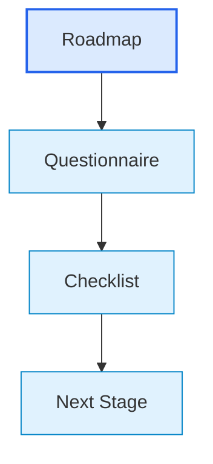

# Checklists Index / Индекс чек-листов готовности

## 1. Назначение документа

`00_Checklists_Index.md` определяет входную точку в слой чек-листов готовности этапов.

Чек-листы используются после заполнения roadmap-документов и анкет, чтобы проверить, можно ли переходить к следующему этапу разработки без пропуска обязательных решений.

> [!info] Главное
> Чек-лист проверяет готовность результата перед переходом к следующему этапу.

## 2. Место слоя в системе документации

Roadmap объясняет порядок мышления.

Анкета собирает проектные ответы.

Чек-лист проверяет готовность результата.

## 3. Правило применения чек-листов

Чек-лист применяется только после того, как по этапу уже есть проектные ответы.

Чек-лист не должен подменять roadmap и не должен собирать новые решения вместо анкеты.

Если пункт чек-листа не выполнен, переход к следующему этапу считается рискованным.

## 4. Чек-листы по маршруту разработки

- [[docs/09_checklists/01_Checklist_System_Design|Checklist: System Design]]
  - Проверяет: готовность логического проектирования системы.
  - Используется перед: проектированием архитектуры системы.

- [[docs/09_checklists/02_Checklist_System_Architecture_Design|Checklist: System Architecture Design]]
  - Проверяет: готовность архитектуры системы.
  - Используется перед: формированием технических требований.

- [[docs/09_checklists/03_Checklist_Technical_Requirements|Checklist: Technical Requirements]]
  - Проверяет: готовность технических требований.
  - Используется перед: связью требований с критериями выбора инструментария.

- [[docs/09_checklists/04_Checklist_Requirements_To_Toolchain_Map|Checklist: Requirements To Toolchain Map]]
  - Проверяет: готовность перехода от требований к критериям выбора.
  - Используется перед: выбором инструментария.

- [[docs/09_checklists/05_Checklist_Toolchain_Selection|Checklist: Toolchain Selection]]
  - Проверяет: готовность выбора инструментария.
  - Используется перед: архитектурой реализации.

- [[docs/09_checklists/06_Checklist_Implementation_Architecture|Checklist: Implementation Architecture]]
  - Проверяет: готовность структуры реализации.
  - Используется перед: написанием кода.

- [[docs/09_checklists/07_Checklist_Testing|Checklist: Testing]]
  - Проверяет: готовность тестирования.
  - Используется перед: эксплуатацией.

- [[docs/09_checklists/08_Checklist_Operation|Checklist: Operation]]
  - Проверяет: готовность эксплуатации.
  - Используется перед: рабочим применением и сопровождением.

- [[docs/09_checklists/09_Checklist_Maintenance|Checklist: Maintenance]]
  - Проверяет: готовность сопровождения.
  - Используется после: выявления дефектов, обновлений или регрессий.

- [[docs/09_checklists/10_Checklist_System_Evolution|Checklist: System Evolution]]
  - Проверяет: готовность развития системы.
  - Используется перед: добавлением новых функций или изменением существующих сценариев.

## 5. Универсальные статусы проверки

Каждый пункт чек-листа может иметь один из статусов:

- `[x]` выполнено;
- `[ ]` не выполнено;
- `[?]` требует уточнения;
- `[!]` блокирует переход к следующему этапу.

## 6. Критерий прохождения чек-листа

Этап считается готовым, если:

- все обязательные пункты выполнены;
- блокирующие вопросы вынесены в открытые вопросы;
- риски перехода к следующему этапу явно зафиксированы;
- есть ссылки на документы, из которых получены решения;
- следующий этап имеет достаточные входные данные.

## 7. Связанные документы

- [[docs/00_maps/00_Development_Route_Map|Development Route Map]]
  - Передаёт: порядок этапов разработки.
  - Используется для: нумерации и последовательности чек-листов.

- [[docs/00_maps/00_Documentation_Map|Documentation Map]]
  - Передаёт: структуру базы знаний.
  - Используется для: размещения слоя чек-листов.

- [[docs/03_roadmaps/01_Roadmap_System_Design|Roadmap: System Design]]
  - Передаёт: первый этап маршрута.
  - Используется для: проверки логической модели системы.

## 8. Следующий шаг

После проверки чек-листа необходимо либо перейти к следующему этапу, либо вернуть невыполненные пункты в открытые вопросы.

## 9. История изменений

- Initial version: создан индекс слоя чек-листов готовности этапов.
- Updated: документ приведён к единому визуальному формату проекта.
