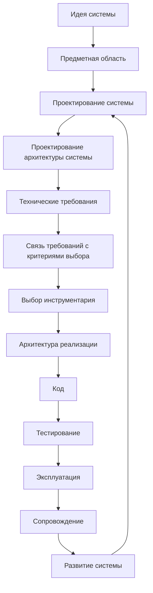
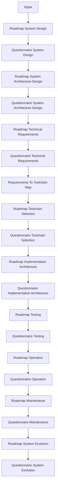
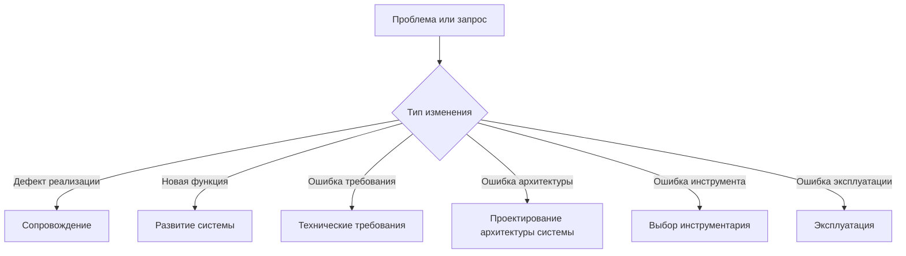

# Development Route Map

## 1. Назначение документа

`00_Development_Route_Map.md` определяет маршрут движения пользователя от идеи цифровой системы до реализации, проверки, эксплуатации, сопровождения и развития.

Документ используется как навигационная карта проектного процесса.

Документ не заменяет roadmap-документы и анкеты. Документ показывает порядок этапов, связи между ними, входные и выходные результаты каждого этапа.

## 2. Место документа в системе знаний

Документ относится к навигационному слою проекта Programming Digital Systems.

Документ используется после [[PROJECT_SCOPE|PROJECT_SCOPE]] и [[docs/00_maps/00_Documentation_Map|Documentation Map]].

Документ передаёт маршрут разработки в roadmap-документы, анкеты, примеры и будущие книги.

## 3. Главный маршрут разработки

## 4. Логика маршрута

Маршрут должен исключать хаотичное движение от идеи сразу к коду.

Каждый этап должен получать входные данные от предыдущего этапа и передавать выходные данные следующему этапу.

Если этап пропущен, следующее решение считается неполным.

Проектирование архитектуры системы должно быть отдельным этапом между проектированием системы и техническими требованиями.

Технические требования должны быть отделены от выбора инструментария.

Связь требований с выбором инструментария должна проходить через отдельную карту перехода: [[docs/00_maps/04_Requirements_To_Toolchain_Map|Requirements To Toolchain Map]].

Архитектура реализации должна быть отдельным этапом после выбора инструментария и до кода.

Эксплуатация, сопровождение и развитие системы должны быть разделены как разные виды работы.

## 5. Этапы маршрута

### 5.1. Идея системы

Назначение: зафиксировать исходный замысел.

Выходные данные:

- краткое описание идеи;
- цель системы;
- ожидаемый результат;
- первичные ограничения.

Следующий этап:

- предметная область.

### 5.2. Предметная область

Назначение: определить область реального или цифрового мира, в которой работает система.

Выходные данные:

- словарь предметной области;
- список основных объектов;
- список процессов;
- список ограничений.

Следующий этап:

- проектирование системы.

### 5.3. Проектирование системы

Назначение: описать будущую систему до проектирования архитектуры и выбора инструментов реализации.

Необходимо определить:

- сущности;
- данные;
- правила;
- состояния;
- события;
- потоки;
- хранение;
- ошибки.

Главные документы:

- [[docs/03_roadmaps/01_Roadmap_System_Design|Roadmap: System Design]]
  - Передаёт: правила проектирования системы.
  - Используется для: определения сущностей, данных, правил, состояний, событий, потоков, хранения и ошибок.
  - Ограничение: не выбирает инструментарий.

- [[docs/04_questionnaires/01_Questionnaire_System_Design|Questionnaire: System Design]]
  - Передаёт: вопросы для практического заполнения проектирования системы.
  - Используется для: получения конкретных проектных ответов.
  - Ограничение: не заменяет roadmap.

Выходные данные:

- модель системы;
- список проектных решений;
- входные данные для проектирования архитектуры системы.

Следующий этап:

- проектирование архитектуры системы.

### 5.4. Проектирование архитектуры системы

Назначение: определить архитектурную организацию системы до формирования технических требований и до выбора конкретного инструментария.

Главные документы:

- [[docs/03_roadmaps/02_Roadmap_System_Architecture_Design|Roadmap: System Architecture Design]]
  - Передаёт: правила архитектуры системы.
  - Используется для: описания слоёв, модулей, моделей, интерфейсов, зависимостей, конфигураций и точек расширения.
  - Ограничение: не подменяет архитектуру реализации.

- [[docs/04_questionnaires/02_Questionnaire_System_Architecture_Design|Questionnaire: System Architecture Design]]
  - Передаёт: вопросы для практического заполнения архитектуры системы.
  - Используется для: фиксации архитектурных решений.
  - Ограничение: не выбирает инструментарий.

Выходные данные:

- архитектурная модель системы;
- список архитектурных решений;
- ограничения для технических требований;
- входные данные для выбора инструментария и архитектуры реализации.

Следующий этап:

- технические требования.

### 5.5. Технические требования

Назначение: определить проверяемые технические условия, которым система должна соответствовать.

Главные документы:

- [[docs/03_roadmaps/03_Roadmap_Technical_Requirements|Roadmap: Technical Requirements]]
  - Передаёт: правила формирования технических требований.
  - Используется для: определения проверяемых условий.
  - Ограничение: не выбирает инструменты.

- [[docs/04_questionnaires/03_Questionnaire_Technical_Requirements|Questionnaire: Technical Requirements]]
  - Передаёт: вопросы для заполнения требований.
  - Используется для: формирования конкретного списка требований.
  - Ограничение: не выбирает инструментарий.

Выходные данные:

- проверяемые технические требования;
- критерии выполнения;
- способы проверки;
- список требований, влияющих на выбор инструментария.

Следующий этап:

- связь требований с критериями выбора инструментария.

### 5.6. Связь требований с критериями выбора

Назначение: преобразовать технические требования в критерии выбора инструментов.

Главный документ:

- [[docs/00_maps/04_Requirements_To_Toolchain_Map|Requirements To Toolchain Map]]
  - Передаёт: трассировку от требования к критерию выбора инструмента.
  - Используется для: предотвращения прямого выбора инструмента без критерия.
  - Ограничение: не выбирает инструменты.

Выходные данные:

- трассировка требования к инструменту;
- критерии выбора инструментария;
- входные данные для выбора инструментария.

Следующий этап:

- выбор инструментария.

### 5.7. Выбор инструментария

Назначение: выбрать инструменты реализации на основании требований, архитектуры системы и критериев выбора.

Главные документы:

- [[docs/03_roadmaps/05_Roadmap_Toolchain_Selection|Roadmap: Toolchain Selection]]
  - Передаёт: правила выбора инструментария.
  - Используется для: выбора инструментов на основе требований и архитектурных ограничений.
  - Ограничение: не меняет требования.

- [[docs/03_roadmaps/05_Toolchain_Selection_Category_Rules|Toolchain Selection Category Rules]]
  - Передаёт: условия применения базовых, прикладных и специализированных категорий инструментов.
  - Используется для: предотвращения ошибочного выбора PLC/embedded/CNC там, где они не нужны.
  - Ограничение: не выбирает конкретный инструмент.

- [[docs/04_questionnaires/05_Questionnaire_Toolchain_Selection|Questionnaire: Toolchain Selection]]
  - Передаёт: вопросы выбора инструментария.
  - Используется для: фиксации решений по инструментам.
  - Ограничение: не формирует требования заново.

Выходные данные:

- утверждённый набор инструментов;
- обоснование выбора;
- отклонённые альтернативы;
- ограничения выбранных инструментов.

Следующий этап:

- архитектура реализации.

### 5.8. Архитектура реализации

Назначение: определить, как архитектура системы будет реализована в конкретной структуре проекта, модулей, файлов, адаптеров, конфигурации и тестов.

Главные документы:

- [[docs/03_roadmaps/06_Roadmap_Implementation_Architecture|Roadmap: Implementation Architecture]]
  - Передаёт: правила проектирования структуры реализации.
  - Используется для: подготовки структуры проекта, модулей, адаптеров, конфигурации, тестов и зависимостей.
  - Ограничение: не пишет код.

- [[docs/04_questionnaires/06_Questionnaire_Implementation_Architecture|Questionnaire: Implementation Architecture]]
  - Передаёт: вопросы архитектуры реализации.
  - Используется для: фиксации дерева проекта, модулей, точек входа и зависимостей.
  - Ограничение: не заменяет код.

Выходные данные:

- дерево проекта;
- список модулей реализации;
- список точек входа;
- правила зависимостей;
- входные данные для кодирования и тестирования.

Следующий этап:

- код.

### 5.9. Код

Назначение: реализовать систему согласно утверждённой архитектуре системы, архитектуре реализации, требованиям и выбранному инструментарию.

Выходные данные:

- рабочая реализация;
- тестируемые модули;
- технические артефакты проекта.

Следующий этап:

- тестирование.

### 5.10. Тестирование

Назначение: проверить соответствие системы требованиям, архитектуре и ожидаемым сценариям работы.

Главные документы:

- [[docs/03_roadmaps/07_Roadmap_Testing|Roadmap: Testing]]
  - Передаёт: правила тестирования требований, модулей, интерфейсов, ошибок и сценариев.
  - Используется для: подтверждения качества системы.
  - Ограничение: не подменяет эксплуатацию.

- [[docs/04_questionnaires/07_Questionnaire_Testing|Questionnaire: Testing]]
  - Передаёт: вопросы проектирования тестирования.
  - Используется для: фиксации тестов, данных, сценариев и критериев приёмки.
  - Ограничение: не исправляет код.

Выходные данные:

- список тестов;
- результаты тестирования;
- список дефектов;
- решение о готовности к эксплуатации.

Следующий этап:

- эксплуатация.

### 5.11. Эксплуатация

Назначение: определить правила использования системы в реальной рабочей среде.

Главные документы:

- [[docs/03_roadmaps/08_Roadmap_Operation|Roadmap: Operation]]
  - Передаёт: правила запуска, остановки, рабочих сценариев, ошибок, логов и ограничений эксплуатации.
  - Используется для: подготовки системы к рабочему использованию.
  - Ограничение: не подменяет сопровождение.

- [[docs/04_questionnaires/08_Questionnaire_Operation|Questionnaire: Operation]]
  - Передаёт: вопросы подготовки эксплуатации.
  - Используется для: фиксации ролей, сценариев, ошибок, логов и ограничений.
  - Ограничение: не исправляет систему.

Выходные данные:

- эксплуатационная инструкция;
- рабочие сценарии;
- список эксплуатационных ошибок;
- список логов и диагностических данных;
- входные данные для сопровождения.

Следующий этап:

- сопровождение.

### 5.12. Сопровождение

Назначение: определить правила исправления, обновления и контроля изменений после начала эксплуатации.

Главные документы:

- [[docs/03_roadmaps/09_Roadmap_Maintenance|Roadmap: Maintenance]]
  - Передаёт: правила регистрации дефектов, исправлений, регрессии, обновлений и журнала изменений.
  - Используется для: сопровождения системы.
  - Ограничение: не подменяет развитие системы.

- [[docs/04_questionnaires/09_Questionnaire_Maintenance|Questionnaire: Maintenance]]
  - Передаёт: вопросы сопровождения.
  - Используется для: фиксации дефектов, причин, исправлений, проверок и обновлений.
  - Ограничение: не добавляет новые функции скрыто.

Выходные данные:

- список дефектов;
- список исправлений;
- журнал изменений;
- обновлённая документация;
- список запросов на развитие системы.

Следующий этап:

- развитие системы.

### 5.13. Развитие системы

Назначение: определить порядок расширения системы без разрушения архитектуры, требований, тестов и эксплуатационной стабильности.

Главные документы:

- [[docs/03_roadmaps/10_Roadmap_System_Evolution|Roadmap: System Evolution]]
  - Передаёт: правила анализа новых функций, сценариев, данных, интерфейсов и интеграций.
  - Используется для: развития системы без разрушения архитектуры.
  - Ограничение: не маскирует дефекты как новые функции.

- [[docs/04_questionnaires/10_Questionnaire_System_Evolution|Questionnaire: System Evolution]]
  - Передаёт: вопросы анализа развития.
  - Используется для: фиксации запроса, анализа влияния, совместимости и решения.
  - Ограничение: не заменяет требования и архитектуру.

Выходные данные:

- карточка запроса развития;
- анализ влияния;
- список изменяемых требований;
- список архитектурных изменений;
- список изменений реализации;
- список новых тестов;
- решение по запросу развития.

Следующий этап:

- возврат к нужному этапу маршрута: проектирование системы, требования, архитектура, инструментарий, реализация, тестирование или эксплуатация.

## 6. Запрещённые переходы

Запрещено переходить:

- от идеи сразу к коду;
- от проектирования системы сразу к техническим требованиям без проектирования архитектуры системы;
- от проектирования системы сразу к выбору библиотеки;
- от технических требований напрямую к названию инструмента без критериев выбора;
- от технических требований к коду без выбора инструментария;
- от выбора инструментария к коду без архитектуры реализации;
- от кода к эксплуатации без тестирования;
- от эксплуатации к хаотичному исправлению без сопровождения;
- от сопровождения к добавлению новой функции без процесса развития системы;
- к развитию системы без анализа влияния на систему, требования, архитектуру, инструментарий, реализацию и тестирование.

## 7. Связь маршрута с типами документов

## 8. Возвраты по маршруту

Развитие системы и сопровождение могут требовать возврата к предыдущим этапам.

## 9. Критерии актуальности маршрута

Документ считается актуальным, если:

- маршрут соответствует [[PROJECT_SCOPE|PROJECT_SCOPE]];
- этапы не противоречат [[docs/00_maps/00_Documentation_Map|Documentation Map]];
- каждый этап имеет назначение;
- каждый этап имеет выходные данные;
- проектирование архитектуры системы выделено отдельно;
- архитектура системы не смешана с архитектурой реализации;
- технические требования отделены от выбора инструментария;
- связь требований и инструментария выделена отдельным этапом;
- эксплуатация, сопровождение и развитие системы разделены;
- запрещённые переходы зафиксированы;
- связанные roadmap-документы и анкеты соответствуют маршруту.

## 10. Связанные документы

### Входные документы

- [[PROJECT_SCOPE|PROJECT_SCOPE]]
  - Передаёт: масштаб проекта, базовый маршрут разработки и разделение уровней проектирования.
  - Используется для: определения главных этапов маршрута.
  - Ограничение: не раскрывает каждый этап подробно.

- [[docs/00_maps/00_Documentation_Map|Documentation Map]]
  - Передаёт: структуру базы знаний и список документационных слоёв.
  - Используется для: связи маршрута с roadmap-документами и анкетами.
  - Ограничение: не является подробной картой процесса разработки.

### Выходные документы

- [[docs/03_roadmaps/01_Roadmap_System_Design|Roadmap: System Design]]
  - Получает: этап проектирования системы.
  - Используется для: подробного описания сущностей, данных, правил, состояний, событий, потоков, хранения и ошибок.
  - Ограничение: не должен выбирать инструменты реализации и не должен подменять проектирование архитектуры системы.

- [[docs/03_roadmaps/02_Roadmap_System_Architecture_Design|Roadmap: System Architecture Design]]
  - Получает: этап проектирования архитектуры системы.
  - Используется для: описания слоёв, модулей, моделей, интерфейсов, зависимостей, конфигураций и точек расширения.
  - Ограничение: не должен подменять архитектуру реализации и выбор инструментария.

- [[docs/03_roadmaps/03_Roadmap_Technical_Requirements|Roadmap: Technical Requirements]]
  - Получает: этап технических требований.
  - Используется для: формирования проверяемых технических условий.
  - Ограничение: не должен подменять выбор инструментария.

- [[docs/00_maps/04_Requirements_To_Toolchain_Map|Requirements To Toolchain Map]]
  - Получает: этап связи требований с критериями выбора инструментария.
  - Используется для: трассировки требований к инструментам.
  - Ограничение: не должен выбирать инструменты.

- [[docs/03_roadmaps/05_Roadmap_Toolchain_Selection|Roadmap: Toolchain Selection]]
  - Получает: этап выбора инструментария.
  - Используется для: выбора инструментов на основе требований, критериев и архитектуры системы.
  - Ограничение: не должен изменять утверждённые требования.

- [[docs/03_roadmaps/06_Roadmap_Implementation_Architecture|Roadmap: Implementation Architecture]]
  - Получает: этап архитектуры реализации.
  - Используется для: проектирования структуры проекта и реализации.
  - Ограничение: не должен писать код.

- [[docs/03_roadmaps/07_Roadmap_Testing|Roadmap: Testing]]
  - Получает: этап тестирования.
  - Используется для: проверки требований и поведения системы.
  - Ограничение: не должен подменять эксплуатацию.

- [[docs/03_roadmaps/08_Roadmap_Operation|Roadmap: Operation]]
  - Получает: этап эксплуатации.
  - Используется для: подготовки системы к рабочему использованию.
  - Ограничение: не должен подменять сопровождение.

- [[docs/03_roadmaps/09_Roadmap_Maintenance|Roadmap: Maintenance]]
  - Получает: этап сопровождения.
  - Используется для: исправлений, обновлений и контроля изменений.
  - Ограничение: не должен подменять развитие системы.

- [[docs/03_roadmaps/10_Roadmap_System_Evolution|Roadmap: System Evolution]]
  - Получает: этап развития системы.
  - Используется для: анализа новых возможностей и изменений системы.
  - Ограничение: не должен маскировать дефекты как новые функции.

## 11. История изменений

- Updated: маршрут расширен до полного жизненного цикла: требования, связь требований с инструментарием, выбор инструментария, архитектура реализации, тестирование, эксплуатация, сопровождение и развитие системы.
- Updated: документ приведён к Obsidian wikilinks.
