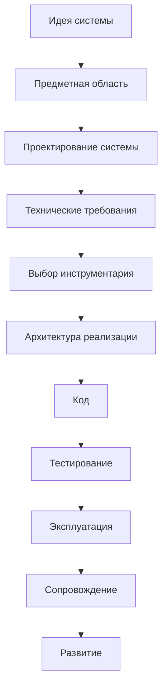
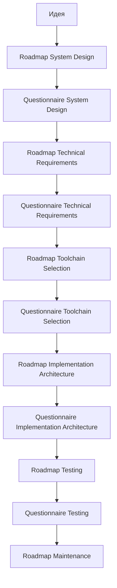

# Development Route Map

## 1. Назначение документа

`Development_Route_Map.md` определяет маршрут движения пользователя от идеи цифровой системы до реализации, проверки, эксплуатации, сопровождения и развития.

Документ используется как навигационная карта проектного процесса.

Документ не заменяет roadmap-документы. Документ показывает порядок этапов и связи между ними.

## 2. Место документа в системе знаний

Документ относится к навигационному слою проекта Programming Digital Systems.

Документ используется после `PROJECT_SCOPE.md` и `docs/00_maps/Documentation_Map.md`.

Документ передаёт маршрут разработки в roadmap-документы и анкеты.

## 3. Главный маршрут разработки

## 4. Логика маршрута

Маршрут должен исключать хаотичное движение от идеи сразу к коду.

Каждый этап должен получать входные данные от предыдущего этапа и передавать выходные данные следующему этапу.

Если этап пропущен, следующее решение считается неполным.

## 5. Этапы маршрута

### 5.1. Идея системы

Назначение: зафиксировать исходный замысел.

Необходимо определить:

- какую проблему решает система;
- для кого создаётся система;
- какой результат должен быть получен;
- какие ограничения уже известны.

Выходные данные:

- краткое описание идеи;
- цель системы;
- ожидаемый результат;
- первичные ограничения.

### 5.2. Предметная область

Назначение: определить область реального или цифрового мира, в которой работает система.

Необходимо определить:

- участников;
- объекты;
- процессы;
- термины;
- правила предметной области.

Выходные данные:

- словарь предметной области;
- список основных объектов;
- список процессов;
- список ограничений.

### 5.3. Проектирование системы

Назначение: описать будущую систему до выбора инструментов реализации.

Необходимо определить:

- сущности;
- данные;
- правила;
- состояния;
- события;
- потоки;
- хранение;
- ошибки.

Выходные данные:

- модель системы;
- список проектных решений;
- входные данные для технических требований.

### 5.4. Технические требования

Назначение: определить технические условия, которым система должна соответствовать.

Необходимо определить:

- требования к данным;
- требования к обработке;
- требования к хранению;
- требования к производительности;
- требования к надёжности;
- требования к ошибкам;
- требования к интерфейсам;
- требования к тестируемости.

Выходные данные:

- проверяемые технические требования;
- ограничения для выбора инструментария;
- критерии технической готовности.

### 5.5. Выбор инструментария

Назначение: выбрать язык, библиотеки, фреймворки, базы данных, протоколы и вспомогательные инструменты.

Необходимо определить:

- какие инструменты закрывают технические требования;
- какие инструменты не подходят;
- какие компромиссы принимаются;
- какие внешние ограничения влияют на выбор.

Выходные данные:

- утверждённый стек реализации;
- обоснование выбора;
- ограничения инструментов.

### 5.6. Архитектура реализации

Назначение: определить структуру компонентов, модулей, слоёв, интерфейсов и зависимостей.

Необходимо определить:

- компоненты;
- модули;
- слои;
- интерфейсы;
- зависимости;
- точки расширения;
- границы ответственности.

Выходные данные:

- архитектурная схема;
- структура проекта;
- правила реализации.

### 5.7. Код

Назначение: реализовать систему согласно утверждённой архитектуре и требованиям.

Необходимо обеспечить:

- соответствие кода архитектуре;
- читаемость;
- тестируемость;
- обработку ошибок;
- воспроизводимость результата.

Выходные данные:

- рабочая реализация;
- тестируемые модули;
- технические артефакты проекта.

### 5.8. Тестирование

Назначение: проверить соответствие системы требованиям.

Необходимо определить:

- что проверяется;
- как проверяется;
- какие тестовые данные используются;
- какой результат считается правильным;
- какие ошибки блокируют выпуск.

Выходные данные:

- результаты тестов;
- список дефектов;
- решение о готовности.

### 5.9. Эксплуатация

Назначение: определить правила использования системы в реальной среде.

Необходимо определить:

- порядок запуска;
- порядок настройки;
- ограничения эксплуатации;
- действия пользователя при ошибках;
- правила сохранения данных.

Выходные данные:

- эксплуатационная инструкция;
- правила работы пользователя;
- список эксплуатационных ограничений.

### 5.10. Сопровождение

Назначение: определить правила исправления, обновления и контроля изменений.

Необходимо определить:

- как фиксируются изменения;
- как проверяется совместимость;
- как обновляются документы;
- как контролируются ошибки после выпуска.

Выходные данные:

- журнал изменений;
- правила обновления;
- процесс сопровождения.

### 5.11. Развитие

Назначение: определить порядок расширения системы без разрушения архитектуры.

Необходимо определить:

- новые требования;
- влияние на текущую архитектуру;
- необходимость изменения данных;
- необходимость изменения интерфейсов;
- необходимость изменения тестов.

Выходные данные:

- план развития;
- новые проектные решения;
- обновлённые требования.

## 6. Запрещённые переходы

Запрещено переходить:

- от идеи сразу к коду;
- от проектирования системы сразу к выбору библиотеки без технических требований;
- от технических требований к коду без выбора инструментария;
- от выбора инструментария к коду без архитектуры реализации;
- от кода к эксплуатации без тестирования;
- к развитию системы без анализа влияния на требования и архитектуру.

## 7. Связь маршрута с типами документов

## 8. Критерии актуальности маршрута

Документ считается актуальным, если:

- маршрут соответствует `PROJECT_SCOPE.md`;
- этапы не противоречат `docs/00_maps/Documentation_Map.md`;
- каждый этап имеет назначение;
- каждый этап имеет выходные данные;
- запрещённые переходы зафиксированы;
- связанные roadmap-документы могут быть созданы по этому маршруту.

## 9. Связанные документы

### Входные документы

- `PROJECT_SCOPE.md`
  - Передаёт: масштаб проекта и базовый маршрут разработки.
  - Используется для: определения главных этапов маршрута.
  - Ограничение: не раскрывает каждый этап подробно.

- `docs/00_maps/Documentation_Map.md`
  - Передаёт: структуру базы знаний и список документационных слоёв.
  - Используется для: связи маршрута с roadmap-документами и анкетами.
  - Ограничение: не является подробной картой процесса разработки.

### Выходные документы

- `docs/03_roadmaps/Roadmap_System_Design.md`
  - Получает: этап проектирования системы.
  - Используется для: подробного описания проектирования сущностей, данных, правил, состояний, событий, потоков, хранения и ошибок.
  - Ограничение: не должен выбирать инструменты реализации.

- `docs/03_roadmaps/Roadmap_Technical_Requirements.md`
  - Получает: этап технических требований.
  - Используется для: формирования проверяемых технических условий.
  - Ограничение: не должен подменять выбор инструментария.

- `docs/03_roadmaps/Roadmap_Toolchain_Selection.md`
  - Получает: этап выбора инструментария.
  - Используется для: выбора инструментов на основе требований.
  - Ограничение: не должен изменять утверждённые требования.
