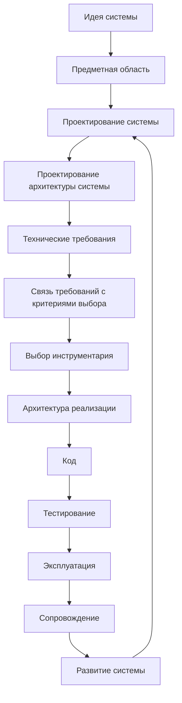
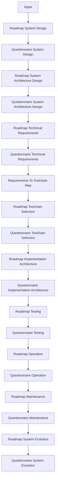
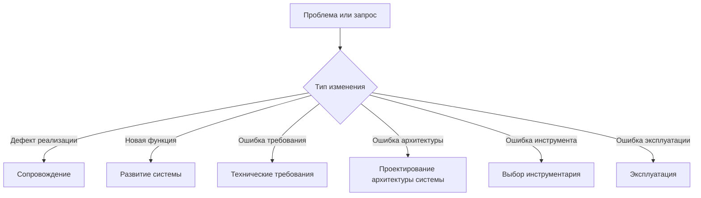

# Development Route Map

## 1. Назначение документа

`Development_Route_Map.md` определяет маршрут движения пользователя от идеи цифровой системы до реализации, проверки, эксплуатации, сопровождения и развития.

Документ используется как навигационная карта проектного процесса.

Документ не заменяет roadmap-документы и анкеты. Документ показывает порядок этапов, связи между ними, входные и выходные результаты каждого этапа.

## 2. Место документа в системе знаний

Документ относится к навигационному слою проекта Programming Digital Systems.

Документ используется после `PROJECT_SCOPE.md` и `docs/00_maps/Documentation_Map.md`.

Документ передаёт маршрут разработки в roadmap-документы, анкеты, примеры и будущие книги.

## 3. Главный маршрут разработки

## 4. Логика маршрута

Маршрут должен исключать хаотичное движение от идеи сразу к коду.

Каждый этап должен получать входные данные от предыдущего этапа и передавать выходные данные следующему этапу.

Если этап пропущен, следующее решение считается неполным.

Проектирование архитектуры системы должно быть отдельным этапом между проектированием системы и техническими требованиями.

Технические требования должны быть отделены от выбора инструментария.

Связь требований с выбором инструментария должна проходить через отдельную карту перехода.

Архитектура реализации должна быть отдельным этапом после выбора инструментария и до кода.

Эксплуатация, сопровождение и развитие системы должны быть разделены как разные виды работы.

## 5. Этапы маршрута

### 5.1. Идея системы

Назначение: зафиксировать исходный замысел.

Необходимо определить:

- какую проблему решает система;
- для кого создаётся система;
- какой результат должен быть получен;
- какие ограничения уже известны.

Выходные данные:

- краткое описание идеи;
- цель системы;
- ожидаемый результат;
- первичные ограничения.

Следующий этап:

- предметная область.

### 5.2. Предметная область

Назначение: определить область реального или цифрового мира, в которой работает система.

Необходимо определить:

- участников;
- объекты;
- процессы;
- термины;
- правила предметной области.

Выходные данные:

- словарь предметной области;
- список основных объектов;
- список процессов;
- список ограничений.

Следующий этап:

- проектирование системы.

### 5.3. Проектирование системы

Назначение: описать будущую систему до проектирования архитектуры и выбора инструментов реализации.

Необходимо определить:

- сущности;
- данные;
- правила;
- состояния;
- события;
- потоки;
- хранение;
- ошибки.

Главные документы:

- `docs/03_roadmaps/Roadmap_System_Design.md`;
- `docs/04_questionnaires/Questionnaire_System_Design.md`.

Выходные данные:

- модель системы;
- список проектных решений;
- входные данные для проектирования архитектуры системы.

Следующий этап:

- проектирование архитектуры системы.

### 5.4. Проектирование архитектуры системы

Назначение: определить архитектурную организацию системы до формирования технических требований и до выбора конкретного инструментария.

Необходимо определить:

- слои;
- модули;
- модели;
- интерфейсы;
- зависимости;
- конфигурации;
- точки расширения;
- границы ответственности архитектурных частей.

Главные документы:

- `docs/03_roadmaps/Roadmap_System_Architecture_Design.md`;
- `docs/04_questionnaires/Questionnaire_System_Architecture_Design.md`.

Выходные данные:

- архитектурная модель системы;
- список архитектурных решений;
- ограничения для технических требований;
- входные данные для выбора инструментария и архитектуры реализации.

Следующий этап:

- технические требования.

### 5.5. Технические требования

Назначение: определить проверяемые технические условия, которым система должна соответствовать.

Необходимо определить:

- требования к данным;
- требования к обработке;
- требования к хранению;
- требования к интерфейсам;
- требования к производительности;
- требования к надёжности;
- требования к ошибкам и диагностике;
- требования к конфигурации;
- требования к расширяемости;
- требования к тестируемости;
- требования к безопасности;
- требования к окружению;
- требования к эксплуатации;
- требования к сопровождению;
- требования к документации.

Главные документы:

- `docs/03_roadmaps/Roadmap_Technical_Requirements.md`;
- `docs/04_questionnaires/Questionnaire_Technical_Requirements.md`.

Выходные данные:

- проверяемые технические требования;
- критерии выполнения;
- способы проверки;
- список требований, влияющих на выбор инструментария.

Следующий этап:

- связь требований с критериями выбора инструментария.

### 5.6. Связь требований с критериями выбора

Назначение: преобразовать технические требования в критерии выбора инструментов.

Необходимо определить:

- какое требование влияет на инструментарий;
- смысл требования;
- категорию инструмента;
- критерии выбора;
- кандидаты инструментов;
- ограничения выбранного инструмента.

Главный документ:

- `docs/00_maps/Requirements_To_Toolchain_Map.md`.

Выходные данные:

- трассировка требования к инструменту;
- критерии выбора инструментария;
- входные данные для выбора инструментария.

Следующий этап:

- выбор инструментария.

### 5.7. Выбор инструментария

Назначение: выбрать инструменты реализации на основании требований, архитектуры системы и критериев выбора.

Необходимо определить:

- базовый инструментарий;
- прикладной инструментарий;
- специализированный инструментарий;
- язык программирования;
- среду выполнения;
- инструменты интерфейса;
- инструменты хранения;
- форматы файлов;
- библиотеки и фреймворки;
- протоколы обмена;
- инструменты тестирования;
- инструменты логирования;
- инструменты документации;
- инструменты сборки и развёртывания.

Главные документы:

- `docs/03_roadmaps/Roadmap_Toolchain_Selection.md`;
- `docs/03_roadmaps/Toolchain_Selection_Category_Rules.md`;
- `docs/04_questionnaires/Questionnaire_Toolchain_Selection.md`.

Выходные данные:

- утверждённый набор инструментов;
- обоснование выбора;
- отклонённые альтернативы;
- ограничения выбранных инструментов.

Следующий этап:

- архитектура реализации.

### 5.8. Архитектура реализации

Назначение: определить, как архитектура системы будет реализована в конкретной структуре проекта, модулей, файлов, адаптеров, конфигурации и тестов.

Необходимо определить:

- структуру проекта;
- директории;
- модули реализации;
- точки входа;
- адаптеры;
- конфигурацию;
- ошибки и логирование;
- тестовую структуру;
- сборку и запуск;
- правила зависимостей.

Главные документы:

- `docs/03_roadmaps/Roadmap_Implementation_Architecture.md`;
- `docs/04_questionnaires/Questionnaire_Implementation_Architecture.md`.

Выходные данные:

- дерево проекта;
- список модулей реализации;
- список точек входа;
- правила зависимостей;
- входные данные для кодирования и тестирования.

Следующий этап:

- код.

### 5.9. Код

Назначение: реализовать систему согласно утверждённой архитектуре системы, архитектуре реализации, требованиям и выбранному инструментарию.

Необходимо обеспечить:

- соответствие кода архитектуре;
- читаемость;
- тестируемость;
- обработку ошибок;
- воспроизводимость результата;
- соблюдение правил зависимостей.

Выходные данные:

- рабочая реализация;
- тестируемые модули;
- технические артефакты проекта.

Следующий этап:

- тестирование.

### 5.10. Тестирование

Назначение: проверить соответствие системы требованиям, архитектуре и ожидаемым сценариям работы.

Необходимо определить:

- проверяемые требования;
- объекты тестирования;
- виды тестирования;
- тестовые данные;
- успешные сценарии;
- ошибочные сценарии;
- проверки интерфейсов;
- проверки производительности;
- проверки безопасности;
- регрессионные проверки;
- ручные проверки;
- действия при провале теста;
- фиксацию результатов.

Главные документы:

- `docs/03_roadmaps/Roadmap_Testing.md`;
- `docs/04_questionnaires/Questionnaire_Testing.md`.

Выходные данные:

- список тестов;
- результаты тестирования;
- список дефектов;
- решение о готовности к эксплуатации.

Следующий этап:

- эксплуатация.

### 5.11. Эксплуатация

Назначение: определить правила использования системы в реальной рабочей среде.

Необходимо определить:

- пользователей и операторов;
- запуск;
- остановку;
- рабочие сценарии;
- входные данные эксплуатации;
- результаты эксплуатации;
- эксплуатационные ошибки;
- действия при ошибках;
- логи и диагностику;
- резервное копирование и восстановление, если требуется;
- ограничения эксплуатации.

Главные документы:

- `docs/03_roadmaps/Roadmap_Operation.md`;
- `docs/04_questionnaires/Questionnaire_Operation.md`.

Выходные данные:

- эксплуатационная инструкция;
- рабочие сценарии;
- список эксплуатационных ошибок;
- список логов и диагностических данных;
- входные данные для сопровождения.

Следующий этап:

- сопровождение.

### 5.12. Сопровождение

Назначение: определить правила исправления, обновления и контроля изменений после начала эксплуатации.

Необходимо определить:

- регистрацию проблем;
- воспроизведение дефектов;
- анализ причины;
- тип проблемы;
- план исправления;
- регрессионную проверку;
- обновление документации;
- выпуск обновлений;
- откат;
- передачу запросов в развитие системы.

Главные документы:

- `docs/03_roadmaps/Roadmap_Maintenance.md`;
- `docs/04_questionnaires/Questionnaire_Maintenance.md`.

Выходные данные:

- список дефектов;
- список исправлений;
- журнал изменений;
- обновлённая документация;
- список запросов на развитие системы.

Следующий этап:

- развитие системы.

### 5.13. Развитие системы

Назначение: определить порядок расширения системы без разрушения архитектуры, требований, тестов и эксплуатационной стабильности.

Необходимо определить:

- запрос развития;
- причину развития;
- пользователя или потребителя;
- тип изменения;
- влияние на проектирование системы;
- влияние на технические требования;
- влияние на архитектуру системы;
- влияние на инструментарий;
- влияние на архитектуру реализации;
- влияние на тестирование;
- влияние на эксплуатацию;
- обратную совместимость;
- необходимость миграции.

Главные документы:

- `docs/03_roadmaps/Roadmap_System_Evolution.md`;
- `docs/04_questionnaires/Questionnaire_System_Evolution.md`.

Выходные данные:

- карточка запроса развития;
- анализ влияния;
- список изменяемых требований;
- список архитектурных изменений;
- список изменений реализации;
- список новых тестов;
- решение по запросу развития.

Следующий этап:

- возврат к нужному этапу маршрута: проектирование системы, требования, архитектура, инструментарий, реализация, тестирование или эксплуатация.

## 6. Запрещённые переходы

Запрещено переходить:

- от идеи сразу к коду;
- от проектирования системы сразу к техническим требованиям без проектирования архитектуры системы;
- от проектирования системы сразу к выбору библиотеки;
- от технических требований напрямую к названию инструмента без критериев выбора;
- от технических требований к коду без выбора инструментария;
- от выбора инструментария к коду без архитектуры реализации;
- от кода к эксплуатации без тестирования;
- от эксплуатации к хаотичному исправлению без сопровождения;
- от сопровождения к добавлению новой функции без процесса развития системы;
- к развитию системы без анализа влияния на систему, требования, архитектуру, инструментарий, реализацию и тестирование.

## 7. Связь маршрута с типами документов

## 8. Возвраты по маршруту

Развитие системы и сопровождение могут требовать возврата к предыдущим этапам.

## 9. Критерии актуальности маршрута

Документ считается актуальным, если:

- маршрут соответствует `PROJECT_SCOPE.md`;
- этапы не противоречат `docs/00_maps/Documentation_Map.md`;
- каждый этап имеет назначение;
- каждый этап имеет выходные данные;
- проектирование архитектуры системы выделено отдельно;
- архитектура системы не смешана с архитектурой реализации;
- технические требования отделены от выбора инструментария;
- связь требований и инструментария выделена отдельным этапом;
- эксплуатация, сопровождение и развитие системы разделены;
- запрещённые переходы зафиксированы;
- связанные roadmap-документы и анкеты соответствуют маршруту.

## 10. Связанные документы

### Входные документы

- `PROJECT_SCOPE.md`
  - Передаёт: масштаб проекта, базовый маршрут разработки и разделение уровней проектирования.
  - Используется для: определения главных этапов маршрута.
  - Ограничение: не раскрывает каждый этап подробно.

- `docs/00_maps/Documentation_Map.md`
  - Передаёт: структуру базы знаний и список документационных слоёв.
  - Используется для: связи маршрута с roadmap-документами и анкетами.
  - Ограничение: не является подробной картой процесса разработки.

### Выходные документы

- `docs/03_roadmaps/Roadmap_System_Design.md`
  - Получает: этап проектирования системы.
  - Используется для: подробного описания сущностей, данных, правил, состояний, событий, потоков, хранения и ошибок.
  - Ограничение: не должен выбирать инструменты реализации и не должен подменять проектирование архитектуры системы.

- `docs/03_roadmaps/Roadmap_System_Architecture_Design.md`
  - Получает: этап проектирования архитектуры системы.
  - Используется для: описания слоёв, модулей, моделей, интерфейсов, зависимостей, конфигураций и точек расширения.
  - Ограничение: не должен подменять архитектуру реализации и выбор инструментария.

- `docs/03_roadmaps/Roadmap_Technical_Requirements.md`
  - Получает: этап технических требований.
  - Используется для: формирования проверяемых технических условий.
  - Ограничение: не должен подменять выбор инструментария.

- `docs/00_maps/Requirements_To_Toolchain_Map.md`
  - Получает: этап связи требований с критериями выбора инструментария.
  - Используется для: трассировки требований к инструментам.
  - Ограничение: не должен выбирать инструменты.

- `docs/03_roadmaps/Roadmap_Toolchain_Selection.md`
  - Получает: этап выбора инструментария.
  - Используется для: выбора инструментов на основе требований, критериев и архитектуры системы.
  - Ограничение: не должен изменять утверждённые требования.

- `docs/03_roadmaps/Roadmap_Implementation_Architecture.md`
  - Получает: этап архитектуры реализации.
  - Используется для: проектирования структуры проекта и реализации.
  - Ограничение: не должен писать код.

- `docs/03_roadmaps/Roadmap_Testing.md`
  - Получает: этап тестирования.
  - Используется для: проверки требований и поведения системы.
  - Ограничение: не должен подменять эксплуатацию.

- `docs/03_roadmaps/Roadmap_Operation.md`
  - Получает: этап эксплуатации.
  - Используется для: подготовки системы к рабочему использованию.
  - Ограничение: не должен подменять сопровождение.

- `docs/03_roadmaps/Roadmap_Maintenance.md`
  - Получает: этап сопровождения.
  - Используется для: исправлений, обновлений и контроля изменений.
  - Ограничение: не должен подменять развитие системы.

- `docs/03_roadmaps/Roadmap_System_Evolution.md`
  - Получает: этап развития системы.
  - Используется для: анализа новых возможностей и изменений системы.
  - Ограничение: не должен маскировать дефекты как новые функции.

## 11. История изменений

- Updated: маршрут расширен до полного жизненного цикла: требования, связь требований с инструментарием, выбор инструментария, архитектура реализации, тестирование, эксплуатация, сопровождение и развитие системы.
