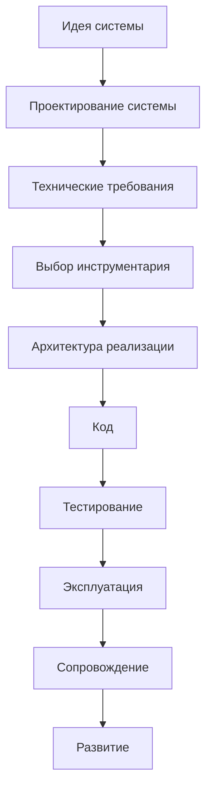
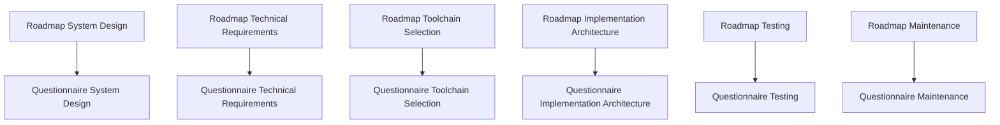
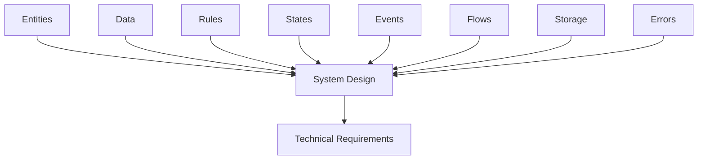

# Documentation Map

## 1. Назначение документа

`Documentation_Map.md` определяет карту документации проекта Programming Digital Systems.

Документ показывает структуру будущей базы знаний, связи между слоями документации и маршрут движения пользователя от идеи цифровой системы к реализации, проверке, сопровождению и развитию.

## 2. Место документа в системе знаний

Этот документ относится к навигационному слою проекта.

Документ используется для:

- понимания общей структуры базы знаний;
- поиска нужного документа;
- определения следующего шага проектирования;
- контроля связей между roadmap-документами, анкетами, регламентами, энциклопедическими статьями и примерами;
- подготовки проекта к масштабу учебного курса, книги, серии книг или энциклопедии.

## 3. Общая структура базы знаний

```text
Programming-Digital-Systems
|
|-- PROJECT_SCOPE.md
|
|-- docs/
|   |
|   |-- 00_maps/
|   |   |-- Documentation_Map.md
|   |   |-- Development_Route_Map.md
|   |   |-- Knowledge_Layer_Map.md
|   |
|   |-- 01_regulations/
|   |   |-- Documentation_System_Regulation.md
|   |   |-- Document_Writing_Rules.md
|   |   |-- Link_Rules.md
|   |   |-- Diagram_Rules.md
|   |
|   |-- 02_templates/
|   |   |-- Roadmap_Document_Template.md
|   |   |-- Questionnaire_Document_Template.md
|   |
|   |-- 03_roadmaps/
|   |   |-- Roadmap_System_Design.md
|   |   |-- Roadmap_Technical_Requirements.md
|   |   |-- Roadmap_Toolchain_Selection.md
|   |   |-- Roadmap_Implementation_Architecture.md
|   |   |-- Roadmap_Testing.md
|   |   |-- Roadmap_Maintenance.md
|   |
|   |-- 04_questionnaires/
|   |   |-- Questionnaire_System_Design.md
|   |   |-- Questionnaire_Technical_Requirements.md
|   |   |-- Questionnaire_Toolchain_Selection.md
|   |   |-- Questionnaire_Implementation_Architecture.md
|   |   |-- Questionnaire_Testing.md
|   |   |-- Questionnaire_Maintenance.md
|   |
|   |-- 05_encyclopedia/
|   |   |-- Entities.md
|   |   |-- Data.md
|   |   |-- Rules.md
|   |   |-- States.md
|   |   |-- Events.md
|   |   |-- Flows.md
|   |   |-- Storage.md
|   |   |-- Errors.md
|   |   |-- Interfaces.md
|   |   |-- Architecture.md
|   |
|   |-- 06_examples/
|   |   |-- Scripts/
|   |   |-- GUI/
|   |   |-- Web/
|   |   |-- Embedded/
|   |   |-- PLC/
|   |   |-- CNC_CAM/
|   |   |-- Databases/
|   |   |-- Integrations/
|   |
|   |-- 07_diagrams/
|   |   |-- System_Map.md
|   |   |-- Documentation_Map_Diagrams.md
|   |   |-- Development_Route_Diagrams.md
|   |
|   |-- 08_books/
|       |-- Book_01_Foundations.md
|       |-- Book_02_System_Design.md
|       |-- Book_03_Technical_Requirements.md
|       |-- Book_04_Toolchain_Selection.md
|       |-- Book_05_Implementation_Architecture.md
```

## 4. Слои документации

### 4.1. Масштаб проекта

Назначение слоя: определить цель, масштаб и границы проекта.

Документы:

- `PROJECT_SCOPE.md`

### 4.2. Навигационный слой

Назначение слоя: показывать карту базы знаний и маршруты движения пользователя.

Документы:

- `docs/00_maps/Documentation_Map.md`
- `docs/00_maps/Development_Route_Map.md`
- `docs/00_maps/Knowledge_Layer_Map.md`

### 4.3. Регламентный слой

Назначение слоя: определить правила создания, оформления, связывания и визуализации документов.

Документы:

- `docs/01_regulations/Documentation_System_Regulation.md`
- `docs/01_regulations/Document_Writing_Rules.md`
- `docs/01_regulations/Link_Rules.md`
- `docs/01_regulations/Diagram_Rules.md`

### 4.4. Шаблонный слой

Назначение слоя: задать единую структуру будущих документов.

Документы:

- `docs/02_templates/Roadmap_Document_Template.md`
- `docs/02_templates/Questionnaire_Document_Template.md`

### 4.5. Roadmap-слой

Назначение слоя: вести пользователя по этапам проектирования и разработки.

Документы:

- `docs/03_roadmaps/Roadmap_System_Design.md`
- `docs/03_roadmaps/Roadmap_Technical_Requirements.md`
- `docs/03_roadmaps/Roadmap_Toolchain_Selection.md`
- `docs/03_roadmaps/Roadmap_Implementation_Architecture.md`
- `docs/03_roadmaps/Roadmap_Testing.md`
- `docs/03_roadmaps/Roadmap_Maintenance.md`

### 4.6. Анкетный слой

Назначение слоя: превращать правила roadmap-документов в последовательность вопросов.

Документы:

- `docs/04_questionnaires/Questionnaire_System_Design.md`
- `docs/04_questionnaires/Questionnaire_Technical_Requirements.md`
- `docs/04_questionnaires/Questionnaire_Toolchain_Selection.md`
- `docs/04_questionnaires/Questionnaire_Implementation_Architecture.md`
- `docs/04_questionnaires/Questionnaire_Testing.md`
- `docs/04_questionnaires/Questionnaire_Maintenance.md`

### 4.7. Энциклопедический слой

Назначение слоя: раскрывать универсальные понятия цифрового мира.

Документы:

- `docs/05_encyclopedia/Entities.md`
- `docs/05_encyclopedia/Data.md`
- `docs/05_encyclopedia/Rules.md`
- `docs/05_encyclopedia/States.md`
- `docs/05_encyclopedia/Events.md`
- `docs/05_encyclopedia/Flows.md`
- `docs/05_encyclopedia/Storage.md`
- `docs/05_encyclopedia/Errors.md`
- `docs/05_encyclopedia/Interfaces.md`
- `docs/05_encyclopedia/Architecture.md`

### 4.8. Слой примеров

Назначение слоя: показывать применение универсальных правил в разных областях цифровых систем.

Категории:

- Скрипты автоматизации
  - Примеры: обработка файлов, генерация отчётов, парсинг данных.
- GUI-приложения
  - Примеры: настольная утилита, интерфейс оператора, редактор шаблонов.
- Web-системы
  - Примеры: API-сервис, личный кабинет, панель мониторинга.
- Embedded-системы
  - Примеры: контроллер датчиков, устройство сбора данных, управление клапанами.
- PLC-системы
  - Примеры: автоматический режим, аварийные межблокировки, управление технологическим процессом.
- CNC/CAM-системы
  - Примеры: постпроцессор, анализ NC-программ, контроль инструмента.
- Базы данных
  - Примеры: складской учёт, журнал измерений, история изменений.
- Интеграционные системы
  - Примеры: обмен между Excel и БД, обмен между PLC и GUI, REST API.

### 4.9. Слой диаграмм

Назначение слоя: хранить крупные диаграммы и визуальные карты, которые используются несколькими документами.

Документы:

- `docs/07_diagrams/System_Map.md`
- `docs/07_diagrams/Documentation_Map_Diagrams.md`
- `docs/07_diagrams/Development_Route_Diagrams.md`

### 4.10. Книжный слой

Назначение слоя: подготовить базу знаний к формату книги или серии книг.

Документы:

- `docs/08_books/Book_01_Foundations.md`
- `docs/08_books/Book_02_System_Design.md`
- `docs/08_books/Book_03_Technical_Requirements.md`
- `docs/08_books/Book_04_Toolchain_Selection.md`
- `docs/08_books/Book_05_Implementation_Architecture.md`

## 5. Главный маршрут разработки



## 6. Связь roadmap-документов и анкет



## 7. Связь энциклопедии с проектированием



## 8. Правило расширения карты

Карта документации должна обновляться при добавлении нового крупного документа, слоя или маршрута.

Новый документ должен быть добавлен в карту, если он:

- является частью маршрута разработки;
- является регламентом;
- является шаблоном;
- является анкетой;
- является энциклопедической статьёй;
- содержит диаграмму общего назначения;
- входит в структуру будущей книги или серии книг.

## 9. Критерии завершения карты

Карта считается актуальной, если:

- перечислены все основные слои документации;
- указаны главные документы каждого слоя;
- показан маршрут от идеи к реализации;
- показана связь roadmap-документов и анкет;
- показана связь энциклопедии с проектированием;
- новые документы не появляются вне карты.

## 10. Связанные документы

### Входные документы

- `PROJECT_SCOPE.md`
  - Передаёт: масштаб проекта, центральную формулу цифровой системы, области применения.
  - Используется для: построения общей карты базы знаний.
  - Ограничение: не описывает подробную структуру каждого слоя.

- `docs/01_regulations/Documentation_System_Regulation.md`
  - Передаёт: правила построения системы документации.
  - Используется для: определения слоёв и связей документации.
  - Ограничение: не является навигационной картой.

### Выходные документы

- `docs/00_maps/Development_Route_Map.md`
  - Получает: общий маршрут разработки.
  - Используется для: детального описания движения от идеи до сопровождения.
  - Ограничение: не должен дублировать всю карту документации.

- `docs/00_maps/Knowledge_Layer_Map.md`
  - Получает: структуру слоёв базы знаний.
  - Используется для: детального описания энциклопедического, учебного, roadmap- и анкетного слоёв.
  - Ограничение: не должен заменять roadmap-документы.
