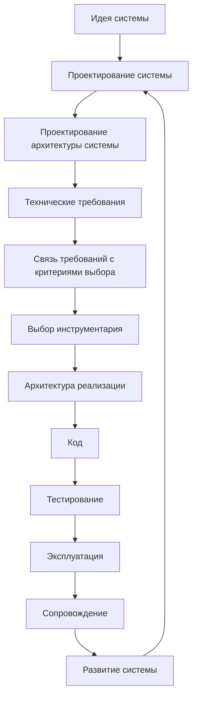
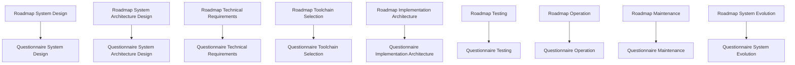

# Documentation Map

## 1. Назначение документа

`Documentation_Map.md` определяет карту документации проекта Programming Digital Systems.

Документ показывает структуру базы знаний, связи между слоями документации и маршрут движения пользователя от идеи цифровой системы к реализации, проверке, эксплуатации, сопровождению и развитию.

## 2. Главные входные точки

- [[PROJECT_SCOPE|PROJECT_SCOPE]]
  - Передаёт: масштаб проекта, центральную формулу цифровой системы, области применения и разделение уровней проектирования.
  - Используется для: понимания общего масштаба работы.
  - Ограничение: не заменяет карту документации.

- [[AGENTS|AGENTS]]
  - Передаёт: правила, которые AI-агент должен учитывать перед созданием и изменением документов.
  - Используется для: соблюдения структуры, маршрута и регламентов.
  - Ограничение: не заменяет регламенты и roadmap-документы.

- [[docs/00_maps/Development_Route_Map|Development Route Map]]
  - Передаёт: полный маршрут разработки от идеи до развития системы.
  - Используется для: понимания порядка движения по проекту.
  - Ограничение: не раскрывает подробно каждый этап.

- [[docs/00_maps/Knowledge_Layer_Map|Knowledge Layer Map]]
  - Передаёт: карту слоёв базы знаний.
  - Используется для: понимания назначения roadmap, анкет, энциклопедии, примеров и книг.
  - Ограничение: не заменяет маршрут разработки.

## 3. Общая структура базы знаний

```text
Programming-Digital-Systems
|
|-- PROJECT_SCOPE.md
|-- AGENTS.md
|-- docs/
|   |-- 00_maps/
|   |-- 01_regulations/
|   |-- 02_templates/
|   |-- 03_roadmaps/
|   |-- 04_questionnaires/
|   |-- 05_encyclopedia/
|   |-- 06_examples/
|   |-- 07_diagrams/
|   |-- 08_books/
```

## 4. Слои документации

### 4.1. Масштаб проекта

Назначение слоя: определить цель, масштаб и границы проекта.

Документы:

- [[PROJECT_SCOPE|PROJECT_SCOPE]]

### 4.2. Агентный слой

Назначение слоя: определить, какие документы и правила должен учитывать AI-агент при создании и изменении документации.

Документы:

- [[AGENTS|AGENTS]]

### 4.3. Навигационный слой

Назначение слоя: показывать карту базы знаний и маршруты движения пользователя.

Документы:

- [[docs/00_maps/Documentation_Map|Documentation Map]]
  - Передаёт: общую структуру базы знаний.
  - Используется для: ориентации в документации.
  - Ограничение: не заменяет подробные roadmap-документы.

- [[docs/00_maps/Development_Route_Map|Development Route Map]]
  - Передаёт: полный маршрут разработки.
  - Используется для: движения от идеи до развития системы.
  - Ограничение: не заменяет анкеты.

- [[docs/00_maps/Knowledge_Layer_Map|Knowledge Layer Map]]
  - Передаёт: карту слоёв знаний.
  - Используется для: понимания назначения каждого слоя документации.
  - Ограничение: не заменяет карту маршрута.

- [[docs/00_maps/Requirements_To_Toolchain_Map|Requirements To Toolchain Map]]
  - Передаёт: переход от технических требований к критериям выбора инструментария.
  - Используется для: предотвращения прямого выбора инструмента без критериев.
  - Ограничение: не заменяет документы требований и инструментария.

### 4.4. Регламентный слой

Назначение слоя: определить правила создания, оформления, связывания и визуализации документов.

Документы:

- [[docs/01_regulations/Documentation_System_Regulation|Documentation System Regulation]]
  - Передаёт: правила построения системы документации.
  - Используется для: согласования структуры документов.
  - Ограничение: не заменяет карту документации.

- [[docs/01_regulations/Document_Writing_Rules|Document Writing Rules]]
  - Передаёт: правила изложения и оформления.
  - Используется для: исключения личного шума и мусора.
  - Ограничение: не определяет маршрут разработки.

- [[docs/01_regulations/Link_Rules|Link Rules]]
  - Передаёт: правила Obsidian-ссылок.
  - Используется для: связывания документов между собой и отображения связей в Graph view.
  - Ограничение: не определяет содержание документов.

- [[docs/01_regulations/Diagram_Rules|Diagram Rules]]
  - Передаёт: правила использования диаграмм.
  - Используется для: визуального объяснения структуры и связей.
  - Ограничение: не заменяет текстовое содержание.

### 4.5. Шаблонный слой

Назначение слоя: задать единую структуру будущих документов.

Документы:

- [[docs/02_templates/Roadmap_Document_Template|Roadmap Document Template]]
  - Передаёт: структуру roadmap-документов.
  - Используется для: создания новых roadmap.
  - Ограничение: не содержит содержание конкретного этапа.

- [[docs/02_templates/Questionnaire_Document_Template|Questionnaire Document Template]]
  - Передаёт: структуру анкет.
  - Используется для: создания новых анкет.
  - Ограничение: не содержит конкретные вопросы этапа.

### 4.6. Roadmap-слой

Назначение слоя: вести пользователя по этапам проектирования и разработки.

Документы:

- [[docs/03_roadmaps/Roadmap_System_Design|Roadmap: System Design]]
  - Передаёт: проектирование сущностей, данных, правил, состояний, событий, потоков, хранения и ошибок.
  - Используется для: первого проектного этапа после идеи и предметной области.
  - Ограничение: не выбирает инструментарий.

- [[docs/03_roadmaps/Roadmap_System_Architecture_Design|Roadmap: System Architecture Design]]
  - Передаёт: проектирование слоёв, модулей, моделей, интерфейсов, зависимостей и точек расширения.
  - Используется для: архитектурной организации системы.
  - Ограничение: не подменяет архитектуру реализации.

- [[docs/03_roadmaps/Roadmap_Technical_Requirements|Roadmap: Technical Requirements]]
  - Передаёт: проверяемые технические условия.
  - Используется для: подготовки критериев проверки и выбора инструментария.
  - Ограничение: не выбирает инструменты.

- [[docs/03_roadmaps/Roadmap_Toolchain_Selection|Roadmap: Toolchain Selection]]
  - Передаёт: правила выбора базового, прикладного и специализированного инструментария.
  - Используется для: выбора инструментов по требованиям и ограничениям.
  - Ограничение: не меняет требования.

- [[docs/03_roadmaps/Toolchain_Selection_Category_Rules|Toolchain Selection Category Rules]]
  - Передаёт: условия применения категорий инструментария.
  - Используется для: предотвращения ощущения, что PLC, embedded или CNC/CAM нужны каждому проекту.
  - Ограничение: не выбирает конкретный инструмент.

- [[docs/03_roadmaps/Roadmap_Implementation_Architecture|Roadmap: Implementation Architecture]]
  - Передаёт: проектирование структуры проекта, модулей, адаптеров, конфигурации, логирования, тестов и зависимостей.
  - Используется для: подготовки к коду.
  - Ограничение: не пишет код.

- [[docs/03_roadmaps/Roadmap_Testing|Roadmap: Testing]]
  - Передаёт: правила проверки требований, модулей, интерфейсов, ошибок и сценариев.
  - Используется для: подтверждения качества системы.
  - Ограничение: не подменяет эксплуатацию.

- [[docs/03_roadmaps/Roadmap_Operation|Roadmap: Operation]]
  - Передаёт: правила запуска, рабочих сценариев, ошибок пользователя, логов и ограничений эксплуатации.
  - Используется для: подготовки реального использования системы.
  - Ограничение: не подменяет сопровождение.

- [[docs/03_roadmaps/Roadmap_Maintenance|Roadmap: Maintenance]]
  - Передаёт: правила регистрации дефектов, исправлений, регрессии, обновлений и журнала изменений.
  - Используется для: сопровождения системы после эксплуатации.
  - Ограничение: не подменяет развитие системы.

- [[docs/03_roadmaps/Roadmap_System_Evolution|Roadmap: System Evolution]]
  - Передаёт: правила анализа новых функций, новых сценариев, изменения требований, архитектуры и тестов.
  - Используется для: развития системы без разрушения архитектуры.
  - Ограничение: не маскирует дефекты как новые функции.

### 4.7. Анкетный слой

Назначение слоя: превращать правила roadmap-документов в последовательность вопросов.

Документы:

- [[docs/04_questionnaires/Questionnaire_System_Design|Questionnaire: System Design]]
- [[docs/04_questionnaires/Questionnaire_System_Architecture_Design|Questionnaire: System Architecture Design]]
- [[docs/04_questionnaires/Questionnaire_Technical_Requirements|Questionnaire: Technical Requirements]]
- [[docs/04_questionnaires/Questionnaire_Toolchain_Selection|Questionnaire: Toolchain Selection]]
- [[docs/04_questionnaires/Questionnaire_Implementation_Architecture|Questionnaire: Implementation Architecture]]
- [[docs/04_questionnaires/Questionnaire_Testing|Questionnaire: Testing]]
- [[docs/04_questionnaires/Questionnaire_Operation|Questionnaire: Operation]]
- [[docs/04_questionnaires/Questionnaire_Maintenance|Questionnaire: Maintenance]]
- [[docs/04_questionnaires/Questionnaire_System_Evolution|Questionnaire: System Evolution]]

Эти документы используются для практического заполнения проектных решений по этапам маршрута.

### 4.8. Энциклопедический слой

Назначение слоя: раскрывать универсальные понятия цифрового мира.

Документы:

- [[docs/05_encyclopedia/Entities|Entities]]
- [[docs/05_encyclopedia/Data|Data]]
- [[docs/05_encyclopedia/Rules|Rules]]
- [[docs/05_encyclopedia/States|States]]
- [[docs/05_encyclopedia/Events|Events]]
- [[docs/05_encyclopedia/Flows|Flows]]
- [[docs/05_encyclopedia/Storage|Storage]]
- [[docs/05_encyclopedia/Errors|Errors]]
- [[docs/05_encyclopedia/Interfaces|Interfaces]]
- [[docs/05_encyclopedia/Architecture|Architecture]]

Энциклопедия объясняет понятия, а roadmap ведёт пользователя по процессу.

### 4.9. Слой примеров

Назначение слоя: показывать применение универсальных правил в разных областях цифровых систем.

Документы:

- [[docs/06_examples/Examples_Index|Examples Index]]
  - Передаёт: структуру категорий примеров.
  - Используется для: выбора учебного примера.
  - Ограничение: не заменяет сами примеры.

- [[docs/06_examples/Scripts/Python_File_Processing_Utility|Python File Processing Utility]]
  - Передаёт: первый полный учебный пример Python-утилиты обработки файлов.
  - Используется для: демонстрации полного маршрута от идеи до развития.
  - Ограничение: не является production-реализацией.

Категории будущих примеров:

- Scripts / Скрипты автоматизации.
- GUI / Графические приложения.
- Web / Web-системы.
- Embedded / Встроенные системы.
- PLC / Промышленная автоматизация.
- CNC_CAM / CNC и CAM-системы.
- Databases / Базы данных.
- Integrations / Интеграционные системы.

### 4.10. Слой диаграмм

Назначение слоя: хранить крупные диаграммы и визуальные карты, которые используются несколькими документами.

Документы:

- [[docs/07_diagrams/System_Map|System Map]]
- [[docs/07_diagrams/Documentation_Map_Diagrams|Documentation Map Diagrams]]
- [[docs/07_diagrams/Development_Route_Diagrams|Development Route Diagrams]]

### 4.11. Книжный слой

Назначение слоя: подготовить базу знаний к формату книги или серии книг.

Документы:

- [[docs/08_books/Book_01_Foundations|Book 01: Foundations]]
- [[docs/08_books/Book_02_System_Design|Book 02: System Design]]
- [[docs/08_books/Book_03_System_Architecture_Design|Book 03: System Architecture Design]]
- [[docs/08_books/Book_04_Technical_Requirements|Book 04: Technical Requirements]]
- [[docs/08_books/Book_05_Toolchain_Selection|Book 05: Toolchain Selection]]
- [[docs/08_books/Book_06_Implementation_Architecture|Book 06: Implementation Architecture]]
- [[docs/08_books/Book_07_Testing|Book 07: Testing]]
- [[docs/08_books/Book_08_Operation_Maintenance_Evolution|Book 08: Operation Maintenance Evolution]]

## 5. Главный маршрут разработки



## 6. Связь roadmap-документов и анкет



## 7. Критерии актуальности карты

Карта считается актуальной, если:

- перечислены все основные слои документации;
- указаны главные документы каждого слоя;
- документы оформлены рабочими Obsidian wikilinks;
- показан маршрут от идеи к реализации;
- технические требования отделены от выбора инструментария;
- связь требований и инструментария вынесена в отдельный документ;
- эксплуатация, сопровождение и развитие системы выделены отдельно;
- новые документы не появляются вне карты.

## 8. Связанные документы

### Входные документы

- [[PROJECT_SCOPE|PROJECT_SCOPE]]
  - Передаёт: масштаб проекта, центральную формулу цифровой системы, области применения и разделение уровней проектирования.
  - Используется для: построения общей карты базы знаний.
  - Ограничение: не описывает подробную структуру каждого слоя.

- [[AGENTS|AGENTS]]
  - Передаёт: правила, которые AI-агент должен учитывать перед созданием и изменением документов.
  - Используется для: соблюдения структуры, маршрута и регламентов.
  - Ограничение: не заменяет карту документации.

- [[docs/01_regulations/Documentation_System_Regulation|Documentation System Regulation]]
  - Передаёт: правила построения системы документации.
  - Используется для: определения слоёв и связей документации.
  - Ограничение: не является навигационной картой.

### Выходные документы

- [[docs/00_maps/Development_Route_Map|Development Route Map]]
  - Получает: общий маршрут разработки.
  - Используется для: детального описания движения от идеи до сопровождения.
  - Ограничение: не должен дублировать всю карту документации.

- [[docs/00_maps/Knowledge_Layer_Map|Knowledge Layer Map]]
  - Получает: структуру слоёв базы знаний.
  - Используется для: детального описания энциклопедического, учебного, roadmap- и анкетного слоёв.
  - Ограничение: не должен заменять roadmap-документы.

- [[docs/00_maps/Requirements_To_Toolchain_Map|Requirements To Toolchain Map]]
  - Получает: место связующего документа между требованиями и инструментарием.
  - Используется для: трассировки требований к критериям выбора инструментов.
  - Ограничение: не должен заменять документы требований и выбора инструментария.

## 9. История изменений

- Updated: документ приведён к рабочим Obsidian wikilinks вместо текстовых путей и Markdown-only ссылок.
