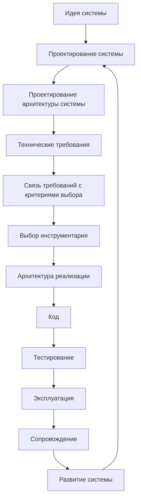
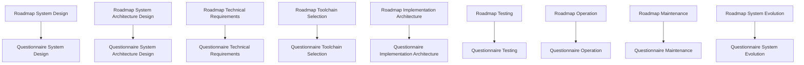

# Documentation Map

## 1. Назначение документа

`Documentation_Map.md` определяет карту документации проекта Programming Digital Systems.

Документ показывает структуру базы знаний, связи между слоями документации и маршрут движения пользователя от идеи цифровой системы к реализации, проверке, эксплуатации, сопровождению и развитию.

## 2. Главные входные точки

- [PROJECT_SCOPE.md](../../PROJECT_SCOPE.md)
  - Передаёт: масштаб проекта, центральную формулу цифровой системы, области применения и разделение уровней проектирования.
  - Используется для: понимания общего масштаба работы.
  - Ограничение: не заменяет карту документации.

- [AGENTS.md](../../AGENTS.md)
  - Передаёт: правила, которые AI-агент должен учитывать перед созданием и изменением документов.
  - Используется для: соблюдения структуры, маршрута и регламентов.
  - Ограничение: не заменяет регламенты и roadmap-документы.

- [Development Route Map](Development_Route_Map.md)
  - Передаёт: полный маршрут разработки от идеи до развития системы.
  - Используется для: понимания порядка движения по проекту.
  - Ограничение: не раскрывает подробно каждый этап.

- [Knowledge Layer Map](Knowledge_Layer_Map.md)
  - Передаёт: карту слоёв базы знаний.
  - Используется для: понимания назначения roadmap, анкет, энциклопедии, примеров и книг.
  - Ограничение: не заменяет маршрут разработки.

## 3. Общая структура базы знаний

```text
Programming-Digital-Systems
|
|-- PROJECT_SCOPE.md
|
|-- AGENTS.md
|
|-- docs/
|   |
|   |-- 00_maps/
|   |-- 01_regulations/
|   |-- 02_templates/
|   |-- 03_roadmaps/
|   |-- 04_questionnaires/
|   |-- 05_encyclopedia/
|   |-- 06_examples/
|   |-- 07_diagrams/
|   |-- 08_books/
```

## 4. Слои документации

### 4.1. Масштаб проекта

Назначение слоя: определить цель, масштаб и границы проекта.

Документы:

- [PROJECT_SCOPE.md](../../PROJECT_SCOPE.md)

### 4.2. Агентный слой

Назначение слоя: определить, какие документы и правила должен учитывать AI-агент при создании и изменении документации.

Документы:

- [AGENTS.md](../../AGENTS.md)

### 4.3. Навигационный слой

Назначение слоя: показывать карту базы знаний и маршруты движения пользователя.

Документы:

- [Documentation Map](Documentation_Map.md)
  - Передаёт: общую структуру базы знаний.
  - Используется для: ориентации в документации.
  - Ограничение: не заменяет подробные roadmap-документы.

- [Development Route Map](Development_Route_Map.md)
  - Передаёт: полный маршрут разработки.
  - Используется для: движения от идеи до развития системы.
  - Ограничение: не заменяет анкеты.

- [Knowledge Layer Map](Knowledge_Layer_Map.md)
  - Передаёт: карту слоёв знаний.
  - Используется для: понимания назначения каждого слоя документации.
  - Ограничение: не заменяет карту маршрута.

- [Requirements To Toolchain Map](Requirements_To_Toolchain_Map.md)
  - Передаёт: переход от технических требований к критериям выбора инструментария.
  - Используется для: предотвращения прямого выбора инструмента без критериев.
  - Ограничение: не заменяет документы требований и инструментария.

### 4.4. Регламентный слой

Назначение слоя: определить правила создания, оформления, связывания и визуализации документов.

Документы:

- [Documentation System Regulation](../01_regulations/Documentation_System_Regulation.md)
  - Передаёт: правила построения системы документации.
  - Используется для: согласования структуры документов.
  - Ограничение: не заменяет карту документации.

- [Document Writing Rules](../01_regulations/Document_Writing_Rules.md)
  - Передаёт: правила изложения и оформления.
  - Используется для: исключения личного шума и мусора.
  - Ограничение: не определяет маршрут разработки.

- [Link Rules](../01_regulations/Link_Rules.md)
  - Передаёт: правила рабочих Markdown-ссылок.
  - Используется для: связывания документов между собой.
  - Ограничение: не определяет содержание документов.

- [Diagram Rules](../01_regulations/Diagram_Rules.md)
  - Передаёт: правила использования диаграмм.
  - Используется для: визуального объяснения структуры и связей.
  - Ограничение: не заменяет текстовое содержание.

### 4.5. Шаблонный слой

Назначение слоя: задать единую структуру будущих документов.

Документы:

- [Roadmap Document Template](../02_templates/Roadmap_Document_Template.md)
  - Передаёт: структуру roadmap-документов.
  - Используется для: создания новых roadmap.
  - Ограничение: не содержит содержание конкретного этапа.

- [Questionnaire Document Template](../02_templates/Questionnaire_Document_Template.md)
  - Передаёт: структуру анкет.
  - Используется для: создания новых анкет.
  - Ограничение: не содержит конкретные вопросы этапа.

### 4.6. Roadmap-слой

Назначение слоя: вести пользователя по этапам проектирования и разработки.

Документы:

- [Roadmap: System Design](../03_roadmaps/Roadmap_System_Design.md)
  - Передаёт: проектирование сущностей, данных, правил, состояний, событий, потоков, хранения и ошибок.
  - Используется для: первого проектного этапа после идеи и предметной области.
  - Ограничение: не выбирает инструментарий.

- [Roadmap: System Architecture Design](../03_roadmaps/Roadmap_System_Architecture_Design.md)
  - Передаёт: проектирование слоёв, модулей, моделей, интерфейсов, зависимостей и точек расширения.
  - Используется для: архитектурной организации системы.
  - Ограничение: не подменяет архитектуру реализации.

- [Roadmap: Technical Requirements](../03_roadmaps/Roadmap_Technical_Requirements.md)
  - Передаёт: проверяемые технические условия.
  - Используется для: подготовки критериев проверки и выбора инструментария.
  - Ограничение: не выбирает инструменты.

- [Roadmap: Toolchain Selection](../03_roadmaps/Roadmap_Toolchain_Selection.md)
  - Передаёт: правила выбора базового, прикладного и специализированного инструментария.
  - Используется для: выбора инструментов по требованиям и ограничениям.
  - Ограничение: не меняет требования.

- [Toolchain Selection Category Rules](../03_roadmaps/Toolchain_Selection_Category_Rules.md)
  - Передаёт: условия применения категорий инструментария.
  - Используется для: предотвращения ощущения, что PLC, embedded или CNC/CAM нужны каждому проекту.
  - Ограничение: не выбирает конкретный инструмент.

- [Roadmap: Implementation Architecture](../03_roadmaps/Roadmap_Implementation_Architecture.md)
  - Передаёт: проектирование структуры проекта, модулей, адаптеров, конфигурации, логирования, тестов и зависимостей.
  - Используется для: подготовки к коду.
  - Ограничение: не пишет код.

- [Roadmap: Testing](../03_roadmaps/Roadmap_Testing.md)
  - Передаёт: правила проверки требований, модулей, интерфейсов, ошибок и сценариев.
  - Используется для: подтверждения качества системы.
  - Ограничение: не подменяет эксплуатацию.

- [Roadmap: Operation](../03_roadmaps/Roadmap_Operation.md)
  - Передаёт: правила запуска, рабочих сценариев, ошибок пользователя, логов и ограничений эксплуатации.
  - Используется для: подготовки реального использования системы.
  - Ограничение: не подменяет сопровождение.

- [Roadmap: Maintenance](../03_roadmaps/Roadmap_Maintenance.md)
  - Передаёт: правила регистрации дефектов, исправлений, регрессии, обновлений и журнала изменений.
  - Используется для: сопровождения системы после эксплуатации.
  - Ограничение: не подменяет развитие системы.

- [Roadmap: System Evolution](../03_roadmaps/Roadmap_System_Evolution.md)
  - Передаёт: правила анализа новых функций, новых сценариев, изменения требований, архитектуры и тестов.
  - Используется для: развития системы без разрушения архитектуры.
  - Ограничение: не маскирует дефекты как новые функции.

### 4.7. Анкетный слой

Назначение слоя: превращать правила roadmap-документов в последовательность вопросов.

Документы:

- [Questionnaire: System Design](../04_questionnaires/Questionnaire_System_Design.md)
- [Questionnaire: System Architecture Design](../04_questionnaires/Questionnaire_System_Architecture_Design.md)
- [Questionnaire: Technical Requirements](../04_questionnaires/Questionnaire_Technical_Requirements.md)
- [Questionnaire: Toolchain Selection](../04_questionnaires/Questionnaire_Toolchain_Selection.md)
- [Questionnaire: Implementation Architecture](../04_questionnaires/Questionnaire_Implementation_Architecture.md)
- [Questionnaire: Testing](../04_questionnaires/Questionnaire_Testing.md)
- [Questionnaire: Operation](../04_questionnaires/Questionnaire_Operation.md)
- [Questionnaire: Maintenance](../04_questionnaires/Questionnaire_Maintenance.md)
- [Questionnaire: System Evolution](../04_questionnaires/Questionnaire_System_Evolution.md)

Эти документы используются для практического заполнения проектных решений по этапам маршрута.

### 4.8. Энциклопедический слой

Назначение слоя: раскрывать универсальные понятия цифрового мира.

Документы:

- [Entities](../05_encyclopedia/Entities.md)
- [Data](../05_encyclopedia/Data.md)
- [Rules](../05_encyclopedia/Rules.md)
- [States](../05_encyclopedia/States.md)
- [Events](../05_encyclopedia/Events.md)
- [Flows](../05_encyclopedia/Flows.md)
- [Storage](../05_encyclopedia/Storage.md)
- [Errors](../05_encyclopedia/Errors.md)
- [Interfaces](../05_encyclopedia/Interfaces.md)
- [Architecture](../05_encyclopedia/Architecture.md)

Энциклопедия объясняет понятия, а roadmap ведёт пользователя по процессу.

### 4.9. Слой примеров

Назначение слоя: показывать применение универсальных правил в разных областях цифровых систем.

Документы:

- [Examples Index](../06_examples/Examples_Index.md)
  - Передаёт: структуру категорий примеров.
  - Используется для: выбора учебного примера.
  - Ограничение: не заменяет сами примеры.

- [Python File Processing Utility](../06_examples/Scripts/Python_File_Processing_Utility.md)
  - Передаёт: первый полный учебный пример Python-утилиты обработки файлов.
  - Используется для: демонстрации полного маршрута от идеи до развития.
  - Ограничение: не является production-реализацией.

Категории будущих примеров:

- Scripts / Скрипты автоматизации.
- GUI / Графические приложения.
- Web / Web-системы.
- Embedded / Встроенные системы.
- PLC / Промышленная автоматизация.
- CNC_CAM / CNC и CAM-системы.
- Databases / Базы данных.
- Integrations / Интеграционные системы.

### 4.10. Слой диаграмм

Назначение слоя: хранить крупные диаграммы и визуальные карты, которые используются несколькими документами.

Документы:

- [System Map](../07_diagrams/System_Map.md)
- [Documentation Map Diagrams](../07_diagrams/Documentation_Map_Diagrams.md)
- [Development Route Diagrams](../07_diagrams/Development_Route_Diagrams.md)

### 4.11. Книжный слой

Назначение слоя: подготовить базу знаний к формату книги или серии книг.

Документы:

- [Book 01: Foundations](../08_books/Book_01_Foundations.md)
- [Book 02: System Design](../08_books/Book_02_System_Design.md)
- [Book 03: System Architecture Design](../08_books/Book_03_System_Architecture_Design.md)
- [Book 04: Technical Requirements](../08_books/Book_04_Technical_Requirements.md)
- [Book 05: Toolchain Selection](../08_books/Book_05_Toolchain_Selection.md)
- [Book 06: Implementation Architecture](../08_books/Book_06_Implementation_Architecture.md)
- [Book 07: Testing](../08_books/Book_07_Testing.md)
- [Book 08: Operation Maintenance Evolution](../08_books/Book_08_Operation_Maintenance_Evolution.md)

## 5. Главный маршрут разработки



## 6. Связь roadmap-документов и анкет



## 7. Критерии актуальности карты

Карта считается актуальной, если:

- перечислены все основные слои документации;
- указаны главные документы каждого слоя;
- документы оформлены рабочими Markdown-ссылками;
- показан маршрут от идеи к реализации;
- технические требования отделены от выбора инструментария;
- связь требований и инструментария вынесена в отдельный документ;
- эксплуатация, сопровождение и развитие системы выделены отдельно;
- новые документы не появляются вне карты.

## 8. Связанные документы

### Входные документы

- [PROJECT_SCOPE.md](../../PROJECT_SCOPE.md)
  - Передаёт: масштаб проекта, центральную формулу цифровой системы, области применения и разделение уровней проектирования.
  - Используется для: построения общей карты базы знаний.
  - Ограничение: не описывает подробную структуру каждого слоя.

- [AGENTS.md](../../AGENTS.md)
  - Передаёт: правила, которые AI-агент должен учитывать перед созданием и изменением документов.
  - Используется для: соблюдения структуры, маршрута и регламентов.
  - Ограничение: не заменяет карту документации.

- [Documentation System Regulation](../01_regulations/Documentation_System_Regulation.md)
  - Передаёт: правила построения системы документации.
  - Используется для: определения слоёв и связей документации.
  - Ограничение: не является навигационной картой.

### Выходные документы

- [Development Route Map](Development_Route_Map.md)
  - Получает: общий маршрут разработки.
  - Используется для: детального описания движения от идеи до сопровождения.
  - Ограничение: не должен дублировать всю карту документации.

- [Knowledge Layer Map](Knowledge_Layer_Map.md)
  - Получает: структуру слоёв базы знаний.
  - Используется для: детального описания энциклопедического, учебного, roadmap- и анкетного слоёв.
  - Ограничение: не должен заменять roadmap-документы.

- [Requirements To Toolchain Map](Requirements_To_Toolchain_Map.md)
  - Получает: место связующего документа между требованиями и инструментарием.
  - Используется для: трассировки требований к критериям выбора инструментов.
  - Ограничение: не должен заменять документы требований и выбора инструментария.

## 9. История изменений

- Updated: документ приведён к рабочим Markdown-ссылкам вместо текстовых путей.
