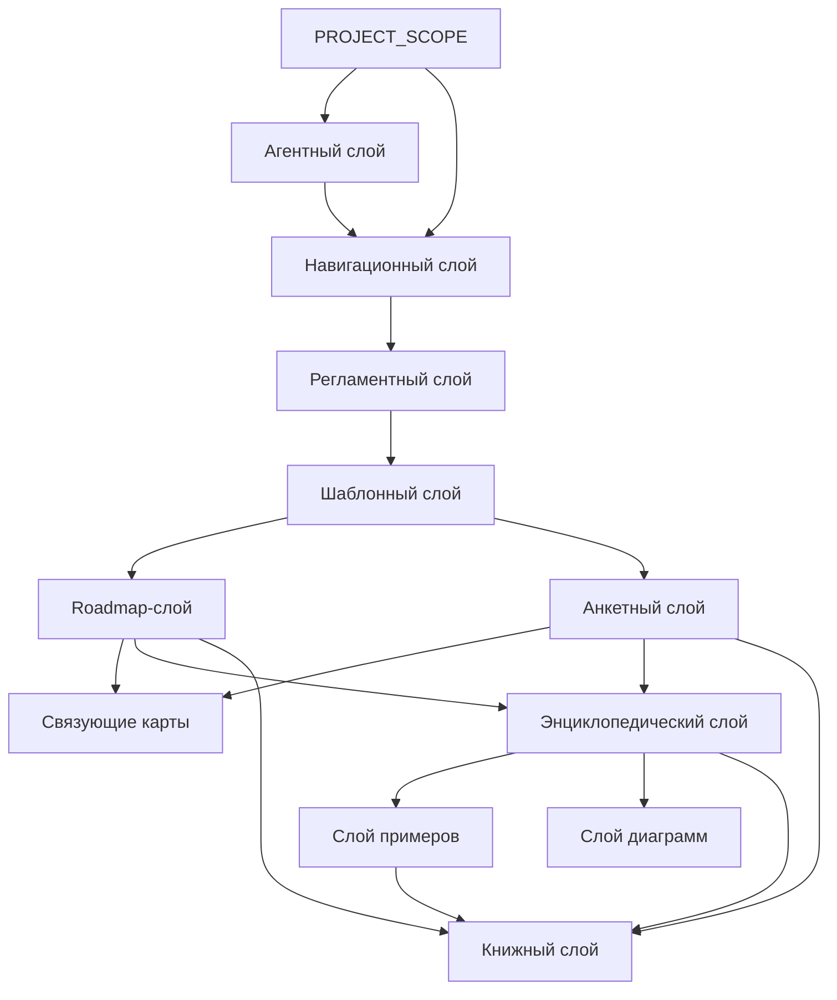
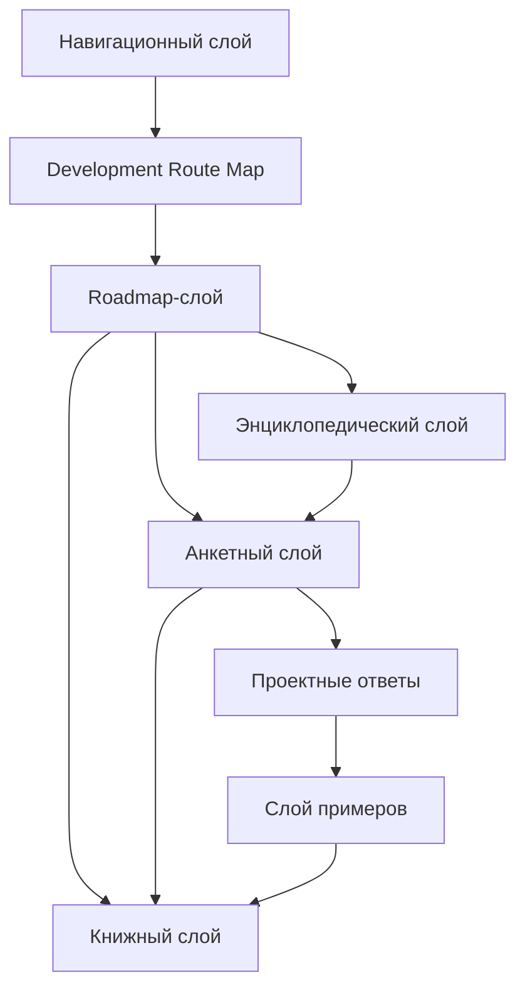

# Knowledge Layer Map

## 1. Назначение документа

`Knowledge_Layer_Map.md` определяет слои базы знаний проекта Programming Digital Systems.

Документ объясняет, какие виды документов существуют в проекте, за что отвечает каждый слой и как слои связаны между собой.

Документ не описывает подробный маршрут разработки. Маршрут разработки описан в [[docs/00_maps/Development_Route_Map|Development Route Map]].

## 2. Место документа в системе знаний

Документ относится к навигационному слою.

Документ используется после [[PROJECT_SCOPE|PROJECT_SCOPE]] и [[docs/00_maps/Documentation_Map|Documentation Map]].

Документ применяется перед созданием новых слоёв, крупных разделов, серий документов и книг.

## 3. Общая схема слоёв знаний

## 4. Слой масштаба проекта

Назначение: определить цель, масштаб и стратегическую границу проекта.

Основной документ:

- [[PROJECT_SCOPE|PROJECT_SCOPE]]
  - Передаёт: масштаб базы знаний и центральную формулу цифровой системы.
  - Используется для: понимания общей цели проекта.
  - Ограничение: не раскрывает подробно каждый слой.

## 5. Агентный слой

Назначение: определить правила работы AI-агента с документацией проекта.

Документы:

- [[AGENTS|AGENTS]]
  - Передаёт: правила, которые агент должен учитывать перед созданием и изменением документов.
  - Используется для: соблюдения структуры, маршрута и регламентов.
  - Ограничение: не заменяет сами регламенты.

## 6. Навигационный слой

Назначение: помогать пользователю ориентироваться в базе знаний.

Документы:

- [[docs/00_maps/Documentation_Map|Documentation Map]]
  - Передаёт: общую структуру документации.
  - Используется для: поиска слоёв и главных документов.
  - Ограничение: не раскрывает подробно каждый этап.

- [[docs/00_maps/Development_Route_Map|Development Route Map]]
  - Передаёт: полный маршрут разработки.
  - Используется для: движения от идеи до развития системы.
  - Ограничение: не объясняет структуру каждого слоя.

- [[docs/00_maps/Knowledge_Layer_Map|Knowledge Layer Map]]
  - Передаёт: карту слоёв знаний.
  - Используется для: понимания назначения roadmap, анкет, энциклопедии, примеров и книг.
  - Ограничение: не заменяет roadmap-документы.

- [[docs/00_maps/Requirements_To_Toolchain_Map|Requirements To Toolchain Map]]
  - Передаёт: связь требований с критериями выбора инструментария.
  - Используется для: предотвращения прямого выбора инструмента без критериев.
  - Ограничение: не выбирает инструменты.

## 7. Регламентный слой

Назначение: определить правила создания, оформления, связывания и визуализации документов.

Документы:

- [[docs/01_regulations/Documentation_System_Regulation|Documentation System Regulation]]
  - Передаёт: общие правила системы документации.
  - Используется для: согласования структуры базы знаний.
  - Ограничение: не заменяет карту документации.

- [[docs/01_regulations/Document_Writing_Rules|Document Writing Rules]]
  - Передаёт: правила изложения.
  - Используется для: исключения личного шума и мусора.
  - Ограничение: не определяет маршрут разработки.

- [[docs/01_regulations/Link_Rules|Link Rules]]
  - Передаёт: правила Obsidian wikilinks.
  - Используется для: рабочих внутренних ссылок и Graph view.
  - Ограничение: не задаёт содержание документов.

- [[docs/01_regulations/Diagram_Rules|Diagram Rules]]
  - Передаёт: правила диаграмм.
  - Используется для: визуального объяснения структуры и связей.
  - Ограничение: не заменяет текстовое содержание.

## 8. Шаблонный слой

Назначение: задать стандартную форму будущих документов.

Документы:

- [[docs/02_templates/Roadmap_Document_Template|Roadmap Document Template]]
  - Передаёт: обязательную структуру roadmap-документа.
  - Используется для: создания новых roadmap.
  - Ограничение: не содержит содержание конкретного этапа.

- [[docs/02_templates/Questionnaire_Document_Template|Questionnaire Document Template]]
  - Передаёт: обязательную структуру анкеты.
  - Используется для: создания новых анкет.
  - Ограничение: не содержит конкретные вопросы этапа.

## 9. Roadmap-слой

Назначение: вести пользователя по этапам проектирования и разработки.

Документы:

- [[docs/03_roadmaps/Roadmap_System_Design|Roadmap: System Design]]
- [[docs/03_roadmaps/Roadmap_System_Architecture_Design|Roadmap: System Architecture Design]]
- [[docs/03_roadmaps/Roadmap_Technical_Requirements|Roadmap: Technical Requirements]]
- [[docs/03_roadmaps/Roadmap_Toolchain_Selection|Roadmap: Toolchain Selection]]
- [[docs/03_roadmaps/Toolchain_Selection_Category_Rules|Toolchain Selection Category Rules]]
- [[docs/03_roadmaps/Roadmap_Implementation_Architecture|Roadmap: Implementation Architecture]]
- [[docs/03_roadmaps/Roadmap_Testing|Roadmap: Testing]]
- [[docs/03_roadmaps/Roadmap_Operation|Roadmap: Operation]]
- [[docs/03_roadmaps/Roadmap_Maintenance|Roadmap: Maintenance]]
- [[docs/03_roadmaps/Roadmap_System_Evolution|Roadmap: System Evolution]]

Слой отвечает за:

- порядок проектирования;
- входные условия этапа;
- правила этапа;
- контрольные вопросы;
- критерии завершения;
- выходные данные для следующего этапа.

Слой не должен быть свободной теорией. Каждый roadmap-документ должен вести пользователя к результату.

## 10. Анкетный слой

Назначение: превращать правила roadmap-документов в последовательность вопросов.

Документы:

- [[docs/04_questionnaires/Questionnaire_System_Design|Questionnaire: System Design]]
- [[docs/04_questionnaires/Questionnaire_System_Architecture_Design|Questionnaire: System Architecture Design]]
- [[docs/04_questionnaires/Questionnaire_Technical_Requirements|Questionnaire: Technical Requirements]]
- [[docs/04_questionnaires/Questionnaire_Toolchain_Selection|Questionnaire: Toolchain Selection]]
- [[docs/04_questionnaires/Questionnaire_Implementation_Architecture|Questionnaire: Implementation Architecture]]
- [[docs/04_questionnaires/Questionnaire_Testing|Questionnaire: Testing]]
- [[docs/04_questionnaires/Questionnaire_Operation|Questionnaire: Operation]]
- [[docs/04_questionnaires/Questionnaire_Maintenance|Questionnaire: Maintenance]]
- [[docs/04_questionnaires/Questionnaire_System_Evolution|Questionnaire: System Evolution]]

Слой отвечает за:

- вопросы пользователю;
- поля для ответов;
- критерии заполнения;
- связь вопросов с roadmap-документами;
- движение от неопределённой идеи к проектному решению;
- отделение неизвестных ответов в открытые вопросы.

## 11. Связующие карты

Назначение: связывать самостоятельные темы, которые нельзя смешивать в одном документе.

Документы:

- [[docs/00_maps/Requirements_To_Toolchain_Map|Requirements To Toolchain Map]]
  - Передаёт: переход от технического требования к критерию выбора инструмента.
  - Используется для: трассировки требования к инструменту.
  - Ограничение: не заменяет документы требований и инструментария.

## 12. Энциклопедический слой

Назначение: раскрывать универсальные понятия цифрового мира.

Документы:

- [[docs/05_encyclopedia/Entities|Entities]]
- [[docs/05_encyclopedia/Data|Data]]
- [[docs/05_encyclopedia/Rules|Rules]]
- [[docs/05_encyclopedia/States|States]]
- [[docs/05_encyclopedia/Events|Events]]
- [[docs/05_encyclopedia/Flows|Flows]]
- [[docs/05_encyclopedia/Storage|Storage]]
- [[docs/05_encyclopedia/Errors|Errors]]
- [[docs/05_encyclopedia/Interfaces|Interfaces]]
- [[docs/05_encyclopedia/Architecture|Architecture]]

Слой отвечает за:

- определения;
- классификации;
- универсальные свойства цифровых систем;
- примеры применения понятий;
- связи между понятиями.

Энциклопедия объясняет понятия, а roadmap ведёт пользователя по процессу.

## 13. Слой примеров

Назначение: показывать применение универсальных правил в разных областях цифровых систем.

Документы:

- [[docs/06_examples/Examples_Index|Examples Index]]
  - Передаёт: индекс категорий примеров.
  - Используется для: выбора учебного примера.
  - Ограничение: не заменяет сами примеры.

- [[docs/06_examples/Scripts/Python_File_Processing_Utility|Python File Processing Utility]]
  - Передаёт: первый полный пример Python-утилиты.
  - Используется для: демонстрации полного маршрута.
  - Ограничение: не является production-реализацией.

Категории:

- Скрипты автоматизации
  - Примеры: обработка файлов, генерация отчётов, парсинг данных.
- GUI-приложения
  - Примеры: настольная утилита, интерфейс оператора, редактор шаблонов.
- Web-системы
  - Примеры: API-сервис, личный кабинет, панель мониторинга.
- Embedded-системы
  - Примеры: контроллер датчиков, устройство сбора данных, управление клапанами.
- PLC-системы
  - Примеры: автоматический режим, аварийные межблокировки, управление технологическим процессом.
- CNC/CAM-системы
  - Примеры: постпроцессор, анализ NC-программ, контроль инструмента.
- Базы данных
  - Примеры: складской учёт, журнал измерений, история изменений.
- Интеграционные системы
  - Примеры: обмен между Excel и БД, обмен между PLC и GUI, REST API.

## 14. Слой диаграмм

Назначение: хранить крупные диаграммы и визуальные карты, которые используются несколькими документами.

Документы:

- [[docs/07_diagrams/System_Map|System Map]]
- [[docs/07_diagrams/Documentation_Map_Diagrams|Documentation Map Diagrams]]
- [[docs/07_diagrams/Development_Route_Diagrams|Development Route Diagrams]]

## 15. Книжный слой

Назначение: подготовить базу знаний к формату книги или серии книг.

Документы:

- [[docs/08_books/Book_01_Foundations|Book 01: Foundations]]
- [[docs/08_books/Book_02_System_Design|Book 02: System Design]]
- [[docs/08_books/Book_03_System_Architecture_Design|Book 03: System Architecture Design]]
- [[docs/08_books/Book_04_Technical_Requirements|Book 04: Technical Requirements]]
- [[docs/08_books/Book_05_Toolchain_Selection|Book 05: Toolchain Selection]]
- [[docs/08_books/Book_06_Implementation_Architecture|Book 06: Implementation Architecture]]
- [[docs/08_books/Book_07_Testing|Book 07: Testing]]
- [[docs/08_books/Book_08_Operation_Maintenance_Evolution|Book 08: Operation Maintenance Evolution]]

## 16. Связь слоёв с маршрутом разработки

## 17. Правило добавления нового слоя

Новый слой допускается только если существующие слои не покрывают его назначение.

Перед добавлением нового слоя необходимо определить:

- назначение слоя;
- какие документы он содержит;
- какие документы являются входными;
- какие документы являются выходными;
- чем слой отличается от существующих;
- нужно ли обновить [[docs/00_maps/Documentation_Map|Documentation Map]];
- нужно ли обновить [[docs/00_maps/Knowledge_Layer_Map|Knowledge Layer Map]].

## 18. Критерии актуальности карты слоёв

Документ считается актуальным, если:

- перечислены все основные слои базы знаний;
- каждый слой имеет назначение;
- каждый слой имеет границы ответственности;
- каждый слой связан с документами через Obsidian wikilinks;
- roadmap-слой и анкетный слой соответствуют текущему маршруту разработки;
- связующие карты вынесены отдельно от самостоятельных тем;
- категории и примеры не смешаны;
- карта не противоречит [[docs/00_maps/Documentation_Map|Documentation Map]].

## 19. Связанные документы

### Входные документы

- [[PROJECT_SCOPE|PROJECT_SCOPE]]
  - Передаёт: масштаб проекта и принцип связанной базы знаний.
  - Используется для: определения необходимости слоёв знаний.
  - Ограничение: не раскрывает структуру каждого слоя.

- [[docs/00_maps/Documentation_Map|Documentation Map]]
  - Передаёт: общую структуру базы знаний.
  - Используется для: детализации слоёв документации.
  - Ограничение: не объясняет границы ответственности каждого слоя подробно.

- [[docs/00_maps/Development_Route_Map|Development Route Map]]
  - Передаёт: полный маршрут разработки.
  - Используется для: связи roadmap- и анкетного слоёв с этапами разработки.
  - Ограничение: не описывает назначение каждого слоя базы знаний.

### Выходные документы

- [[docs/03_roadmaps/Roadmap_System_Design|Roadmap: System Design]]
  - Получает: место roadmap-слоя в базе знаний.
  - Используется для: построения первого проектного roadmap-документа.
  - Ограничение: не должен подменять энциклопедию понятий.

- [[docs/05_encyclopedia/Entities|Entities]]
  - Получает: место энциклопедического слоя в базе знаний.
  - Используется для: раскрытия понятия сущностей.
  - Ограничение: не должен превращаться в roadmap-документ.

- [[docs/06_examples/Examples_Index|Examples Index]]
  - Получает: место слоя примеров в базе знаний.
  - Используется для: демонстрации применения маршрута в разных областях цифровых систем.
  - Ограничение: не должен заменять roadmap и анкеты.

## 20. История изменений

- Updated: карта слоёв синхронизирована с текущей структурой документации, добавлены агентный слой, связующие карты, полный roadmap-слой, полный анкетный слой, эксплуатация, сопровождение, развитие системы и обновлённый книжный слой.
- Updated: документ приведён к Obsidian wikilinks.
