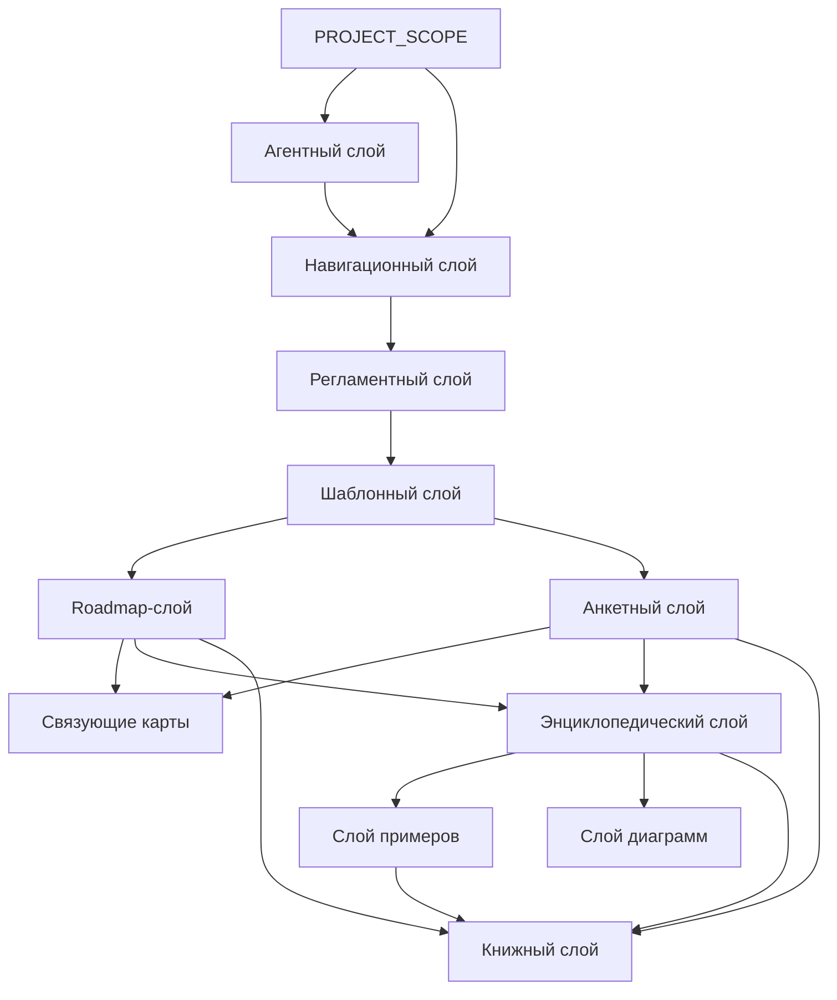
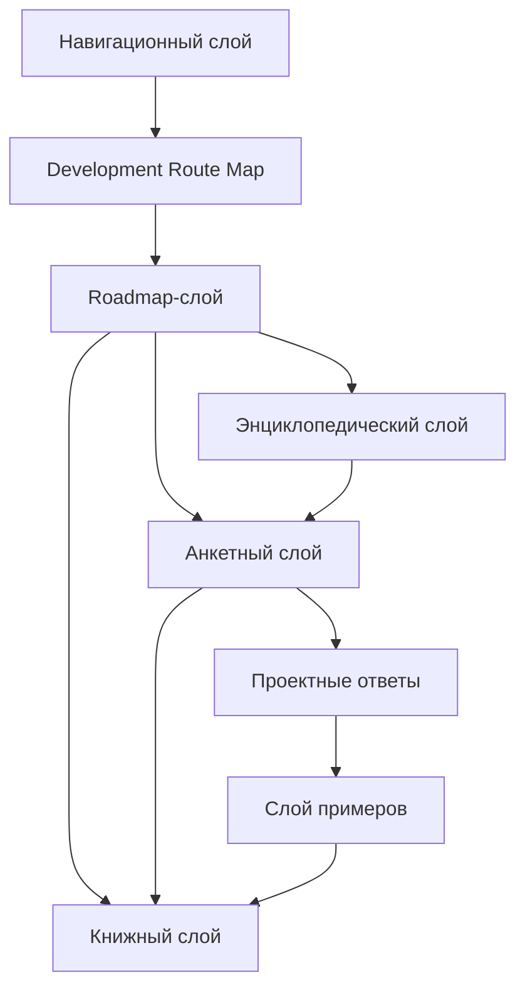

# Knowledge Layer Map

## 1. Назначение документа

`Knowledge_Layer_Map.md` определяет слои базы знаний проекта Programming Digital Systems.

Документ объясняет, какие виды документов существуют в проекте, за что отвечает каждый слой и как слои связаны между собой.

Документ не описывает подробный маршрут разработки. Маршрут разработки описан в `docs/00_maps/Development_Route_Map.md`.

## 2. Место документа в системе знаний

Документ относится к навигационному слою.

Документ используется после `PROJECT_SCOPE.md` и `docs/00_maps/Documentation_Map.md`.

Документ применяется перед созданием новых слоёв, крупных разделов, серий документов и книг.

## 3. Общая схема слоёв знаний

## 4. Слой масштаба проекта

Назначение: определить цель, масштаб и стратегическую границу проекта.

Основной документ:

- `PROJECT_SCOPE.md`

Слой отвечает за:

- назначение проекта;
- масштаб базы знаний;
- центральную формулу цифровой системы;
- области применения;
- принцип связности;
- принцип анкетного движения;
- разделение проектирования системы, архитектуры системы, требований, инструментария и реализации.

Слой не должен содержать подробные roadmap-документы, анкеты и энциклопедические статьи.

## 5. Агентный слой

Назначение: определить правила работы AI-агента с документацией проекта.

Документы:

- `AGENTS.md`

Слой отвечает за:

- какие документы агент должен прочесть перед изменениями;
- какие правила оформления соблюдать;
- как учитывать карту документации;
- как не смешивать уровни проектирования;
- как сохранять связи между документами;
- как работать с GitHub-репозиторием.

Слой не должен заменять регламенты документации и roadmap-документы.

## 6. Навигационный слой

Назначение: помогать пользователю ориентироваться в базе знаний.

Документы:

- `docs/00_maps/Documentation_Map.md`
- `docs/00_maps/Development_Route_Map.md`
- `docs/00_maps/Knowledge_Layer_Map.md`
- `docs/00_maps/Requirements_To_Toolchain_Map.md`

Слой отвечает за:

- карту документации;
- маршрут разработки;
- карту слоёв знаний;
- связь документов между собой;
- определение следующего шага пользователя;
- переход от требований к критериям выбора инструментария.

Слой не должен подробно раскрывать содержание каждого проектного этапа.

## 7. Регламентный слой

Назначение: определить правила создания, оформления, связывания и визуализации документов.

Документы:

- `docs/01_regulations/Documentation_System_Regulation.md`
- `docs/01_regulations/Document_Writing_Rules.md`
- `docs/01_regulations/Link_Rules.md`
- `docs/01_regulations/Diagram_Rules.md`

Слой отвечает за:

- правила структуры документации;
- правила изложения;
- запрет личного шума;
- правила ссылок;
- правила диаграмм;
- правила отделения категорий от примеров;
- правила отделения требований от инструментов;
- правила связности документов.

Слой не должен подменять roadmap-документы и анкеты.

## 8. Шаблонный слой

Назначение: задать стандартную форму будущих документов.

Документы:

- `docs/02_templates/Roadmap_Document_Template.md`
- `docs/02_templates/Questionnaire_Document_Template.md`

Слой отвечает за:

- обязательные разделы roadmap-документа;
- обязательные разделы анкеты;
- критерии завершения документа;
- структуру вопросов;
- единый формат будущих материалов.

Слой не должен содержать конкретное содержание проектных этапов.

## 9. Roadmap-слой

Назначение: вести пользователя по этапам проектирования и разработки.

Документы:

- `docs/03_roadmaps/Roadmap_System_Design.md`
- `docs/03_roadmaps/Roadmap_System_Architecture_Design.md`
- `docs/03_roadmaps/Roadmap_Technical_Requirements.md`
- `docs/03_roadmaps/Roadmap_Toolchain_Selection.md`
- `docs/03_roadmaps/Toolchain_Selection_Category_Rules.md`
- `docs/03_roadmaps/Roadmap_Implementation_Architecture.md`
- `docs/03_roadmaps/Roadmap_Testing.md`
- `docs/03_roadmaps/Roadmap_Operation.md`
- `docs/03_roadmaps/Roadmap_Maintenance.md`
- `docs/03_roadmaps/Roadmap_System_Evolution.md`

Слой отвечает за:

- порядок проектирования;
- входные условия этапа;
- правила этапа;
- контрольные вопросы;
- критерии завершения;
- выходные данные для следующего этапа.

Слой не должен быть свободной теорией. Каждый roadmap-документ должен вести пользователя к результату.

## 10. Анкетный слой

Назначение: превращать правила roadmap-документов в последовательность вопросов.

Документы:

- `docs/04_questionnaires/Questionnaire_System_Design.md`
- `docs/04_questionnaires/Questionnaire_System_Architecture_Design.md`
- `docs/04_questionnaires/Questionnaire_Technical_Requirements.md`
- `docs/04_questionnaires/Questionnaire_Toolchain_Selection.md`
- `docs/04_questionnaires/Questionnaire_Implementation_Architecture.md`
- `docs/04_questionnaires/Questionnaire_Testing.md`
- `docs/04_questionnaires/Questionnaire_Operation.md`
- `docs/04_questionnaires/Questionnaire_Maintenance.md`
- `docs/04_questionnaires/Questionnaire_System_Evolution.md`

Слой отвечает за:

- вопросы пользователю;
- поля для ответов;
- критерии заполнения;
- связь вопросов с roadmap-документами;
- движение от неопределённой идеи к проектному решению;
- отделение неизвестных ответов в открытые вопросы.

Слой не должен содержать случайные вопросы, которые не влияют на проектное решение.

## 11. Связующие карты

Назначение: связывать самостоятельные темы, которые нельзя смешивать в одном документе.

Документы:

- `docs/00_maps/Requirements_To_Toolchain_Map.md`

Слой отвечает за:

- переход от технического требования к критерию выбора;
- трассировку требования к инструменту;
- предотвращение прямого перехода от требования к названию инструмента;
- объяснение связи самостоятельных тем.

Слой не должен заменять сами темы. Например, карта требований и инструментария не должна заново раскрывать технические требования или заново выбирать инструменты.

## 12. Энциклопедический слой

Назначение: раскрывать универсальные понятия цифрового мира.

Документы:

- `docs/05_encyclopedia/Entities.md`
- `docs/05_encyclopedia/Data.md`
- `docs/05_encyclopedia/Rules.md`
- `docs/05_encyclopedia/States.md`
- `docs/05_encyclopedia/Events.md`
- `docs/05_encyclopedia/Flows.md`
- `docs/05_encyclopedia/Storage.md`
- `docs/05_encyclopedia/Errors.md`
- `docs/05_encyclopedia/Interfaces.md`
- `docs/05_encyclopedia/Architecture.md`

Слой отвечает за:

- определения;
- классификации;
- универсальные свойства цифровых систем;
- примеры применения понятий;
- связи между понятиями.

Слой не должен заменять roadmap-документы. Энциклопедия объясняет понятия, а roadmap ведёт пользователя по процессу.

## 13. Слой примеров

Назначение: показывать применение универсальных правил в разных областях цифровых систем.

Категории:

- Скрипты автоматизации
  - Примеры: обработка файлов, генерация отчётов, парсинг данных.
- GUI-приложения
  - Примеры: настольная утилита, интерфейс оператора, редактор шаблонов.
- Web-системы
  - Примеры: API-сервис, личный кабинет, панель мониторинга.
- Embedded-системы
  - Примеры: контроллер датчиков, устройство сбора данных, управление клапанами.
- PLC-системы
  - Примеры: автоматический режим, аварийные межблокировки, управление технологическим процессом.
- CNC/CAM-системы
  - Примеры: постпроцессор, анализ NC-программ, контроль инструмента.
- Базы данных
  - Примеры: складской учёт, журнал измерений, история изменений.
- Интеграционные системы
  - Примеры: обмен между Excel и БД, обмен между PLC и GUI, REST API.

Слой отвечает за:

- демонстрацию полного маршрута на конкретных системах;
- показ различий между типами цифровых систем;
- обучение через практические примеры;
- связь теории с реальной разработкой.

Слой не должен смешивать категории и примеры на одном уровне.

## 14. Слой диаграмм

Назначение: хранить крупные диаграммы и визуальные карты, которые используются несколькими документами.

Документы:

- `docs/07_diagrams/System_Map.md`
- `docs/07_diagrams/Documentation_Map_Diagrams.md`
- `docs/07_diagrams/Development_Route_Diagrams.md`

Слой отвечает за:

- общие диаграммы системы знаний;
- маршрутные диаграммы;
- диаграммы связей между документами;
- диаграммы, которые используются в нескольких местах.

Слой не должен содержать диаграммы без пояснения и связей.

## 15. Книжный слой

Назначение: подготовить базу знаний к формату книги или серии книг.

Документы:

- `docs/08_books/Book_01_Foundations.md`
- `docs/08_books/Book_02_System_Design.md`
- `docs/08_books/Book_03_System_Architecture_Design.md`
- `docs/08_books/Book_04_Technical_Requirements.md`
- `docs/08_books/Book_05_Toolchain_Selection.md`
- `docs/08_books/Book_06_Implementation_Architecture.md`
- `docs/08_books/Book_07_Testing.md`
- `docs/08_books/Book_08_Operation_Maintenance_Evolution.md`

Слой отвечает за:

- последовательность глав;
- учебную логику;
- объединение roadmap, анкет, энциклопедии и примеров;
- подготовку материала к формату книги или серии книг.

Слой не должен разрушать структуру исходной базы знаний.

## 16. Связь слоёв с маршрутом разработки

## 17. Правило добавления нового слоя

Новый слой допускается только если существующие слои не покрывают его назначение.

Перед добавлением нового слоя необходимо определить:

- назначение слоя;
- какие документы он содержит;
- какие документы являются входными;
- какие документы являются выходными;
- чем слой отличается от существующих;
- нужно ли обновить `docs/00_maps/Documentation_Map.md`;
- нужно ли обновить `docs/00_maps/Knowledge_Layer_Map.md`.

## 18. Критерии актуальности карты слоёв

Документ считается актуальным, если:

- перечислены все основные слои базы знаний;
- каждый слой имеет назначение;
- каждый слой имеет границы ответственности;
- каждый слой связан с документами;
- roadmap-слой и анкетный слой соответствуют текущему маршруту разработки;
- связующие карты вынесены отдельно от самостоятельных тем;
- категории и примеры не смешаны;
- карта не противоречит `docs/00_maps/Documentation_Map.md`.

## 19. Связанные документы

### Входные документы

- `PROJECT_SCOPE.md`
  - Передаёт: масштаб проекта и принцип связанной базы знаний.
  - Используется для: определения необходимости слоёв знаний.
  - Ограничение: не раскрывает структуру каждого слоя.

- `docs/00_maps/Documentation_Map.md`
  - Передаёт: общую структуру базы знаний.
  - Используется для: детализации слоёв документации.
  - Ограничение: не объясняет границы ответственности каждого слоя подробно.

- `docs/00_maps/Development_Route_Map.md`
  - Передаёт: полный маршрут разработки.
  - Используется для: связи roadmap- и анкетного слоёв с этапами разработки.
  - Ограничение: не описывает назначение каждого слоя базы знаний.

### Выходные документы

- `docs/03_roadmaps/Roadmap_System_Design.md`
  - Получает: место roadmap-слоя в базе знаний.
  - Используется для: построения первого проектного roadmap-документа.
  - Ограничение: не должен подменять энциклопедию понятий.

- `docs/05_encyclopedia/Entities.md`
  - Получает: место энциклопедического слоя в базе знаний.
  - Используется для: раскрытия понятия сущностей.
  - Ограничение: не должен превращаться в roadmap-документ.

- `docs/06_examples/`
  - Получает: место слоя примеров в базе знаний.
  - Используется для: демонстрации применения маршрута в разных областях цифровых систем.
  - Ограничение: не должен заменять roadmap и анкеты.

## 20. История изменений

- Updated: карта слоёв синхронизирована с текущей структурой документации, добавлены агентный слой, связующие карты, полный roadmap-слой, полный анкетный слой, эксплуатация, сопровождение, развитие системы и обновлённый книжный слой.
