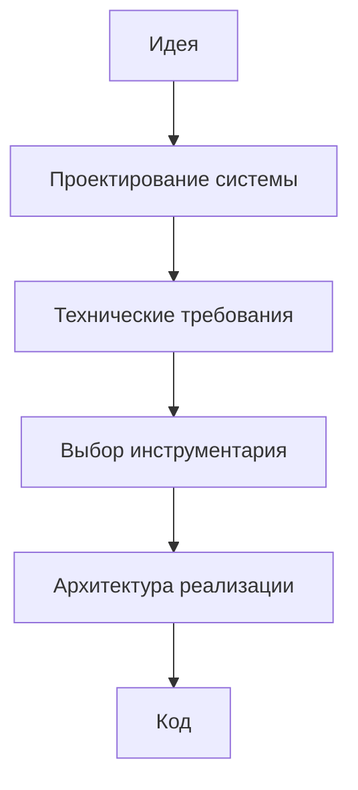

# Правила диаграмм и визуального представления

## 1. Назначение документа

Документ определяет правила использования диаграмм в проекте Programming Digital Systems.

Диаграммы нужны для визуального объяснения структуры, связей, потоков, состояний, последовательностей и архитектурных уровней.

## 2. Главный принцип

Диаграмма должна использоваться только тогда, когда она уточняет структуру, связь, поток, состояние, последовательность или поведение системы.

Диаграмма не должна быть декоративной.

## 3. Выбор типа диаграммы

Тип диаграммы должен соответствовать типу информации.

| Что нужно показать | Рекомендуемый тип |
|---|---|
| Общий маршрут разработки | `flowchart` |
| Иерархия понятий | `mindmap` или `flowchart` |
| Сущности, атрибуты и связи | `classDiagram` |
| Состояния системы | `stateDiagram` |
| Последовательность действий | `sequenceDiagram` |
| Поток данных или решений | `flowchart` |
| Границы системы и внешние участники | C4 или flowchart-адаптация |
| Структура файлов проекта | дерево каталогов или `flowchart` |

## 4. Правило Mermaid

Если документ предназначен для Obsidian, Mermaid-синтаксис должен быть максимально совместимым.

Для сложных диаграмм допускается использовать упрощённую flowchart-адаптацию вместо продвинутого синтаксиса, если это повышает стабильность отображения.

## 5. Правило обязательного пояснения

Каждая диаграмма должна иметь:

- идентификатор;
- название;
- назначение;
- Mermaid-код или другой формат представления;
- пояснение, что именно показывает диаграмма;
- связанные документы или разделы.

Пример структуры:

```md
## DG-SYS-001. Общий маршрут разработки

Назначение: показывает путь от идеи до сопровождения.


```

## 6. Правило визуальной достаточности

Диаграмма должна быть достаточно подробной, чтобы объяснять смысл, но не должна превращаться в нечитаемую схему.

Если диаграмма становится слишком большой, её необходимо разделить на несколько диаграмм:

- обзорная диаграмма;
- диаграмма отдельного раздела;
- диаграмма отдельного процесса;
- диаграмма отдельной сущности.

## 7. Запрещено

Запрещено использовать диаграммы:

- без текстового пояснения;
- только ради красоты;
- с типом, который не соответствует смыслу информации;
- с нестабильным синтаксисом, если документ предназначен для Obsidian;
- настолько большими, что пользователь не может прочитать связи.

## 8. Связанные документы

- `PROJECT_SCOPE.md` — определяет масштаб проекта.
- `docs/01_regulations/Documentation_System_Regulation.md` — требует визуальной информативности.
- `docs/01_regulations/Link_Rules.md` — определяет ссылки на диаграммы как смысловые блоки.
