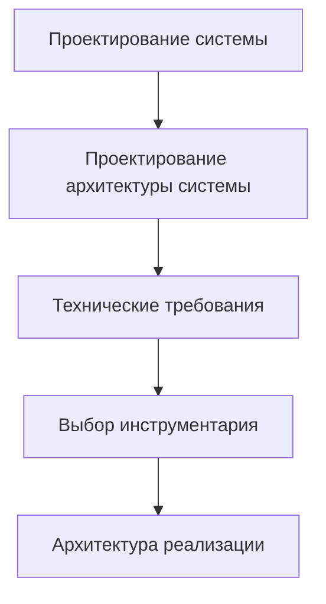
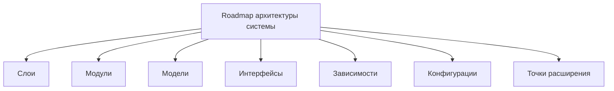

# 2. Roadmap: System Architecture Design / Архитектура системы

## 1. Назначение документа

`02_02_Roadmap_System_Architecture_Design.md` определяет порядок проектирования архитектуры системы.

Документ используется после [[docs/03_roadmaps/01_01_Roadmap_System_Design|Roadmap: System Design]] и до [[docs/03_roadmaps/03_03_Roadmap_Technical_Requirements|Roadmap: Technical Requirements]].

Документ должен превратить результаты проектирования системы в архитектурную организацию: слои, модули, модели, интерфейсы, зависимости, конфигурации и точки расширения.

Документ не должен подменять:

- [[docs/03_roadmaps/01_01_Roadmap_System_Design|Roadmap: System Design]];
- [[docs/03_roadmaps/03_03_Roadmap_Technical_Requirements|Roadmap: Technical Requirements]];
- [[docs/03_roadmaps/05_05_Roadmap_Toolchain_Selection|Roadmap: Toolchain Selection]];
- [[docs/03_roadmaps/06_06_Roadmap_Implementation_Architecture|Roadmap: Implementation Architecture]].

## 2. Место документа в маршруте разработки

Проектирование архитектуры системы находится между проектированием системы и техническими требованиями.

Это отдельный этап, потому что система должна быть организована архитектурно до выбора конкретных библиотек, фреймворков и структуры кода.

## 3. Граница ответственности

### 3.1. Проектирование системы

Проектирование системы отвечает за вопрос:

> Что существует в системе и как система должна работать на уровне сущностей, данных, правил, состояний, событий, потоков, хранения и ошибок?

### 3.2. Проектирование архитектуры системы

Проектирование архитектуры системы отвечает за вопрос:

> Как система должна быть организована на архитектурном уровне?

### 3.3. Архитектура реализации

Архитектура реализации отвечает за вопрос:

> Как архитектура системы будет реализована в конкретном коде, структуре проекта, инструментах и технических компонентах?

## 4. Входные условия

Перед началом проектирования архитектуры системы должны быть определены:

- сущности;
- данные;
- правила;
- состояния;
- события;
- потоки;
- хранение;
- ошибки;
- основные сценарии работы системы;
- внешние участники или внешние системы;
- ожидаемые результаты работы системы.

Если эти элементы не определены, архитектура системы будет строиться на догадках.

## Диаграммы этапа

Основные диаграммы этого этапа вынесены в отдельный документ:

- [[docs/07_diagrams/02_02_Roadmap_System_Architecture_Diagrams|Roadmap System Architecture Diagrams]]
  - Передаёт: полный визуальный набор диаграмм архитектуры системы.
  - Используется для: визуального понимания этапа и его связей с другими документами.
  - Ограничение: не заменяет этот roadmap-документ.

## 5. Основные архитектурные элементы

Проектирование архитектуры системы должно определить:

- слои;
- модули;
- модели;
- интерфейсы;
- зависимости;
- конфигурации;
- точки расширения.

## 6. DG-ARCH-001. Общая карта архитектуры системы

Назначение: показать, из каких архитектурных областей состоит проектирование архитектуры системы.

## 7. Слои

Слой — это архитектурная область ответственности системы.

Необходимо определить, какие слои нужны системе и за что отвечает каждый слой.

### 7.1. Основные виды слоёв

- Слой представления
  - Отвечает за взаимодействие пользователя с системой.
- Слой сценариев / приложения
  - Отвечает за координацию пользовательских или системных сценариев.
- Слой бизнес-логики
  - Отвечает за правила обработки и принятия решений.
- Слой доменной модели
  - Отвечает за основные понятия предметной области.
- Слой данных
  - Отвечает за структуры данных, DTO, преобразования и подготовку данных.
- Слой хранения
  - Отвечает за сохранение и извлечение данных.
- Слой инфраструктуры
  - Отвечает за взаимодействие с файлами, сетью, оборудованием, ОС и внешними сервисами.
- Слой конфигурации
  - Отвечает за настройки, параметры и изменяемое поведение без изменения кода.
- Слой ошибок и логирования
  - Отвечает за обработку ошибок, диагностику и след выполнения.

### 7.2. Правила слоёв

- Каждый слой должен иметь назначение.
- Каждый слой должен иметь границу ответственности.
- Каждый слой должен иметь разрешённые зависимости.
- Слои не должны образовывать циклические зависимости.
- Слой не должен выполнять ответственность другого слоя.

## 8. Модули

Модуль — это отдельная часть системы с определённой ответственностью.

Необходимо определить модули, которые реализуют функции системы внутри архитектурных слоёв.

### 8.1. Возможные виды модулей

- Входной модуль.
- Модули представления.
- Модули сценариев / приложения.
- Доменные модули.
- Модули бизнес-логики.
- Модули данных.
- Модули чтения входных данных.
- Модули парсинга.
- Модули валидации.
- Модули расчётов.
- Модули хранения.
- Инфраструктурные модули.
- Модули конфигурации.
- Модули ошибок и логирования.
- Тестовые модули.

### 8.2. Правила модулей

- Модуль должен иметь одну основную ответственность.
- Модуль должен иметь понятный вход и выход.
- Модуль должен иметь минимально необходимые зависимости.
- Модуль не должен знать больше, чем нужно для выполнения своей задачи.
- Модуль должен быть пригоден для тестирования.

## 9. Модели

Модель — это формальное представление сущности, данных, состояния, события, правила, ошибки или связи.

Связанные понятия:

- [[docs/05_encyclopedia/Entities|Entities]];
- [[docs/05_encyclopedia/Data|Data]];
- [[docs/05_encyclopedia/States|States]];
- [[docs/05_encyclopedia/Events|Events]];
- [[docs/05_encyclopedia/Errors|Errors]].

### 9.1. Возможные виды моделей

- Доменные модели.
- Модели данных.
- Модели входных данных.
- Модели выходных данных.
- Модели промежуточных данных.
- Модели конфигурации.
- Модели состояния.
- Модели событий.
- Модели правил.
- Модели ошибок.
- Модели хранения.
- Модели интерфейса.
- Модели сценариев.
- Модели связей.

## 10. Интерфейсы

Интерфейс — это граница взаимодействия между пользователем, системой, модулем, слоем, внешней системой или оборудованием.

Связанный документ: [[docs/05_encyclopedia/Interfaces|Interfaces]].

## 11. Зависимости

Зависимость — это отношение, при котором один элемент системы использует другой элемент.

Правила зависимостей:

- зависимости должны быть явными;
- скрытые зависимости должны быть устранены или задокументированы;
- циклические зависимости запрещены, если они не имеют отдельного обоснования;
- архитектура должна определять допустимое направление зависимостей;
- внешние зависимости должны быть отделены от доменной логики.

## 12. Конфигурации

Конфигурация — это набор изменяемых параметров, которые управляют поведением системы без изменения кода.

Конфигурация должна быть связана с требованиями, сценариями работы и будущей архитектурой реализации.

## 13. Точки расширения

Точка расширения — это заранее определённое место, где система может быть расширена без разрушения архитектуры.

Точка расширения должна быть связана с требованиями, ожидаемым развитием или [[docs/03_roadmaps/10_10_Roadmap_System_Evolution|Roadmap: System Evolution]].

## 14. Примеры применения

### 14.1. Скрипт автоматизации

Архитектурные элементы:

- Слои:
  - чтение входных файлов;
  - парсинг;
  - обработка;
  - формирование отчёта;
  - логирование.
- Модули:
  - Excel reader;
  - PDF parser;
  - validator;
  - report writer.
- Точки расширения:
  - новый формат входного файла;
  - новый тип отчёта.

### 14.2. GUI-приложение

Архитектурные элементы:

- Слои:
  - представление;
  - сценарии приложения;
  - доменная логика;
  - хранение;
  - инфраструктура.
- Модули:
  - editor view;
  - preview renderer;
  - template service;
  - project storage.
- Точки расширения:
  - новый тип шаблона;
  - новый экспортный формат.

### 14.3. Embedded-система

Архитектурные элементы:

- Слои:
  - драйверы;
  - логика управления;
  - состояния;
  - диагностика.
- Модули:
  - sensor reader;
  - actuator controller;
  - state machine;
  - fault handler.
- Точки расширения:
  - новый датчик;
  - новый режим управления.

### 14.4. PLC-система

Архитектурные элементы:

- Слои:
  - входные сигналы;
  - логика автоматического режима;
  - межблокировки;
  - аварии;
  - HMI.
- Модули:
  - pump control;
  - alarm logic;
  - mode manager;
  - diagnostics.
- Точки расширения:
  - новый агрегат;
  - новый аварийный сценарий.

### 14.5. CNC/CAM-система

Архитектурные элементы:

- Слои:
  - чтение NC-файлов;
  - анализ операций;
  - модель инструмента;
  - расчёты;
  - отчёты.
- Модули:
  - NC parser;
  - tool usage analyzer;
  - time calculator;
  - report exporter.
- Точки расширения:
  - новый формат NC-программы;
  - новый тип анализа инструмента.

## 15. Контрольные вопросы

Перед переходом к техническим требованиям необходимо ответить:

1. Какие слои нужны системе?
2. За что отвечает каждый слой?
3. Какие модули нужны системе?
4. Какие модели нужны системе?
5. Какие интерфейсы нужны системе?
6. Какие зависимости допустимы?
7. Какие зависимости запрещены?
8. Какие конфигурации нужны системе?
9. Какие точки расширения нужны системе?
10. Какие точки расширения избыточны?
11. Какие архитектурные решения влияют на технические требования?
12. Какие архитектурные решения влияют на выбор инструментария?

## 16. Критерии завершения

Roadmap архитектуры системы считается завершённым, если:

- определены слои;
- определены модули;
- определены модели;
- определены интерфейсы;
- определены зависимости;
- определены конфигурации;
- определены точки расширения;
- указаны границы ответственности;
- архитектура системы не смешана с архитектурой реализации;
- открытые вопросы вынесены отдельно;
- выходные данные готовы для формирования технических требований.

## 17. Выходные данные для следующего этапа

После завершения документа должны быть получены:

- архитектурная модель системы;
- перечень слоёв;
- перечень модулей;
- перечень моделей;
- перечень интерфейсов;
- перечень зависимостей;
- перечень конфигураций;
- перечень точек расширения;
- архитектурные ограничения для технических требований;
- архитектурные ограничения для выбора инструментария.

## 18. Открытые вопросы

Открытые вопросы должны быть вынесены в отдельный список.

Примеры открытых вопросов:

- Нужен ли отдельный слой доменной модели?
- Нужен ли слой инфраструктуры для малого скрипта?
- Какие зависимости допустимы между модулями?
- Какие точки расширения нужны сейчас, а какие преждевременны?

## 19. Связанные документы

### Входные документы

- [[docs/03_roadmaps/01_01_Roadmap_System_Design|Roadmap: System Design]]
  - Передаёт: сущности, данные, правила, состояния, события, потоки, хранение и ошибки.
  - Используется для: построения архитектуры системы.
  - Ограничение: не должен подменять проектирование архитектуры системы.

- [[docs/05_encyclopedia/Entities|Entities]]
  - Передаёт: понятие сущности и виды сущностей.
  - Используется для: построения доменных моделей и модулей.
  - Ограничение: не описывает архитектурную организацию системы.

- [[docs/05_encyclopedia/Data|Data]]
  - Передаёт: виды данных и правила анализа данных.
  - Используется для: проектирования моделей данных, интерфейсов данных и хранения.
  - Ограничение: не выбирает инструменты хранения.

### Выходные документы

- [[docs/03_roadmaps/03_03_Roadmap_Technical_Requirements|Roadmap: Technical Requirements]]
  - Получает: архитектурные ограничения и архитектурные решения.
  - Используется для: формирования требований к данным, интерфейсам, хранению, ошибкам, расширяемости и тестируемости.
  - Ограничение: не должен менять архитектурные решения без фиксации изменения.

- [[docs/03_roadmaps/05_05_Roadmap_Toolchain_Selection|Roadmap: Toolchain Selection]]
  - Получает: архитектурные ограничения.
  - Используется для: выбора инструментов, совместимых с архитектурой системы.
  - Ограничение: не должен изменять архитектуру системы без причины.

- [[docs/03_roadmaps/06_06_Roadmap_Implementation_Architecture|Roadmap: Implementation Architecture]]
  - Получает: архитектурную модель системы.
  - Используется для: преобразования архитектуры системы в конкретную структуру реализации.
  - Ограничение: не должен подменять этап проектирования архитектуры системы.

## 20. История изменений

- Initial version: добавлен отдельный roadmap проектирования архитектуры системы.
- Updated: документ приведён к Obsidian wikilinks.
