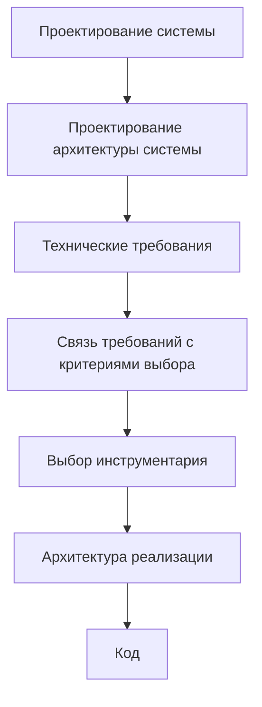
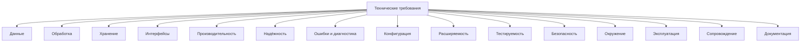
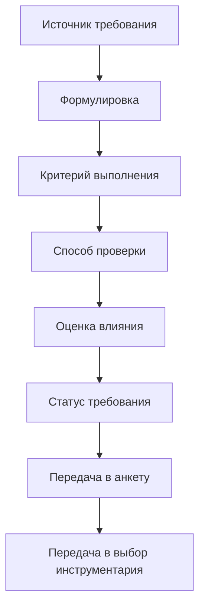

# 3.Roadmap: Technical Requirements / Технические требования

## 1. Назначение документа

`Roadmap_Technical_Requirements.md` определяет порядок формирования технических требований к цифровой системе.

Документ используется после [[docs/03_roadmaps/Roadmap_System_Design|Roadmap: System Design]] и [[docs/03_roadmaps/Roadmap_System_Architecture_Design|Roadmap: System Architecture Design]].

Документ должен превратить проектные и архитектурные решения в проверяемые технические условия, которым система должна соответствовать.

Документ не должен выбирать конкретные языки программирования, библиотеки, фреймворки, базы данных, GUI-инструменты, микроконтроллеры, PLC-платформы, протоколы или структуру реализации.

Исключение допускается только если конкретный инструмент является внешним обязательным ограничением. В этом случае инструмент фиксируется не как выбор, а как входное ограничение.

## 2. Место документа в маршруте разработки



Технические требования отвечают на вопрос:

> Каким проверяемым техническим условиям система должна соответствовать?

Технические требования не отвечают на вопрос:

> Какими конкретными инструментами система будет реализована?

## 3. Граница ответственности

### 3.1. Что входит в технические требования

В технические требования входят:

- требования к данным;
- требования к обработке;
- требования к хранению;
- требования к интерфейсам;
- требования к производительности;
- требования к надёжности;
- требования к ошибкам и диагностике;
- требования к конфигурации;
- требования к расширяемости;
- требования к тестируемости;
- требования к безопасности;
- требования к окружению;
- требования к эксплуатации;
- требования к сопровождению;
- требования к документации.

### 3.2. Что не входит в технические требования

В технические требования не входят:

- выбор языка программирования;
- выбор GUI-фреймворка;
- выбор базы данных;
- выбор библиотеки;
- выбор микроконтроллера;
- выбор PLC-платформы;
- выбор промышленного протокола;
- выбор среды разработки;
- выбор структуры файлов проекта;
- проектирование классов и функций;
- написание кода.

Эти решения относятся к отдельным этапам: [[docs/00_maps/Requirements_To_Toolchain_Map|Requirements To Toolchain Map]], [[docs/03_roadmaps/Roadmap_Toolchain_Selection|Roadmap: Toolchain Selection]] и [[docs/03_roadmaps/Roadmap_Implementation_Architecture|Roadmap: Implementation Architecture]].

## 4. Входные условия

Перед формированием технических требований должны быть определены:

- граница системы;
- внешние участники;
- сущности;
- данные;
- правила;
- состояния;
- события;
- потоки;
- хранение;
- ошибки;
- слои;
- модули;
- модели;
- интерфейсы;
- зависимости;
- конфигурации;
- точки расширения;
- архитектурные ограничения;
- открытые вопросы, которые могут повлиять на требования.

Если эти элементы не определены, технические требования будут строиться на догадках.

## Диаграммы этапа

Основные диаграммы этого этапа вынесены в отдельный документ:

- [[docs/07_diagrams/Roadmap_Technical_Requirements_Diagrams|Roadmap Technical Requirements Diagrams]]
  - Передаёт: полный визуальный набор диаграмм технических требований.
  - Используется для: визуального понимания этапа и его связей с другими документами.
  - Ограничение: не заменяет этот roadmap-документ.


## 5. Связанные документы

### 5.1. Входные документы

- [[docs/03_roadmaps/Roadmap_System_Design|Roadmap: System Design]]
  - Передаёт: сущности, данные, правила, состояния, события, потоки, хранение и ошибки.
  - Используется для: определения предмета технических требований.
  - Ограничение: не должен формировать требования вместо этого документа.

- [[docs/03_roadmaps/Roadmap_System_Architecture_Design|Roadmap: System Architecture Design]]
  - Передаёт: слои, модули, модели, интерфейсы, зависимости, конфигурации, точки расширения и архитектурные ограничения.
  - Используется для: определения требований, вытекающих из архитектуры системы.
  - Ограничение: не должен выбирать инструменты реализации.

- [[docs/04_questionnaires/Questionnaire_System_Design|Questionnaire: System Design]]
  - Передаёт: заполненные ответы по проектированию системы.
  - Используется для: конкретизации требований.
  - Ограничение: не должен содержать выбор инструментария.

- [[docs/04_questionnaires/Questionnaire_System_Architecture_Design|Questionnaire: System Architecture Design]]
  - Передаёт: заполненные архитектурные ответы.
  - Используется для: формирования требований к слоям, модулям, интерфейсам, зависимостям, конфигурациям и расширяемости.
  - Ограничение: не должен подменять технические требования.

### 5.2. Выходные документы

- [[docs/04_questionnaires/Questionnaire_Technical_Requirements|Questionnaire: Technical Requirements]]
  - Получает: структуру вопросов для заполнения технических требований.
  - Используется для: практического формирования требований.
  - Ограничение: не должен выбирать инструментарий.

- [[docs/00_maps/Requirements_To_Toolchain_Map|Requirements To Toolchain Map]]
  - Получает: утверждённые технические требования.
  - Используется для: преобразования требований в критерии выбора инструментария.
  - Ограничение: не выбирает инструменты.

- [[docs/03_roadmaps/Roadmap_Toolchain_Selection|Roadmap: Toolchain Selection]]
  - Получает: утверждённые технические требования как входные критерии выбора инструментария.
  - Используется для: выбора инструментов под требования.
  - Ограничение: не должен изменять требования без фиксации проектного изменения.

- [[docs/03_roadmaps/Roadmap_Implementation_Architecture|Roadmap: Implementation Architecture]]
  - Получает: технические требования и выбранный инструментарий после отдельного этапа выбора.
  - Используется для: проектирования конкретной структуры реализации.
  - Ограничение: не должен подменять требования.

## 6. Основные понятия этапа

### 6.1. Техническое требование

Техническое требование — это проверяемое условие, которому система должна соответствовать.

Требование считается корректным, если для него можно определить:

- идентификатор;
- формулировку;
- источник;
- причину;
- критерий выполнения;
- способ проверки;
- связанный элемент системы;
- влияние на следующие этапы;
- статус.

### 6.2. Критерий выполнения

Критерий выполнения — это условие, по которому можно определить, выполнено требование или нет.

### 6.3. Способ проверки

Способ проверки — это метод подтверждения выполнения требования.

Примеры:

- автоматический тест;
- ручная проверка;
- проверка лога;
- проверка файла;
- проверка интерфейса;
- симуляция;
- измерение времени;
- инспекция конфигурации;
- сценарий отказа;
- тестовый запуск.

### 6.4. Источник требования

Источник требования показывает, откуда появилось требование.

Источником может быть:

- [[docs/05_encyclopedia/Data|данные]];
- [[docs/05_encyclopedia/Rules|правило]];
- [[docs/05_encyclopedia/States|состояние]];
- [[docs/05_encyclopedia/Events|событие]];
- [[docs/05_encyclopedia/Flows|поток]];
- [[docs/05_encyclopedia/Storage|хранение]];
- [[docs/05_encyclopedia/Errors|ошибка]];
- [[docs/05_encyclopedia/Interfaces|интерфейс]];
- архитектурное ограничение;
- эксплуатационное ограничение;
- внешнее обязательное ограничение.

## 7. Виды технических требований

### 7.1. Требования к данным

Требования к данным определяют, какие данные система принимает, проверяет, преобразует, хранит и выдаёт.

Связанный документ: [[docs/05_encyclopedia/Data|Data]].

Необходимо определить:

- обязательные данные;
- необязательные данные;
- формат данных;
- допустимые значения;
- правила проверки;
- действие при некорректных данных;
- связь данных с сущностями;
- требования к диагностике ошибок данных.

### 7.2. Требования к обработке

Требования к обработке определяют, как система должна выполнять обработку данных, правил, сценариев и операций.

Связанный документ: [[docs/05_encyclopedia/Rules|Rules]].

Необходимо определить:

- порядок обработки;
- условия запуска обработки;
- условия остановки обработки;
- промежуточные результаты;
- правила расчётов;
- правила преобразования;
- правила повторной обработки;
- действие при сбое обработки.

### 7.3. Требования к хранению

Требования к хранению определяют, какие данные должны сохраняться, как долго и с какими гарантиями.

Связанный документ: [[docs/05_encyclopedia/Storage|Storage]].

Необходимо определить:

- что сохраняется;
- зачем сохраняется;
- срок жизни данных;
- правила обновления;
- правила архивирования;
- требования к целостности;
- требования к восстановлению;
- требования к ошибкам хранения.

### 7.4. Требования к интерфейсам

Требования к интерфейсам определяют, какие границы взаимодействия должна поддерживать система.

Связанный документ: [[docs/05_encyclopedia/Interfaces|Interfaces]].

Необходимо определить:

- участников взаимодействия;
- входные данные интерфейса;
- выходные данные интерфейса;
- допустимые команды;
- ошибки интерфейса;
- сообщения пользователю, оператору или внешней системе;
- ограничения взаимодействия.

### 7.5. Требования к производительности

Требования к производительности определяют допустимые ограничения по времени, объёму, частоте, задержке и нагрузке.

Необходимо определить:

- максимальное время выполнения операции;
- допустимый объём входных данных;
- допустимую частоту событий;
- допустимую задержку реакции;
- требования к обработке больших объёмов данных;
- требования к эффективности алгоритмов.

### 7.6. Требования к надёжности

Требования к надёжности определяют, как система должна сохранять корректность работы при ошибках, сбоях и нестандартных сценариях.

Необходимо определить:

- допустимые сбои;
- недопустимые сбои;
- поведение при частичном отказе;
- правила восстановления;
- безопасное состояние;
- правила повторной попытки;
- правила сохранения результата при сбое.

### 7.7. Требования к ошибкам и диагностике

Требования к ошибкам и диагностике определяют, какие ошибки система должна обнаруживать, классифицировать, показывать, логировать и проверять.

Связанный документ: [[docs/05_encyclopedia/Errors|Errors]].

Необходимо определить:

- виды ошибок;
- уровни критичности;
- реакцию системы;
- сообщения пользователю или оператору;
- правила логирования;
- диагностические данные;
- способ проверки ошибочных сценариев.

### 7.8. Требования к конфигурации

Требования к конфигурации определяют, какие параметры должны изменяться без изменения кода.

Необходимо определить:

- список конфигурационных параметров;
- назначение каждого параметра;
- допустимые значения;
- значения по умолчанию;
- правила проверки конфигурации;
- действие при ошибке конфигурации.

### 7.9. Требования к расширяемости

Требования к расширяемости определяют, какие части системы должны допускать развитие без разрушения архитектуры.

Связанный документ: [[docs/03_roadmaps/Roadmap_System_Evolution|Roadmap: System Evolution]].

Необходимо определить:

- какие входные данные могут расширяться;
- какие правила могут добавляться;
- какие форматы результата могут добавляться;
- какие интеграции могут появиться;
- какие точки расширения обязательны;
- какие изменения запрещены без пересмотра архитектуры.

### 7.10. Требования к тестируемости

Требования к тестируемости определяют, как система, сценарии, модули, интерфейсы, ошибки и требования должны проверяться.

Связанный документ: [[docs/03_roadmaps/Roadmap_Testing|Roadmap: Testing]].

Необходимо определить:

- какие элементы должны быть тестируемыми;
- какие сценарии должны проверяться автоматически;
- какие сценарии допускают ручную проверку;
- какие тестовые данные нужны;
- какие ошибки должны проверяться;
- какие критерии приёмки существуют.

### 7.11. Требования к безопасности

Требования к безопасности определяют ограничения доступа, защиты данных, безопасного состояния и недопустимых действий.

Необходимо определить:

- кто имеет право выполнять действия;
- какие действия запрещены;
- какие данные защищаются;
- какие состояния являются безопасными;
- какие ошибки безопасности возможны;
- какие действия должны блокироваться.

### 7.12. Требования к окружению

Требования к окружению определяют условия, в которых система должна работать.

Необходимо определить:

- операционную среду как требование, если она уже задана внешне;
- ограничения файловой системы;
- ограничения сети;
- ограничения оборудования;
- ограничения промышленной среды;
- ограничения прав доступа;
- требования к запуску и остановке.

### 7.13. Требования к эксплуатации

Требования к эксплуатации определяют, как система должна использоваться в реальной среде.

Связанный документ: [[docs/03_roadmaps/Roadmap_Operation|Roadmap: Operation]].

Необходимо определить:

- порядок запуска;
- порядок остановки;
- действия пользователя при ошибке;
- правила сохранения результата;
- правила повторного запуска;
- ограничения эксплуатации.

### 7.14. Требования к сопровождению

Требования к сопровождению определяют, как система должна поддерживаться после создания.

Связанный документ: [[docs/03_roadmaps/Roadmap_Maintenance|Roadmap: Maintenance]].

Необходимо определить:

- требования к журналу изменений;
- требования к совместимости данных;
- требования к обновлению конфигурации;
- требования к диагностике после выпуска;
- требования к читаемости результата и логов.

### 7.15. Требования к документации

Требования к документации определяют, какие документы должны сопровождать систему.

Связанные документы:

- [[docs/01_regulations/Documentation_System_Regulation|Documentation System Regulation]];
- [[docs/01_regulations/Document_Writing_Rules|Document Writing Rules]];
- [[docs/01_regulations/Link_Rules|Link Rules]];
- [[docs/01_regulations/Diagram_Rules|Diagram Rules]].

Необходимо определить:

- пользовательскую инструкцию;
- техническое описание;
- описание входных и выходных данных;
- описание ошибок;
- описание конфигурации;
- описание тестирования;
- описание ограничений.

## 8. DG-TR-001. Классификация технических требований



## 9. Правила формулировки требований

### RULE-TR-001. Требование должно быть проверяемым

Неправильно:

> Система должна быть удобной.

Правильно:

> Система должна показывать сообщение с причиной ошибки, если входной файл не содержит обязательную колонку.

### RULE-TR-002. Требование должно быть отделено от инструмента

Неправильно:

> Использовать SQLite.

Правильно:

> Система должна сохранять данные между запусками в структурированном виде с возможностью поиска по уникальному идентификатору.

### RULE-TR-003. Требование должно иметь источник

Нельзя добавлять требование без причины и источника.

### RULE-TR-004. Требование должно иметь критерий выполнения

Требование считается неполным, если невозможно понять, выполнено оно или нет.

### RULE-TR-005. Требование должно иметь способ проверки

Каждое важное требование должно быть проверяемо тестом, сценарием, логом, измерением, симуляцией или ручной проверкой.

### RULE-TR-006. Требование не должно быть пожеланием

Пожелание должно быть преобразовано в проверяемое условие или вынесено в открытые вопросы.

### RULE-TR-007. Требование не должно противоречить архитектуре системы

Если требование противоречит архитектурному решению, необходимо пересмотреть требование или зафиксировать изменение архитектуры.

### RULE-TR-008. Требование должно сохранять связь с дальнейшим выбором инструментария

Техническое требование может влиять на выбор инструментария, но не должно само выбирать инструмент.

## 10. Порядок работы

### 10.1. Шаг 1. Собрать входные проектные решения

Необходимо собрать результаты проектирования системы и архитектуры системы.

Результат шага:

- список проектных решений;
- список архитектурных решений;
- список ограничений;
- список открытых вопросов.

### 10.2. Шаг 2. Разделить требования по видам

Необходимо распределить требования по категориям из раздела 7.

Результат шага:

- черновой список требований по категориям.

### 10.3. Шаг 3. Сформулировать требования через `Система должна...`

Каждое требование должно описывать обязанность системы.

Результат шага:

- формулировки требований.

### 10.4. Шаг 4. Добавить источник и причину

Для каждого требования необходимо указать, откуда оно появилось и зачем нужно.

Результат шага:

- требования с источниками и причинами.

### 10.5. Шаг 5. Добавить критерии выполнения

Для каждого требования необходимо определить, когда оно считается выполненным.

Результат шага:

- требования с критериями выполнения.

### 10.6. Шаг 6. Добавить способы проверки

Для каждого требования необходимо определить способ проверки.

Результат шага:

- требования с проверками.

### 10.7. Шаг 7. Определить влияние на следующие этапы

Необходимо указать, влияет ли требование на:

- выбор инструментария;
- архитектуру реализации;
- тестирование;
- эксплуатацию;
- сопровождение.

Результат шага:

- требования с указанием влияния на следующие этапы.

### 10.8. Шаг 8. Зафиксировать открытые вопросы

Неопределённые требования должны быть вынесены в открытые вопросы.

Результат шага:

- список открытых вопросов.

## 11. DG-TR-002. Жизненный цикл требования



## 12. Шаблон технического требования

```md
## REQ-TR-000. Название требования

### Формулировка

Система должна ...

### Категория

- Данные / Обработка / Хранение / Интерфейсы / Производительность / Надёжность / Ошибки / Конфигурация / Расширяемость / Тестируемость / Безопасность / Окружение / Эксплуатация / Сопровождение / Документация.

### Источник

- 

### Причина

- 

### Критерий выполнения

Требование считается выполненным, если ...

### Способ проверки

- 

### Влияние на следующие этапы

- Выбор инструментария: Да / Нет.
- Архитектура реализации: Да / Нет.
- Тестирование: Да / Нет.
- Эксплуатация: Да / Нет.
- Сопровождение: Да / Нет.

### Статус

- Draft / Approved / Changed / Deprecated.
```

## 13. Примеры из разных областей цифровых систем

### 13.1. Скрипт автоматизации

Контекст: система обрабатывает входные файлы и формирует отчёт.

Требования:

- Система должна проверять наличие обязательных входных файлов перед обработкой.
- Система должна записывать лог обработки после каждого запуска.
- Система должна сохранять результат в структурированном виде.
- Система должна фиксировать ошибку для каждого файла, который не удалось обработать.

Связанный пример: [[docs/06_examples/Scripts/Python_File_Processing_Utility|Python File Processing Utility]].

### 13.2. GUI-приложение

Контекст: пользователь редактирует шаблон и экспортирует результат.

Требования:

- Система должна блокировать экспорт, если обязательные поля шаблона не заполнены.
- Система должна отображать пользователю причину блокировки действия.
- Система должна сохранять пользовательские настройки между запусками.
- Система должна предупреждать пользователя о несохранённых изменениях.

### 13.3. Embedded-система

Контекст: контроллер управляет исполнительным механизмом по данным датчика.

Требования:

- Система должна переходить в безопасное состояние при потере сигнала датчика.
- Система должна проверять диапазон измеренного значения перед использованием в логике управления.
- Система должна выполнять управляющее действие не позднее заданного времени реакции.
- Система должна сохранять диагностический код ошибки.

### 13.4. PLC-система

Контекст: PLC управляет технологическим процессом.

Требования:

- Система должна блокировать запуск оборудования при активной аварии.
- Система должна сохранять аварийное сообщение до подтверждения оператором.
- Система должна отображать на HMI причину блокировки команды.
- Система должна сохранять критичные уставки после перезапуска контроллера.

### 13.5. CNC/CAM-система

Контекст: система анализирует NC-программы и использование инструмента.

Требования:

- Система должна определять вызовы инструмента в NC-программе.
- Система должна фиксировать ошибку, если инструмент отсутствует в таблице инструмента.
- Система должна формировать отчёт по использованию инструмента.
- Система должна сохранять исходный файл без изменений.

## 14. Контрольные вопросы

Перед переходом к анкете технических требований необходимо ответить:

1. Все ли требования имеют источник?
2. Все ли требования сформулированы через обязанность системы?
3. Все ли требования проверяемы?
4. У каждого требования есть критерий выполнения?
5. У каждого требования есть способ проверки?
6. Требования не содержат выбора инструментария?
7. Требования не противоречат архитектуре системы?
8. Требования разделены по категориям?
9. Известно, какие требования влияют на выбор инструментария?
10. Известно, какие требования влияют на архитектуру реализации?
11. Открытые вопросы вынесены отдельно?
12. Требования готовы для передачи в [[docs/04_questionnaires/Questionnaire_Technical_Requirements|Questionnaire: Technical Requirements]]?

## 15. Критерии завершения

Roadmap технических требований считается завершённым, если:

- определены виды технических требований;
- определены правила формулировки требований;
- определён порядок работы;
- определён шаблон технического требования;
- определены критерии проверки требований;
- требования отделены от выбора инструментария;
- требования связаны с проектированием системы и архитектурой системы;
- требования могут быть переданы в анкету технических требований;
- требования могут быть использованы как вход для отдельного выбора инструментария.

## 16. Выходные данные для следующего этапа

После завершения формирования технических требований должны быть получены:

- список требований к данным;
- список требований к обработке;
- список требований к хранению;
- список требований к интерфейсам;
- список требований к производительности;
- список требований к надёжности;
- список требований к ошибкам и диагностике;
- список требований к конфигурации;
- список требований к расширяемости;
- список требований к тестируемости;
- список требований к безопасности;
- список требований к окружению;
- список требований к эксплуатации;
- список требований к сопровождению;
- список требований к документации;
- список требований, влияющих на выбор инструментария;
- список требований, влияющих на архитектуру реализации;
- список открытых вопросов;
- входные данные для [[docs/00_maps/Requirements_To_Toolchain_Map|Requirements To Toolchain Map]];
- входные данные для [[docs/04_questionnaires/Questionnaire_Technical_Requirements|Questionnaire: Technical Requirements]].

## 17. Открытые вопросы

Открытые вопросы должны быть вынесены отдельно.

Примеры открытых вопросов:

- Неизвестен максимальный объём входных данных.
- Неизвестно допустимое время обработки.
- Неизвестно, какие данные должны храниться после перезапуска.
- Неизвестно, какие ошибки должны блокировать работу.
- Неизвестно, какие эксплуатационные ограничения заданы внешней средой.

## 18. История изменений

- Initial version: создан roadmap технических требований как самостоятельная тема, отделённая от выбора инструментария.
- Updated: документ приведён к Obsidian wikilinks.
