# Toolchain Selection Category Rules / Правила категоризации инструментария

## 1. Назначение документа

`05_Toolchain_Selection_Category_Rules.md` определяет правила категоризации инструментария при выборе средств реализации цифровой системы.

Документ нужен для того, чтобы пользователь не воспринимал все виды инструментария как обязательные для любого проекта.

Инструментарий должен выбираться только в тех категориях, которые действительно требуются конкретной системе.

Связанный roadmap: [[docs/03_roadmaps/05_Roadmap_Toolchain_Selection|Roadmap: Toolchain Selection]].

Связанная анкета: [[docs/04_questionnaires/05_Questionnaire_Toolchain_Selection|Questionnaire: Toolchain Selection]].

## 2. Главный принцип

Список инструментов не должен выглядеть как обязательный перечень для каждого проекта.

Каждая категория инструментария должна иметь условие применения.

Неправильно:

```text
В выбор инструментария входят:
- выбор языка программирования;
- выбор GUI-инструментов;
- выбор embedded-инструментов;
- выбор PLC-инструментов;
- выбор базы данных;
```

Такой список создаёт впечатление, что все категории нужны всегда.

Правильно:

```text
Базовый инструментарий выбирается почти для любого программного проекта.
Прикладной инструментарий выбирается только если система имеет соответствующий тип интерфейса, среды или интеграции.
Специализированный инструментарий выбирается только если проект относится к embedded, PLC, CNC/CAM, промышленной автоматизации или другой специальной области.
```

## 3. Основные группы инструментария

## 3.1. Базовый инструментарий

Базовый инструментарий нужен почти для любого цифрового проекта.

В эту группу входят:

- язык программирования;
- среда выполнения;
- редактор или IDE;
- система контроля версий;
- инструменты тестирования;
- инструменты логирования;
- инструменты документации;
- инструменты сборки или запуска;
- базовые средства отладки.

### Когда применяется

Применяется почти всегда, если создаётся программная система, скрипт, утилита, GUI-приложение, web-сервис, embedded-прошивка, PLC-программа или интеграционная система.

### Пример для Python-новичка

Если пользователь учится создавать Python-утилиту, в базовый инструментарий могут входить:

- язык Python;
- среда выполнения Python;
- редактор VS Code;
- Git;
- pytest или другой инструмент тестирования;
- logging;
- Markdown-документация.

PLC, embedded и промышленные инструменты в таком проекте не требуются.

Связанный пример: [[docs/06_examples/Scripts/Python_File_Processing_Utility|Python File Processing Utility]].

## 3.2. Прикладной инструментарий по типу системы

Прикладной инструментарий выбирается только если система требует соответствующий тип реализации.

### 3.2.1. GUI-инструменты

Выбираются только если система должна иметь графический пользовательский интерфейс.

Применяется, если:

- пользователь работает через окна, формы, кнопки, таблицы, панели или визуальный редактор;
- система должна показывать предпросмотр;
- система должна работать как desktop-приложение.

Не применяется, если:

- система является простым CLI-скриптом;
- система работает полностью в фоне;
- пользовательский интерфейс не требуется.

### 3.2.2. Web-инструменты

Выбираются только если система должна работать через браузер, API или серверную часть.

Применяется, если:

- нужен web-интерфейс;
- нужен REST API;
- система должна обслуживать несколько пользователей через сеть;
- нужна серверная логика.

Не применяется, если:

- система является локальным скриптом;
- система не имеет сетевого взаимодействия;
- desktop-интерфейса достаточно.

### 3.2.3. Инструменты хранения и базы данных

Выбираются только если система должна сохранять данные между запусками, выполнять поиск, поддерживать историю или обеспечивать целостность данных.

Связанный энциклопедический документ: [[docs/05_encyclopedia/Storage|Storage]].

Применяется, если:

- данные должны сохраняться между запусками;
- нужна история изменений;
- нужен поиск по данным;
- нужна связанная структура данных;
- несколько модулей используют общие данные.

Не применяется, если:

- результат одноразовый;
- данные не сохраняются;
- достаточно временной обработки в памяти.

### 3.2.4. Форматы файлов

Выбираются только если система читает, записывает, импортирует, экспортирует или обменивается файлами.

Применяется, если:

- система читает таблицы, PDF, JSON, CSV, XML, NC-файлы или другие файлы;
- система формирует отчёт;
- система хранит конфигурацию в файле;
- требуется обмен с другой системой через файл.

## 3.3. Специализированный инструментарий

Специализированный инструментарий выбирается только для проектов соответствующей области.

Он не должен восприниматься как обязательный для обычного обучения программированию или создания Python-утилит.

### 3.3.1. Embedded-инструменты

Выбираются только если система разрабатывается для микроконтроллера, одноплатного компьютера, датчиков, исполнительных механизмов или устройства с ограниченными ресурсами.

Не применяется, если:

- система является обычным Python-скриптом на ПК;
- система является desktop-приложением без железа;
- нет работы с микроконтроллером или устройством.

### 3.3.2. PLC-инструменты

Выбираются только если система относится к промышленной автоматизации, управлению оборудованием, PLC, HMI, safety, технологическим процессам или промышленным протоколам.

Не применяется, если:

- пользователь изучает обычное программирование на Python;
- система является файловой утилитой;
- система не управляет оборудованием;
- нет PLC, HMI или промышленной автоматизации.

### 3.3.3. CNC/CAM-инструменты

Выбираются только если система работает с NC-программами, CAM-данными, постпроцессорами, инструментом, станками или производственными файлами.

Не применяется, если:

- проект не связан со станками, CAM или NC-программами.

## 4. Связь с маршрутом разработки

Категоризация инструментария находится между:

- [[docs/03_roadmaps/03_Roadmap_Technical_Requirements|Roadmap: Technical Requirements]]
  - Передаёт: требования, из которых должны вытекать критерии выбора.
  - Используется для: определения, какие инструменты вообще нужны.
  - Ограничение: не выбирает инструмент.

- [[docs/00_maps/04_Requirements_To_Toolchain_Map|Requirements To Toolchain Map]]
  - Передаёт: связь требования с критерием выбора инструмента.
  - Используется для: трассировки выбора.
  - Ограничение: не заменяет roadmap выбора инструментария.

- [[docs/03_roadmaps/05_Roadmap_Toolchain_Selection|Roadmap: Toolchain Selection]]
  - Получает: правила категоризации.
  - Используется для: выбора конкретных инструментов.
  - Ограничение: не должен трактовать все категории как обязательные.

## 5. Рекомендуемое правило для основного roadmap

В [[docs/03_roadmaps/05_Roadmap_Toolchain_Selection|Roadmap: Toolchain Selection]] должно быть правило:

```md
### RULE-TOOLS-008. Категория инструментария должна иметь условие применения

Категория инструментария не должна выглядеть обязательной для всех проектов.

Для каждой прикладной или специализированной категории необходимо указать, когда она применяется и когда она не применяется.
```

## 6. Диаграмма категоризации инструментария

```mermaid
flowchart TD
    A[Инструментарий] --> B[Базовый инструментарий]
    A --> C[Прикладной инструментарий]
    A --> D[Специализированный инструментарий]

    B --> B1[Язык программирования]
    B --> B2[Среда выполнения]
    B --> B3[Редактор или IDE]
    B --> B4[Контроль версий]
    B --> B5[Тестирование]
    B --> B6[Логирование]
    B --> B7[Документация]

    C --> C1[GUI если нужен интерфейс]
    C --> C2[Web если нужен браузер или API]
    C --> C3[Хранение если нужны постоянные данные]
    C --> C4[Форматы файлов если есть импорт или экспорт]
    C --> C5[Протоколы если есть обмен]

    D --> D1[Embedded если есть микроконтроллер или устройство]
    D --> D2[PLC если есть промышленная автоматизация]
    D --> D3[CNC/CAM если есть станки или NC-программы]
    D --> D4[Промышленные протоколы если есть оборудование]
    D --> D5[Симуляция если нужно проверять без оборудования]
```



## 7. Контрольные вопросы

Перед выбором категории инструментария необходимо ответить:

1. Эта категория нужна всем проектам или только определённым типам систем?
2. Какое требование вызывает необходимость этой категории?
3. Какой тип системы требует эту категорию?
4. Что произойдёт, если эту категорию не рассматривать?
5. Не вводит ли категория новичка в заблуждение?
6. Нужно ли явно написать `применяется только если...`?
7. Нужно ли явно написать `не применяется если...`?

## 8. История изменений

- Initial version: создано правило категоризации инструментария, чтобы специализированные категории, такие как PLC, embedded и CNC/CAM, не воспринимались как обязательные для всех проектов.
- Updated: документ приведён к Obsidian wikilinks.
