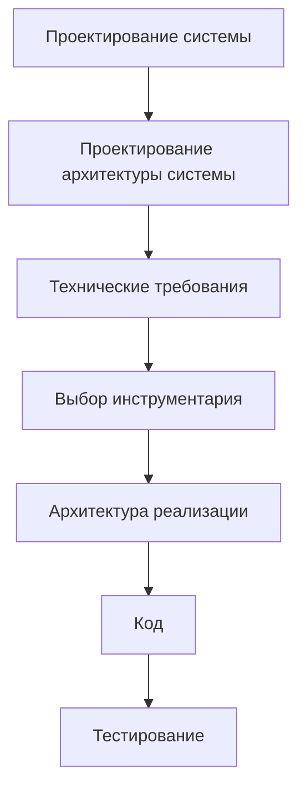
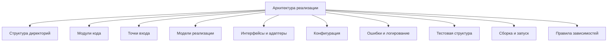

# Roadmap: Implementation Architecture / Архитектура реализации

## 1. Назначение документа

`Roadmap_Implementation_Architecture.md` определяет порядок проектирования архитектуры реализации цифровой системы.

Документ используется после:

- [[docs/03_roadmaps/Roadmap_System_Design|Roadmap: System Design]];
- [[docs/03_roadmaps/Roadmap_System_Architecture_Design|Roadmap: System Architecture Design]];
- [[docs/03_roadmaps/Roadmap_Technical_Requirements|Roadmap: Technical Requirements]];
- [[docs/03_roadmaps/Roadmap_Toolchain_Selection|Roadmap: Toolchain Selection]].

Документ должен превратить архитектуру системы, требования и выбранный инструментарий в конкретную структуру реализации.

Документ не должен:

- заново проектировать систему;
- заново проектировать архитектуру системы;
- заново формировать технические требования;
- заново выбирать инструментарий;
- писать код вместо проектирования реализации.

## 2. Место документа в маршруте разработки



Архитектура реализации отвечает на вопрос:

> Как выбранная архитектура системы будет организована в конкретной структуре проекта, модулей, файлов, адаптеров, конфигураций, тестов и технических компонентов?

## 3. Граница ответственности

### 3.1. Что входит в архитектуру реализации

В архитектуру реализации входят:

- структура проекта;
- структура директорий;
- модули кода;
- точки входа;
- технические компоненты;
- адаптеры;
- реализации интерфейсов;
- конфигурационные файлы;
- файлы данных;
- тестовая структура;
- логирование;
- обработка ошибок на уровне реализации;
- правила именования;
- правила зависимостей в коде;
- правила сборки и запуска;
- правила поставки;
- технические ограничения выбранных инструментов.

### 3.2. Что не входит в архитектуру реализации

В архитектуру реализации не входят:

- изменение цели системы;
- изменение предметных сущностей без возврата к проектированию системы;
- изменение архитектуры системы без фиксации архитектурного решения;
- добавление новых требований без возврата к техническим требованиям;
- смена инструментария без возврата к выбору инструментария;
- непосредственное написание бизнес-кода без структуры реализации.

## 4. Входные условия

Перед проектированием архитектуры реализации должны быть определены:

- результаты проектирования системы;
- архитектура системы;
- технические требования;
- выбранный инструментарий;
- ограничения выбранных инструментов;
- требования к тестируемости;
- требования к эксплуатации;
- требования к сопровождению;
- требования к документации.

Если эти элементы не определены, архитектура реализации будет строиться на догадках.

## 5. Связанные документы

### 5.1. Входные документы

- [[docs/03_roadmaps/Roadmap_System_Architecture_Design|Roadmap: System Architecture Design]]
  - Передаёт: слои, модули, модели, интерфейсы, зависимости, конфигурации и точки расширения.
  - Используется для: преобразования архитектуры системы в структуру реализации.
  - Ограничение: не описывает конкретные файлы и директории реализации.

- [[docs/03_roadmaps/Roadmap_Technical_Requirements|Roadmap: Technical Requirements]]
  - Передаёт: проверяемые технические условия.
  - Используется для: определения требований к структуре, тестированию, логированию и эксплуатации.
  - Ограничение: не выбирает структуру реализации.

- [[docs/03_roadmaps/Roadmap_Toolchain_Selection|Roadmap: Toolchain Selection]]
  - Передаёт: выбранные инструменты и ограничения.
  - Используется для: привязки реализации к выбранному стеку.
  - Ограничение: не описывает структуру проекта.

- [[docs/04_questionnaires/Questionnaire_Toolchain_Selection|Questionnaire: Toolchain Selection]]
  - Передаёт: конкретные решения по инструментарию.
  - Используется для: определения технических компонентов реализации.
  - Ограничение: не проектирует директории и модули.

### 5.2. Выходные документы

- [[docs/04_questionnaires/Questionnaire_Implementation_Architecture|Questionnaire: Implementation Architecture]]
  - Получает: структуру вопросов для проектирования реализации.
  - Используется для: практического заполнения архитектуры реализации.
  - Ограничение: не должен писать код.

- [[docs/03_roadmaps/Roadmap_Testing|Roadmap: Testing]]
  - Получает: структуру реализации и тестовые точки.
  - Используется для: проектирования тестирования.
  - Ограничение: не должен менять архитектуру реализации без причины.

## 6. Основные понятия этапа

### 6.1. Структура проекта

Структура проекта — это организация директорий, файлов, модулей и технических артефактов в репозитории.

### 6.2. Модуль реализации

Модуль реализации — это конкретная единица кода, которая реализует часть архитектурного модуля системы.

### 6.3. Точка входа

Точка входа — это место, с которого начинается выполнение системы или сценария.

Примеры:

- `main.py`;
- CLI-команда;
- web-server entrypoint;
- firmware setup/loop;
- PLC main organization block;
- GUI application bootstrap.

### 6.4. Адаптер

Адаптер — это технический компонент, который связывает внутреннюю систему с внешним инструментом, библиотекой, файлом, API, базой данных, оборудованием или протоколом.

### 6.5. Конфигурация реализации

Конфигурация реализации — это конкретный способ хранения и загрузки параметров выбранного инструментария и поведения системы.

## 7. Основные области архитектуры реализации

### 7.1. Структура директорий

Необходимо определить:

- где расположен исходный код;
- где расположены тесты;
- где расположена документация;
- где расположены конфигурации;
- где расположены примеры данных;
- где расположены скрипты запуска;
- где расположены артефакты сборки, если они допускаются в репозитории.

### 7.2. Модули кода

Необходимо определить:

- какие модули реализуют архитектурные модули системы;
- какие модули являются внутренними;
- какие модули являются адаптерами;
- какие модули являются точками входа;
- какие модули содержат модели;
- какие модули содержат правила;
- какие модули содержат инфраструктурную реализацию.

### 7.3. Реализация слоёв

Необходимо определить, как архитектурные слои будут отражены в проекте.

### 7.4. Реализация моделей

Необходимо определить:

- где находятся доменные модели;
- где находятся модели данных;
- где находятся DTO или структуры обмена;
- где находятся модели конфигурации;
- где находятся модели ошибок;
- где находятся модели событий и состояний.

### 7.5. Реализация интерфейсов и адаптеров

Необходимо определить:

- какие интерфейсы реализуются напрямую;
- какие интерфейсы закрываются адаптерами;
- где находятся адаптеры файлов;
- где находятся адаптеры базы данных;
- где находятся адаптеры API;
- где находятся адаптеры оборудования;
- где находятся адаптеры UI.

### 7.6. Конфигурация реализации

Необходимо определить:

- где хранятся конфигурационные файлы;
- как загружается конфигурация;
- как проверяется конфигурация;
- где находятся значения по умолчанию;
- как обрабатываются ошибки конфигурации.

### 7.7. Ошибки и логирование в реализации

Необходимо определить:

- где создаются ошибки;
- где ошибки перехватываются;
- где ошибки преобразуются в сообщения;
- где ошибки логируются;
- какие уровни логирования используются;
- где хранится лог;
- как лог используется для диагностики.

### 7.8. Тестовая структура

Необходимо определить:

- где находятся unit-тесты;
- где находятся integration-тесты;
- где находятся test fixtures;
- где находятся тестовые данные;
- какие модули должны быть проверяемы изолированно;
- какие адаптеры должны иметь mock или fake-реализации.

## 8. DG-IMPL-001. Общая карта архитектуры реализации



## 9. Правила архитектуры реализации

### RULE-IMPL-001. Реализация должна следовать архитектуре системы

Структура проекта должна отражать утверждённые слои, модули, интерфейсы и зависимости.

### RULE-IMPL-002. Реализация должна учитывать ограничения выбранного инструментария

Ограничения инструментов должны быть отражены в структуре проекта и правилах реализации.

### RULE-IMPL-003. Точки входа должны быть явными

Нельзя оставлять неясным, откуда запускается система, тест, сценарий или служебная команда.

### RULE-IMPL-004. Инфраструктура должна быть отделена от доменной логики

Работа с файлами, базами данных, API, UI, оборудованием и внешними библиотеками должна быть отделена от предметных правил системы.

### RULE-IMPL-005. Конфигурация не должна быть размазана по коду

Параметры, которые должны изменяться без изменения кода, должны иметь явное место хранения и загрузки.

### RULE-IMPL-006. Ошибки должны иметь маршрут обработки

Ошибка должна иметь понятный путь: возникновение → обработка → сообщение или лог → восстановление или остановка.

### RULE-IMPL-007. Тесты должны быть частью архитектуры реализации

Тестовая структура должна проектироваться вместе со структурой реализации, а не добавляться случайно после кода.

### RULE-IMPL-008. Реализация не должна нарушать границы слоёв

Если модуль нижнего уровня начинает зависеть от UI, CLI, API или конкретной инфраструктуры без архитектурного основания, структура реализации считается нарушенной.

## 10. Порядок работы

### 10.1. Шаг 1. Собрать входные решения

Необходимо собрать:

- архитектуру системы;
- технические требования;
- выбранный инструментарий;
- ограничения инструментов.

### 10.2. Шаг 2. Определить структуру проекта

Необходимо определить дерево директорий и назначение каждой части.

### 10.3. Шаг 3. Разложить архитектурные модули на модули реализации

Необходимо определить, какие файлы или пакеты реализуют каждый архитектурный модуль.

### 10.4. Шаг 4. Определить точки входа

Необходимо определить, откуда запускается приложение, сценарии, тесты, служебные команды и процессы.

### 10.5. Шаг 5. Определить адаптеры

Необходимо определить, какие внешние зависимости закрываются адаптерами.

### 10.6. Шаг 6. Определить конфигурацию

Необходимо определить, где находятся настройки и как они загружаются.

### 10.7. Шаг 7. Определить ошибки и логирование

Необходимо определить маршрут ошибки и структуру диагностической информации.

### 10.8. Шаг 8. Определить тестовую структуру

Необходимо определить, как проект будет проверяться.

### 10.9. Шаг 9. Определить правила сборки и запуска

Необходимо определить команды запуска, проверки, сборки и поставки.

### 10.10. Шаг 10. Зафиксировать правила зависимостей

Необходимо определить допустимые и запрещённые зависимости реализации.

## 11. Шаблон описания модуля реализации

```md
## MODULE-IMPL-000. Название модуля

### Назначение

- 

### Архитектурный источник

- 

### Входные данные

- 

### Выходные данные

- 

### Зависимости

- 

### Ошибки

- 

### Тестирование

- 

### Ограничения

- 
```

## 12. Примеры из разных областей цифровых систем

### 12.1. Скрипт автоматизации

Возможная структура:

```text
project_root/
|-- src/
|   |-- main.py
|   |-- readers/
|   |-- parsers/
|   |-- validators/
|   |-- processors/
|   |-- writers/
|   |-- logging_config.py
|-- tests/
|-- config/
|-- docs/
```

Связанный пример: [[docs/06_examples/Scripts/Python_File_Processing_Utility|Python File Processing Utility]].

### 12.2. GUI-приложение

Возможная структура:

```text
project_root/
|-- src/
|   |-- app/
|   |-- ui/
|   |-- application/
|   |-- domain/
|   |-- infrastructure/
|-- tests/
|-- config/
|-- docs/
```

## 13. Контрольные вопросы

Перед переходом к коду необходимо ответить:

1. Определена ли структура проекта?
2. Для каждой директории указано назначение?
3. Определены ли точки входа?
4. Архитектурные модули сопоставлены с модулями реализации?
5. Определены ли адаптеры внешних зависимостей?
6. Определено ли место конфигурации?
7. Определён ли маршрут обработки ошибок?
8. Определена ли структура логирования?
9. Определена ли тестовая структура?
10. Определены ли команды запуска, проверки и сборки?
11. Определены ли допустимые и запрещённые зависимости?
12. Реализация не нарушает архитектуру системы?
13. Ограничения выбранных инструментов учтены?

## 14. Критерии завершения

Roadmap архитектуры реализации считается завершённым, если:

- определена структура проекта;
- определены директории и их назначение;
- определены модули реализации;
- определены точки входа;
- определены адаптеры;
- определена конфигурация;
- определена обработка ошибок и логирование;
- определена тестовая структура;
- определены правила сборки и запуска;
- определены правила зависимостей;
- структура реализации следует архитектуре системы;
- ограничения выбранного инструментария учтены;
- открытые вопросы вынесены отдельно.

## 15. Выходные данные для следующего этапа

После завершения архитектуры реализации должны быть получены:

- дерево проекта;
- описание директорий;
- список модулей реализации;
- список точек входа;
- список адаптеров;
- описание конфигурации;
- описание ошибок и логирования;
- тестовая структура;
- команды запуска, проверки и сборки;
- правила зависимостей;
- входные данные для кодирования и [[docs/03_roadmaps/Roadmap_Testing|Roadmap: Testing]].

## 16. Открытые вопросы

Примеры открытых вопросов:

- Неизвестно, как выбранный инструмент требует организовать проект.
- Неизвестно, как упаковывать приложение.
- Неизвестно, какие тесты должны быть автоматическими.
- Неизвестно, где хранить конфигурацию.
- Неизвестно, как обрабатывать ограничения внешнего инструмента.

## 17. История изменений

- Initial version: создан roadmap архитектуры реализации.
- Updated: документ приведён к Obsidian wikilinks.
