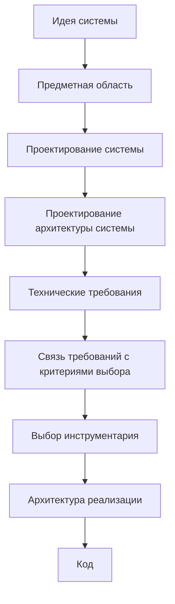
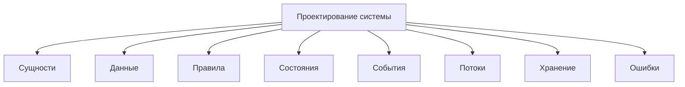
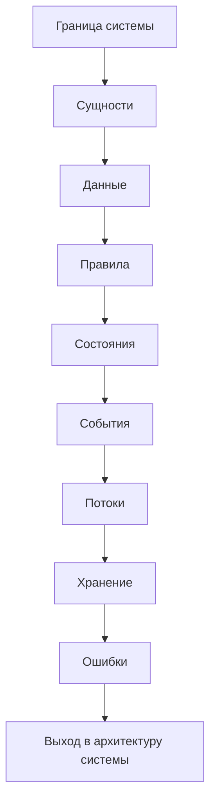
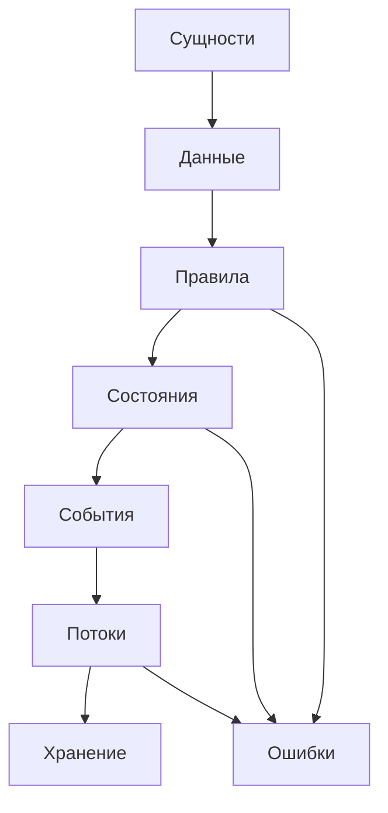

# Roadmap: System Design / Проектирование системы

## 1. Назначение документа

`Roadmap_System_Design.md` определяет порядок проектирования цифровой системы до проектирования архитектуры системы, формирования технических требований, выбора инструментария и реализации.

Документ должен помочь проектировщику последовательно определить:

- сущности;
- данные;
- правила;
- состояния;
- события;
- потоки;
- хранение;
- ошибки.

Документ не должен подменять:

- проектирование архитектуры системы;
- технические требования;
- выбор инструментария;
- архитектуру реализации;
- написание кода.

## 2. Место документа в маршруте разработки

Проектирование системы отвечает за вопрос:

> Что существует в системе и как система должна работать на логическом уровне?

Проектирование системы не отвечает за вопрос:

> Какие библиотеки, фреймворки, базы данных и структура файлов будут использованы?

## 3. Входные условия

Перед началом проектирования системы должны быть зафиксированы:

- идея системы;
- назначение системы;
- основная проблема, которую решает система;
- пользователь или внешний потребитель результата;
- ожидаемый результат работы системы;
- известные ограничения предметной области;
- известные входные материалы, сигналы, файлы, команды или источники данных.

Если эти элементы не определены, проектирование системы будет строиться на догадках.

## 4. Связанные документы

### 4.1. Входные документы

- [[PROJECT_SCOPE|PROJECT_SCOPE]]
  - Передаёт: масштаб проекта, центральную формулу цифровой системы и разделение уровней проектирования.
  - Используется для: определения места проектирования системы в общем маршруте.
  - Ограничение: не раскрывает порядок проектирования конкретной системы.

- [[docs/00_maps/Development_Route_Map|Development Route Map]]
  - Передаёт: маршрут движения от идеи к реализации, эксплуатации, сопровождению и развитию.
  - Используется для: определения входа и выхода этапа проектирования системы.
  - Ограничение: не раскрывает содержание каждого проектного шага.

- [[docs/05_encyclopedia/Entities|Entities]]
  - Передаёт: понятие сущности и виды сущностей.
  - Используется для: выделения состава системы.
  - Ограничение: не является пошаговым roadmap-документом.

- [[docs/05_encyclopedia/Data|Data]]
  - Передаёт: понятие данных и виды данных.
  - Используется для: определения входных, внутренних, хранимых, выходных и конфигурационных данных.
  - Ограничение: не формирует технические требования к данным.

- [[docs/05_encyclopedia/Rules|Rules]]
  - Передаёт: понятие правил и виды правил.
  - Используется для: определения поведения системы.
  - Ограничение: не заменяет проектирование сценариев системы.

- [[docs/05_encyclopedia/States|States]]
  - Передаёт: понятие состояний и жизненных циклов.
  - Используется для: определения состояний системы, сущностей, процессов, данных и ошибок.
  - Ограничение: не заменяет state diagram конкретной системы.

- [[docs/05_encyclopedia/Events|Events]]
  - Передаёт: понятие событий и источников событий.
  - Используется для: определения реакций системы.
  - Ограничение: не заменяет sequence diagram конкретной системы.

- [[docs/05_encyclopedia/Flows|Flows]]
  - Передаёт: понятие потоков.
  - Используется для: определения движения данных, команд, событий, состояний и ошибок.
  - Ограничение: не определяет архитектурные слои и модули.

- [[docs/05_encyclopedia/Storage|Storage]]
  - Передаёт: понятие хранения.
  - Используется для: определения того, какие данные должны сохраняться.
  - Ограничение: не выбирает базу данных или формат хранения.

- [[docs/05_encyclopedia/Errors|Errors]]
  - Передаёт: понятие ошибок, классификацию ошибок и уровни критичности.
  - Используется для: определения ошибочных сценариев.
  - Ограничение: не определяет техническую реализацию исключений.

### 4.2. Выходные документы

- [[docs/03_roadmaps/Roadmap_System_Architecture_Design|Roadmap: System Architecture Design]]
  - Получает: сущности, данные, правила, состояния, события, потоки, хранение и ошибки.
  - Используется для: проектирования слоёв, модулей, моделей, интерфейсов, зависимостей, конфигураций и точек расширения.
  - Ограничение: не должен заново выполнять проектирование системы.

- [[docs/04_questionnaires/Questionnaire_System_Design|Questionnaire: System Design]]
  - Получает: структуру вопросов для заполнения проектирования системы.
  - Используется для: практического применения roadmap-документа.
  - Ограничение: не должен содержать свободные вопросы без критерия заполнения.

- [[docs/03_roadmaps/Roadmap_Technical_Requirements|Roadmap: Technical Requirements]]
  - Получает: логическую модель системы после уточнения архитектуры системы.
  - Используется для: формирования проверяемых технических требований.
  - Ограничение: не должен подменять проектирование системы.

### 4.3. Диаграммы этапа

- [[docs/07_diagrams/Roadmap_System_Design_Diagrams|Roadmap System Design Diagrams]]
  - Передаёт: полный визуальный набор диаграмм проектирования системы.
  - Используется для: визуального понимания границы системы, сущностей, данных, правил, состояний, событий, потоков, хранения и ошибок.
  - Ограничение: не заменяет этот roadmap-документ.

## 5. Основные понятия этапа

Проектирование системы опирается на восемь основных понятий:

1. [[docs/05_encyclopedia/Entities|Сущности]].
2. [[docs/05_encyclopedia/Data|Данные]].
3. [[docs/05_encyclopedia/Rules|Правила]].
4. [[docs/05_encyclopedia/States|Состояния]].
5. [[docs/05_encyclopedia/Events|События]].
6. [[docs/05_encyclopedia/Flows|Потоки]].
7. [[docs/05_encyclopedia/Storage|Хранение]].
8. [[docs/05_encyclopedia/Errors|Ошибки]].

## 6. Правила этапа

### RULE-SD-001. Проектирование системы должно выполняться до архитектуры системы

Сначала необходимо определить, что существует в системе и как система должна работать логически.

Только после этого допускается проектировать слои, модули, модели, интерфейсы и зависимости.

### RULE-SD-002. Проектирование системы не должно выбирать инструменты

Запрещено указывать конкретные библиотеки, фреймворки, базы данных и GUI-инструменты как часть проектирования системы.

Неправильно:

> Система должна использовать SQLite.

Правильно:

> Система должна сохранять данные между запусками.

### RULE-SD-003. Каждый элемент системы должен иметь назначение

Сущность, данные, правило, состояние, событие, поток, хранение или ошибка допускаются в модель только если они влияют на поведение, результат, проверку или развитие системы.

### RULE-SD-004. Категории и примеры должны быть разделены

Нельзя смешивать вид элемента и пример этого элемента на одном уровне.

### RULE-SD-005. Каждый элемент должен иметь связь с другими элементами

Данные должны быть связаны с сущностями.

Правила должны быть связаны с данными, состояниями, событиями или ошибками.

События должны быть связаны с состояниями, правилами или потоками.

Потоки должны иметь источник, получатель и передаваемый объект.

Ошибки должны быть связаны с источником, причиной и реакцией системы.

### RULE-SD-006. Открытые вопросы не должны заменяться догадками

Если проектировщик не знает ответ, вопрос должен быть вынесен в раздел `Открытые вопросы`.

## 7. Порядок работы

### 7.1. Шаг 1. Определить границу системы

Необходимо определить:

- что входит в систему;
- что находится вне системы;
- кто взаимодействует с системой;
- какие внешние системы или устройства участвуют;
- какой результат должна выдавать система.

Результат шага:

- граница системы;
- список внешних участников;
- список внешних источников данных;
- список внешних потребителей результата.

### 7.2. Шаг 2. Определить сущности

Необходимо определить:

- предметные сущности;
- информационные сущности;
- системные сущности;
- интерфейсные сущности;
- результирующие сущности.

Результат шага:

- список сущностей;
- назначение каждой сущности;
- связи между сущностями;
- открытые вопросы по сущностям.

### 7.3. Шаг 3. Определить данные

Необходимо определить:

- входные данные;
- внутренние данные;
- хранимые данные;
- выходные данные;
- конфигурационные данные;
- справочные данные;
- событийные данные;
- диагностические данные.

Результат шага:

- список данных;
- источник данных;
- формат данных;
- обязательность данных;
- правила проверки данных;
- действие при ошибке данных.

### 7.4. Шаг 4. Определить правила

Необходимо определить:

- правила проверки данных;
- бизнес-правила;
- технические правила;
- правила обработки;
- правила расчётов;
- правила переходов состояния;
- правила событий;
- правила доступа;
- правила ошибок.

Результат шага:

- список правил;
- условие применения каждого правила;
- результат применения правила;
- действие при нарушении правила.

### 7.5. Шаг 5. Определить состояния

Необходимо определить:

- состояния системы;
- состояния сущностей;
- состояния процессов;
- состояния интерфейса;
- состояния оборудования;
- состояния данных;
- состояния ошибок.

Результат шага:

- список состояний;
- владелец состояния;
- условия входа;
- условия выхода;
- допустимые события;
- запрещённые действия.

### 7.6. Шаг 6. Определить события

Необходимо определить:

- пользовательские события;
- системные события;
- события данных;
- события времени;
- события оборудования;
- события внешних систем;
- ошибочные события;
- события переходов состояния.

Результат шага:

- список событий;
- источник события;
- данные события;
- допустимое состояние;
- реакция системы;
- возможные ошибки.

### 7.7. Шаг 7. Определить потоки

Необходимо определить:

- потоки данных;
- потоки управления;
- пользовательские потоки;
- потоки событий;
- потоки состояний;
- потоки ошибок;
- интеграционные потоки;
- потоки хранения.

Результат шага:

- источник потока;
- получатель потока;
- передаваемый объект;
- причина запуска потока;
- порядок шагов;
- ошибки потока.

### 7.8. Шаг 8. Определить хранение

Необходимо определить:

- какие данные сохраняются;
- зачем данные сохраняются;
- кто создаёт данные;
- кто использует данные;
- срок жизни данных;
- правила обновления;
- правила архивирования;
- требования к целостности.

Результат шага:

- список хранимых данных;
- назначение хранения;
- жизненный цикл хранимых данных;
- требования к целостности;
- возможные ошибки хранения.

### 7.9. Шаг 9. Определить ошибки

Необходимо определить:

- ошибки входных данных;
- ошибки обработки;
- ошибки состояния;
- ошибки хранения;
- ошибки интеграции;
- ошибки конфигурации;
- ошибки интерфейса;
- ошибки безопасности;
- аппаратные и промышленные ошибки.

Результат шага:

- список ошибок;
- источник ошибки;
- причина ошибки;
- уровень критичности;
- реакция системы;
- сообщение пользователю или оператору;
- правило логирования;
- способ проверки.

## 8. Диаграммы этапа

Полный визуальный набор диаграмм этапа вынесен в отдельный документ:

- [[docs/07_diagrams/Roadmap_System_Design_Diagrams|Roadmap System Design Diagrams]]

### 8.1. DG-SD-001. Последовательность проектирования системы

### 8.2. DG-SD-002. Связь элементов системы

## 9. Примеры из разных областей цифровых систем

### 9.1. Скрипт автоматизации

Контекст: скрипт обрабатывает Excel, PDF и формирует отчёт.

- Сущности:
  - файл;
  - строка таблицы;
  - деталь;
  - материал;
  - отчёт.
- Данные:
  - входной Excel-файл;
  - данные PDF;
  - JSON-результат;
  - лог.
- Правила:
  - обязательные колонки должны существовать;
  - пустые строки должны пропускаться;
  - ошибки должны фиксироваться.

### 9.2. GUI-приложение

Контекст: пользователь редактирует шаблон и экспортирует результат.

- Сущности:
  - пользователь;
  - проект;
  - шаблон;
  - поле шаблона;
  - экспорт.
- Правила:
  - экспорт запрещён при ошибках шаблона;
  - несохранённые изменения должны быть зафиксированы.

### 9.3. Embedded-система

Контекст: контроллер управляет клапаном по данным датчика.

- Сущности:
  - датчик;
  - клапан;
  - контроллер;
  - измерение;
  - команда.
- Правила:
  - команда запрещена при аварии;
  - значение датчика должно быть в диапазоне.

### 9.4. PLC-система

Контекст: PLC управляет насосной системой.

- Сущности:
  - насос;
  - датчик уровня;
  - режим работы;
  - авария;
  - HMI.
- Правила:
  - насос не запускается при низком уровне;
  - авария блокирует автоматический режим.

### 9.5. CNC/CAM-система

Контекст: система анализирует NC-программы и использование инструмента.

- Сущности:
  - инструмент;
  - NC-программа;
  - операция;
  - деталь;
  - отчёт.
- Правила:
  - инструмент должен быть найден перед расчётом;
  - ошибки парсинга должны фиксироваться.

## 10. Контрольные вопросы

Перед переходом к проектированию архитектуры системы необходимо ответить:

1. Где проходит граница системы?
2. Какие внешние участники взаимодействуют с системой?
3. Какие сущности существуют в системе?
4. Какие данные получает система?
5. Какие данные создаёт система?
6. Какие данные сохраняет система?
7. Какие данные выдаёт система?
8. Какие правила управляют поведением системы?
9. Какие состояния есть у системы, сущностей, процессов и данных?
10. Какие события запускают действия системы?
11. Какие потоки данных, управления, событий и ошибок существуют?
12. Какие данные нужно хранить между запусками?
13. Какие ошибки возможны?
14. Какие ошибки являются критичными?
15. Какие открытые вопросы блокируют архитектуру системы?

## 11. Критерии завершения

Roadmap проектирования системы считается завершённым, если:

- определена граница системы;
- определены внешние участники;
- определены сущности;
- определены данные;
- определены правила;
- определены состояния;
- определены события;
- определены потоки;
- определено хранение;
- определены ошибки;
- элементы связаны между собой;
- открытые вопросы вынесены отдельно;
- документ не содержит выбора инструментов реализации;
- документ не подменяет проектирование архитектуры системы.

## 12. Выходные данные для следующего этапа

После завершения проектирования системы должны быть получены:

- описание границы системы;
- список внешних участников;
- список сущностей;
- список данных;
- список правил;
- список состояний;
- список событий;
- список потоков;
- список хранимых данных;
- список ошибок;
- список открытых вопросов;
- входные данные для [[docs/03_roadmaps/Roadmap_System_Architecture_Design|Roadmap: System Architecture Design]].

## 13. Открытые вопросы

Открытые вопросы должны фиксироваться отдельно.

Примеры открытых вопросов:

- Неизвестен полный список входных данных.
- Неизвестны все состояния оборудования.
- Не определено, какие ошибки являются критичными.
- Не определено, какие данные должны храниться между запусками.
- Неясна граница между системой и внешней системой.

## 14. История изменений

- Initial version: создан roadmap проектирования системы на основе энциклопедического ядра.
- Updated: документ приведён к Obsidian wikilinks.
- Updated: добавлена ссылка на отдельный документ диаграмм этапа.
