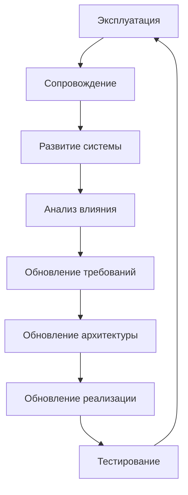
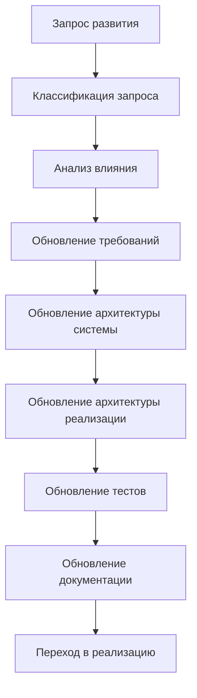

# Roadmap: System Evolution / Развитие системы

## 1. Назначение документа

`Roadmap_System_Evolution.md` определяет порядок развития цифровой системы после эксплуатации и сопровождения.

Документ используется, когда система должна получить новые возможности, новые сценарии, новые интеграции, новые форматы данных, новые интерфейсы или существенные изменения поведения.

Документ должен помочь расширять систему без разрушения архитектуры, требований, тестов и эксплуатационной стабильности.

Документ не должен подменять:

- сопровождение дефектов;
- исправление ошибок;
- технические требования;
- архитектуру системы;
- архитектуру реализации;
- выбор инструментария.

## 2. Место документа в маршруте разработки



Развитие системы отвечает на вопрос:

> Как добавить новые возможности или изменить систему так, чтобы не разрушить уже работающую архитектуру и поведение?

## 3. Граница ответственности

### 3.1. Что входит в развитие системы

В развитие системы входят:

- новые функции;
- новые пользовательские сценарии;
- новые входные данные;
- новые выходные данные;
- новые форматы файлов;
- новые интеграции;
- новые интерфейсы;
- новые режимы работы;
- новые правила обработки;
- новые требования производительности;
- изменения архитектуры системы;
- изменения архитектуры реализации;
- расширение тестов;
- обновление документации.

### 3.2. Что не входит в развитие системы

В развитие системы не входят:

- обычное исправление дефекта без изменения возможностей;
- обновление документации без изменения системы;
- изменение конфигурации без изменения поведения;
- временный обход проблемы;
- незафиксированное расширение функциональности;
- изменение архитектуры без анализа влияния.

## 4. Входные условия

Перед развитием системы должны быть доступны:

- текущая цель системы;
- текущие требования;
- текущая архитектура системы;
- текущая архитектура реализации;
- выбранный инструментарий;
- результаты эксплуатации;
- результаты сопровождения;
- известные ограничения;
- список запросов на развитие.

## 5. Связанные документы

### 5.1. Входные документы

- `docs/03_roadmaps/Roadmap_Maintenance.md`
  - Передаёт: повторяющиеся проблемы, ограничения текущей версии и запросы развития.
  - Используется для: определения причин развития.
  - Ограничение: не должен добавлять новые функции.

- `docs/04_questionnaires/Questionnaire_Maintenance.md`
  - Передаёт: конкретные запросы, которые нужно отделить от сопровождения.
  - Используется для: входа в развитие системы.
  - Ограничение: не заменяет анализ влияния.

- `docs/03_roadmaps/Roadmap_Technical_Requirements.md`
  - Передаёт: правила формирования требований.
  - Используется для: обновления требований при развитии.
  - Ограничение: не определяет сам запрос развития.

- `docs/03_roadmaps/Roadmap_System_Architecture_Design.md`
  - Передаёт: правила изменения архитектуры системы.
  - Используется для: оценки влияния новых возможностей на архитектуру.
  - Ограничение: не должен подменять анализ развития.

- `docs/03_roadmaps/Roadmap_Implementation_Architecture.md`
  - Передаёт: структуру реализации.
  - Используется для: оценки влияния изменений на код и структуру проекта.
  - Ограничение: не должен принимать решение о развитии вместо этого документа.

### 5.2. Выходные документы

- `docs/04_questionnaires/Questionnaire_System_Evolution.md`
  - Получает: структуру вопросов для развития системы.
  - Используется для: практического анализа запроса развития.
  - Ограничение: не должен подменять требования или архитектуру.

## 6. Основные понятия этапа

### 6.1. Запрос развития

Запрос развития — это предложение или необходимость изменить систему, добавив новую возможность, новый сценарий, новый интерфейс, новый формат, новую интеграцию или новое качество работы.

### 6.2. Анализ влияния

Анализ влияния — это проверка, какие части системы изменятся из-за запроса развития.

### 6.3. Обратная совместимость

Обратная совместимость — это способность новой версии системы не ломать существующие данные, сценарии, интерфейсы и результаты.

### 6.4. Миграция

Миграция — это управляемое изменение данных, конфигурации, структуры проекта или пользовательского процесса при переходе на новую версию.

## 7. Основные области развития

### 7.1. Новые функции

Необходимо определить:

- какую новую возможность нужно добавить;
- кто её использует;
- какую проблему она решает;
- какие требования меняются;
- какие тесты нужны.

### 7.2. Новые сценарии

Необходимо определить:

- какой новый сценарий появляется;
- какие входные данные нужны;
- какие состояния и события добавляются;
- какие ошибки возможны;
- как сценарий влияет на эксплуатацию.

### 7.3. Новые данные и форматы

Необходимо определить:

- какие данные добавляются;
- какие форматы изменяются;
- нужна ли миграция;
- сохраняется ли совместимость;
- как проверять новые данные.

### 7.4. Новые интерфейсы и интеграции

Необходимо определить:

- кто новый участник взаимодействия;
- какие данные передаются;
- какие ошибки возможны;
- какие требования безопасности появляются;
- какие инструменты могут потребоваться.

### 7.5. Изменение архитектуры системы

Необходимо определить:

- какие слои затронуты;
- какие модули меняются;
- какие зависимости появляются;
- какие точки расширения используются;
- нужно ли новое архитектурное решение.

### 7.6. Изменение архитектуры реализации

Необходимо определить:

- какие директории меняются;
- какие модули добавляются;
- какие адаптеры добавляются;
- какие тесты добавляются;
- какие команды сборки или запуска меняются.

### 7.7. Изменение инструментария

Применяется только если текущий инструмент не способен закрыть новый запрос развития.

Необходимо определить:

- какое требование не закрывается текущим инструментом;
- какие ограничения возникли;
- нужно ли вернуться к выбору инструментария;
- какие риски смены инструмента.

## 8. DG-EVO-001. Карта развития системы



## 9. Правила развития системы

### RULE-EVO-001. Развитие должно иметь причину

Нельзя добавлять функцию без понятной проблемы, пользователя или цели.

### RULE-EVO-002. Развитие должно проходить анализ влияния

Любой запрос развития должен быть проверен на влияние на данные, правила, состояния, события, потоки, хранение, ошибки, интерфейсы, архитектуру, инструментарий, тесты и эксплуатацию.

### RULE-EVO-003. Новая функция должна иметь требования

Нельзя добавлять функцию сразу в код без обновления требований.

### RULE-EVO-004. Изменение архитектуры должно быть зафиксировано

Если развитие требует изменения архитектуры системы или реализации, это должно быть отражено в соответствующих документах.

### RULE-EVO-005. Обратная совместимость должна быть проверена

Если существующие данные, сценарии или интерфейсы могут сломаться, нужно явно принять решение о совместимости или миграции.

### RULE-EVO-006. Развитие должно обновлять тесты

Новые возможности должны иметь новые или изменённые проверки.

### RULE-EVO-007. Развитие не должно маскироваться как сопровождение

Если изменение добавляет новую возможность, это развитие, а не обычное исправление дефекта.

## 10. Порядок работы

### 10.1. Шаг 1. Зафиксировать запрос развития

Необходимо описать новую возможность, источник запроса и причину.

### 10.2. Шаг 2. Классифицировать запрос

Необходимо определить, это новая функция, новый сценарий, новая интеграция, изменение данных, изменение интерфейса, изменение качества или изменение архитектуры.

### 10.3. Шаг 3. Выполнить анализ влияния

Необходимо проверить влияние на систему и документы.

### 10.4. Шаг 4. Обновить требования

Необходимо сформировать или изменить требования.

### 10.5. Шаг 5. Обновить архитектуру системы

Если нужны новые слои, модули, интерфейсы, зависимости или точки расширения, они должны быть зафиксированы.

### 10.6. Шаг 6. Обновить выбор инструментария, если требуется

Если текущие инструменты не подходят, нужно вернуться к выбору инструментария.

### 10.7. Шаг 7. Обновить архитектуру реализации

Необходимо определить изменения структуры проекта и модулей.

### 10.8. Шаг 8. Обновить тестирование

Необходимо добавить или изменить тесты.

### 10.9. Шаг 9. Обновить эксплуатацию и сопровождение

Необходимо обновить инструкции, сценарии, логи и правила сопровождения.

## 11. Шаблон запроса развития

```md
## EVO-000. Название запроса

### Источник запроса

- 

### Причина

- 

### Описание новой возможности

- 

### Пользователь или потребитель

- 

### Тип изменения

- Новая функция / Новый сценарий / Новые данные / Новый интерфейс / Новая интеграция / Изменение архитектуры / Изменение инструментария.

### Анализ влияния

- Данные:
- Правила:
- Состояния:
- События:
- Потоки:
- Хранение:
- Ошибки:
- Интерфейсы:
- Архитектура системы:
- Архитектура реализации:
- Инструментарий:
- Тестирование:
- Эксплуатация:
- Документация:

### Решение

- Принять / Отклонить / Отложить / Требует исследования.

### Следующие действия

- 
```

## 12. Примеры из разных областей цифровых систем

### 12.1. Скрипт автоматизации

Развитие включает:

- поддержку нового формата входного файла;
- новый тип отчёта;
- новую проверку данных;
- новую интеграцию с базой данных.

### 12.2. GUI-приложение

Развитие включает:

- новый экран;
- новый режим редактирования;
- новый экспорт;
- новую систему шаблонов.

### 12.3. Embedded-система

Развитие включает:

- поддержку нового датчика;
- новый режим управления;
- новый диагностический код;
- изменение протокола связи.

### 12.4. PLC-система

Развитие включает:

- новый агрегат;
- новый режим работы;
- новую HMI-страницу;
- новую межблокировку;
- новую аварийную логику.

### 12.5. CNC/CAM-система

Развитие включает:

- поддержку нового типа NC-программы;
- новый анализ инструмента;
- новую интеграцию с CAM;
- новый отчёт по производству.

## 13. Контрольные вопросы

Перед запуском развития необходимо ответить:

1. У запроса развития есть причина?
2. Известен пользователь или потребитель?
3. Определён тип изменения?
4. Выполнен анализ влияния?
5. Нужно ли обновлять требования?
6. Нужно ли обновлять архитектуру системы?
7. Нужно ли обновлять инструментарий?
8. Нужно ли обновлять архитектуру реализации?
9. Нужно ли обновлять тесты?
10. Нужно ли обновлять эксплуатацию?
11. Сохраняется ли обратная совместимость?
12. Нужна ли миграция?

## 14. Критерии завершения

Roadmap развития системы считается завершённым, если:

- определён запрос развития;
- определена причина;
- определён тип изменения;
- выполнен анализ влияния;
- определены изменения требований;
- определены изменения архитектуры;
- определены изменения инструментария, если нужны;
- определены изменения реализации;
- определены изменения тестов;
- определены изменения эксплуатации и документации;
- принято решение: принять, отклонить, отложить или исследовать.

## 15. Выходные данные для следующего цикла

После анализа развития должны быть получены:

- описание запроса развития;
- анализ влияния;
- список изменяемых требований;
- список изменяемых архитектурных решений;
- список изменяемых инструментов, если требуется;
- список изменений реализации;
- список новых тестов;
- список обновляемых документов;
- решение по запросу.

## 16. История изменений

- Initial version: создан roadmap развития системы.
