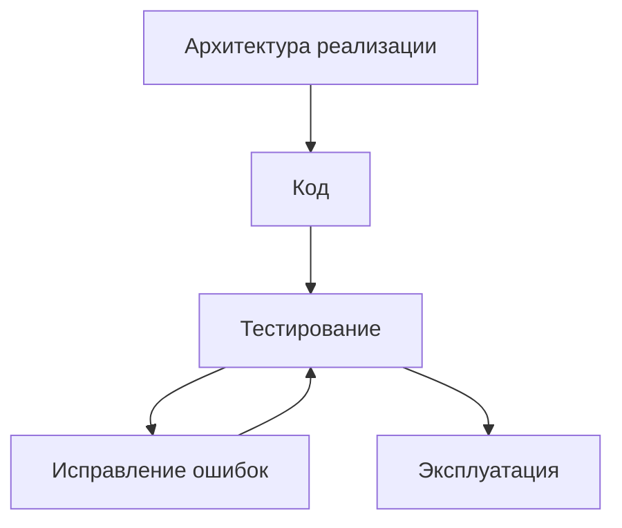
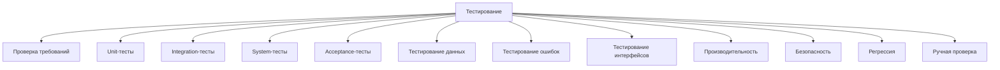
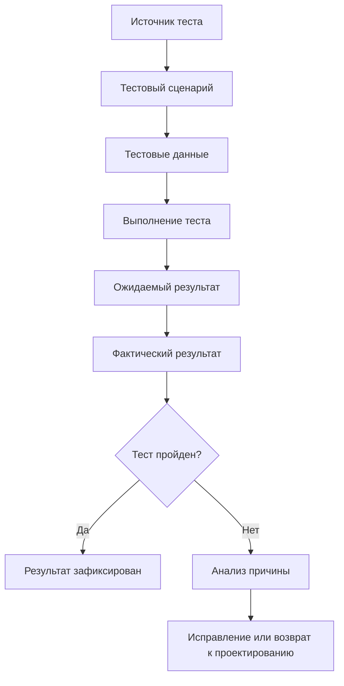

# Roadmap: Testing / Тестирование

## 1. Назначение документа

`Roadmap_Testing.md` определяет порядок проектирования и выполнения проверки цифровой системы.

Документ используется после [[docs/03_roadmaps/Roadmap_Implementation_Architecture|Roadmap: Implementation Architecture]] и до [[docs/03_roadmaps/Roadmap_Operation|Roadmap: Operation]].

Документ должен помочь определить:

- что нужно проверять;
- какие виды тестирования нужны;
- какие требования проверяются;
- какие сценарии проверяются;
- какие данные нужны для проверки;
- какие ошибки должны быть проверены;
- какие критерии приёмки используются;
- какие результаты тестирования должны быть зафиксированы.

Документ не должен подменять:

- [[docs/03_roadmaps/Roadmap_Technical_Requirements|Roadmap: Technical Requirements]];
- [[docs/03_roadmaps/Roadmap_Implementation_Architecture|Roadmap: Implementation Architecture]];
- написание кода;
- эксплуатацию системы.

## 2. Место документа в маршруте разработки



Тестирование отвечает на вопрос:

> Как доказать, что система соответствует требованиям, архитектуре и ожидаемым сценариям работы?

## 3. Граница ответственности

### 3.1. Что входит в тестирование

В тестирование входят:

- проверка требований;
- проверка данных;
- проверка правил;
- проверка состояний;
- проверка событий;
- проверка потоков;
- проверка хранения;
- проверка ошибок;
- проверка интерфейсов;
- проверка модулей;
- проверка интеграций;
- проверка производительности;
- проверка безопасности;
- проверка конфигурации;
- проверка эксплуатации;
- фиксация результатов проверки.

### 3.2. Что не входит в тестирование

В тестирование не входят:

- изменение требований без возврата к требованиям;
- изменение архитектуры без фиксации архитектурного решения;
- выбор нового инструментария без возврата к выбору инструментария;
- исправление кода без фиксации причины;
- эксплуатация системы без критериев готовности.

## 4. Входные условия

Перед проектированием тестирования должны быть определены:

- технические требования;
- архитектура реализации;
- структура проекта;
- модули реализации;
- интерфейсы и адаптеры;
- обработка ошибок;
- логирование;
- тестовая структура;
- команды запуска;
- критерии приёмки, если они уже заданы.

Если требования не определены, тестирование будет проверять не систему, а предположения.

## 5. Связанные документы

### 5.1. Входные документы

- [[docs/03_roadmaps/Roadmap_Technical_Requirements|Roadmap: Technical Requirements]]
  - Передаёт: проверяемые требования.
  - Используется для: построения тестов и критериев приёмки.
  - Ограничение: не описывает конкретные тестовые сценарии.

- [[docs/04_questionnaires/Questionnaire_Technical_Requirements|Questionnaire: Technical Requirements]]
  - Передаёт: заполненные требования конкретной системы.
  - Используется для: трассировки тестов к требованиям.
  - Ограничение: не заменяет план тестирования.

- [[docs/03_roadmaps/Roadmap_Implementation_Architecture|Roadmap: Implementation Architecture]]
  - Передаёт: структуру реализации, модули, адаптеры, ошибки, логирование и тестовую структуру.
  - Используется для: определения объектов тестирования.
  - Ограничение: не определяет итоговые результаты тестирования.

- [[docs/04_questionnaires/Questionnaire_Implementation_Architecture|Questionnaire: Implementation Architecture]]
  - Передаёт: конкретную структуру реализации.
  - Используется для: определения тестируемых модулей и точек входа.
  - Ограничение: не должен заменять тестовый план.

### 5.2. Выходные документы

- [[docs/04_questionnaires/Questionnaire_Testing|Questionnaire: Testing]]
  - Получает: структуру вопросов для проектирования тестирования.
  - Используется для: практического заполнения тестового плана.
  - Ограничение: не должен исправлять код.

- [[docs/03_roadmaps/Roadmap_Maintenance|Roadmap: Maintenance]]
  - Получает: результаты тестирования, ошибки, регрессии и критерии качества.
  - Используется для: сопровождения и контроля изменений.
  - Ограничение: не должен заменять тестирование.

## 6. Основные понятия этапа

### 6.1. Тест

Тест — это проверка конкретного условия, требования, поведения, сценария, ошибки или ограничения.

### 6.2. Тестовый сценарий

Тестовый сценарий — это последовательность действий и ожидаемых результатов.

### 6.3. Тестовые данные

Тестовые данные — это входные данные, конфигурации, файлы, сигналы или состояния, используемые для проверки.

### 6.4. Критерий приёмки

Критерий приёмки — это условие, при котором результат проверки считается успешным.

### 6.5. Регрессия

Регрессия — это повторное появление ошибки или нарушение ранее работавшего поведения после изменения системы.

## 7. Виды тестирования

### 7.1. Проверка требований

Проверяет, что каждое важное техническое требование имеет подтверждение выполнения.

### 7.2. Unit-тестирование

Проверяет отдельные функции, классы, модули или логические блоки изолированно.

### 7.3. Integration-тестирование

Проверяет взаимодействие между модулями, слоями, адаптерами, файлами, базой данных, API, UI или оборудованием.

### 7.4. System-тестирование

Проверяет систему целиком через реальные или близкие к реальным сценарии.

### 7.5. Acceptance-тестирование

Проверяет готовность системы с точки зрения пользователя, оператора, заказчика или эксплуатационного сценария.

### 7.6. Тестирование данных

Проверяет входные, внутренние, хранимые, выходные, конфигурационные, справочные, событийные и диагностические данные.

### 7.7. Тестирование ошибок

Проверяет ошибочные сценарии, сообщения, логи, восстановление и безопасное состояние.

Связанный документ: [[docs/05_encyclopedia/Errors|Errors]].

### 7.8. Тестирование интерфейсов

Проверяет пользовательские, программные, модульные, аппаратные и интеграционные интерфейсы.

Связанный документ: [[docs/05_encyclopedia/Interfaces|Interfaces]].

### 7.9. Тестирование производительности

Проверяет время выполнения, задержку реакции, объём данных, частоту событий и нагрузку.

### 7.10. Тестирование безопасности

Проверяет доступ, запрещённые действия, защищаемые данные, безопасные состояния и ошибки безопасности.

### 7.11. Регрессионное тестирование

Проверяет, что изменения не сломали ранее работавшие функции.

### 7.12. Ручное тестирование

Применяется, если проверку невозможно или нецелесообразно автоматизировать на текущем этапе.

## 8. DG-TEST-001. Классификация тестирования



## 9. Правила тестирования

### RULE-TEST-001. Тест должен иметь источник

Каждый важный тест должен быть связан с требованием, правилом, ошибкой, интерфейсом, модулем или сценарием.

### RULE-TEST-002. Тест должен иметь ожидаемый результат

Нельзя проверять систему без заранее определённого ожидаемого результата.

### RULE-TEST-003. Ошибочные сценарии обязательны для критичных функций

Если функция критична, нужно проверить не только успешный сценарий, но и ошибки.

### RULE-TEST-004. Тестовые данные должны быть управляемыми

Тестовые данные должны быть известны, воспроизводимы и пригодны для повторной проверки.

### RULE-TEST-005. Ручная проверка должна иметь сценарий

Ручное тестирование не должно быть свободным нажатием кнопок без цели.

### RULE-TEST-006. Ошибка теста должна вести к решению

Если тест не проходит, нужно определить:

- ошибка в коде;
- ошибка в тесте;
- ошибка в требовании;
- ошибка в архитектуре;
- ошибка в инструментарии;
- недостаточно данных.

### RULE-TEST-007. Тестирование должно быть трассируемым

Должно быть понятно, какое требование каким тестом проверяется.

## 10. Порядок работы

### 10.1. Шаг 1. Собрать требования для проверки

Необходимо взять список требований из [[docs/04_questionnaires/Questionnaire_Technical_Requirements|Questionnaire: Technical Requirements]].

### 10.2. Шаг 2. Определить объекты тестирования

Необходимо определить, что именно проверяется:

- модуль;
- функция;
- интерфейс;
- файл;
- конфигурация;
- поток;
- сценарий;
- ошибка;
- система целиком.

### 10.3. Шаг 3. Определить виды тестирования

Необходимо выбрать виды тестирования, применимые к системе.

### 10.4. Шаг 4. Определить тестовые данные

Необходимо подготовить входные данные, конфигурации, файлы, сигналы или состояния.

### 10.5. Шаг 5. Определить тестовые сценарии

Необходимо описать шаги проверки и ожидаемые результаты.

### 10.6. Шаг 6. Определить критерии приёмки

Необходимо определить, когда система считается прошедшей проверку.

### 10.7. Шаг 7. Определить автоматические и ручные проверки

Необходимо отделить автоматизируемые проверки от ручных.

### 10.8. Шаг 8. Определить фиксацию результатов

Необходимо определить, как сохраняются результаты тестирования.

### 10.9. Шаг 9. Определить действия при провале теста

Необходимо определить маршрут реакции на неуспешный тест.

## 11. DG-TEST-002. Жизненный цикл теста



## 12. Шаблон тестового сценария

```md
## TEST-000. Название теста

### Источник

- Требование / ошибка / интерфейс / модуль / сценарий.

### Цель проверки

- 

### Предусловия

- 

### Тестовые данные

- 

### Шаги проверки

1. 
2. 
3. 

### Ожидаемый результат

- 

### Фактический результат

- 

### Статус

- Passed / Failed / Blocked / Not Run.

### Действие при провале

- 
```

## 13. Примеры из разных областей цифровых систем

### 13.1. Скрипт автоматизации

Тесты:

- файл существует;
- обязательные колонки найдены;
- некорректная строка попадает в лог;
- результат сохраняется;
- повторный запуск не ломает данные.

Связанный пример: [[docs/06_examples/Scripts/Python_File_Processing_Utility|Python File Processing Utility]].

### 13.2. GUI-приложение

Тесты:

- обязательное поле блокирует экспорт;
- предпросмотр обновляется после изменения данных;
- несохранённые изменения вызывают предупреждение;
- ошибка отображается пользователю понятным сообщением.

### 13.3. Embedded-система

Тесты:

- датчик вне диапазона вызывает ошибку;
- потеря сигнала переводит систему в безопасное состояние;
- реакция выполняется в допустимое время;
- команда исполнительному механизму блокируется при аварии.

### 13.4. PLC-система

Тесты:

- запуск блокируется при активной аварии;
- HMI отображает причину блокировки;
- manual/auto режимы работают по правилам;
- авария сохраняется до подтверждения оператором.

### 13.5. CNC/CAM-система

Тесты:

- вызов инструмента найден в NC-программе;
- неизвестный формат программы создаёт диагностическую ошибку;
- отчёт содержит ожидаемые поля;
- исходный NC-файл не изменяется.

## 14. Контрольные вопросы

Перед переходом к эксплуатации необходимо ответить:

1. Все критичные требования имеют тесты?
2. Все критичные ошибки имеют тесты?
3. Определены ли тестовые данные?
4. Определены ли ожидаемые результаты?
5. Определены ли критерии приёмки?
6. Отделены ли автоматические проверки от ручных?
7. Есть ли регрессионные проверки?
8. Определено ли действие при провале теста?
9. Результаты тестирования фиксируются?
10. Тестирование не меняет требования без возврата к требованиям?

## 15. Критерии завершения

Roadmap тестирования считается завершённым, если:

- определены объекты тестирования;
- определены виды тестирования;
- требования связаны с тестами;
- ошибки связаны с тестами;
- определены тестовые данные;
- определены тестовые сценарии;
- определены критерии приёмки;
- определены автоматические и ручные проверки;
- определена фиксация результатов;
- определён маршрут действий при провале теста;
- открытые вопросы вынесены отдельно.

## 16. Выходные данные для следующего этапа

После завершения проектирования тестирования должны быть получены:

- список тестируемых требований;
- список тестируемых модулей;
- список тестируемых интерфейсов;
- список тестируемых ошибок;
- список тестовых данных;
- список тестовых сценариев;
- критерии приёмки;
- правила фиксации результатов;
- список открытых вопросов;
- входные данные для [[docs/03_roadmaps/Roadmap_Operation|Roadmap: Operation]] и [[docs/03_roadmaps/Roadmap_Maintenance|Roadmap: Maintenance]].

## 17. Открытые вопросы

Примеры открытых вопросов:

- Неизвестны точные критерии производительности.
- Неизвестны реальные тестовые данные.
- Неизвестно, какие проверки должны быть автоматическими.
- Неизвестно, кто принимает результат тестирования.
- Неизвестно, какие ошибки считаются блокирующими.

## 18. История изменений

- Initial version: создан roadmap тестирования.
- Updated: документ приведён к Obsidian wikilinks.
