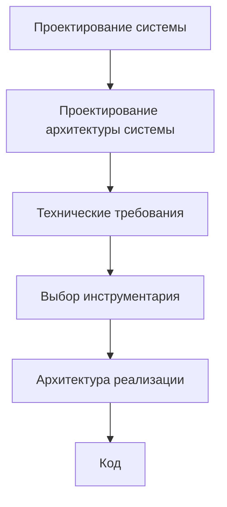
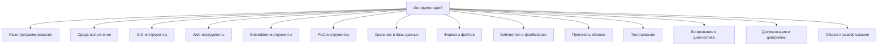
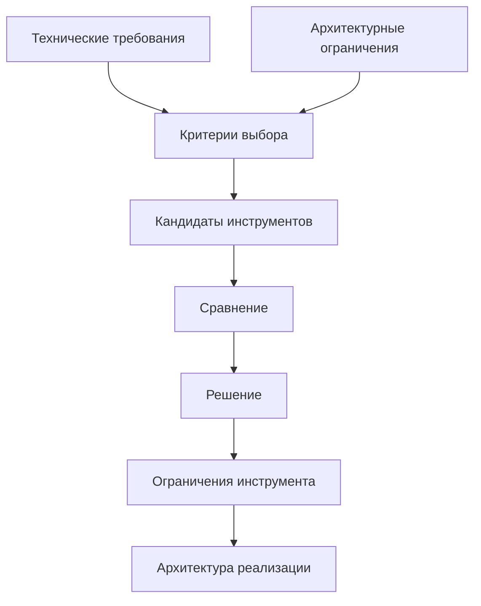

# Roadmap: Toolchain Selection / Выбор инструментария

## 1. Назначение документа

`Roadmap_Toolchain_Selection.md` определяет порядок выбора инструментария для реализации цифровой системы.

Документ используется после формирования технических требований и до проектирования архитектуры реализации.

Документ должен помочь выбрать инструменты на основании:

- технических требований;
- архитектуры системы;
- ограничений окружения;
- требований к эксплуатации;
- требований к сопровождению;
- требований к тестируемости;
- требований к развитию системы.

Документ не должен формировать технические требования заново.

## 2. Место документа в маршруте разработки



Выбор инструментария отвечает на вопрос:

> Какими инструментами можно реализовать систему так, чтобы выполнить утверждённые требования и сохранить архитектурные ограничения?

Выбор инструментария не отвечает на вопрос:

> Каким требованиям система должна соответствовать?

## 3. Граница ответственности

### 3.1. Что входит в выбор инструментария

В выбор инструментария входят:

- выбор языка программирования;
- выбор среды выполнения;
- выбор GUI-инструментов;
- выбор web-инструментов;
- выбор embedded-инструментов;
- выбор PLC-инструментов;
- выбор базы данных или способа хранения;
- выбор форматов файлов;
- выбор библиотек;
- выбор фреймворков;
- выбор протоколов обмена;
- выбор инструментов тестирования;
- выбор инструментов логирования;
- выбор инструментов документации;
- выбор инструментов сборки и развёртывания;
- выбор средств симуляции и отладки;
- выбор средств контроля версий и автоматизации.

### 3.2. Что не входит в выбор инструментария

В выбор инструментария не входят:

- изменение цели системы;
- изменение сущностей системы;
- изменение данных без пересмотра проектирования системы;
- изменение архитектуры системы без фиксации архитектурного решения;
- добавление новых технических требований без возврата к требованиям;
- проектирование конкретной структуры кода;
- написание кода;
- реализация классов, функций и модулей.

## 4. Входные условия

Перед выбором инструментария должны быть определены:

- утверждённые технические требования;
- архитектура системы;
- требования к данным;
- требования к обработке;
- требования к хранению;
- требования к интерфейсам;
- требования к производительности;
- требования к надёжности;
- требования к ошибкам и диагностике;
- требования к конфигурации;
- требования к расширяемости;
- требования к тестируемости;
- требования к безопасности;
- требования к окружению;
- требования к эксплуатации;
- требования к сопровождению;
- внешние обязательные ограничения.

Если технические требования не сформированы, выбор инструментария считается преждевременным.

## 5. Связанные документы

### 5.1. Входные документы

- `docs/03_roadmaps/Roadmap_Technical_Requirements.md`
  - Передаёт: виды требований, правила формулировки требований и критерии проверки.
  - Используется для: построения критериев выбора инструментов.
  - Ограничение: не должен выбирать инструменты.

- `docs/04_questionnaires/Questionnaire_Technical_Requirements.md`
  - Передаёт: заполненные технические требования.
  - Используется для: практического выбора инструментов.
  - Ограничение: не должен подменять выбор инструментария.

- `docs/03_roadmaps/Roadmap_System_Architecture_Design.md`
  - Передаёт: слои, модули, модели, интерфейсы, зависимости, конфигурации и точки расширения.
  - Используется для: проверки совместимости инструментов с архитектурой системы.
  - Ограничение: не должен выбирать конкретные библиотеки.

- `docs/05_encyclopedia/Architecture.md`
  - Передаёт: различие между архитектурой системы и архитектурой реализации.
  - Используется для: предотвращения смешивания выбора инструментов с архитектурой реализации.
  - Ограничение: не является roadmap-документом.

### 5.2. Выходные документы

- `docs/04_questionnaires/Questionnaire_Toolchain_Selection.md`
  - Получает: структуру вопросов для выбора инструментария.
  - Используется для: практического выбора инструментов.
  - Ограничение: не должен формировать требования заново.

- `docs/03_roadmaps/Roadmap_Implementation_Architecture.md`
  - Получает: выбранные инструменты и ограничения инструментов.
  - Используется для: проектирования конкретной структуры реализации.
  - Ограничение: не должен менять выбор инструментов без фиксации причины.

- `docs/00_maps/Requirements_To_Toolchain_Map.md`
  - Получает: связь требований и критериев выбора инструментов.
  - Используется для: навигации между техническими требованиями и выбором инструментария.
  - Ограничение: не должен заменять отдельные документы требований и инструментария.

## 6. Основные понятия этапа

### 6.1. Инструментарий

Инструментарий — это совокупность языков, платформ, библиотек, фреймворков, сред, форматов, протоколов, сервисов и вспомогательных средств, используемых для реализации, проверки, сопровождения и развития системы.

### 6.2. Критерий выбора

Критерий выбора — это проверяемое основание, по которому инструмент считается подходящим или неподходящим.

Критерий должен вытекать из технического требования, архитектурного ограничения или внешнего ограничения.

### 6.3. Кандидат инструмента

Кандидат инструмента — это инструмент, который может быть выбран после проверки по критериям.

### 6.4. Решение выбора

Решение выбора — это зафиксированное обоснование, почему выбран конкретный инструмент и почему отклонены альтернативы.

## 7. Виды инструментария

### 7.1. Язык программирования

Определяет основной язык реализации системы или её части.

Критерии выбора могут включать:

- соответствие требованиям к производительности;
- поддержку нужных платформ;
- поддержку библиотек;
- удобство тестирования;
- удобство сопровождения;
- компетенции команды;
- ограничения промышленной среды.

### 7.2. Среда выполнения

Определяет, где и как будет выполняться система.

Примеры категорий:

- desktop-среда;
- server-среда;
- browser-среда;
- embedded-runtime;
- PLC-runtime;
- CNC/HMI-среда;
- контейнерная среда;
- облачная среда.

### 7.3. GUI-инструменты

Определяют средства создания пользовательского интерфейса.

Критерии выбора могут включать:

- требования к интерфейсу;
- требования к платформе;
- требования к скорости разработки;
- требования к поддержке графики;
- требования к долгосрочному сопровождению;
- требования к доступу к локальным файлам и устройствам.

### 7.4. Web-инструменты

Определяют средства создания web-интерфейсов, API и server-side компонентов.

Критерии выбора могут включать:

- требования к API;
- требования к авторизации;
- требования к нагрузке;
- требования к интеграции;
- требования к развёртыванию.

### 7.5. Embedded-инструменты

Определяют средства разработки встроенных систем.

Критерии выбора могут включать:

- требования к реальному времени;
- требования к энергопотреблению;
- требования к памяти;
- требования к периферии;
- требования к протоколам;
- требования к отладке;
- требования к надёжности.

### 7.6. PLC-инструменты

Определяют средства разработки промышленных управляющих систем.

Критерии выбора могут включать:

- совместимость с контроллером;
- поддержка языков IEC 61131-3;
- поддержка HMI;
- поддержка safety-функций;
- поддержка диагностики;
- поддержка промышленных протоколов;
- требования к эксплуатации.

### 7.7. Хранение и база данных

Определяет инструмент или способ хранения данных.

Критерии выбора могут включать:

- структура данных;
- объём данных;
- требования к поиску;
- требования к транзакционности;
- требования к целостности;
- требования к автономной работе;
- требования к резервному копированию;
- требования к совместимости.

### 7.8. Форматы файлов

Определяют форматы входных, выходных, конфигурационных, отчётных и обменных данных.

Критерии выбора могут включать:

- читаемость человеком;
- структурированность;
- совместимость с внешними системами;
- устойчивость к ошибкам;
- удобство версионирования;
- требования к размеру файла.

### 7.9. Библиотеки и фреймворки

Определяют готовые компоненты, используемые для реализации функций системы.

Критерии выбора могут включать:

- соответствие требованиям;
- активность поддержки;
- лицензия;
- документация;
- стабильность API;
- тестируемость;
- зависимость от платформы.

### 7.10. Протоколы обмена

Определяют способ взаимодействия между системами, устройствами и компонентами.

Критерии выбора могут включать:

- требования к скорости обмена;
- требования к надёжности;
- требования к безопасности;
- требования к промышленной совместимости;
- требования к диагностике;
- поддержка оборудованием.

### 7.11. Инструменты тестирования

Определяют средства проверки системы.

Критерии выбора могут включать:

- тип тестов;
- автоматизация;
- поддержка mock/simulation;
- интеграция с CI;
- отчётность;
- поддержка целевой платформы.

### 7.12. Инструменты логирования и диагностики

Определяют средства фиксации событий, ошибок и диагностических данных.

Критерии выбора могут включать:

- формат логов;
- уровень детализации;
- ротация логов;
- читаемость;
- интеграция с мониторингом;
- поддержка промышленной диагностики.

### 7.13. Инструменты документации и диаграмм

Определяют средства ведения документации, схем, диаграмм и регламентов.

Критерии выбора могут включать:

- читаемость;
- совместимость с Git;
- поддержка ссылок;
- поддержка диаграмм;
- поддержка экспорта;
- удобство для AI-агента.

### 7.14. Инструменты сборки, поставки и развёртывания

Определяют средства подготовки системы к запуску и доставке пользователю или оборудованию.

Критерии выбора могут включать:

- повторяемость сборки;
- простота установки;
- поддержка версий;
- поддержка целевой платформы;
- возможность автоматизации;
- восстановление после ошибки установки.

## 8. DG-TOOLS-001. Классификация инструментария



## 9. Правила выбора инструментария

### RULE-TOOLS-001. Инструмент должен выбираться под требование

Нельзя выбирать инструмент только потому, что он знаком, популярен или удобен.

### RULE-TOOLS-002. Инструмент должен быть проверен по критериям

Для каждого важного инструмента необходимо указать критерии выбора и результаты проверки.

### RULE-TOOLS-003. Инструмент не должен разрушать архитектуру системы

Если инструмент требует нарушить архитектурные границы, необходимо выбрать другой инструмент или пересмотреть архитектуру с фиксацией причины.

### RULE-TOOLS-004. Альтернативы должны быть рассмотрены явно

Для важных решений необходимо указать хотя бы одну альтернативу или причину, почему альтернативы не рассматриваются.

### RULE-TOOLS-005. Ограничения инструмента должны быть зафиксированы

Выбор инструмента считается неполным, если не указаны его ограничения и риски.

### RULE-TOOLS-006. Внешний обязательный инструмент должен быть отмечен как constraint

Если инструмент задан внешней средой, заказчиком, оборудованием или платформой, он фиксируется как обязательное ограничение, а не как свободный выбор.

### RULE-TOOLS-007. Инструмент не должен добавлять неоправданную сложность

Инструмент должен соответствовать масштабу системы.

## 10. Порядок работы

### 10.1. Шаг 1. Собрать требования, влияющие на инструментарий

Необходимо взять требования из `Questionnaire_Technical_Requirements.md`.

Результат шага:

- список требований, влияющих на выбор инструментов.

### 10.2. Шаг 2. Собрать архитектурные ограничения

Необходимо взять ограничения из `Questionnaire_System_Architecture_Design.md`.

Результат шага:

- список архитектурных ограничений.

### 10.3. Шаг 3. Определить категории инструментов

Необходимо определить, какие виды инструментов нужны конкретной системе.

Результат шага:

- список категорий инструментов.

### 10.4. Шаг 4. Сформировать критерии выбора

Для каждой категории инструмента необходимо сформировать критерии выбора.

Результат шага:

- список критериев выбора.

### 10.5. Шаг 5. Определить кандидатов

Необходимо определить возможные инструменты-кандидаты.

Результат шага:

- список кандидатов.

### 10.6. Шаг 6. Сравнить кандидатов

Необходимо сравнить кандидатов по критериям.

Результат шага:

- таблица или список сравнения кандидатов.

### 10.7. Шаг 7. Зафиксировать решение

Необходимо выбрать инструмент и указать причину выбора.

Результат шага:

- решение выбора инструмента.

### 10.8. Шаг 8. Зафиксировать ограничения выбранного инструмента

Необходимо указать риски и ограничения выбранного инструмента.

Результат шага:

- список ограничений и рисков.

## 11. DG-TOOLS-002. Процесс выбора инструмента



## 12. Шаблон решения по инструменту

```md
## TOOL-000. Название решения

### Категория инструмента

- 

### Требования-источники

- 

### Архитектурные ограничения

- 

### Критерии выбора

- 

### Кандидаты

- Кандидат 1:
- Кандидат 2:
- Кандидат 3:

### Выбранный инструмент

- 

### Причина выбора

- 

### Отклонённые альтернативы

- 

### Ограничения выбранного инструмента

- 

### Влияние на архитектуру реализации

- 

### Статус

- Draft / Approved / Changed / Deprecated.
```

## 13. Примеры из разных областей цифровых систем

### 13.1. Скрипт автоматизации

Категории инструментов:

- язык программирования;
- библиотеки чтения файлов;
- формат результата;
- инструмент логирования;
- инструмент тестирования.

Критерии:

- поддержка работы с файлами;
- простота запуска;
- читаемость результата;
- удобство сопровождения.

### 13.2. GUI-приложение

Категории инструментов:

- GUI-фреймворк;
- формат хранения шаблонов;
- библиотека рендера;
- инструмент упаковки приложения;
- инструмент тестирования интерфейса.

Критерии:

- поддержка целевой ОС;
- стабильность интерфейса;
- доступ к локальным файлам;
- поддержка предпросмотра;
- удобство сопровождения.

### 13.3. Embedded-система

Категории инструментов:

- микроконтроллер;
- SDK;
- среда сборки;
- инструмент симуляции;
- инструмент отладки;
- протокол связи.

Критерии:

- ресурсы памяти;
- периферия;
- задержка реакции;
- надёжность;
- поддержка отладки.

### 13.4. PLC-система

Категории инструментов:

- PLC-платформа;
- среда разработки;
- HMI-инструмент;
- протокол обмена;
- инструмент диагностики;
- симулятор.

Критерии:

- совместимость с оборудованием;
- поддержка safety;
- поддержка HMI;
- диагностика;
- эксплуатационная поддержка.

### 13.5. CNC/CAM-система

Категории инструментов:

- язык обработки файлов;
- парсер NC-программ;
- формат отчёта;
- интеграция с таблицами;
- база данных или файл хранения;
- инструмент тестирования.

Критерии:

- поддержка формата NC;
- точность парсинга;
- сохранение исходных файлов без изменения;
- удобство отчётов;
- возможность расширения под другие станки.

## 14. Контрольные вопросы

Перед переходом к архитектуре реализации необходимо ответить:

1. Все ли выбранные инструменты связаны с требованиями?
2. Все ли выбранные инструменты проверены по критериям?
3. Все ли архитектурные ограничения учтены?
4. Есть ли внешние обязательные ограничения?
5. Рассмотрены ли альтернативы для важных решений?
6. Зафиксированы ли ограничения выбранных инструментов?
7. Не нарушает ли инструмент архитектуру системы?
8. Не добавляет ли инструмент избыточную сложность?
9. Известно ли влияние инструмента на архитектуру реализации?
10. Открытые вопросы вынесены отдельно?

## 15. Критерии завершения

Roadmap выбора инструментария считается завершённым, если:

- определены категории инструментов;
- требования преобразованы в критерии выбора;
- архитектурные ограничения учтены;
- кандидаты рассмотрены;
- решения выбора зафиксированы;
- альтернативы отклонены с причиной;
- ограничения выбранных инструментов зафиксированы;
- влияние на архитектуру реализации определено;
- открытые вопросы вынесены отдельно.

## 16. Выходные данные для следующего этапа

После завершения выбора инструментария должны быть получены:

- выбранный язык или языки реализации;
- выбранная среда выполнения;
- выбранные инструменты интерфейса;
- выбранные инструменты хранения;
- выбранные форматы файлов;
- выбранные библиотеки и фреймворки;
- выбранные протоколы обмена;
- выбранные инструменты тестирования;
- выбранные инструменты логирования и диагностики;
- выбранные инструменты документации;
- выбранные инструменты сборки и развёртывания;
- ограничения выбранных инструментов;
- входные данные для `Roadmap_Implementation_Architecture.md`.

## 17. Открытые вопросы

Открытые вопросы должны быть вынесены отдельно.

Примеры открытых вопросов:

- Неизвестно, какая целевая операционная система обязательна.
- Неизвестно, нужен ли offline-режим.
- Неизвестно, какой объём данных будет обрабатываться.
- Неизвестно, требуется ли промышленный протокол обмена.
- Неизвестно, какие лицензии допустимы.

## 18. История изменений

- Initial version: создан roadmap выбора инструментария как самостоятельная тема, отделённая от технических требований.
