# 01. Entities / Сущности

## 1. Назначение документа

`01_Entities.md` раскрывает понятие сущности как одного из базовых элементов проектирования цифровых систем.

Документ используется как визуальный инженерный путеводитель: он помогает увидеть, какие объекты важны для системы, как они связаны с данными, правилами, состояниями, событиями, хранением, интерфейсами, архитектурой и реализацией.

> [!info] Главное
> Сущности — это первый слой осмысленного проектирования.
> Если сущности определены плохо, система начинает строиться на случайных переменных, неявных правилах и плохо связанных данных.

## 2. Место сущностей в маршруте проектирования

Сущности относятся к этапу [[docs/03_roadmaps/01_Roadmap_System_Design|Roadmap: System Design]].

Они появляются раньше архитектуры реализации, выбора инструментов и кода.

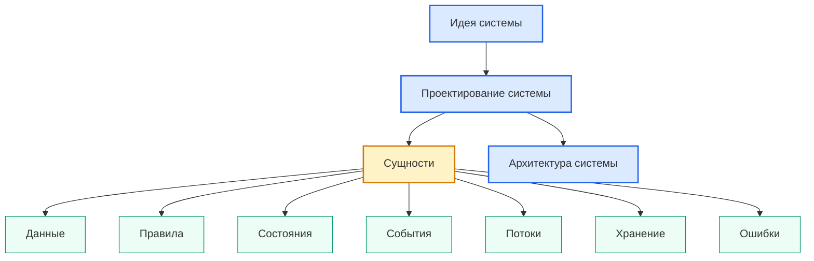

## 3. Простое объяснение

**Сущность** — это значимый объект, о котором система должна знать.

Сущность может быть реальным объектом, документом, пользователем, файлом, инструментом, заказом, рецептом, измерением, программой, сигналом, экранной формой или внутренним объектом системы.

> [!tip] Простая формула
> Если система должна что-то помнить, проверять, изменять, показывать, хранить или связывать — возможно, перед нами сущность.

## 4. Инженерное определение

**Сущность** — это значимый объект предметной области или самой системы, который имеет смысл, границы, данные, связи и может участвовать в правилах, состояниях, событиях, потоках, хранении, интерфейсах или архитектурных решениях.

Сущность считается полезно определённой, если для неё можно ответить:

- что это такое;
- зачем это нужно системе;
- какие данные с ней связаны;
- какие правила на неё действуют;
- какие состояния у неё возможны;
- какие события с ней происходят;
- где она появляется в потоках;
- нужно ли её хранить;
- кто или что с ней взаимодействует;
- как она будет представлена в архитектуре и реализации.

## 5. Визуальная карта сущности

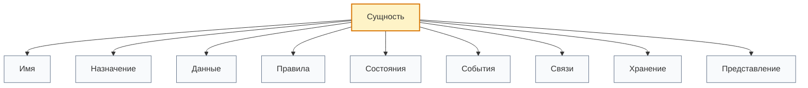

## 6. Чем сущность отличается от других понятий

| Понятие | Что означает | Главный вопрос |
|---|---|---|
| Сущность | Значимый объект системы | О чём система должна знать? |
| Данные | Информация о сущности | Что именно известно об объекте? |
| Правило | Ограничение или логика поведения | Что разрешено, запрещено или должно быть рассчитано? |
| Состояние | Положение сущности или системы во времени | В каком положении сейчас объект? |
| Событие | Факт изменения или действия | Что произошло? |
| Объект в коде | Представление во время выполнения программы | Как это живёт в памяти? |
| Класс | Шаблон для создания объектов | Как описать тип таких объектов? |
| Таблица БД | Способ постоянного хранения | Как сохранить множество таких объектов? |

> [!warning] Не путать
> Сущность — это не просто переменная.
>
> Переменная может быть временным техническим именем в коде.
> Сущность имеет смысл в системе и влияет на проектирование.

## 7. Основные виды сущностей

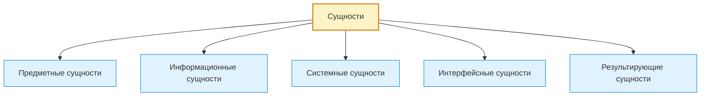

### 7.1. Предметные сущности

**Предметные сущности** описывают реальные или смысловые объекты предметной области.

Они отвечают на вопрос:

> Что существует в задаче пользователя независимо от программы?

Примеры по областям:

- Скрипт автоматизации
  - `Файл`
  - `Строка таблицы`
  - `Отчёт`
  - `Материал`
  - `Деталь`

- GUI-приложение
  - `Документ`
  - `Шаблон`
  - `Проект`
  - `Пользователь`
  - `Настройка`

- Embedded-система
  - `Датчик`
  - `Клапан`
  - `Контроллер`
  - `Измерение`
  - `Команда управления`

- PLC-система
  - `Привод`
  - `Клапан`
  - `Технологический узел`
  - `Авария`
  - `Режим работы`

- CNC/CAM-система
  - `Инструмент`
  - `Станок`
  - `NC-программа`
  - `Операция обработки`
  - `Измерение инструмента`

- База данных
  - `Клиент`
  - `Заказ`
  - `Позиция заказа`
  - `Складская запись`
  - `История изменения`

### 7.2. Информационные сущности

**Информационные сущности** описывают документы, записи, сообщения, параметры и наборы данных, с которыми работает система.

Они отвечают на вопрос:

> В какой информационной форме система получает, хранит или передаёт смысл?

Примеры по областям:

- Скрипт автоматизации
  - `CSV-файл`
  - `JSON-результат`
  - `Лог обработки`
  - `Строка Excel`

- GUI-приложение
  - `Форма ввода`
  - `Профиль настроек`
  - `Файл проекта`
  - `Состояние интерфейса`

- Embedded-система
  - `Пакет измерений`
  - `Конфигурационный блок`
  - `Сообщение телеметрии`

- PLC-система
  - `DB-блок`
  - `Тег`
  - `Аварийное сообщение`
  - `Рецепт процесса`

- CNC/CAM-система
  - `G-code файл`
  - `Постпроцессорный параметр`
  - `Таблица инструмента`
  - `Измерительный отчёт`

### 7.3. Системные сущности

**Системные сущности** описывают внутренние части самой цифровой системы.

Они отвечают на вопрос:

> Из каких рабочих частей состоит система как программный или цифровой механизм?

Примеры по областям:

- Скрипт автоматизации
  - `Парсер`
  - `Валидатор`
  - `Генератор отчёта`
  - `Конфигурация запуска`

- GUI-приложение
  - `Контроллер окна`
  - `Сервис сохранения`
  - `Команда пользователя`
  - `Менеджер шаблонов`

- Embedded-система
  - `Драйвер датчика`
  - `Планировщик задач`
  - `Буфер измерений`
  - `Модуль связи`

- PLC-система
  - `Функциональный блок`
  - `Секция логики`
  - `Межблокировка`
  - `Состояние автомата`

- База данных
  - `Миграция`
  - `Индекс`
  - `Ограничение целостности`
  - `Процедура обновления`

### 7.4. Интерфейсные сущности

**Интерфейсные сущности** описывают то, через что пользователь, оператор, внешняя система или устройство взаимодействует с системой.

Они отвечают на вопрос:

> Через что происходит взаимодействие?

Примеры по областям:

- GUI-приложение
  - `Кнопка`
  - `Поле ввода`
  - `Таблица`
  - `Панель настроек`
  - `Диалог ошибки`

- Web-система
  - `Endpoint`
  - `Форма авторизации`
  - `Страница отчёта`
  - `API-запрос`

- Embedded-система
  - `UART-команда`
  - `I2C-устройство`
  - `Экран LCD`
  - `Световой индикатор`

- PLC-система
  - `HMI-экран`
  - `Кнопка оператора`
  - `Тег обмена`
  - `Аварийное окно`

- CNC/CAM-система
  - `HMI-сообщение`
  - `Параметр цикла`
  - `Файл программы`
  - `Окно коррекции инструмента`

### 7.5. Результирующие сущности

**Результирующие сущности** появляются как итог работы системы.

Они отвечают на вопрос:

> Что система создаёт, изменяет, рассчитывает или выдаёт как результат?

Примеры по областям:

- Скрипт автоматизации
  - `Итоговый отчёт`
  - `Сводная таблица`
  - `Файл ошибок`
  - `Обновлённый JSON`

- GUI-приложение
  - `Экспортированный документ`
  - `Сохранённый проект`
  - `Сформированный SVG`

- Embedded-система
  - `Команда на исполнительный механизм`
  - `Пакет телеметрии`
  - `Сигнал аварии`

- PLC-система
  - `Режим работы линии`
  - `Аварийный статус`
  - `Запись в журнал событий`

- CNC/CAM-система
  - `NC-программа`
  - `Отчёт измерений`
  - `Список инструментов`
  - `Предупреждение о превышении допуска`

## 8. Как выявлять сущности

Сущности удобно искать через вопросы.

| Вопрос | Что помогает найти |
|---|---|
| О каких объектах говорит пользователь? | Предметные сущности |
| Какие документы, файлы или записи используются? | Информационные сущности |
| Какие внутренние части нужны системе? | Системные сущности |
| Через что пользователь или устройство взаимодействует с системой? | Интерфейсные сущности |
| Что система должна создать или выдать? | Результирующие сущности |
| Что имеет собственные данные? | Кандидат в сущность |
| Что может менять состояние? | Сущность с жизненным циклом |
| Что нужно хранить долго? | Сущность хранения |
| Что участвует в правилах? | Сущность бизнес-логики или технологической логики |


> [!note] Практический приём
> Сначала выписываются все кандидаты в сущности.
> Потом они очищаются: случайные технические слова убираются, а значимые объекты остаются.

## 9. Минимальная карточка сущности

Каждую важную сущность полезно описывать в одинаковом формате.

```md
### Entity: <Название сущности>

- Тип сущности:
- Назначение:
- Откуда появляется:
- Какие данные содержит:
- Какие правила на неё действуют:
- Какие состояния возможны:
- Какие события с ней происходят:
- Где используется:
- Нужно ли хранить:
- Кто взаимодействует:
- Связанные сущности:
- Открытые вопросы:
```

## 10. Связи между сущностями

Сущность редко существует одна. Обычно она связана с другими сущностями.

Типовые связи:

- содержит;
- принадлежит;
- создаёт;
- изменяет;
- использует;
- измеряет;
- управляет;
- зависит от;
- является частью;
- имеет историю;
- имеет состояние;
- генерирует событие.

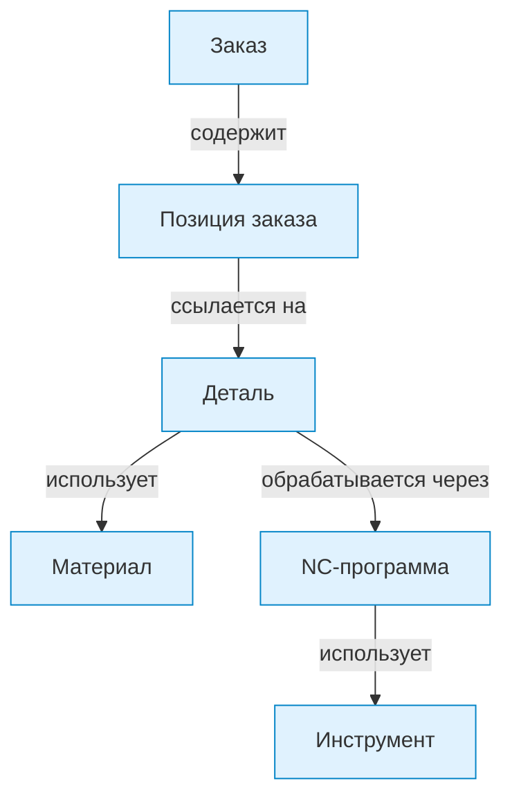

> [!warning] Ошибка проектирования
> Если сущности названы, но связи между ними не указаны, система остаётся набором слов, а не моделью.

## 11. Сущность в разных слоях системы

Одна и та же сущность проходит через несколько представлений.

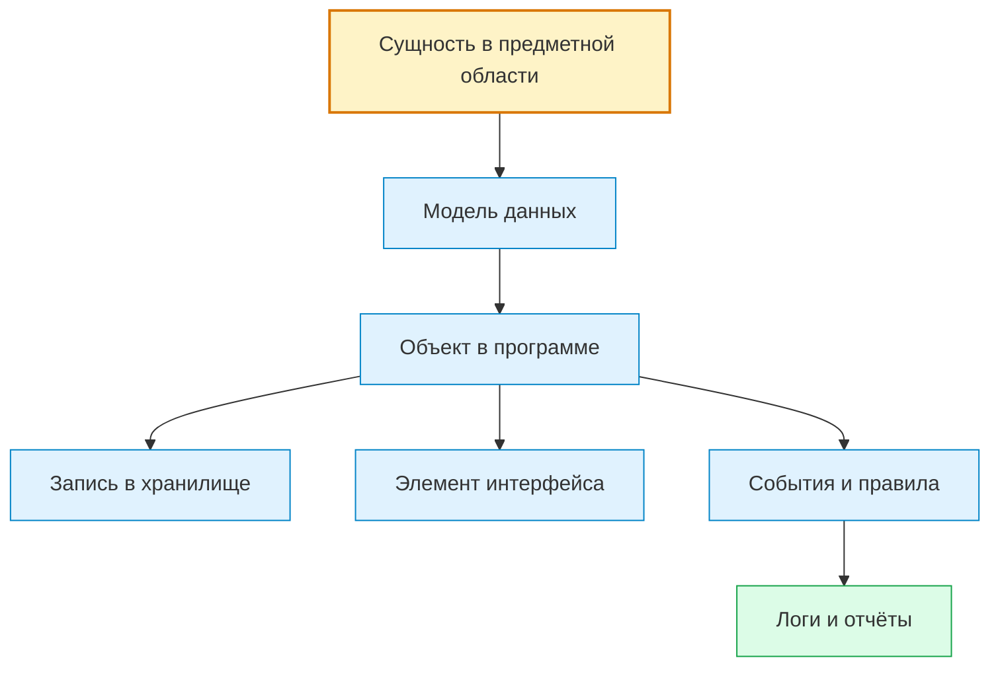

Пример для сущности `Инструмент`:

| Слой | Представление |
|---|---|
| Предметная область | Фреза, сверло, метчик, измеряемый инструмент |
| Данные | номер, тип, диаметр, длина, допуск, статус |
| Код | `Tool`, `ToolMeasurement`, `ToolState` |
| Хранилище | таблица инструментов, JSON, CSV, DB-запись |
| Интерфейс | строка в таблице, карточка инструмента, HMI-поле |
| Правила | измерять только существующие инструменты, проверять допуски |
| События | инструмент измерен, инструмент заменён, превышен допуск |
| Результат | отчёт измерений, предупреждение, запись в лог |

## 12. Сущность и данные

Сущность отвечает на вопрос **что это**, а данные отвечают на вопрос **что о ней известно**.

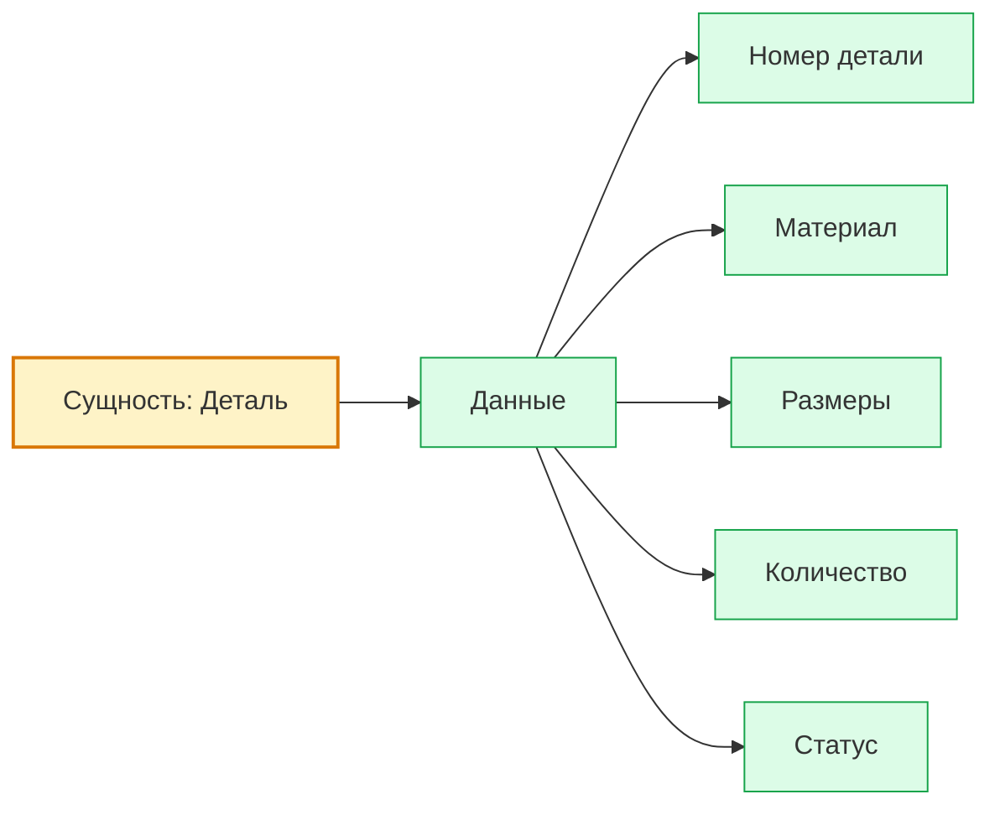

> [!important] Правило
> Нельзя проектировать данные без понимания сущности.
> Иначе поля появляются случайно, а структура данных быстро становится хаотичной.

## 13. Сущность и правила

Правила определяют, что с сущностью можно делать, что нельзя, что нужно проверить и какой результат получить.

Пример:

| Сущность | Правило |
|---|---|
| Материал | если материал профильный, расход считается по длине |
| Инструмент | если измерение превышает допуск, нужен warning |
| Пользователь | если нет прав, действие запрещено |
| Заказ | если статус закрыт, редактирование запрещено |
| Рецепт | если ингредиент запрещён диетой, нужна замена |

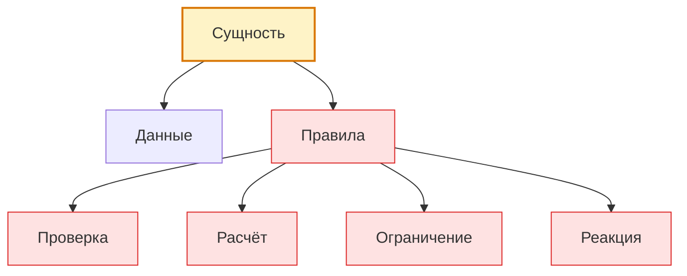

## 14. Сущность и состояния

Если сущность может меняться во времени, у неё есть состояния.

Пример состояния `Заказ`:

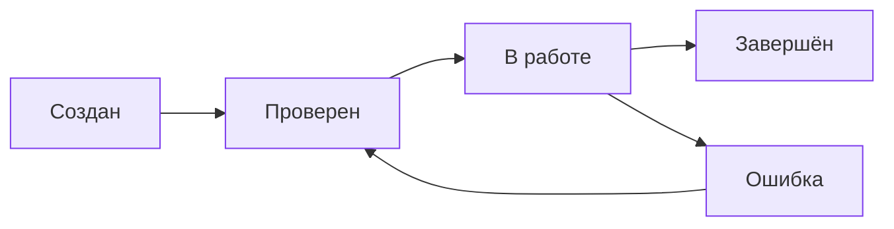

Примеры сущностей со состояниями:

- `Инструмент`
  - новый;
  - измерен;
  - в работе;
  - требует замены;
  - заблокирован.

- `Файл обработки`
  - найден;
  - прочитан;
  - обработан;
  - содержит ошибки;
  - экспортирован.

- `PLC-узел`
  - остановлен;
  - готов;
  - автоматический режим;
  - ручной режим;
  - авария.

## 15. Сущность и события

Событие фиксирует факт, что с сущностью что-то произошло.

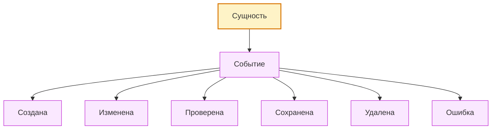

Примеры:

- `Деталь найдена в таблице`;
- `Файл не найден`;
- `Инструмент измерен`;
- `Клапан открыт`;
- `Пользователь изменил настройку`;
- `Рецепт адаптирован`;
- `Экспорт SVG завершён`.

## 16. Сущность и хранение

Не каждая сущность должна храниться постоянно.

| Вид сущности | Нужно ли хранить | Пример |
|---|---|---|
| Долгоживущая предметная сущность | обычно да | материал, инструмент, заказ |
| Временная сущность обработки | иногда нет | промежуточная строка, временный расчёт |
| Конфигурационная сущность | обычно да | настройки, шаблон, профиль |
| Событийная сущность | зависит от важности | лог, авария, измерение |
| Интерфейсная сущность | обычно нет | кнопка, поле ввода, временная форма |

> [!note] Правило хранения
> Решение о хранении принимается не потому, что сущность существует, а потому что её состояние, история или данные нужны после завершения текущего процесса.

## 17. Сущность и интерфейс

Интерфейс показывает сущности пользователю, оператору или внешней системе.

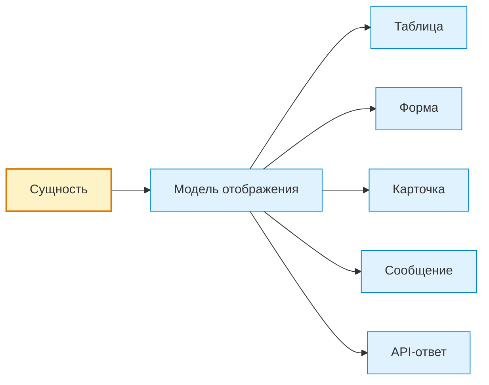

Пример:

- сущность `Инструмент` в CNC-системе может отображаться как:
  - строка в таблице инструмента;
  - карточка измерения;
  - HMI-сообщение;
  - строка CSV-отчёта;
  - warning о превышении допуска.

## 18. Сущность в Python

В Python сущность может быть представлена по-разному в зависимости от сложности задачи.

| Уровень | Представление | Когда подходит |
|---|---|---|
| Простое значение | `str`, `int`, `float`, `bool` | когда нужен один параметр |
| Словарь | `dict` | когда нужна гибкая структура без строгой модели |
| Список объектов | `list[dict]`, `list[object]` | когда много однотипных сущностей |
| Класс | `class Tool` | когда у сущности есть поведение, правила и методы |
| Dataclass | `@dataclass` | когда нужна структурированная модель данных |
| ORM-модель | `ToolModel` | когда сущность сохраняется в базе данных |

Пример эволюции представления:

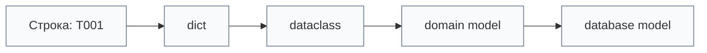

> [!warning] Не начинать слишком сложно
> Для маленького скрипта сущность может быть словарём.
> Для большой системы сущность лучше оформлять как модель с явными полями и правилами.

## 19. Сущность в embedded, PLC и CNC/CAM системах

В разных технологических мирах сущности могут называться по-разному, но смысл остаётся похожим.

| Мир | Как может называться сущность | Пример |
|---|---|---|
| Python | объект, dict, dataclass, модель | `Tool`, `Material`, `Report` |
| Embedded | структура, регистр, устройство, модуль | `Sensor`, `Valve`, `Measurement` |
| PLC | тег, DB, функциональный блок, объект HMI | `Motor`, `Alarm`, `Mode` |
| CNC/CAM | инструмент, операция, программа, корректор | `Tool`, `Operation`, `NCProgram` |
| Database | таблица, запись, строка, relation | `Order`, `Customer`, `Measurement` |
| Web | resource, DTO, endpoint model | `User`, `Request`, `Response` |

> [!important] Универсальный смысл
> Названия меняются между технологиями, но проектный вопрос остаётся одинаковым:
> **какой значимый объект существует в системе и что система должна с ним делать?**

## 20. Типичные ошибки при выделении сущностей

### 20.1. Считать каждую переменную сущностью

Плохо:

```text
quantity, file_name, row_index, temp_value — все объявлены сущностями.
```

Лучше:

```text
Сущность: Деталь
Данные сущности: quantity, file_name, row_index
Временная переменная: temp_value
```

### 20.2. Смешивать сущность и данные

Плохо:

```text
Материал, размер, цвет, количество — все на одном уровне как сущности.
```

Лучше:

```text
Сущность: Материал
Данные: название, размер, цвет, количество
```

### 20.3. Смешивать сущность и действие

Плохо:

```text
Создать отчёт — сущность.
```

Лучше:

```text
Сущность: Отчёт
Действие: создать отчёт
Событие: отчёт создан
```

### 20.4. Называть сущность слишком технически

Плохо:

```text
row_data, item_obj, data_1
```

Лучше:

```text
PartRow, MaterialUsage, ToolMeasurement
```

### 20.5. Не отделять предметную сущность от системной

Плохо:

```text
Инструмент и ToolParser находятся в одном списке без различия.
```

Лучше:

```text
Предметная сущность: Инструмент
Системная сущность: ToolParser
```

## 21. Мини-процесс выделения сущностей

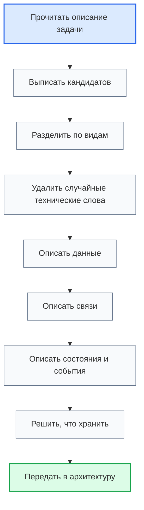

## 22. Пример: Python-утилита обработки файлов

### 22.1. Кандидаты в сущности

- `Папка входных файлов`
- `Файл`
- `PDF-файл`
- `MPF-файл`
- `Excel-строка`
- `Деталь`
- `Материал`
- `Размер заготовки`
- `Результат обработки`
- `Лог ошибки`
- `Сводный отчёт`

### 22.2. Разделение по видам

- Предметные сущности
  - `Деталь`
  - `Материал`
  - `Заготовка`

- Информационные сущности
  - `PDF-файл`
  - `MPF-файл`
  - `Excel-строка`
  - `JSON-результат`
  - `Лог-файл`

- Системные сущности
  - `FileScanner`
  - `PdfParser`
  - `MpfParser`
  - `MaterialMatcher`
  - `ReportWriter`

- Результирующие сущности
  - `Сводный отчёт`
  - `Список ошибок`
  - `Материальная сводка`

### 22.3. Компактная схема

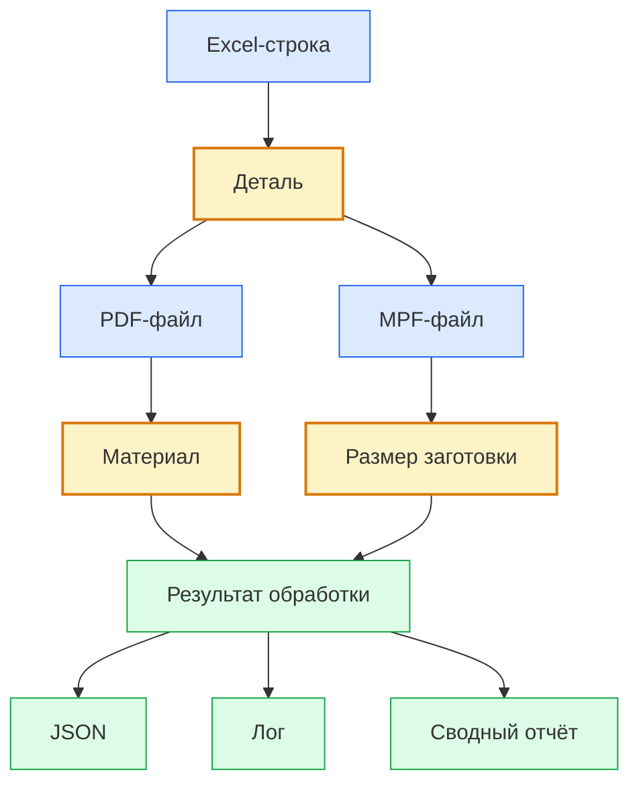

## 23. Пример: embedded-система управления

### 23.1. Кандидаты в сущности

- `Датчик уровня`
- `Датчик температуры`
- `Клапан воды`
- `Клапан концентрата`
- `Контроллер`
- `Измерение`
- `Команда управления`
- `Режим работы`
- `Авария`
- `Настройка концентрации`

### 23.2. Разделение по видам

- Предметные сущности
  - `Датчик`
  - `Клапан`
  - `Ёмкость`
  - `Жидкость`

- Информационные сущности
  - `Измерение`
  - `Команда управления`
  - `Конфигурация`
  - `Лог события`

- Системные сущности
  - `SensorReader`
  - `ValveController`
  - `StateMachine`
  - `Scheduler`

- Интерфейсные сущности
  - `LCD-экран`
  - `I2C-сообщение`
  - `Serial-команда`

- Результирующие сущности
  - `Команда открытия клапана`
  - `Аварийный сигнал`
  - `Запись телеметрии`

## 24. Пример: PLC-система

### 24.1. Кандидаты в сущности

- `Привод`
- `Клапан`
- `Датчик`
- `Технологический узел`
- `Режим AUTO`
- `Режим MANUAL`
- `Авария`
- `HMI-команда`
- `Межблокировка`
- `Рецепт`

### 24.2. Важное различие

В PLC-мире сущность может быть представлена как:

- тег;
- DB-блок;
- функциональный блок;
- HMI-объект;
- аварийное сообщение;
- состояние автомата.

Но проектный вопрос остаётся тем же:

> Что является значимым объектом управления или контроля?

## 25. Пример: CNC/CAM-система

### 25.1. Кандидаты в сущности

- `Станок`
- `Инструмент`
- `Магазин инструмента`
- `Позиция инструмента`
- `Измерение инструмента`
- `NC-программа`
- `Операция обработки`
- `Корректор инструмента`
- `Материал`
- `Деталь`

### 25.2. Компактная схема

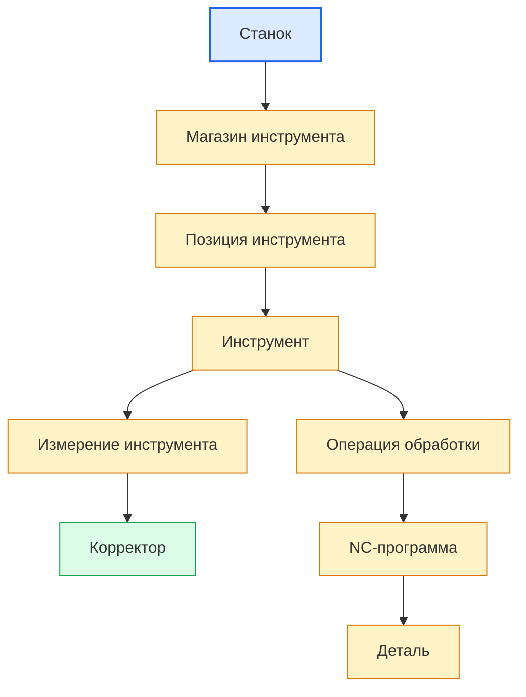

## 26. Как сущности переходят в архитектуру

После выделения сущностей нужно понять, какие архитектурные элементы с ними работают.

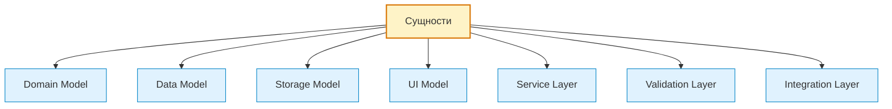

| Сущность | Возможное архитектурное следствие |
|---|---|
| Есть важные правила | нужен слой валидации или domain service |
| Есть состояние | нужна state model или state machine |
| Нужно хранить | нужна модель хранения |
| Показывается пользователю | нужна view model или UI-компонент |
| Приходит извне | нужен adapter/parser/importer |
| Передаётся наружу | нужен exporter/API/output model |
| Генерирует события | нужен event log или event handler |

## 27. Как сущности переходят в требования

Сущности помогают формировать технические требования.

Пример перехода:

```text
Сущность: Инструмент
Данные: номер, тип, длина, радиус, допуски
Правило: если измерение превышает допуск, показать предупреждение
Требование: система должна проверять измеренные параметры инструмента по заданным допускам и фиксировать превышения в отчёте.
```

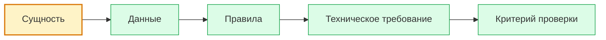

## 28. Мини-чек перед завершением темы сущностей

Перед переходом к данным нужно убедиться:

- сущности названы понятно;
- сущности разделены по видам;
- примеры не смешаны с видами;
- для каждой важной сущности понятно назначение;
- для каждой важной сущности известны основные данные;
- для каждой важной сущности указаны связи;
- сущности не заменены случайными переменными;
- сущности не смешаны с действиями;
- ясно, какие сущности требуют хранения;
- ясно, какие сущности будут влиять на архитектуру.

## 29. Связанные документы

### Входные документы

- [[docs/03_roadmaps/01_Roadmap_System_Design|Roadmap: System Design]]
  - Передаёт: место сущностей внутри проектирования системы.
  - Используется для: понимания, когда и зачем выделять сущности.
  - Ограничение: не раскрывает сущности так подробно, как энциклопедический документ.

- [[docs/07_diagrams/01_Roadmap_System_Design_Diagrams|Roadmap System Design Diagrams]]
  - Передаёт: визуальные схемы проектирования системы.
  - Используется для: связи сущностей с данными, правилами, состояниями, событиями, потоками, хранением и ошибками.
  - Ограничение: не заменяет текстовое раскрытие темы.

### Выходные документы

- [[docs/05_encyclopedia/Data|Data]]
  - Получает: список сущностей, для которых нужно определить данные.
  - Используется для: следующего энциклопедического шага.
  - Ограничение: не должен заново определять все сущности.

- [[docs/05_encyclopedia/Rules|Rules]]
  - Получает: сущности, на которые действуют правила.
  - Используется для: описания проверок, ограничений, расчётов и реакций.
  - Ограничение: не должен смешивать правило и сущность.

- [[docs/03_roadmaps/02_Roadmap_System_Architecture_Design|Roadmap: System Architecture Design]]
  - Получает: сущности как основу для моделей, модулей, интерфейсов и зависимостей.
  - Используется для: перехода от логической модели системы к архитектуре системы.
  - Ограничение: не должен преждевременно превращать каждую сущность в отдельный класс или таблицу.

## 30. История изменений

- Initial version: создана первая полноценная энциклопедическая глава по сущностям с компактными Mermaid-схемами, визуальными callout-блоками, классификацией и примерами из разных областей цифровых систем.
